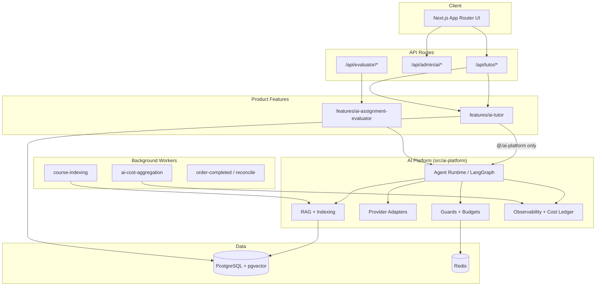
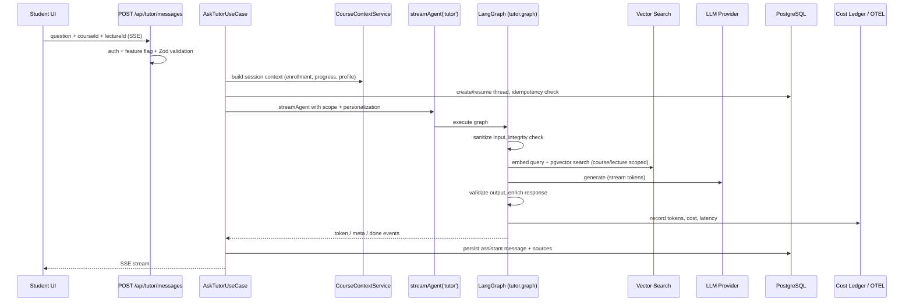

<p align="center">
  
</p>

<h1 align="center">IthraCode</h1>

<p align="center">
  <strong>Arabic-first online learning platform with a production-oriented internal AI platform</strong>
</p>

<p align="center">
  <a href="#overview">Overview</a> ·
  <a href="#key-features">Features</a> ·
  <a href="#architecture">Architecture</a> ·
  <a href="#environment-setup">Setup</a> ·
  <a href="#available-commands">Commands</a> ·
  <a href="#documentation">Docs</a>
</p>

---

## Overview

**IthraCode** is a full-stack, Arabic-first (RTL) learning platform for programming and web development courses. It provides course discovery, enrollment, video-based learning, multi-provider payments, and instructor tooling — with an internal **AI Platform** (`src/ai-platform/`) that powers the **AI Tutor** and other agent-based features.

| Layer | Responsibility |
|-------|----------------|
| **Learning platform** | Courses, enrollments, progress, cart, Stripe/Paymob payments, Mux video, admin/instructor dashboards |
| **AI Platform** | Provider-agnostic LLM runtime, LangGraph agents, RAG/indexing, guards, cost ledger, observability |
| **AI Tutor** | Course-aware tutoring product built on the platform (enrollment-scoped, streaming, RAG-grounded) |

The AI Platform is designed as a shared module: product features import **only** from `@/ai-platform`, not from its internals. AI Tutor is a thin product layer (`src/features/ai-tutor/`) that delegates agent execution to the platform runtime.

---

## Key Features

### Learning Platform

| Area | Capabilities |
|------|--------------|
| **Students** | Course catalog, learning paths, cart, checkout, enrolled-course study view, progress tracking, reviews |
| **Instructors** | Course/section/lecture management, Mux video upload, attachments, consultation availability |
| **Admins** | User/course management, payment reconciliation, AI usage analytics dashboard |
| **Auth** | NextAuth v5 — credentials, Google, GitHub; role-based access (Student / Instructor / Admin) |
| **Payments** | Stripe (default) + optional Paymob; webhooks, BullMQ fulfillment, reconciliation workers |
| **Video** | Mux streaming and playback |

### AI Platform

| Capability | Status |
|------------|--------|
| Provider abstraction (`LlmPort`, `EmbeddingPort`, `VectorSearchPort`) | Implemented |
| OpenAI-compatible adapter (OpenAI or OpenRouter via `OPENAI_BASE_URL`) | Implemented |
| Anthropic adapter (`ANTHROPIC_API_KEY`) | Implemented (optional) |
| Gemini adapter (`GOOGLE_AI_API_KEY`) | Implemented (optional) |
| Resilient LLM wrapper + model fallback chains | Implemented |
| `ai.chat()` / `ai.chatStream()` direct LLM runtime | Implemented |
| LangGraph agent runtime (`runAgent`, `streamAgent`) | Implemented |
| Agent registry (tutor, evaluator, code-reviewer stub, supervisor stub) | Implemented |
| Built-in tools (`search`, `calculator`) + tool executor | Implemented |
| MCP client (stdio/HTTP, via `AI_PLATFORM_MCP_SERVERS`) | Partial — registers when configured |
| Token usage normalization (OpenAI / Anthropic / Gemini) | Implemented |
| Cost ledger (`ai_agent_runs`) + daily aggregation (`ai_usage_daily`) | Implemented |
| USD budget guards (per-user, global) | Implemented |
| Redis rate limits (minute/hour/day, fail-closed) | Implemented |
| Input sanitization + output validation graph nodes | Implemented |
| OpenTelemetry traces/metrics (opt-in) | Implemented (off by default) |
| LangSmith tracing (opt-in) | Implemented (off by default) |
| Langfuse prompt management | Partial — local templates with optional Langfuse override |
| Structured output service | Implemented |
| Offline evaluation (Ragas runner, golden datasets) | Implemented (manual scripts) |
| Admin cost/usage analytics API | Implemented |

### AI Tutor

| Capability | Status |
|------------|--------|
| Course-aware Q&A with RAG over indexed course content | Implemented |
| LangGraph tutor graph via `streamAgent('tutor')` | Implemented |
| Server-Sent Events (SSE) streaming responses | Implemented |
| Course-scoped conversations + lecture-based threads | Implemented |
| Enrollment access control | Implemented |
| Lecture validation (must be enrolled, lecture belongs to course) | Implemented |
| Turn idempotency (`TutorTurnIdempotency`) | Implemented |
| Redis session-context cache (5 min TTL) | Implemented |
| Student learning profile personalization | Implemented |
| Knowledge-gap detection from progress analytics | Implemented |
| Educational integrity (assessment intent detection, guidance mode) | Implemented |
| Sensitivity filtering (excludes `ASSESSMENT` chunks from retrieval) | Implemented |
| Course knowledge indexing (publish hooks, worker, outbox, manual API) | Implemented |
| Thread history (read-only) | Implemented |
| Message deletion (GDPR-oriented) | Implemented |

### AI Assignment Evaluator (early product)

| Capability | Status |
|------------|--------|
| `POST /api/evaluator/submissions` — rubric-based structured evaluation | Implemented (API + use case) |
| Student-facing evaluation UI | Not present in repository |

---

## Architecture

### High-level



### Hexagonal / ports and adapters

Mature features (payments, AI Tutor, AI Platform) follow domain → application → infrastructure separation:

```
features/{feature}/
  domain/          # Entities, ports (interfaces)
  application/     # Use cases, DTOs, services
  infrastructure/  # Prisma repos, Redis, DI containers
  api/             # Route-handler-facing logic
  presentation/    # React components and hooks (where applicable)
```

The AI Platform mirrors the same pattern internally and exposes a **public barrel** at `src/ai-platform/index.ts`. Features must not import platform internals directly.

### AI Platform boundaries

| Inside `@/ai-platform` | Outside (product features) |
|------------------------|----------------------------|
| LLM/embedding providers, LangGraph graphs, RAG pipeline | Enrollment checks, tutor UI, course context assembly |
| Cost ledger, guards, OTEL/LangSmith hooks | Conversation persistence repositories |
| Indexing workers and outbox | Publish-route hooks that enqueue indexing |

### LangGraph tutor graph

Production tutor requests run through `tutor.graph.ts`:

```
sanitize-input → load-history → integrity-check
  → retrieve-context → prepare-history → generate-response
  → (tool-call loop, max 5) → validate-output → enrich-response → persist-turn
```

The integrity-check node can short-circuit to validation when assessment content must not be answered directly.

---

## AI Request Flow

End-to-end path for a student tutor question:



---

## RAG / Knowledge Pipeline

### Content collection

Course and lecture sources are collected from:

- Course overview and metadata
- Section/lecture titles and descriptions
- Lecture HTML/content
- `LectureTranscript` records (manual transcripts)
- Attachments (PDF via `pdf-parse`, inline text extractors)

Sources are typed (`KnowledgeContentType`) and tagged with sensitivity (`PUBLIC`, `ASSESSMENT`, `INSTRUCTOR`). Assessment content is indexed but **excluded from student retrieval**.

### Processing pipeline

1. **Collect** — `content-collector.service.ts` gathers `KnowledgeSource` records for a course or lecture.
2. **Extract** — pluggable extractor registry per source type.
3. **Change detection** — `KnowledgeSourceHash` stores content hashes; unchanged sources are skipped.
4. **Chunk** — `chunk-builder.service.ts` splits content into `KnowledgeChunk` records.
5. **Embed** — `embeddings/pipeline.ts` with Redis embedding cache.
6. **Store** — PostgreSQL `knowledge_chunks` table with `vector(1536)` column and HNSW index (created via Prisma migrations, not `db push`).
7. **Retrieve** — `PostgresVectorSearchAdapter` runs cosine-similarity search with `courseId` filter, optional `lectureId` scoping, `minScore` threshold, and `PUBLIC` sensitivity filter.

### Indexing triggers

| Trigger | Mechanism |
|---------|-----------|
| Course publish | `POST /api/courses/[idOrSlug]/publish` enqueues indexing |
| Lecture publish | `POST /api/courses/[idOrSlug]/lectures/[lectureId]/publish` |
| Manual re-index | `POST /api/tutor/index` (authenticated) |
| Bootstrap | `bootstrapUnindexedCourseIndexing()` for courses missing chunks |
| Worker | `pnpm worker:course-indexing` (BullMQ `course-indexing` queue) |
| Outbox | `CourseIndexingOutbox` for reliable enqueue |

---

## LLM Providers

Application code depends on port interfaces, not vendor SDKs:

```
Use case / graph node
  → LlmPort (domain port)
    → Provider registry (model → adapter)
      → OpenAILlmAdapter | AnthropicLlmAdapter | GeminiLlmAdapter
        → ResilientLlmAdapter / FallbackLlmAdapter (retries + failover)
```

| Provider | Adapter | Activation |
|----------|---------|------------|
| OpenAI / OpenRouter | `providers/openai/` | `OPENAI_API_KEY` (required when AI enabled) |
| Anthropic | `providers/anthropic/` | `ANTHROPIC_API_KEY` (optional) |
| Google Gemini | `providers/gemini/` | `GOOGLE_AI_API_KEY` (optional) |

Embeddings use `OpenAIEmbeddingAdapter` (OpenAI-compatible endpoint). Default models are configured via `AI_PLATFORM_LLM_MODEL`, `AI_PLATFORM_EMBEDDING_MODEL`, or tutor-specific overrides.

---

## Observability and Cost Monitoring

### Implemented

| Signal | Where |
|--------|-------|
| Per-run record | `ai_agent_runs` — `inputTokens`, `outputTokens`, `embeddingTokens`, `estimatedCostUsd`, `model`, `provider`, `latencyMs`, `correlationId` |
| Daily rollups | `ai_usage_daily` via `pnpm worker:ai-cost-aggregation` |
| Structured AI event logs | `observability/logging/ai-event-logger.ts` |
| Prometheus metrics | `platform-metrics.ts` (when `OTEL_ENABLED=true`, scrape `:OTEL_METRICS_PORT/metrics`) |
| OTLP trace export | `otel-setup.ts` (when `OTEL_ENABLED=true`) |
| LangSmith runs | Optional via `LANGCHAIN_TRACING_V2=true` |
| Admin analytics API | `/api/admin/ai/overview`, `/costs`, `/usage`, `/models`, `/providers`, `/runs`, `/breakdown` (Bearer `AI_ADMIN_API_SECRET`) |
| Admin UI | `/admin/analytics/ai` |
| Health | `/api/health/ai-platform`, `/api/health/tutor` |

OTEL failures are isolated — AI requests continue if exporters are unavailable (`telemetry-isolation.ts`). Cost ledger write failures are logged and non-blocking; **budget and rate-limit guard failures are fail-closed**.

### Partially implemented / opt-in

| Item | Notes |
|------|-------|
| Langfuse-managed prompts | Works with local template fallback when Langfuse is not configured |
| Real-time dashboards | Metrics export is pull-based (Prometheus scrape); no bundled Grafana stack |
| Nightly Ragas CI gate | `pnpm eval:ragas` exists; automated nightly job not in repo |
| Advanced cost engine (forecasting, quotas) | Documented in `docs/ai-platform/16-cost-engine.md` — not implemented |

---

## Security and Guards

| Control | Implementation |
|---------|----------------|
| Authentication | NextAuth v5 session on all tutor/evaluator routes |
| Authorization | Enrollment check before tutor access; admin session for analytics UI |
| Course/lecture scoping | Retrieval and context limited to enrolled `courseId`; lecture validation |
| Input sanitization | `sanitize-input` graph node |
| Output validation | `validate-output` graph node + educational content filter adapter |
| Assessment protection | Integrity check blocks direct answers; `ASSESSMENT` chunks excluded from search |
| Rate limiting | Redis sliding windows per user (minute/hour/day); Redis down → deny |
| Budget caps | Per-user and global daily USD limits via Redis |
| Feature flags | `AI_PLATFORM_ENABLED`, `AI_TUTOR_ENABLED` (default `false`) |
| Idempotency | `TutorTurnIdempotency` prevents duplicate turns |
| PII in traces | OTEL attributes hash user identifiers |
| Secrets | Validated via `src/config/env.ts`; see `.env.example` |

---

## Tech Stack

| Category | Technology |
|----------|------------|
| **Frontend** | React 19, Tailwind CSS 4, Radix UI, TanStack Query, Zustand |
| **Framework** | Next.js 16 (App Router) |
| **Language** | TypeScript 5 |
| **Database** | PostgreSQL (Prisma ORM 7) |
| **Vector search** | pgvector (`vector(1536)`), HNSW index on `knowledge_chunks` |
| **Cache / queues** | Redis, BullMQ |
| **Auth** | NextAuth v5 (Auth.js), Prisma adapter |
| **Payments** | Stripe, Paymob (optional) |
| **Video** | Mux |
| **AI / LLM** | OpenAI SDK, OpenRouter-compatible endpoints, Anthropic, Gemini |
| **Agent runtime** | LangGraph (`@langchain/langgraph`) |
| **Observability** | OpenTelemetry, Prometheus exporter, LangSmith, Langfuse, Pino |
| **Testing** | Vitest |
| **Package manager** | pnpm 10 |

---

## Project Structure

```
ithra-code/
├── prisma/
│   ├── schema.prisma       # Includes tutor, knowledge, ai_agent_runs, etc.
│   ├── migrations/         # Includes pgvector HNSW migrations
│   └── seeds/
├── src/
│   ├── ai-platform/        # Internal AI module (import via @/ai-platform only)
│   │   ├── agents/         # Agent definitions + registry
│   │   ├── application/    # chat/agent use cases, runtime
│   │   ├── domain/         # Ports, policies
│   │   ├── graph/          # LangGraph nodes + tutor.graph.ts
│   │   ├── indexing/       # Course indexing pipelines, outbox, worker handler
│   │   ├── infrastructure/ # DI, guards, queues, config
│   │   ├── observability/  # Cost ledger, OTEL, metrics, analytics
│   │   ├── providers/      # OpenAI, Anthropic, Gemini adapters
│   │   ├── rag/            # Ingestion, retrieval, vector search
│   │   └── tools/          # Built-in + MCP tools
│   ├── app/                # Next.js routes (public, student, admin, api)
│   ├── features/
│   │   ├── ai-tutor/       # Tutor product (use cases, API handlers, UI)
│   │   ├── ai-assignment-evaluator/
│   │   ├── payments/       # Hexagonal payment module
│   │   ├── courses/, cart/, my-courses/, ...
│   │   └── admin/
│   ├── server/workers/     # BullMQ workers (indexing, cost, payments)
│   ├── config/env.ts       # Centralized env validation
│   └── lib/                # Auth, Prisma, Redis, Stripe, logging
├── tests/
│   ├── unit/               # Platform + tutor unit tests
│   └── integration/ai-tutor/
├── docs/
│   ├── ai-platform/        # Platform blueprint, runtime, observability ADRs
│   └── ai-tutor/           # Tutor architecture, indexing, operations
├── eval/                   # Python deps for Ragas evaluation
└── scripts/                # Payment, eval, and ops scripts
```

---

## Environment Setup

### Prerequisites

- Node.js ≥ 20
- pnpm ≥ 10
- PostgreSQL with **pgvector** extension
- Redis (local via `docker compose up -d`, or hosted)
- Stripe account (test mode) for payments
- Mux account for video
- LLM API key (OpenAI or OpenRouter) for AI features

### Install and configure

```bash
git clone <repository-url>
cd ithra-code
pnpm install

cp .env.example .env
# Fill in values — never commit .env
```

### Database

```bash
# Apply migrations (required for pgvector HNSW index on knowledge_chunks)
npx prisma migrate dev

# Seed initial data
pnpm seed
```

Use `pnpm db:studio` to inspect data. Prefer `prisma migrate` over `db push` for `knowledge_chunks` (see schema comments).

### Enable AI (optional)

```env
AI_PLATFORM_ENABLED=true
AI_TUTOR_ENABLED=true
OPENAI_API_KEY=sk-...
# Optional OpenRouter:
OPENAI_BASE_URL=https://openrouter.ai/api/v1
AI_TUTOR_LLM_MODEL=openai/gpt-4o-mini
AI_TUTOR_EMBEDDING_MODEL=openai/text-embedding-3-small
```

`AI_TUTOR_ENABLED=true` requires `AI_PLATFORM_ENABLED=true`.

### Start services

```bash
# Terminal 1 — app
pnpm dev

# Terminal 2 — Redis (if not using hosted Redis)
docker compose up -d

# Terminal 3+ — workers (as needed)
pnpm worker:order-completed
pnpm worker:course-indexing      # when AI Tutor enabled
pnpm worker:ai-cost-aggregation  # when AI Platform enabled
pnpm worker:reconcile            # payment reconciliation scheduler
pnpm worker:reconcile-consumer   # reconciliation queue consumer
```

Open [http://localhost:3000](http://localhost:3000).

See `.env.example` for the full variable list. Observability template: `docs/ai-platform/production/vps-observability.env.example`.

---

## Available Commands

| Command | Description |
|---------|-------------|
| `pnpm dev` | Start Next.js dev server (port 3000) |
| `pnpm build` | Production build |
| `pnpm start` | Start production server |
| `pnpm lint` | ESLint |
| `pnpm format` | Prettier write |
| `pnpm format:check` | Prettier check |
| `pnpm type-check` | `tsc --noEmit` |
| `pnpm test` | Vitest (unit; integration skipped unless flagged) |
| `pnpm test:watch` | Vitest watch mode |
| `pnpm test:unit` | Unit tests only |
| `pnpm test:integration` | Integration tests (`VITEST_INTEGRATION=true`) |
| `pnpm eval:ragas` | Run Ragas evaluation suite |
| `pnpm deepeval:golden` | Run DeepEval golden suite |
| `pnpm seed` | Seed database |
| `pnpm db:push` | Push schema (avoid for pgvector tables) |
| `pnpm db:reset` | Reset database |
| `pnpm db:studio` | Prisma Studio |
| `pnpm worker:order-completed` | Post-payment fulfillment worker |
| `pnpm worker:course-indexing` | Course knowledge indexing worker |
| `pnpm worker:ai-cost-aggregation` | AI usage daily aggregation worker |
| `pnpm worker:reconcile` | Payment reconciliation scheduler |
| `pnpm worker:reconcile-consumer` | Reconciliation queue consumer |
| `pnpm payment:e2e` | Payment end-to-end script |
| `pnpm payment:reconcile` | Manual reconciliation script |

`prisma generate` runs automatically on `postinstall`.

---

## Testing

| Item | Detail |
|------|--------|
| **Framework** | Vitest (`vitest.config.ts`) |
| **Unit tests** | `tests/unit/` — observability, guards, tutor protocol, pricing, fallback chain |
| **Integration tests** | `tests/integration/ai-tutor/` — require `VITEST_INTEGRATION=true` and a database |
| **Setup** | `tests/setup/env.ts` |
| **Current status** | 86 passed, 6 skipped (integration) when running `pnpm test` |

Integration tests cover smoke, enrollment/auth cache, idempotency, pagination, lecture validation, and GDPR delete flows.

---

## Feature Flags and Configuration

| Variable | Default | Effect |
|----------|---------|--------|
| `AI_PLATFORM_ENABLED` | `false` | Gates platform runtime, guards, cost ledger, indexing infrastructure |
| `AI_TUTOR_ENABLED` | `false` | Registers `/api/tutor/*` routes; shows tutor UI vs placeholder |
| `OTEL_ENABLED` | `false` | Bootstraps OpenTelemetry in `instrumentation.ts` |
| `LANGCHAIN_TRACING_V2` | `false` | LangSmith tracing |
| `LANGFUSE_PUBLIC_KEY` / `LANGFUSE_SECRET_KEY` | unset | Remote prompt management (local fallback always available) |
| Paymob vars | unset | Paymob gateway not registered |

Startup validation runs for platform and tutor config when respective flags are enabled (`src/instrumentation.ts`).

---

## Production Readiness

### Implemented

- LangGraph-based tutor runtime with sanitization, RAG, validation, and persistence
- pgvector-backed knowledge indexing with change detection and outbox
- Enrollment-scoped access, turn idempotency, educational integrity controls
- Redis rate limits and USD budget guards (fail-closed)
- Per-run cost accounting and daily aggregation worker
- Admin AI analytics API and dashboard
- Optional OTEL/LangSmith instrumentation with failure isolation
- Payment webhooks, fulfillment workers, and reconciliation tooling
- Vitest coverage for core platform and tutor behaviors

### Hardening / limitations

- **Observability is opt-in** — OTEL, LangSmith, and Langfuse require explicit configuration; no bundled monitoring stack.
- **Prompt management** — primary path uses local templates; full Langfuse-driven prompt lifecycle is incomplete.
- **Phase 3 agents** — code-reviewer and supervisor agents are registered stubs; assignment evaluator has API only (no student UI).
- **MCP tools** — client exists but requires manual `AI_PLATFORM_MCP_SERVERS` configuration.
- **Long-term memory** — `ai_memory_facts` schema and repository exist; not fully integrated into tutor personalization.
- **Evaluation automation** — Ragas/DeepEval scripts exist; nightly CI regression gates are not wired.
- **Advanced cost engine** — forecasting and quota management documented only.
- **Multi-provider routing** — fallback chains work when keys are set; routing policies are basic.
- **Paymob** — implemented but optional; Stripe remains the default path.

Operational runbooks: `docs/ai-tutor/08-production-operations.md`, `docs/ai-platform/production/production-readiness-checklist.md`.

---

## Roadmap

Items below are explicitly tracked in project documentation as incomplete — not assumptions.

### AI Platform (`docs/ai-platform/14-roadmap.md`)

- Langfuse as primary prompt source (local fallback today)
- Automated LangSmith tracing for all agent runs in production
- Nightly Ragas evaluation with stored regression results
- DeepEval CI gates blocking quality regressions
- Full MCP tool activation (filesystem server for code review)
- Long-term memory integration across agents
- Context summarization node for token budget overflow
- Generic `ai-indexing` and `ai-memory-summarize` workers

### AI Tutor (`docs/ai-tutor/07-future-roadmap.md`)

- Persistent short-term memory (Redis session resumption)
- Student knowledge graph / mastery modeling
- Multi-agent collaboration for complex questions
- Deeper evaluation and quality loops

---

## Documentation

| Area | Location |
|------|----------|
| AI Platform blueprint | `docs/ai-platform/00-platform-blueprint.md` |
| Runtime and graphs | `docs/ai-platform/17-runtime.md` |
| RAG design | `docs/ai-platform/05-rag.md` |
| Observability | `docs/ai-platform/09-observability.md` |
| AI Tutor architecture | `docs/ai-tutor/02-architecture.md` |
| Indexing pipeline | `docs/ai-tutor/04-indexing-pipeline.md` |
| Product features catalog | `docs/FEATURES.md` |
| Agent guidelines | `AGENTS.md` |
| API docs (live) | `/docs` (Swagger UI) |

---

## Contributing

Follow [Conventional Commits](https://www.conventionalcommits.org/). Commit messages are validated via Husky + Commitlint.

```bash
git commit -m "feat(ai-tutor): add thread pagination"
git commit -m "fix(payments): handle paymob webhook replay"
```

---

## License

This project is private and not licensed for public use.
