# Internal AI Platform — Architecture Blueprint

> Principal architecture document for extracting IthraCode's AI Tutor into a reusable Internal AI Platform.  
> **Status:** Phase 2 in progress — `src/ai-platform/` is implemented (~99 files). Production AI Tutor delegates LLM execution to `streamAgent('tutor')` when `AI_PLATFORM_RUNTIME_ENABLED=true`. Legacy hand-rolled pipeline remains the fallback.  
> **Last updated:** August 2026  
> **Audience:** Engineering leadership, platform engineers, feature teams

---

## Table of Contents

1. [Current Architecture Analysis](#1-current-architecture-analysis)
2. [Problems with Current Architecture](#2-problems-with-current-architecture)
3. [Future Target Architecture](#3-future-target-architecture)
4. [AI Platform Architecture](#4-ai-platform-architecture)
5. [AI SDK Architecture](#5-ai-sdk-architecture)
6. [Model Router Design](#6-model-router-design)
7. [Provider Abstraction Design](#7-provider-abstraction-design)
8. [AI Tutor Refactoring Plan](#8-ai-tutor-refactoring-plan)
9. [Migration Strategy](#9-migration-strategy)
10. [Folder Structure](#10-folder-structure)
11. [Domain Boundaries](#11-domain-boundaries)
12. [Architecture Decision Records](#12-architecture-decision-records)
13. [Sequence Diagrams](#13-sequence-diagrams)
14. [Component Diagrams](#14-component-diagrams)
15. [Dependency Graph](#15-dependency-graph)
16. [Risks](#16-risks)
17. [Trade-offs](#17-trade-offs)
18. [Future Extensions](#18-future-extensions)
19. [Production Readiness Checklist](#19-production-readiness-checklist)
20. [Implementation Roadmap](#20-implementation-roadmap)

### Related Deep-Dive Documents

| Topic | Document |
|-------|----------|
| Vision and scope | [01-overview.md](./01-overview.md) |
| Layer model and flows | [02-architecture.md](./02-architecture.md) |
| Folder tree | [03-folder-structure.md](./03-folder-structure.md) |
| Agents and LangGraph | [04-agents.md](./04-agents.md) |
| RAG pipeline | [05-rag.md](./05-rag.md) |
| Memory | [06-memory.md](./06-memory.md) |
| Tools and MCP | [07-tools.md](./07-tools.md) |
| Prompts (Langfuse) | [08-prompts.md](./08-prompts.md) |
| Observability | [09-observability.md](./09-observability.md) |
| Evaluation | [10-evaluation.md](./10-evaluation.md) |
| Workers | [11-workers.md](./11-workers.md) |
| Providers | [12-providers.md](./12-providers.md) |
| Security | [13-security.md](./13-security.md) |
| Phased roadmap | [14-roadmap.md](./14-roadmap.md) |
| ADRs (full text) | [15-adrs.md](./15-adrs.md) |
| Cost engine | [16-cost-engine.md](./16-cost-engine.md) |
| Runtime | [17-runtime.md](./17-runtime.md) |
| Structured output | [18-structured-output.md](./18-structured-output.md) |
| AI Tutor (product) | [../ai-tutor/02-architecture.md](../ai-tutor/02-architecture.md) |

---

## 1. Current Architecture Analysis

### 1.1 System Context

IthraCode is a **modular monolith**: Next.js App Router, PostgreSQL (Prisma), Redis, BullMQ workers, NextAuth. AI capabilities live almost entirely inside `src/features/ai-tutor/` (127 files). There is **no** `src/ai-platform/` module at runtime — only design documentation.

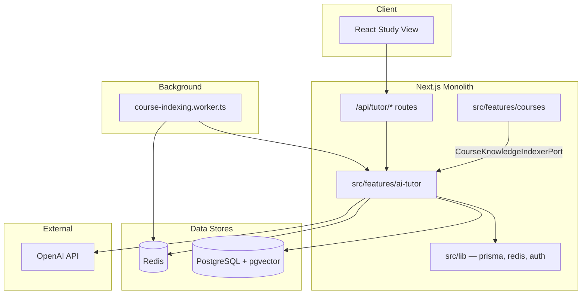

### 1.2 AI Tutor Layer Model

The tutor follows Clean Architecture within a single feature module:

| Layer | Path | Responsibility |
|-------|------|----------------|
| Presentation | `presentation/` | `AITutorChat`, SSE client hook |
| API | `api/handlers/` | HTTP handlers; guards; SSE streaming |
| Application | `application/` | Use cases, RAG, prompts, learning profile, ingestion |
| Domain | `domain/` | Models, 12 ports |
| Infrastructure | `infrastructure/` | OpenAI adapters, Prisma repos, Redis, BullMQ, DI |

### 1.3 Domain Ports (Verified in Code)

| Port | Abstracts |
|------|-----------|
| `LlmPort` | Streaming LLM generation |
| `EmbeddingPort` | Text embeddings |
| `VectorSearchPort` | pgvector similarity search |
| `ConversationRepositoryPort` | Conversations, threads, messages |
| `ContentFilterPort` | Educational integrity filtering |
| `KnowledgeChunkRepositoryPort` | Chunk persistence |
| `CourseContextRepositoryPort` | Enrollment + progress |
| `StudentLearningProfileRepositoryPort` | Adaptive learning preferences |
| `CourseContentRepositoryPort` | Published content for indexing |
| `SessionContextCachePort` | Cached session context |
| `KnowledgeSourceHashRepositoryPort` | Content-hash dedup (not exported from barrel) |
| `TextExtractorPort` | Per-source extraction (registry, not DI) |

Ports exist, but **only OpenAI adapters are wired** in `ai-tutor-container.ts`.

### 1.4 Core Request Flow (`ask-tutor.use-case.ts`)

The ask-tutor pipeline is **hand-rolled** (~400 lines), not graph-based:

1. Build session context (course, progress, learning profile, knowledge gaps)
2. Get/create conversation and thread; load history (limit 20)
3. Fire-and-forget learning profile update
4. Assessment intent detection → guided response (no LLM)
5. RAG retrieval (`content-retriever.service.ts`)
6. Fallback path when no chunks
7. `buildSystemPrompt` + `buildConversationMessages`
8. `llmPort.streamAnswer`
9. `contentFilter.validateResponse` (may replace entire response)
10. Persist turn

**Streaming behavior:** In default strict mode, the use case **buffers the full LLM stream** before yielding tokens — educational integrity validation runs on the complete response.

### 1.5 RAG and Indexing

| Path | Flow |
|------|------|
| **Indexing trigger** | Course publish → `courses/wiring/publish-course.wiring.ts` → `BullmqCourseKnowledgeIndexer` |
| **Queue** | BullMQ `course-indexing` with transactional outbox (`course_indexing_outbox`) |
| **Worker** | `src/server/workers/course-indexing.worker.ts` |
| **Pipeline** | Collect → extract → hash dedup → chunk → embed → upsert `knowledge_chunks` |
| **Retrieval** | Embed query (Redis cache `tutor:embed:*`) → pgvector cosine search scoped by `courseId` |

Embeddings are **fixed at 1536 dimensions** (`text-embedding-3-small`). Vector column: `knowledge_chunks.embedding vector(1536)` with HNSW index.

### 1.6 Cross-Feature Coupling

| Coupling | Direction | Mechanism |
|----------|-----------|-----------|
| Courses → AI Tutor | Feature imports tutor queue | `CourseKnowledgeIndexerPort` implemented in `ai-tutor/infrastructure/queue/` |
| AI Tutor → Courses types | Tutor imports courses | `CourseKnowledgeIndexingScope` in indexing event |
| AI Tutor → Course schema | Shared DB | Reads `Course`, `Lecture`, `Enrollment`, updates `knowledgeIndexedAt` |
| My Courses → AI Tutor UI | Presentation import | `AITutorChat` embedded in study view |

### 1.7 Infrastructure Usage

| System | Keys / Tables | Owner |
|--------|---------------|-------|
| Redis | `tutor:session-context:*`, `tutor:embed:*`, `rate:tutor-messages:*`, `tutor:active-streams:*`, `tutor:daily-cost:*` | AI Tutor |
| PostgreSQL | `tutor_*`, `knowledge_chunks`, `knowledge_source_hashes`, `student_learning_profiles`, `course_indexing_outbox` | AI Tutor (+ shared course tables) |
| BullMQ | `course-indexing` queue | AI Tutor |
| OpenAI | `OPENAI_API_KEY`, default model `gpt-3.5-turbo` | AI Tutor config |

### 1.8 Test Coverage Gaps

15 unit tests exist inside `ai-tutor`. **No integration test** covers `ask-tutor.use-case.ts` or `ask-tutor.handler.ts`. Courses has one publish→indexing test that imports tutor's indexing runner directly.

### 1.9 What Works Well (Preserve)

- Port/adapter pattern for LLM, embeddings, vector search (ADR-001)
- BullMQ + outbox for durable indexing
- Educational integrity as a pluggable `ContentFilterPort`
- Enrollment check before AI access
- Redis fail-closed on rate limits; structured error codes
- Arabic-first prompt engineering with RAG source attribution

---

## 2. Problems with Current Architecture

### 2.1 Structural Coupling

| Problem | Evidence | Impact |
|---------|----------|--------|
| **AI infra is product code** | All providers, RAG, queues in `ai-tutor/` | Every new AI app duplicates or forks infrastructure |
| **Inverted dependency** | Courses depends on tutor for indexing port impl | Course publish is blocked on tutor module layout |
| **Knowledge is tutor-named** | `knowledge_chunks` owned by tutor repos | Marketing/Job assistants would share tutor's data model awkwardly |
| **Config is tutor-scoped** | `AI_TUTOR_*` env vars, `AITutorConfig` | No per-application model defaults |
| **DI is global singleton** | `globalThis.__aiTutorState` in container | Hard to test multi-provider routing; state leaks across requests in edge cases |

### 2.2 Provider Coupling (Despite Ports)

The port pattern is **structurally correct but operationally OpenAI-only**:

- `ai-tutor-container.ts` hard-wires `OpenAILlmAdapter` + `OpenAIEmbeddingAdapter`
- Default LLM: `gpt-3.5-turbo` (configurable via `AI_TUTOR_LLM_MODEL`, still OpenAI-shaped)
- No model router, no fallback chain, no per-app provider policy
- Embedding model change requires re-indexing entire corpus (1536-dim lock-in)

**Risk:** Adding Claude for Assignment Generator requires touching tutor infrastructure, not registering a new app.

### 2.3 Orchestration Ceiling

`ask-tutor.use-case.ts` encodes a linear pipeline. Adding tool-calling loops, multi-agent handoffs, or conditional branches means growing one file or duplicating patterns. This does not scale to five AI applications with different workflows.

### 2.4 Hidden Operational Coupling

| Gap | Detail |
|-----|--------|
| **Observability** | Pino request logger only; no LangSmith traces, no OTEL spans, no per-run cost ledger |
| **Prompt management** | Hardcoded `prompt-builder.ts`; no versioning, A/B, or rollback |
| **Cost accounting** | Daily request counter (`tutor:daily-cost`), not token-based cost per user/app |
| **Evaluation** | No offline regression gate for Arabic RAG quality |

### 2.5 Scalability Risks

| Risk | Threshold | Current Mitigation |
|------|-----------|-------------------|
| pgvector HNSW rebuild | Large re-index events | Incremental hashing; monitor p95 |
| Redis single instance | Rate limit + cache + BullMQ | No cluster documented |
| Next.js process handles SSE | Concurrent streams capped at 2/user | Slot guard exists |
| Embedding API on every query | Cache TTL 3600s | Partial |
| Worker concurrency default 1 | Indexing backlog on bulk publish | Configurable |

At **millions of requests/day**, the monolith would need: dedicated AI worker pool, connection pooling tuning, read replicas for vector search, and queue partitioning by app — none of which are designed yet.

### 2.6 Security Risks

| Risk | Status |
|------|--------|
| Prompt injection | Partial — integrity filter on output; no dedicated sanitization node |
| Cross-course retrieval | Mitigated by `courseId` filter in vector search |
| Authorization in platform | Correctly in feature layer — but platform must never trust `userId` without feature attestation |
| API key exposure | Env vars only; no secrets rotation automation |
| PII in logs | Tutor request logger may include question text — retention policy exists in docs, not enforced in code |
| Tool calling | Not implemented — future MCP surface needs sandbox design |

### 2.7 Maintainability Issues

- **127 files** in one feature mixing product + platform concerns
- Prompt, RAG, analytics, and ingestion intertwined in `application/services/`
- Two documentation sets (`docs/ai-tutor/`, `docs/ai-platform/`) with no runtime module bridging them
- Product naming drift: docs mention "Assignment Evaluator" vs requested "Assignment Generator"

### 2.8 Streaming UX vs Integrity Trade-off

Strict mode buffers the entire LLM response before streaming to the client. Users perceive latency equal to full generation time. This is a **product decision embedded in infrastructure** — the platform should offer configurable streaming policies per app.

---

## 3. Future Target Architecture

### 3.1 Target State Summary

Extract all AI infrastructure into `src/ai-platform/`. AI Tutor becomes a **thin client** — authorization, UI, tutor-specific policies, conversation persistence. Future apps call the same SDK surface.

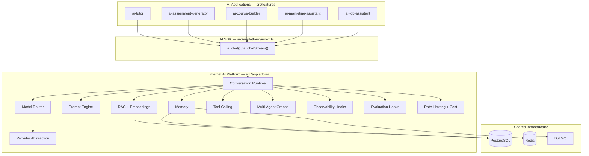

### 3.2 Architectural Style

| Pattern | Application |
|---------|-------------|
| **Clean Architecture** | Domain ports at center; infrastructure at edge |
| **Hexagonal (Ports & Adapters)** | Providers, Prisma, Redis, Langfuse as adapters |
| **DDD** | Bounded contexts: Platform, Tutor, Courses, future AI apps |
| **Strangler Fig** | Incremental extraction; tutor stays live |
| **Event-Driven (async)** | Indexing, evaluation via BullMQ + domain events |
| **Modular Monolith** | In-process TypeScript API (ADR-001, ADR-005) — not a separate microservice in Phase 1–3 |

### 3.3 Per-Application Model Routing (Target)

Applications never import provider SDKs. The platform resolves models from **application ID**:

| Application | Default Model (example) | Routing Policy |
|-------------|---------------------------|----------------|
| AI Tutor | `gpt-5` (or `gpt-4o` until available) | Quality + Arabic; education task |
| AI Assignment Generator | `claude-sonnet-4` | Structured output; evaluation task |
| AI Marketing Assistant | `gemini-2.5-flash` | Cost-optimized; creative task |
| AI Course Builder | `gpt-5` | Long context; curriculum task |
| AI Job Assistant | `gpt-4o-mini` | Latency-optimized; Q&A task |

*Note: Exact model IDs are configured at deploy time via `AgentDefinition` + router policies, not hardcoded in features.*

### 3.4 Deployment Topology (Phase 1–3)

Single repository, single database, multiple processes:

| Process | Responsibility |
|---------|----------------|
| Next.js server | API routes, `ai.chat()` in-request |
| BullMQ workers | Indexing, evaluation, cost aggregation |
| PostgreSQL | Vectors, memory, runs, product data |
| Redis | Cache, rate limits, queues |

Service extraction criteria documented in [14-roadmap.md](./14-roadmap.md#service-extraction-criteria) — triggered only at scale, not preemptively.

---

## 4. AI Platform Architecture

### 4.1 Layer Model

```
src/features/*  →  @/ai-platform (public barrel)
                         ↓
              application/ (use cases, runtime)
                         ↓
              domain/ (ports, models, policies)
                         ↓
    capabilities: graph, rag, memory, tools, prompts, router, providers, agents
                         ↓
              infrastructure/ (DI, Prisma, Redis, guards, queues)
```

See [02-architecture.md](./02-architecture.md) and [03-folder-structure.md](./03-folder-structure.md) for full detail.

### 4.2 Core Subsystems

| Subsystem | Module | Responsibility |
|-----------|--------|----------------|
| **Conversation Runtime** | `application/runtime/` | Lifecycle: guards → context → graph → stream → persist → observe |
| **Prompt Engine** | `prompts/` | Langfuse resolution, locale, variable injection, version pinning |
| **Model Router** | `router/` | Static/dynamic routing, fallback, cost/latency optimization |
| **Provider Abstraction** | `providers/` | OpenAI, Anthropic, Gemini, Ollama behind `LlmPort` / `EmbeddingPort` |
| **RAG** | `rag/`, `embeddings/`, `indexing/` | Ingest, chunk, embed, retrieve, filter |
| **Memory** | `memory/` | Redis short-term + PostgreSQL long-term + conversation assembly |
| **Tool Calling** | `tools/` | Registry, executor, MCP client |
| **Multi-Agent** | `graph/`, `agents/` | LangGraph StateGraphs, agent registry |
| **Evaluation Hooks** | `evaluation/` | Ragas/DeepEval offline; hook points in runtime |
| **Observability Hooks** | `observability/` | LangSmith, OTEL, cost ledger |
| **Guards** | `infrastructure/guards/` | Rate limits, concurrency, cost caps, budgets |

### 4.3 Runtime vs LangGraph

| Component | Owns |
|-----------|------|
| **Runtime** | Request validation, guards, context assembly, streaming bridge, cancellation, cost/trace wiring |
| **LangGraph** | Node sequencing, conditional edges, tool loops, checkpointing |
| **Agent Definition** | Declarative config: app ID, default model policy, tools, graph reference |
| **Provider Adapter** | Vendor API calls, stream normalization |

See [17-runtime.md](./17-runtime.md).

### 4.4 Data Ownership (Target)

| Data | Owner | Table Prefix |
|------|-------|--------------|
| Agent runs, cost, tool invocations | Platform | `ai_*` |
| Knowledge chunks (shared RAG) | Platform | `ai_knowledge_*` (migration from `knowledge_*`) |
| Tutor conversations | AI Tutor feature | `tutor_*` |
| Learning profiles | AI Tutor feature (initially) | `student_learning_profiles` |
| Course content | Courses feature | `courses`, `lectures`, etc. |

**Open design question:** Whether learning profiles move to platform memory in Phase 3 — recommended if multiple apps need adaptive personalization.

---

## 5. AI SDK Architecture

### 5.1 Design Goals

1. **Provider opacity** — Callers pass `appId`, not `model` or `provider`
2. **Type safety** — Zod-validated request/response DTOs
3. **Streaming first** — `chatStream` is primary; `chat` is sugar over collect
4. **Scope attestation** — Features pass pre-authorized `userId` + domain scope
5. **Stable public surface** — Only `@/ai-platform` is importable (ADR-005)
6. **Extraction-ready** — DTOs become HTTP contracts if service is split later

### 5.2 Public API Surface

```typescript
// src/ai-platform/index.ts — conceptual contract (not implemented)

import { ai } from '@/ai-platform';

// ─── Primary API ───────────────────────────────────────────────

// Non-streaming (collects full response)
const result = await ai.chat({
  appId: 'ai-tutor',
  messages: [{ role: 'user', content: 'اشرح لي الحلقات' }],
  scope: {
    userId: '...',          // Pre-authorized by feature
    courseId: '...',
    lectureId: '...',
  },
  options: {
    locale: 'ar',
    threadId: '...',
    // model override NOT exposed to features by default
  },
});

// Streaming
for await (const event of ai.chatStream({ appId: 'ai-tutor', ... })) {
  switch (event.type) {
    case 'meta':    /* sources, runId */ break;
    case 'token':   /* partial text */ break;
    case 'done':    /* final usage */ break;
    case 'error':   /* typed error */ break;
  }
}

// ─── Capability APIs (lower-level, same module) ────────────────

await ai.retrieve({ appId, query, scope, topK: 5 });
await ai.enqueueIndexing({ sourceType: 'course', sourceId });
await ai.getMemory({ userId, scope });
await ai.recordFeedback({ runId, rating });
```

### 5.3 SDK Layering

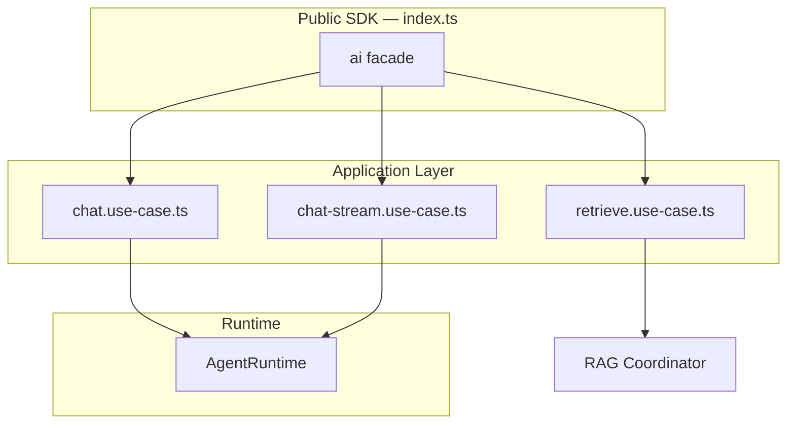

### 5.4 `ai.chat()` Resolution Chain

1. Validate DTO (Zod)
2. Resolve `AgentDefinition` by `appId` → `agents/definitions/`
3. Run platform guards (rate, cost, concurrency)
4. `ModelRouter.resolve(appId, task, hints)` → provider + model
5. Build `RuntimeContext` (memory, RAG scope, prompt keys)
6. Invoke LangGraph (or legacy pipeline during Phase 1)
7. Stream or collect; emit observability events
8. Return typed result with `runId`, `usage`, `sources` (if RAG)

### 5.5 Error Taxonomy

| Code | HTTP (if extracted) | Meaning |
|------|---------------------|---------|
| `AI_DISABLED` | 503 | Platform or app disabled |
| `RATE_LIMITED` | 429 | User exceeded limits |
| `COST_CAP_EXCEEDED` | 503 | Budget exhausted |
| `CONCURRENCY_LIMIT` | 429 | Too many active streams |
| `PROVIDER_UNAVAILABLE` | 502 | All providers in fallback chain failed |
| `VALIDATION_ERROR` | 400 | Malformed request |
| `RUNTIME_ERROR` | 500 | Unexpected platform failure |

Features map these to product-specific user messages.

### 5.6 What Features Must NOT Do

- Import `openai`, `@anthropic-ai/sdk`, `@google/generative-ai`
- Read `OPENAI_API_KEY` or any provider env var
- Pass `model: 'gpt-5'` in normal flows (admin/debug endpoints excepted)
- Import `@/ai-platform/infrastructure/*` or `@/ai-platform/providers/*`

### 5.7 Backward Compatibility Aliases

During migration, existing `runAgent` / `streamAgent` names remain as aliases:

```typescript
export const runAgent = (agentId, req) => ai.chat({ appId: agentId, ...req });
export const streamAgent = (agentId, req) => ai.chatStream({ appId: agentId, ...req });
```

---

## 6. Model Router Design

### 6.1 Responsibilities

The Model Router is the **only** component that maps logical requests to physical `provider + model + parameters`. Features and graph nodes request a **route**, not a vendor.

### 6.2 Routing Modes

| Mode | Trigger | Example |
|------|---------|---------|
| **Static** | `AgentDefinition.defaultModel` | Tutor always starts with education policy |
| **Dynamic — task** | Graph node declares `task: 'summarization'` | Cheaper model for summaries |
| **Dynamic — cost** | Cost Engine signals budget pressure | Downgrade to `gemini-flash` |
| **Dynamic — latency** | p95 latency SLO breach | Prefer faster model in region |
| **Fallback** | Retryable provider error | GPT → Claude → Gemini |
| **Override (internal)** | Admin/eval tooling only | Pin model for regression test |

### 6.3 Resolution Algorithm

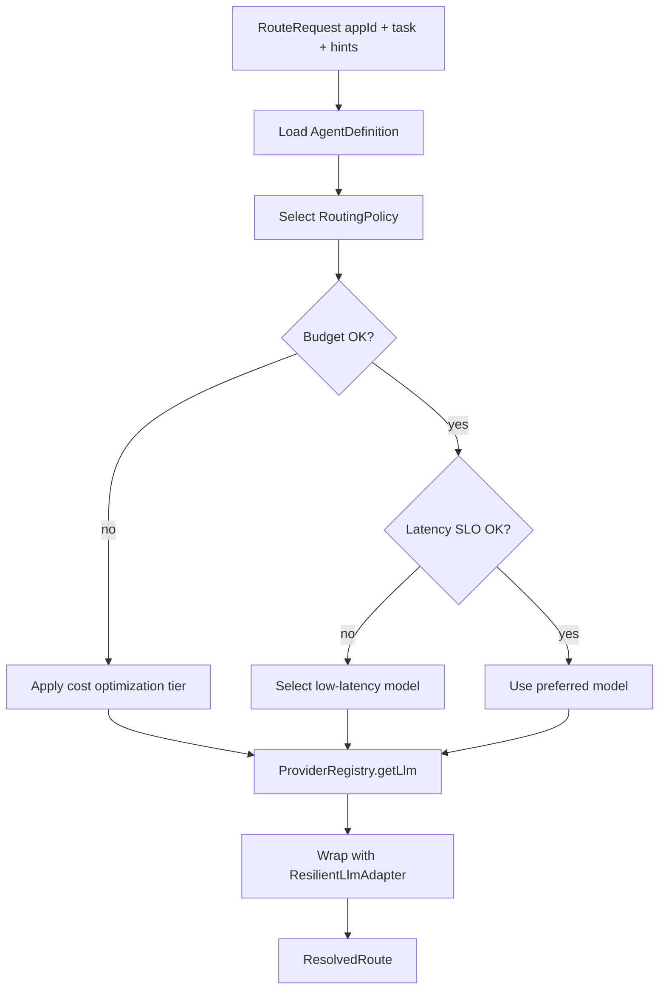

### 6.4 Configuration Structure

```typescript
// Conceptual — router/routing-policies.ts

interface AppModelPolicy {
  appId: string;
  defaultTask: string;
  allowedModels: string[];       // Allowlist per app
  preferredModel: string;
  fallbackChain: string[];
  costTier: 'economy' | 'balanced' | 'quality';
  maxCostPerRequestUsd?: number;
}

// Example policies (deploy-time config)
const APP_POLICIES: AppModelPolicy[] = [
  {
    appId: 'ai-tutor',
    defaultTask: 'education',
    preferredModel: 'gpt-5',
    fallbackChain: ['gpt-4o', 'claude-sonnet-4', 'gemini-2.5-flash'],
    allowedModels: ['gpt-5', 'gpt-4o', 'claude-sonnet-4'],
    costTier: 'quality',
  },
  {
    appId: 'ai-assignment-generator',
    defaultTask: 'evaluation',
    preferredModel: 'claude-sonnet-4',
    fallbackChain: ['gpt-4o'],
    allowedModels: ['claude-sonnet-4', 'gpt-4o'],
    costTier: 'balanced',
  },
  {
    appId: 'ai-marketing-assistant',
    defaultTask: 'creative',
    preferredModel: 'gemini-2.5-flash',
    fallbackChain: ['gpt-4o-mini'],
    allowedModels: ['gemini-2.5-flash', 'gpt-4o-mini'],
    costTier: 'economy',
  },
];
```

### 6.5 Fallback Chain Execution

See [12-providers.md](./12-providers.md#fallback-chains). Key rules:

1. Only **retryable** errors trigger fallback (rate limit, timeout, 503)
2. Auth failures and invalid requests do **not** fallback (prevents key leakage across providers)
3. Ollama excluded from production fallback chains
4. Actual model used is recorded in `ai_agent_runs` for cost accuracy
5. Circuit breaker opens after N consecutive failures (Phase 2)

### 6.6 Embedding Routing (Separate Concern)

Embeddings are **not** routed per chat request. A single embedding model is active per environment (`text-embedding-3-small`, 1536 dims). Changing embedding model requires **re-indexing**. The router does not apply to embeddings unless multi-index support is added (Future Extension).

### 6.7 Observability

Every route decision emits:

- `route.model`, `route.provider`, `route.policy`, `route.fallbackUsed`
- LangSmith metadata + OTEL span attribute `ai.model.selected`

---

## 7. Provider Abstraction Design

### 7.1 Port Interfaces

Canonical definitions in `domain/ports/`:

**`LlmPort`**
- `streamAnswer(options): AsyncIterable<string>`
- `complete?(options): Promise<string>` (non-streaming apps)
- Normalized `LlmMessage`, `LlmStreamOptions`
- `LlmError` with `retryable` flag

**`EmbeddingPort`**
- `embed(texts): Promise<number[][]>`
- `embedSingle(text): Promise<number[]>`
- `getDimensions(): number`

See [12-providers.md](./12-providers.md) for full interface.

### 7.2 Adapter Matrix

| Provider | LLM | Embeddings | Streaming | Tool Calling | Production |
|----------|-----|------------|-----------|--------------|------------|
| OpenAI | ✅ | ✅ | ✅ | ✅ | ✅ |
| Anthropic | ✅ | ❌ | ✅ | ✅ (tool_use) | ✅ |
| Google Gemini | ✅ | ✅ (Phase 3+) | ✅ | ✅ | ✅ |
| Ollama | ✅ | ❌ | ✅ | Limited | Dev/CI only |

### 7.3 Normalization Responsibilities

Each adapter must normalize:

| Concern | Normalization |
|---------|---------------|
| System prompt | OpenAI message vs Anthropic `system` param vs Gemini `systemInstruction` |
| Tool calls | `tool_calls` vs `tool_use` vs Gemini function calling |
| Streaming events | Delta chunks → `string` tokens |
| Token usage | Map to `UsageRecord { inputTokens, outputTokens }` |
| Errors | Map HTTP/SDK errors → `LlmError` with code + retryable |
| Timeouts | AbortSignal propagation |

### 7.4 Provider Registry

```typescript
interface ProviderRegistry {
  registerLlm(provider: string, adapter: LlmPort, models: string[]): void;
  registerEmbedding(provider: string, adapter: EmbeddingPort, models: string[]): void;
  getLlm(model: string): LlmPort;
  getEmbedding(model: string): EmbeddingPort;
  getProviderForModel(model: string): string;
  listModels(): ModelInfo[];
}
```

Populated at startup in `ai-platform.container.ts`. **No runtime dynamic loading** in Phase 1–3.

### 7.5 Resilient Wrapper

All production adapters wrapped with `ResilientLlmAdapter` (migrated from ai-tutor):

- 3 attempts, exponential backoff + jitter
- Retry only on `RATE_LIMITED`, `TIMEOUT`, `SERVICE_UNAVAILABLE`
- Circuit breaker (Phase 2)

### 7.6 OpenRouter Compatibility

OpenAI adapter accepts `OPENAI_BASE_URL` for OpenRouter — useful as emergency unified gateway without changing feature code. **Not a substitute** for first-class Anthropic/Gemini adapters (different tool formats, usage accounting).

---

## 8. AI Tutor Refactoring Plan

### 8.1 Target End State

```
src/features/ai-tutor/
├── api/handlers/           # HTTP, auth, enrollment — unchanged routes
├── application/
│   ├── use-cases/
│   │   └── ask-tutor.use-case.ts   # Thin: enroll check → ai.chatStream()
│   └── services/
│       ├── course-context.service.ts      # STAYS — tutor-specific
│       ├── educational-integrity.service.ts # STAYS
│       └── learning-profile.service.ts      # STAYS
├── domain/
│   ├── models/             # TutorConversation, TutorThread — STAYS
│   └── ports/
│       └── ConversationRepositoryPort.ts    # STAYS
├── infrastructure/
│   └── repositories/         # Tutor Prisma repos — STAYS
└── presentation/             # UI — STAYS
```

### 8.2 What Moves to Platform

| Current Location | Platform Target |
|------------------|-----------------|
| `domain/ports/LlmPort.ts` | `ai-platform/domain/ports/llm.port.ts` |
| `domain/ports/EmbeddingPort.ts` | `ai-platform/domain/ports/embedding.port.ts` |
| `domain/ports/VectorSearchPort.ts` | `ai-platform/domain/ports/vector-search.port.ts` |
| `infrastructure/adapters/OpenAI*.ts` | `ai-platform/providers/openai/` |
| `infrastructure/adapters/ResilientLlmAdapter.ts` | `ai-platform/providers/resilient/` |
| `infrastructure/adapters/PostgresVectorSearchAdapter.ts` | `ai-platform/rag/retrieval/` |
| `application/services/knowledge-ingestion/*` | `ai-platform/rag/ingestion/`, `indexing/` |
| `infrastructure/queue/course-indexing-*` | `ai-platform/indexing/` |
| `infrastructure/guards/tutor-request.guards.ts` | `ai-platform/infrastructure/guards/` (generalized) |
| `infrastructure/guards/tutor-cost-cap.guard.ts` | `ai-platform/infrastructure/guards/` + cost engine |
| `application/services/content-retriever.service.ts` | `ai-platform/rag/retrieval/` |
| `infrastructure/cache/embedding-cache.ts` | `ai-platform/embeddings/cache/` |
| Hand-rolled ask pipeline (RAG → prompt → LLM) | `ai-platform/graph/graphs/tutor.graph.ts` |

### 8.3 What Stays in AI Tutor

| Concern | Rationale |
|---------|-----------|
| `ConversationRepositoryPort` + Prisma repos | Product-specific threading model (ADR-002 tutor) |
| `CourseContextRepositoryPort` | Enrollment is a courses domain concern |
| `ContentFilterPort` / educational integrity | Tutor-specific academic policy |
| `prompt-builder.ts` content sections | Tutor variables; templates move to Langfuse |
| Learning profile + knowledge gaps | Tutor personalization (may generalize later) |
| API routes `/api/tutor/*` | Feature presentation boundary |
| `AITutorChat` UI | Product UX |

### 8.4 Refactored `ask-tutor` (Target)

```typescript
// Conceptual — Phase 2 end state
export async function* askTutorUseCase(input: AskTutorInputDTO, deps: AskTutorDeps) {
  await deps.enrollmentPolicy.assertEnrolled(input.userId, input.courseId);

  const sessionContext = await buildTutorSessionContext(input, deps);

  // Assessment / session-meta shortcuts remain in tutor (product logic)
  const early = tryGuidedResponse(sessionContext, input.message);
  if (early) { yield early; return; }

  for await (const event of ai.chatStream({
    appId: 'ai-tutor',
    messages: [{ role: 'user', content: input.message }],
    scope: {
      userId: input.userId,
      courseId: input.courseId,
      lectureId: input.lectureId,
      threadId: input.threadId,
    },
    context: { sessionContext },  // Tutor-specific context blob
    options: { locale: 'ar' },
  })) {
    if (event.type === 'token') yield event.text;
    if (event.type === 'done') {
      await deps.conversationRepository.persistTurn({ ... });
    }
  }
}
```

### 8.5 Indexing Port Inversion

**Today:** Courses → `CourseKnowledgeIndexerPort` → implemented in ai-tutor.

**Target:** Courses → `CourseKnowledgeIndexerPort` → implemented in **ai-platform/indexing/** (platform owns queue). Courses feature keeps the port interface; wiring changes once.

### 8.6 Phase 2 Runtime Migration (Implemented)

Production tutor orchestration now uses a **dual-path** in `ask-tutor.use-case.ts`:

| Flag | Execution path |
|------|----------------|
| `AI_PLATFORM_RUNTIME_ENABLED=false` | Legacy `llmPort.streamAnswer()` pipeline (Phase 1) |
| `AI_PLATFORM_RUNTIME_ENABLED=true` | `streamAgent('tutor')` → LangGraph tutor graph + cost ledger |

**What the use case still owns (unchanged):** session context, enrollment, conversation/thread persistence, assessment blocking, RAG retrieval, prompt building, content filter, SSE `[META]` protocol.

**What the platform runtime owns:** guards (rate limit, cost cap, concurrency), `startAgentRun` / `completeAgentRun`, graph nodes (`sanitize-input` → `retrieve-context` → `generate-response` → `validate-output`).

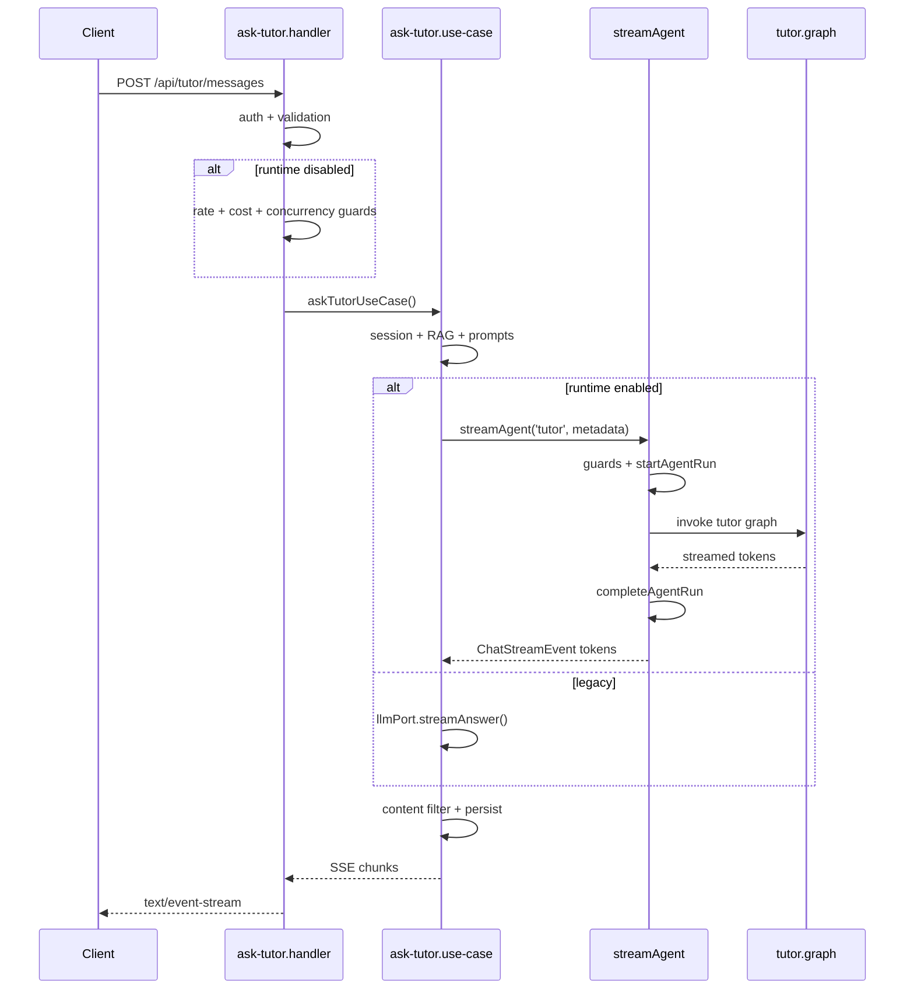

**Feature flags:**

- `AI_TUTOR_ENABLED` — master switch for `/api/tutor/*` routes
- `AI_PLATFORM_ENABLED` — enables platform providers, guards config, cost ledger tables
- `AI_PLATFORM_RUNTIME_ENABLED` — switches tutor LLM execution to LangGraph runtime (requires platform enabled)

When runtime is enabled, the handler skips pre-stream guards; `streamAgent` applies platform guards with `agent:tutor` scope. Early-exit paths (assessment block, RAG fallback) call tutor guard helpers directly since they do not invoke the graph.

---

## 9. Migration Strategy

### 9.1 Principles

1. **Strangler fig** — No big-bang rewrite (ADR-012)
2. **Tests gate each move** — All 15+ ai-tutor tests pass after every extraction
3. **API stability** — `/api/tutor/*` contracts unchanged until explicitly versioned
4. **Feature flag** — `AI_PLATFORM_ENABLED` parallel to `AI_TUTOR_ENABLED`
5. **Delegate pattern** — `ai-tutor-container.ts` → `ai-platform.container.ts`

### 9.2 Phase Overview

| Phase | Duration | Outcome |
|-------|----------|---------|
| **Phase 1: Foundation** | 4–6 weeks | Providers, RAG, indexing, guards extracted; tutor delegates |
| **Phase 2: Agent Runtime** | 4–6 weeks | LangGraph, Langfuse, LangSmith, OTEL, `ai.chat()` |
| **Phase 3: Intelligence** | 6–8 weeks | Multi-provider, tools, MCP, memory, first new app |

See [14-roadmap.md](./14-roadmap.md) and [Section 20](#20-implementation-roadmap).

### 9.3 Migration Steps (Phase 1 Detail)

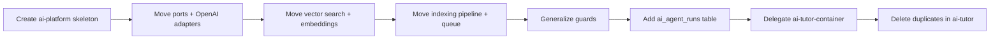

### 9.4 Rollback Strategy

Each phase is revertible:

- Git revert of extraction PR
- `AI_PLATFORM_ENABLED=false` falls back to inlined tutor code (maintain shim until Phase 2 complete)
- Indexing outbox ensures no lost jobs during rollback

### 9.5 Data Migration

| Change | Strategy |
|--------|----------|
| `knowledge_chunks` → `ai_knowledge_chunks` | Dual-write then cutover (Phase 2) OR keep table name, change repo owner only (Phase 1 — **recommended initially**) |
| New `ai_agent_runs` | Additive migration; no backfill required |
| Redis key `tutor:*` → `ai:*` | TTL-based natural migration; support both prefixes during transition |

---

## 10. Folder Structure

The canonical folder tree is documented in [03-folder-structure.md](./03-folder-structure.md).

### Summary

```
src/
├── ai-platform/          # NEW — all shared AI infrastructure
│   ├── index.ts          # Public SDK: ai.chat(), ai.chatStream(), ...
│   ├── application/      # Use cases, runtime
│   ├── domain/           # Ports, models, policies
│   ├── infrastructure/   # DI, guards, queues, Prisma repos
│   ├── providers/        # OpenAI, Anthropic, Gemini, Ollama
│   ├── router/           # Model routing
│   ├── agents/           # Per-app agent definitions
│   ├── graph/            # LangGraph nodes and graphs
│   ├── prompts/          # Langfuse + local fallback
│   ├── rag/              # Retrieval, chunking, ingestion
│   ├── embeddings/       # Embedding pipeline + cache
│   ├── memory/           # Short/long-term memory
│   ├── tools/            # Tool registry + MCP
│   ├── evaluation/       # Ragas, DeepEval
│   ├── observability/    # LangSmith, OTEL, cost
│   ├── indexing/         # Async indexing pipelines
│   └── shared/           # Constants, streaming helpers
│
├── features/
│   ├── ai-tutor/         # Thin product client
│   ├── ai-assignment-generator/   # Future
│   ├── ai-course-builder/         # Future
│   ├── ai-marketing-assistant/    # Future
│   └── ai-job-assistant/          # Future
│
└── server/workers/       # Thin shells → platform handlers
```

### Import Rule

```
features → @/ai-platform ONLY
ai-platform → NEVER features
```

---

## 11. Domain Boundaries

### 11.1 Bounded Context Map

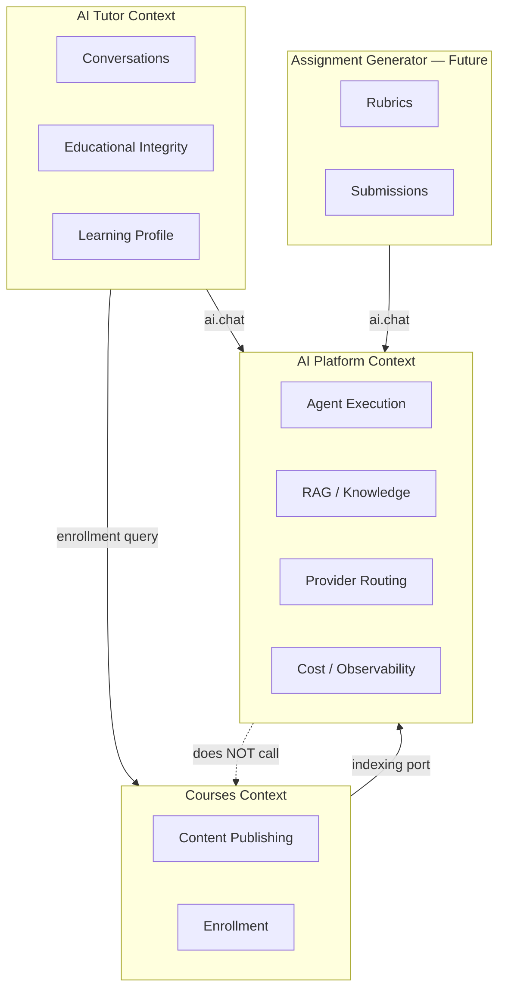

### 11.2 Context Rules

| Rule | Description |
|------|-------------|
| **Platform is domain-agnostic** | Receives `scope` blob; does not import course models |
| **Features own authorization** | Enrollment, roles, admin scope verified before `ai.chat()` |
| **Shared knowledge is platform-owned** | RAG chunks are not tutor-specific |
| **Product conversations stay in features** | Tutor threads ≠ platform memory (until unified memory Phase 3) |
| **Anti-corruption layer** | Tutor passes `sessionContext` DTO, not Prisma entities |

### 11.3 Ubiquitous Language

| Term | Meaning |
|------|---------|
| **App / Agent** | A registered AI product (`ai-tutor`, `ai-marketing-assistant`) |
| **Run** | Single `ai.chat()` execution with `runId` |
| **Scope** | Authorization context: `userId` + resource IDs |
| **Route** | Resolved `provider + model + params` |
| **Chunk** | Vector-indexed knowledge unit |
| **Guard** | Pre-execution platform policy (rate, cost) |

---

## 12. Architecture Decision Records

Full ADR text: [15-adrs.md](./15-adrs.md). Summary:

| ADR | Decision | Status |
|-----|----------|--------|
| ADR-001 | Internal module, not microservice | Accepted |
| ADR-002 | LangGraph for orchestration | Accepted |
| ADR-003 | Langfuse (prompts) + LangSmith (traces) + OTEL | Accepted |
| ADR-004 | pgvector, not dedicated vector DB | Accepted |
| ADR-005 | Direct TypeScript API (`ai.chat`), not internal REST | Accepted |
| ADR-006 | BullMQ + outbox for async indexing | Accepted |
| ADR-007 | Redis + PostgreSQL dual memory | Accepted |
| ADR-008 | MCP for tool extensibility | Accepted |
| ADR-009 | Port/adapter provider abstraction | Accepted |
| ADR-010 | Feature-owned authorization | Accepted |
| ADR-011 | Workers in `src/server/workers/` | Accepted |
| ADR-012 | Strangler migration from ai-tutor | Accepted |

### ADR-013 (Proposed): `ai.chat` Facade over `runAgent`

**Context:** Docs used `runAgent`/`streamAgent`; product teams expect `ai.chat()`.

**Decision:** Export `ai` namespace as primary SDK; keep `runAgent` as deprecated alias.

**Consequence:** Single ergonomic entry point; easier onboarding for new AI apps.

### ADR-014 (Proposed): Per-App Model Policy via Router

**Context:** Each future app needs different default providers.

**Decision:** `AgentDefinition` references `AppModelPolicy`; features cannot override model in production.

**Consequence:** Centralized cost/quality governance; prevents provider leakage to features.

---

## 13. Sequence Diagrams

### 13.1 `ai.chatStream()` — AI Tutor Happy Path

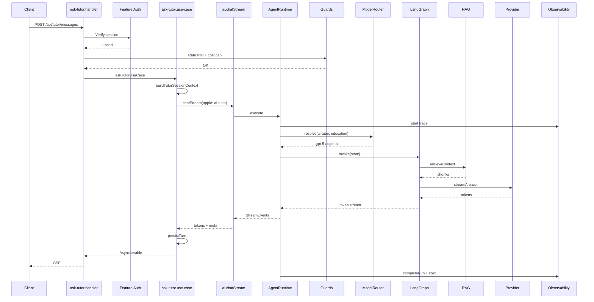

### 13.2 Provider Fallback

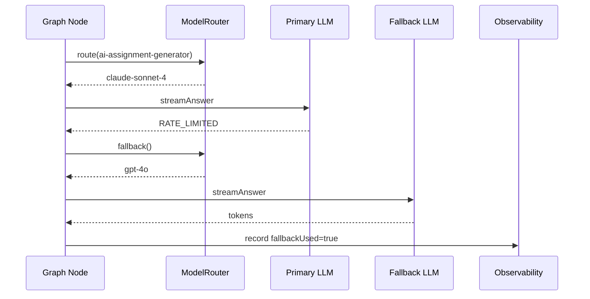

### 13.3 Course Indexing (Async)

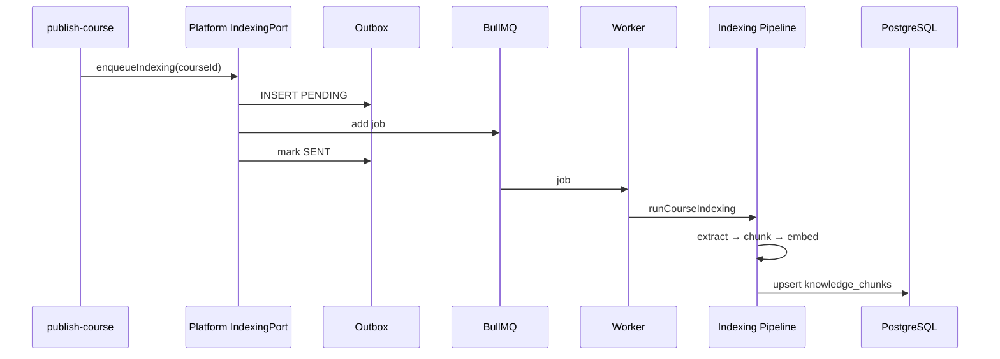

### 13.4 Tool Calling Loop (Phase 3)

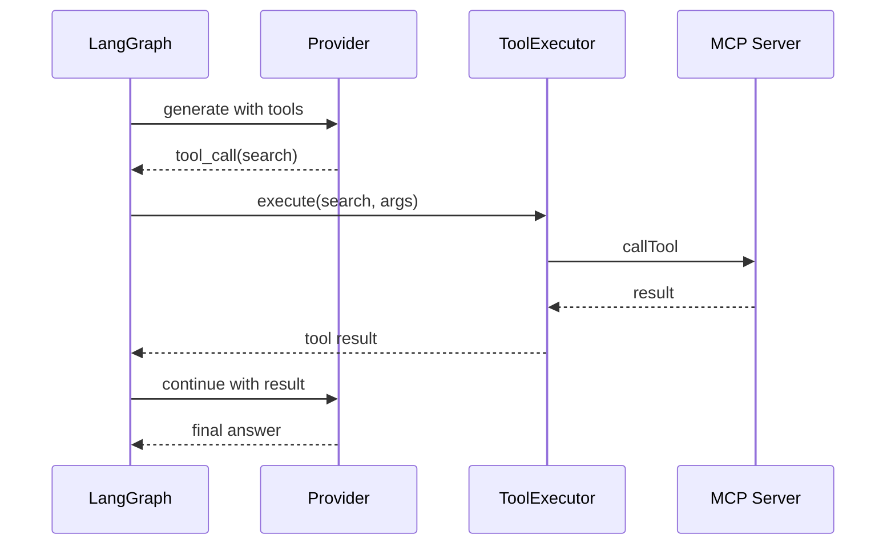

---

## 14. Component Diagrams

### 14.1 Platform Component Diagram

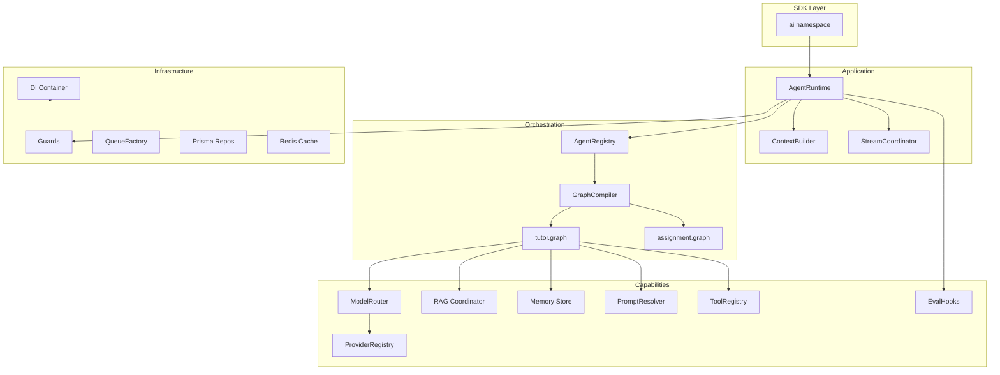

### 14.2 Provider Component Diagram

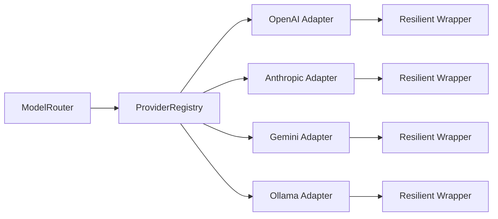

---

## 15. Dependency Graph

### 15.1 Module Dependency DAG

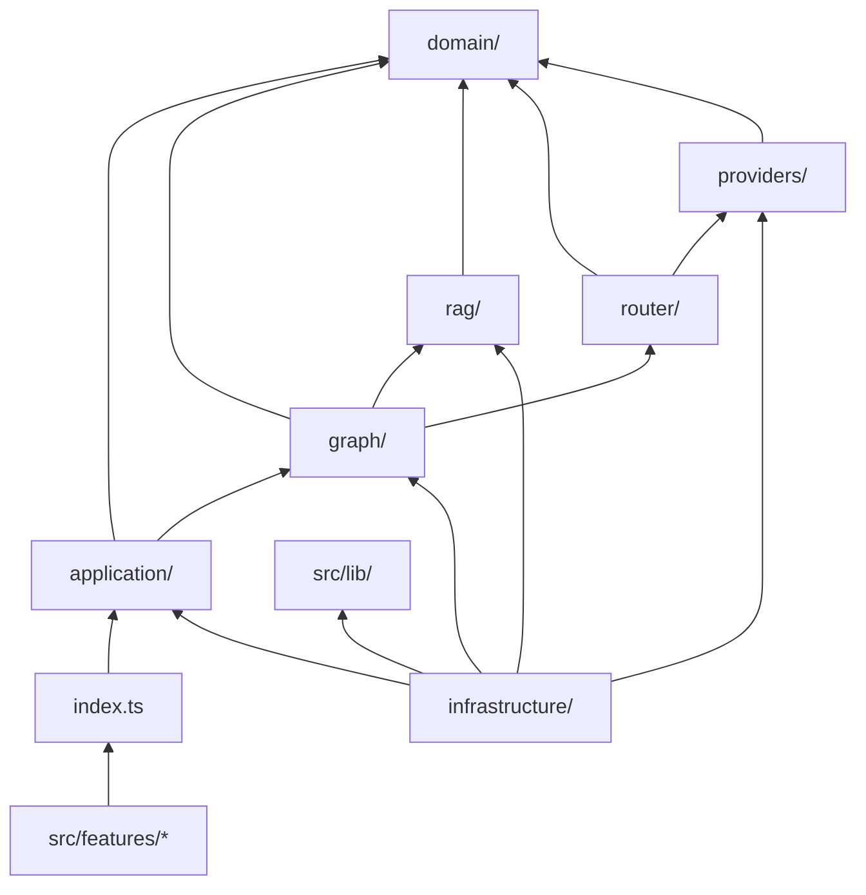

### 15.2 Forbidden Dependencies

| From | To | Reason |
|------|-----|--------|
| `ai-platform` | `features/*` | Inversion of control |
| `domain/` | `infrastructure/` | Clean architecture |
| `features/` | `ai-platform/infrastructure/` | Leaky abstraction |
| `graph/nodes/` | `openai` SDK | Provider lock-in |
| `providers/` | `features/` | Circular dependency |

### 15.3 External Dependencies (npm)

| Package | Purpose | Phase |
|---------|---------|-------|
| `openai` | OpenAI adapter | 1 |
| `@anthropic-ai/sdk` | Anthropic adapter | 3 |
| `@google/generative-ai` | Gemini adapter | 3 |
| `@langchain/langgraph` | Orchestration | 2 |
| `langsmith` | Tracing | 2 |
| `langfuse` | Prompts | 2 |
| `@opentelemetry/sdk-node` | System observability | 2 |
| `@modelcontextprotocol/sdk` | MCP tools | 3 |

---

## 16. Risks

| ID | Risk | Likelihood | Impact | Mitigation |
|----|------|------------|--------|------------|
| R1 | Migration breaks live tutor | Medium | High | Strangler + test gate per PR |
| R2 | Arabic quality regression | Medium | High | Golden dataset + Ragas CI gate |
| R3 | LangGraph learning curve delays Phase 2 | Medium | Medium | Start linear graph; one node at a time |
| R4 | Cost spike from multi-provider | Medium | Medium | Cost Engine + per-app budgets |
| R5 | Embedding dimension lock-in | High | Medium | Document re-index requirement; avoid casual model changes |
| R6 | pgvector latency at scale | Low | High | Monitor p95; plan read replica / partition |
| R7 | Redis SPOF | Medium | High | Fail-closed guards become outage; Redis HA for prod |
| R8 | Single developer bottleneck | High | Medium | This documentation; phased independence |
| R9 | Provider API breaking changes | Medium | Medium | Adapter isolation; pin SDK versions |
| R10 | Prompt injection via RAG chunks | Medium | High | Sanitize node + sensitivity filters |
| R11 | Cross-app data leakage via shared RAG | Low | Critical | Strict scope filters per `appId` + `courseId` |
| R12 | Strict streaming buffer UX regression | Low | Medium | Per-app streaming policy in agent definition |
| R13 | Vendor lock-in (LangChain ecosystem) | Medium | Medium | Ports at provider boundary; OTEL escape hatch |

---

## 17. Trade-offs

### 17.1 Modular Monolith vs Separate AI Service

| | Monolith (chosen) | Microservice |
|---|-------------------|--------------|
| Latency | In-process (~0ms) | Network (+5–50ms) |
| Deployment | Single pipeline | Coordinated releases |
| Scaling | Coupled | Independent |
| Team fit | 1 developer | 3+ AI engineers |
| **Verdict** | Correct for 2026 scale | Revisit per [14-roadmap.md](./14-roadmap.md) criteria |

### 17.2 LangGraph vs Hand-Rolled Orchestration

| | LangGraph | Hand-rolled |
|---|-----------|-------------|
| Learning curve | Higher | Lower |
| Multi-agent | Native | Manual |
| Debug | LangSmith integration | Custom logging |
| Simple tutor path | Slight overhead | Already works |
| **Verdict** | Adopt in Phase 2 | Keep during Phase 1 extraction |

### 17.3 pgvector vs Dedicated Vector DB

| | pgvector | Pinecone/Qdrant |
|---|----------|-----------------|
| Ops complexity | Low (existing PG) | New service |
| Hybrid search | Manual | Built-in (some) |
| Scale ceiling | ~1M chunks tuned | Higher |
| **Verdict** | Keep until p95 > 200ms or >1M chunks |

### 17.4 Langfuse + LangSmith vs Single Vendor

| | Hybrid | Single |
|---|--------|--------|
| Cost | Two subscriptions | One |
| Best-of-breed | Yes | Compromise |
| Ops burden | Two integrations | One |
| **Verdict** | Hybrid (ADR-003) |

### 17.5 Centralized vs Per-Feature Model Choice

| | Centralized router | Feature chooses model |
|---|-------------------|----------------------|
| Governance | Strong | Weak |
| Flexibility | Admin-configured | Developer freedom |
| Provider secrecy | Guaranteed | Leaks via imports |
| **Verdict** | Centralized (requirement) |

---

## 18. Future Extensions

| Extension | Trigger | Design Hook |
|-----------|---------|-------------|
| **Service extraction** | >1000 runs/min, 3+ AI engineers | DTOs → HTTP; workers migrate |
| **Multi-embedding indexes** | Different content types need different embeddings | `EmbeddingIndexRegistry` |
| **Hybrid search (BM25 + vector)** | Retrieval precision plateau | `rag/rerankers/`, Elasticsearch optional |
| **Voice I/O** | Accessibility requirements | New adapter on `LlmPort` |
| **Multimodal (diagrams)** | Course materials include images | Gemini/GPT-4o vision route |
| **Real-time collaboration** | Multiple students, one tutor session | WebSocket + graph checkpointing |
| **Federated memory** | Cross-app user preferences | Platform `ai_memory_facts` |
| **Online learning / feedback** | Thumbs-down drives prompt iteration | `ai.recordFeedback()` → Langfuse |
| **GPU local inference** | Data residency requirements | Ollama production tier |
| **AI Gateway (LiteLLM)** | 10+ providers, ops team | Router delegates to gateway adapter |
| **Tenant isolation** | B2B SaaS pivot | `tenantId` in scope + row-level security |

---

## 19. Production Readiness Checklist

### 19.1 Platform Core

- [ ] `src/ai-platform/` module created with `index.ts` public barrel
- [ ] `AI_PLATFORM_ENABLED` feature flag with startup validation
- [ ] All domain ports have adapter implementations
- [ ] DI container with no `globalThis` singleton leaks
- [ ] `ai.chat()` / `ai.chatStream()` integration tests
- [ ] Provider registry with OpenAI, Anthropic, Gemini, Ollama
- [ ] Model router with static + fallback policies
- [ ] Resilient wrapper on all production providers

### 19.2 Data and RAG

- [ ] pgvector extension validated at startup
- [ ] HNSW index monitored (p95 < 200ms)
- [ ] Indexing outbox durability verified
- [ ] Content-hash incremental indexing
- [ ] Embedding cache with namespaced keys (`ai:embed:*`)
- [ ] Re-index runbook documented

### 19.3 Security

- [ ] Feature-owned auth (ADR-010) enforced in all handlers
- [ ] Input sanitization graph node
- [ ] Output validation before persist
- [ ] Course-scoped retrieval filters
- [ ] Rate limits fail-closed
- [ ] API keys in env only; rotation runbook
- [ ] PII redaction in traces/logs
- [ ] Tool sandbox with timeout + allowlist

### 19.4 Observability

- [ ] LangSmith trace per run
- [ ] OTEL spans exported (stdout dev, OTLP prod)
- [ ] Cost ledger: `ai_agent_runs` populated
- [ ] Correlation ID from HTTP → worker
- [ ] Dashboard data layer for admin cost analytics
- [ ] Alerting on error rate, latency, daily cost

### 19.5 Quality

- [ ] Arabic golden dataset (≥50 cases)
- [ ] Nightly Ragas evaluation job
- [ ] DeepEval CI gate on PRs (Phase 3)
- [ ] Load test: target 100 concurrent streams
- [ ] Chaos test: Redis down, provider 503, fallback works

### 19.6 Operations

- [ ] `/api/health/ai-platform` endpoint
- [ ] Worker heartbeat monitoring
- [ ] BullMQ queue depth alerts
- [ ] Runbooks: provider outage, re-index, cost cap breach
- [ ] Data retention jobs per [ai-tutor/10-data-retention.md](../ai-tutor/10-data-retention.md)

### 19.7 Migration Complete

- [ ] No duplicate code between ai-tutor and ai-platform
- [ ] `ai-tutor-container.ts` is thin delegate
- [ ] Courses indexing port implemented in platform
- [ ] All ai-tutor tests pass
- [ ] New integration test for ask-tutor E2E

---

## 20. Implementation Roadmap

### 20.1 Step-by-Step (Single Developer, ~16–18 weeks)

#### Weeks 1–2: Scaffold and Ports

1. Create `src/ai-platform/` folder structure per [03-folder-structure.md](./03-folder-structure.md)
2. Copy and generalize ports from ai-tutor (`LlmPort`, `EmbeddingPort`, `VectorSearchPort`)
3. Create `index.ts` with stub `ai.chat()` throwing `NOT_IMPLEMENTED`
4. Add `AI_PLATFORM_ENABLED` to `src/config/env.ts`
5. Add startup validation (`validate-platform-infrastructure.ts`)
6. **Gate:** CI passes; no behavior change

#### Weeks 3–4: Provider Extraction

7. Move `OpenAILlmAdapter`, `OpenAIEmbeddingAdapter`, `ResilientLlmAdapter`
8. Create `ai-platform.container.ts`
9. Update `ai-tutor-container.ts` to delegate
10. Add `ai_agent_runs` Prisma migration
11. Record token usage in cost ledger (basic)
12. **Gate:** All ai-tutor tests pass; tutor uses platform adapters

#### Weeks 5–6: RAG and Indexing Extraction

13. Move `PostgresVectorSearchAdapter` → `rag/retrieval/`
14. Move embedding pipeline + cache
15. Move knowledge ingestion pipeline
16. Move BullMQ queue, outbox, worker handlers
17. Implement `CourseKnowledgeIndexerPort` in platform
18. Update courses wiring to platform port
19. **Gate:** Publish course → index → ask question E2E works

#### Week 7: Guards and SDK v1

20. Generalize rate limit, concurrency, cost cap guards (`ai:*` keys)
21. Implement `ai.chatStream()` over existing hand-rolled tutor pipeline
22. Add integration test for ask-tutor handler
23. **Gate:** Phase 1 exit criteria from [14-roadmap.md](./14-roadmap.md)

#### Weeks 8–10: LangGraph Runtime

24. Install LangGraph; create `tutor.graph.ts` (linear: sanitize → retrieve → generate → validate)
25. Extract `AgentRuntime` per [17-runtime.md](./17-runtime.md)
26. Register `ai-tutor` agent definition
27. Migrate `ask-tutor.use-case.ts` to call `ai.chatStream()`
28. **Gate:** Streaming behavior matches pre-migration

#### Weeks 11–12: Observability and Prompts

29. Integrate Langfuse; migrate prompt keys from `prompt-builder.ts`
30. Integrate LangSmith tracing
31. OTEL bootstrap
32. Nightly Ragas eval job
33. **Gate:** Traces visible; prompts versioned in Langfuse

#### Weeks 13–14: Model Router and Multi-Provider

34. Implement `ModelRouter` with per-app policies
35. Add Anthropic and Gemini adapters
36. Implement fallback chains
37. Configure assignment-generator agent stub with Claude route
38. **Gate:** Force fallback in staging; verify cost recording

#### Weeks 15–16: Tools, Memory, First New App

39. Tool registry + built-in tools
40. MCP client (stdio transport)
41. Long-term memory (`ai_memory_facts`)
42. Scaffold `ai-assignment-generator` feature calling `ai.chat()`
43. **Gate:** Two AI apps on platform; Phase 3 exit criteria

#### Weeks 17–18: Hardening

44. Load testing and tuning
45. Production readiness checklist (Section 19)
46. Documentation deprecation banners in `docs/ai-tutor/`
47. Admin cost analytics API

### 20.2 Parallel Workstreams (If Team Grows)

| Stream | Owner | Deliverable |
|--------|-------|-------------|
| Platform core | Platform engineer | Phases 1–2 |
| AI Tutor refactor | Feature engineer | Thin client migration |
| Assignment Generator | Product engineer | First new consumer |
| DevOps | Infra | OTEL collector, Redis HA, alerts |

### 20.3 Success Metrics

| Metric | Baseline (Today) | Target (Post Phase 3) |
|--------|------------------|-------------------------|
| Time to ship new AI app | N/A (fork tutor) | < 1 week |
| Provider imports in features | 0 (but OpenAI in infra) | 0 |
| p95 ask-tutor latency | Unmeasured | < 8s (streaming start < 2s) |
| Arabic Ragas faithfulness | Unmeasured | ≥ 0.85 |
| Cost visibility | Daily request count | Per-run token cost by app |
| Test coverage (ask path) | 0 integration tests | ≥ 1 E2E + golden set |

---

## Document History

| Version | Date | Author | Changes |
|---------|------|--------|---------|
| 1.0 | August 2026 | Platform Architecture | Initial blueprint — all 20 deliverables |

---

## Approval

| Role | Name | Date | Sign-off |
|------|------|------|----------|
| Principal AI Architect | | | |
| Staff Engineer | | | |
| Engineering Lead | | | |
