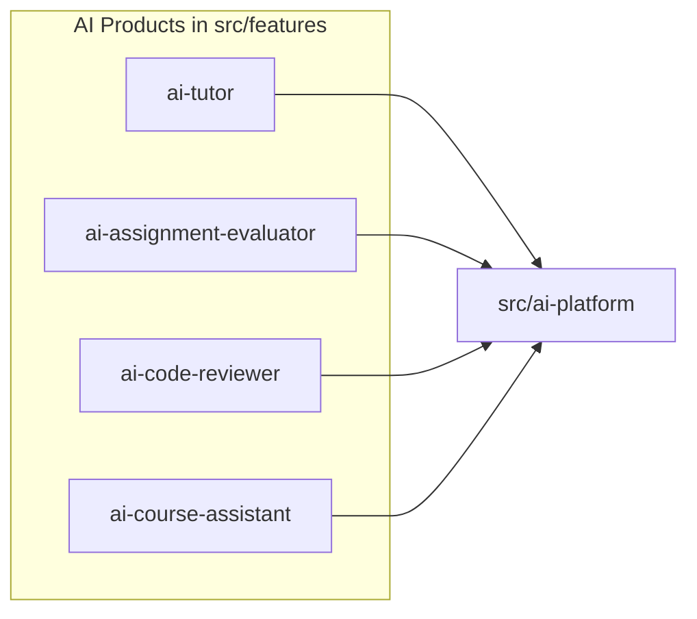

# AI Platform — Overview

> Official engineering documentation for the IthraCode AI Platform.  
> **Last updated:** August 2026

---

## Table of Contents

1. [Vision](#vision)
2. [Goals](#goals)
3. [Non-Goals](#non-goals)
4. [Scope](#scope)
5. [Position in the Monolith](#position-in-the-monolith)
6. [Relationship to AI Tutor](#relationship-to-ai-tutor)
7. [Target Products](#target-products)
8. [Documentation Index](#documentation-index)

---

## Vision

The IthraCode AI Platform is an **internal module** (`src/ai-platform`) that provides shared AI capabilities to all product features in the application. It is not a separate service, not a microservice, and not deployed independently.

Business features (courses, payments, auth, AI Tutor, and future AI products) live in `src/features`. They call the platform through **direct TypeScript function invocations** — no internal REST API, no gRPC, no AI gateway.

The platform exists so that:

- Every AI product shares the same provider abstraction, RAG pipeline, observability, and cost controls.
- New AI products can be added by composing platform primitives without reimplementing LLM adapters, vector search, or job queues.
- A single developer can maintain the entire stack while the architecture remains scalable as more AI products ship.



---

## Goals

### 1. Extensibility Without Business-Layer Changes

New AI products register an agent definition, provide product-specific prompts and policies, and call `runAgent()` or `retrieveContext()`. The platform handles orchestration, providers, memory, tools, and observability.

### 2. Production-Grade Observability

Every agent run is traced (LangSmith), every LLM call is metered (cost ledger), and system spans are exported via OpenTelemetry. Operators can debug failures, compare prompt versions, and control spend.

### 3. Cost Control

Token usage and estimated cost are recorded per run, per user, and per product. Rate limits, concurrency slots, and daily cost caps are enforced at the platform layer (migrated from the existing AI Tutor guards).

### 4. Single-Database Monolith

All AI data — vectors, conversations, memory, usage logs — lives in the **same PostgreSQL database** as the rest of the application. pgvector handles semantic search. No second database, no dedicated vector DB service in Phase 1–3.

### 5. Clean Architecture Alignment

The platform follows the same patterns already proven in `src/features/ai-tutor` and `src/features/payments`:

- Ports and adapters for external dependencies
- Composition-root DI container
- Plain-function use cases with injected dependencies
- Workers as thin process shells; business logic in the platform module

### 6. Strangler Migration from AI Tutor

The existing AI Tutor (`src/features/ai-tutor`) is production-grade. The platform extracts shared code incrementally. The tutor becomes a thin product layer; no big-bang rewrite.

---

## Non-Goals

The following are explicitly **out of scope** for the AI Platform as designed:

| Non-Goal | Rationale |
|----------|-----------|
| **Separate AI microservice** | Adds deployment, networking, and auth complexity inappropriate for a single-developer modular monolith |
| **Internal REST or gRPC API** | TypeScript function calls are faster, type-safe, and require no serialization overhead within the same process |
| **AI Gateway (Kong, LiteLLM proxy, etc.)** | Provider routing is handled by the platform's `router/` module; an external gateway adds another hop and failure point |
| **Separate deployment unit** | Platform ships inside the Next.js application and BullMQ worker processes |
| **Multi-tenant SaaS AI layer** | IthraCode is a single-tenant product; platform scopes data by `userId` and `courseId`, not by tenant |
| **Real-time model fine-tuning** | Training and fine-tuning pipelines are not part of the platform; inference only |
| **Embedding Python in Next.js** | Ragas and DeepEval run as subprocess/CLI from BullMQ workers, not in-process |

---

## Scope

### In Scope

| Area | Description |
|------|-------------|
| **Module location** | `src/ai-platform/` with documented folder structure |
| **Provider abstraction** | OpenAI, Anthropic, Gemini, Ollama behind `LlmPort` / `EmbeddingPort` |
| **Orchestration** | LangGraph multi-agent graphs with checkpointing |
| **RAG** | Indexing, chunking, embedding, pgvector retrieval |
| **Memory** | Redis short-term + PostgreSQL long-term |
| **Tools** | MCP integration + native tool registry |
| **Prompts** | Langfuse (primary) with local fallback |
| **Observability** | LangSmith traces, OpenTelemetry spans, cost ledger |
| **Evaluation** | Ragas + DeepEval offline pipelines |
| **Background jobs** | BullMQ queues with outbox durability |
| **Security** | Prompt injection defenses, tool sandbox, cost caps |
| **Migration** | Phased extraction from `ai-tutor` |

### Out of Scope (This Documentation Phase)

- Implementation code
- Prisma migration files
- npm package installation
- Admin dashboard UI components (data layer only is documented)
- Breaking changes to live AI Tutor API routes

---

## Position in the Monolith

```
ithra-code/
├── src/
│   ├── app/                    # Next.js App Router (routes, API handlers)
│   ├── features/               # Business features (courses, payments, ai-tutor, …)
│   ├── ai-platform/            # ← Internal AI Platform module
│   ├── lib/                    # Shared infra (prisma, redis, logger)
│   ├── config/                 # Environment validation
│   └── server/workers/         # BullMQ worker processes (thin shells)
├── prisma/                     # Single schema, single database
└── docs/ai-platform/           # This documentation set
```

### Dependency Rule

```
src/features/*  →  src/ai-platform  →  src/lib/*
```

The platform **never** imports from `src/features`. Features may import from `@/ai-platform` (the public barrel export in `index.ts`).

### Runtime Boundaries

| Process | Role |
|---------|------|
| **Next.js server** | Serves pages and API routes; features call platform functions in-request |
| **BullMQ workers** | Background indexing, evaluation; import platform handler functions |
| **PostgreSQL** | All persistent data including `vector(1536)` embeddings |
| **Redis** | BullMQ connection, session cache, embedding cache, rate limits |

---

## Relationship to AI Tutor

The AI Tutor is the **first consumer** of the platform and the **source of most shared code** to extract.

| Concern | Today (`ai-tutor`) | After Migration (`ai-platform`) |
|---------|-------------------|--------------------------------|
| LLM / embedding adapters | `infrastructure/adapters/` | `ai-platform/providers/` |
| Vector search | `PostgresVectorSearchAdapter` | `ai-platform/rag/retrieval/` |
| Indexing queue | `infrastructure/queue/` | `ai-platform/indexing/` |
| Agent orchestration | Hand-rolled in `ask-tutor.use-case.ts` | LangGraph in `ai-platform/graph/` |
| Tutor-specific logic | Stays in `ai-tutor` | Educational integrity, UI, API handlers |
| Documentation | `docs/ai-tutor/` (product-specific) | `docs/ai-platform/` (platform-wide) |

Product-specific docs at `docs/ai-tutor/` remain valid for tutor behavior. Shared concerns (providers, RAG, observability) reference this documentation set.

See [14-roadmap.md](./14-roadmap.md) for the phased migration plan.

---

## Target Products

The platform is designed to power multiple AI products. Each product is a feature module that composes platform capabilities.

| Product | Feature Module | Platform Capabilities Used |
|---------|---------------|------------------------------|
| **AI Tutor** | `src/features/ai-tutor` | RAG, memory, streaming, educational integrity filters |
| **AI Assignment Evaluator** | `src/features/ai-assignment-evaluator` (future) | Structured output, rubric prompts, evaluation metrics |
| **AI Code Reviewer** | `src/features/ai-code-reviewer` (future) | Code ingestion, tool calling, diff analysis |
| **AI Course Assistant** | `src/features/ai-course-assistant` (future) | Cross-course RAG, admin-scoped retrieval |
| **Future AI Agents** | `src/features/ai-*` | LangGraph multi-agent, MCP tools |

Each product:

1. Defines an agent in `ai-platform/agents/<product>/`
2. Registers a LangGraph in `ai-platform/graph/graphs/`
3. Stores prompts in Langfuse under a product-specific namespace
4. Calls `runAgent('product-id', request)` from its use case

---

## Documentation Index

| Doc | Title |
|-----|-------|
| [00-platform-blueprint.md](./00-platform-blueprint.md) | **Master architecture blueprint** — current state, target design, SDK, router, migration, risks, roadmap (all 20 deliverables) |
| [01-overview.md](./01-overview.md) | Vision, goals, non-goals, scope (this document) |
| [02-architecture.md](./02-architecture.md) | High-level architecture and internal flows |
| [03-folder-structure.md](./03-folder-structure.md) | Complete folder tree and import rules |
| [04-agents.md](./04-agents.md) | Agent architecture and LangGraph integration |
| [05-rag.md](./05-rag.md) | Indexing, retrieval, chunking, pgvector |
| [06-memory.md](./06-memory.md) | Redis + PostgreSQL memory systems |
| [07-tools.md](./07-tools.md) | MCP integration and tool registry |
| [08-prompts.md](./08-prompts.md) | Langfuse prompt management |
| [09-observability.md](./09-observability.md) | LangSmith, OpenTelemetry, cost analytics |
| [10-evaluation.md](./10-evaluation.md) | Ragas, DeepEval, regression testing |
| [11-workers.md](./11-workers.md) | BullMQ architecture and worker lifecycle |
| [12-providers.md](./12-providers.md) | Provider abstraction and multi-model support |
| [13-security.md](./13-security.md) | Security boundaries and threat model |
| [14-roadmap.md](./14-roadmap.md) | Implementation phases and future evolution |
| [15-adrs.md](./15-adrs.md) | Architecture Decision Records |
| [16-cost-engine.md](./16-cost-engine.md) | Cost governance, budgets, quotas, and optimization |
| [17-runtime.md](./17-runtime.md) | Execution lifecycle, orchestration pipeline, and runtime coordination |

---

## Related Documentation

- [AI Tutor Architecture](../ai-tutor/02-architecture.md) — product-specific tutor design (pre-platform)
- [Payment Platform Index](../payment/00-index.md) — reference for documentation structure
- [Product Features](../FEATURES.md) — platform-wide feature catalog
