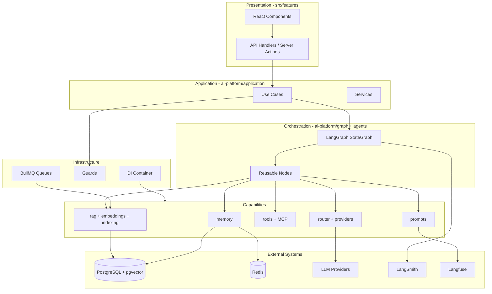
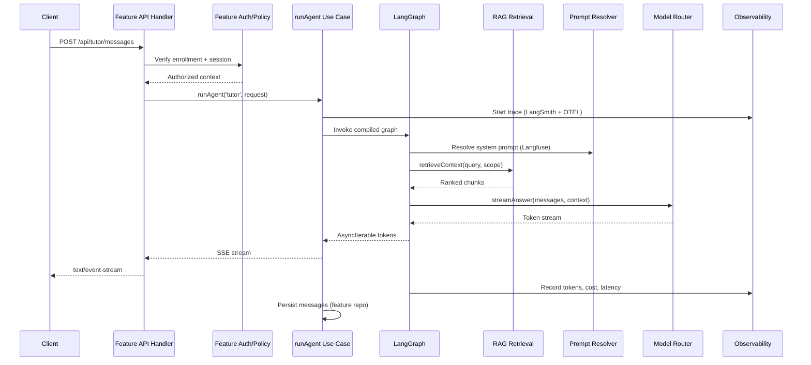
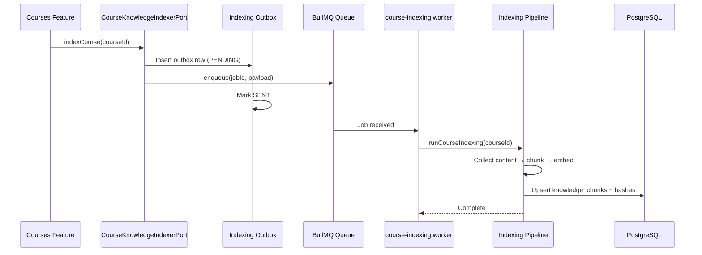
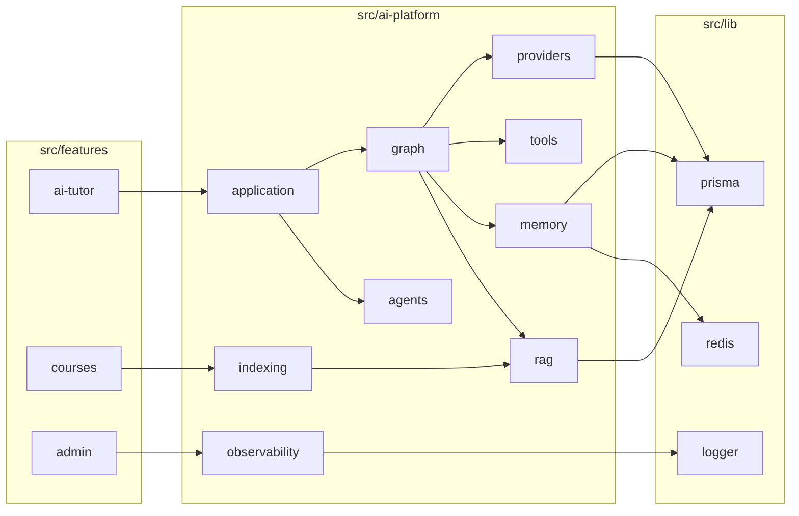
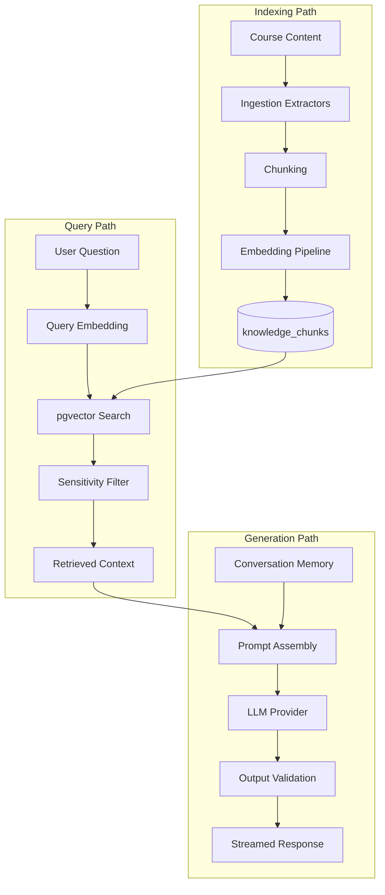

# AI Platform — Architecture

> High-level architecture, internal flows, and module interactions.  
> **Last updated:** August 2026

---

## Table of Contents

1. [Architecture Overview](#architecture-overview)
2. [Layer Model](#layer-model)
3. [Request Flow: Agent Run](#request-flow-agent-run)
4. [Request Flow: Indexing](#request-flow-indexing)
5. [Module Interaction Map](#module-interaction-map)
6. [Comparison with AI Tutor Architecture](#comparison-with-ai-tutor-architecture)
7. [Data Flow Diagram](#data-flow-diagram)
8. [Technology Stack](#technology-stack)

---

## Architecture Overview

The AI Platform is an internal module within the IthraCode modular monolith. It sits between product features and infrastructure, providing reusable AI capabilities through typed TypeScript APIs.



---

## Layer Model

The platform follows Clean Architecture with DDD boundaries where they add clarity.

| Layer | Path | Depends On | Responsibility |
|-------|------|------------|----------------|
| **Domain** | `domain/` | Nothing external | Models, ports, policies, enums |
| **Application** | `application/` | `domain/` | Use cases, orchestration services, DTOs, events |
| **Capabilities** | `graph/`, `rag/`, `memory/`, `tools/`, `prompts/`, `providers/`, `router/`, `agents/`, `embeddings/`, `indexing/`, `evaluation/`, `observability/` | `domain/`, `application/` | Specialized subsystems |
| **Infrastructure** | `infrastructure/` | All above | DI, config, Prisma, Redis, queues, guards |
| **Shared** | `shared/` | Nothing business-specific | Constants, base errors, streaming helpers |

### Dependency Rule

```
features → ai-platform/index.ts (public API only)
ai-platform/capabilities → ai-platform/domain
ai-platform/infrastructure → ai-platform/capabilities + domain
ai-platform/domain → (no imports from infrastructure or features)
```

Features must **not** import from internal platform paths like `@/ai-platform/infrastructure/di/ai-platform.container.ts`. They import from `@/ai-platform`.

---

## Request Flow: Agent Run

A typical streaming agent request (e.g., AI Tutor ask question) flows through these stages:



### Stage Responsibilities

| Stage | Owner | What Happens |
|-------|-------|--------------|
| **Authentication** | Feature (`ai-tutor` API handler) | NextAuth session, enrollment check |
| **Authorization scope** | Feature | Passes `userId`, `courseId`, `lectureId` to platform |
| **Agent selection** | Platform (`agents/`) | Resolves agent definition by ID |
| **Graph execution** | Platform (`graph/`) | Runs LangGraph nodes: sanitize → retrieve → generate → validate |
| **Retrieval** | Platform (`rag/`) | pgvector search with sensitivity filters |
| **Generation** | Platform (`providers/` + `router/`) | LLM streaming via selected provider |
| **Persistence** | Feature or Platform | Tutor messages via feature repository; run metadata via platform |
| **Observability** | Platform (`observability/`) | Trace, cost ledger, structured logs |

---

## Request Flow: Indexing

Course content indexing is asynchronous via BullMQ:



The worker file lives in `src/server/workers/`. The handler logic lives in `ai-platform/indexing/workers/`.

---

## Module Interaction Map



### Cross-Feature Ports

Features define ports for things they need from the platform. The platform implements them.

| Port (defined in feature) | Platform implementation |
|---------------------------|------------------------|
| `CourseKnowledgeIndexerPort` (courses) | `indexing/pipelines/course-indexing.ts` |
| Future: `AssignmentEvaluatorPort` | `agents/evaluator/` |

Features trigger indexing or agent runs; the platform executes.

---

## Comparison with AI Tutor Architecture

The AI Tutor (`docs/ai-tutor/02-architecture.md`) established a four-layer clean architecture within a single feature. The platform generalizes this:

| Aspect | AI Tutor (today) | AI Platform |
|--------|------------------|-------------|
| **Scope** | Single product | All AI products |
| **Layers** | domain / application / infrastructure / api / presentation | domain / application / capabilities / infrastructure |
| **Orchestration** | `ask-tutor.use-case.ts` hand-rolled pipeline | LangGraph `StateGraph` with reusable nodes |
| **Providers** | `OpenAILlmAdapter` in feature | `providers/` with multi-vendor support |
| **DI** | `ai-tutor-container.ts` | `ai-platform.container.ts`; tutor delegates |
| **Prompts** | `prompt-builder.ts` hardcoded | Langfuse with versioning |
| **Tracing** | `tutor-request-logger.ts` (Pino) | LangSmith + OTEL + Pino |
| **API layer** | Stays in `ai-tutor/api/` | Stays in features |
| **UI** | Stays in `ai-tutor/presentation/` | Stays in features |

### What Moves vs What Stays

**Moves to platform:**
- `LlmPort`, `EmbeddingPort`, `VectorSearchPort`
- OpenAI adapters, resilient wrapper, embedding cache
- Vector search, chunking, ingestion pipeline
- Indexing queue, outbox, worker handlers
- Rate limits, cost caps, request logging (generalized)

**Stays in ai-tutor:**
- `TutorConversation`, `TutorThread`, `TutorMessage` repositories
- Educational integrity service and content filter
- API handlers, React chat UI
- Tutor-specific prompt keys (stored in Langfuse, resolved by platform)

---

## Data Flow Diagram



---

## Technology Stack

| Component | Technology | Role |
|-----------|-----------|------|
| Orchestration | LangGraph | Stateful agent graphs, checkpointing |
| Tracing | LangSmith | Agent run traces, debugging |
| Prompts | Langfuse | Versioning, A/B testing |
| System observability | OpenTelemetry | Vendor-neutral spans and metrics |
| Evaluation | Ragas + DeepEval | Offline RAG and LLM quality metrics |
| Vector store | pgvector | Semantic search in PostgreSQL |
| Short-term memory | Redis | Session context, embedding cache |
| Long-term memory | PostgreSQL | Facts, preferences, audit logs |
| Background jobs | BullMQ | Indexing, evaluation |
| Tools | MCP SDK | External tool protocol |
| LLM providers | OpenAI, Anthropic, Gemini, Ollama | Inference |

---

## Public API Contract

Features interact with the platform through `src/ai-platform/index.ts`:

```typescript
// Agent execution
runAgent(agentId: string, request: AgentRunRequest): Promise<AgentRunResult>
streamAgent(agentId: string, request: AgentRunRequest): AsyncIterable<string>

// RAG
retrieveContext(query: RetrievalQuery, options: RetrievalOptions): Promise<RetrievedChunk[]>
enqueueIndexing(job: IndexingJob): Promise<void>

// Memory
getConversationMemory(scope: MemoryScope): Promise<ConversationMemory>
storeMemoryFact(fact: MemoryFact): Promise<void>

// Observability
getCostSummary(filters: CostFilters): Promise<CostSummary>
```

See [03-folder-structure.md](./03-folder-structure.md) for where each capability is implemented.

---

## Related Documentation

- [01-overview.md](./01-overview.md) — Vision and scope
- [03-folder-structure.md](./03-folder-structure.md) — Folder tree and import rules
- [04-agents.md](./04-agents.md) — LangGraph agent lifecycle
- [AI Tutor Architecture](../ai-tutor/02-architecture.md) — Pre-platform tutor design
