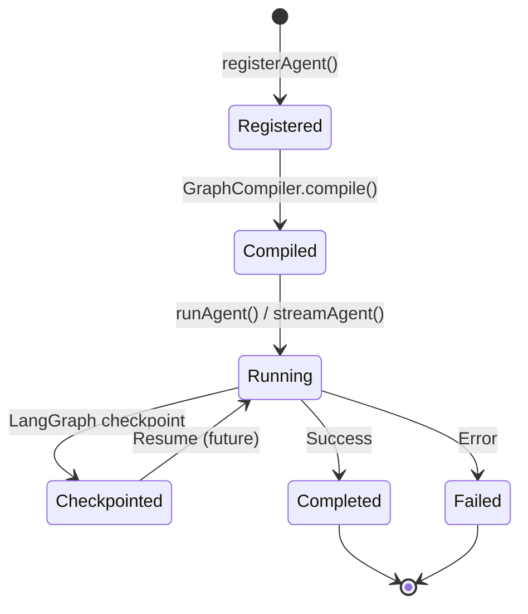
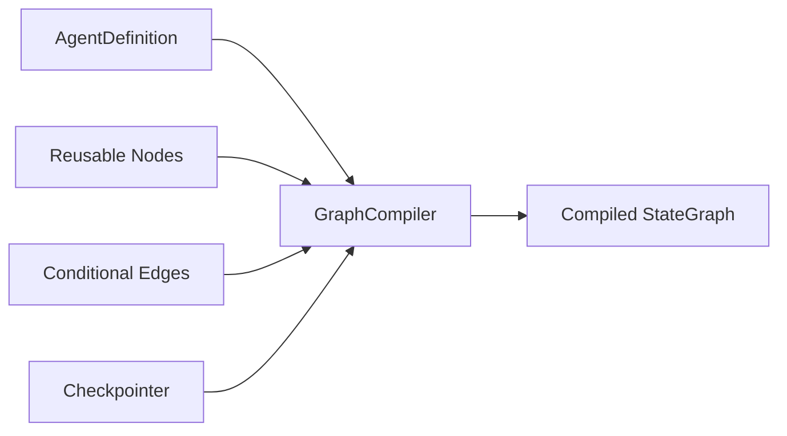
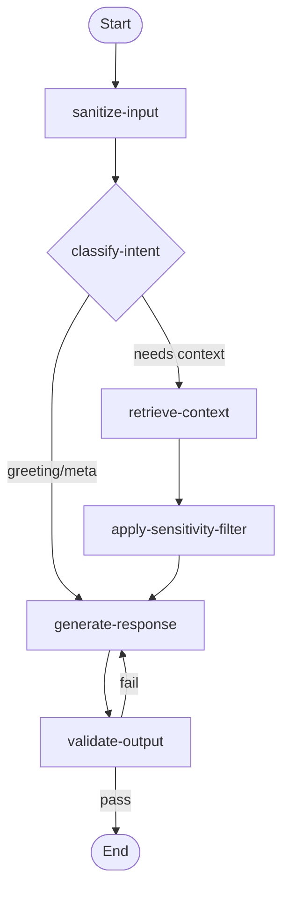
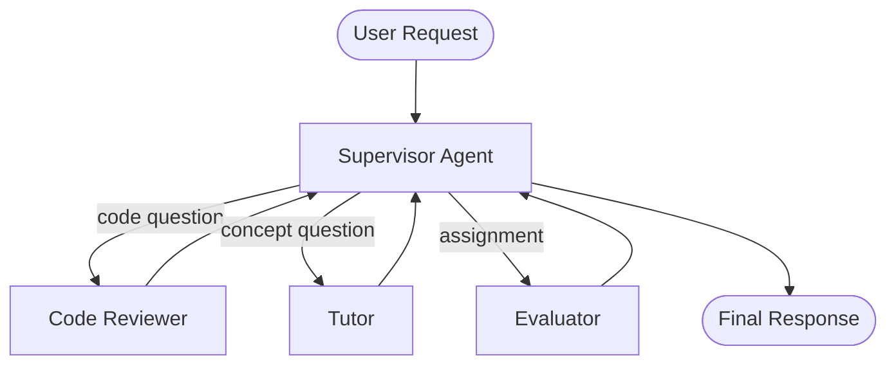
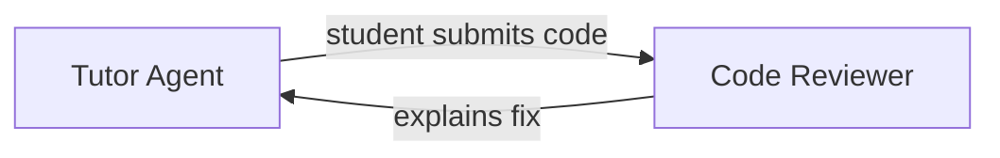
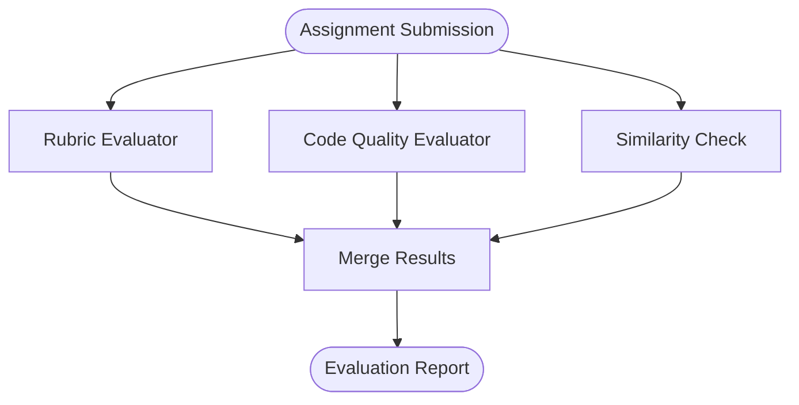

# AI Platform — Agents

> Agent architecture, LangGraph integration, and agent lifecycle.  
> **Last updated:** August 2026

---

## Table of Contents

1. [Agent Model](#agent-model)
2. [Agent Definition](#agent-definition)
3. [Agent Registry](#agent-registry)
4. [Agent Lifecycle](#agent-lifecycle)
5. [LangGraph Integration](#langgraph-integration)
6. [Graph State](#graph-state)
7. [Reusable Nodes](#reusable-nodes)
8. [Checkpointing](#checkpointing)
9. [Multi-Agent Patterns](#multi-agent-patterns)
10. [Product Agents](#product-agents)

---

## Agent Model

An **agent** in the AI Platform is a configured AI product capability that:

1. Has a unique identifier (`agentId`)
2. References a compiled LangGraph
3. Declares capabilities (streaming, RAG, tools, structured output)
4. Defines default model routing policy
5. Specifies allowed tools and memory scope

Agents are **not** classes. They are declarative definitions registered at startup.

```typescript
interface AgentDefinition {
  id: string;                          // 'tutor', 'evaluator', 'code-reviewer'
  name: string;
  description: string;
  graphId: string;                     // Reference to compiled graph in graph/graphs/
  capabilities: AgentCapability[];     // STREAMING | RAG | TOOLS | STRUCTURED_OUTPUT
  defaultModelPolicy: RoutingPolicy;
  allowedTools: string[];              // Tool IDs from ToolRegistry
  memoryScope: MemoryScopeType;        // SESSION | CONVERSATION | LONG_TERM
  promptNamespace: string;             // Langfuse namespace prefix
  guards: GuardConfig;                 // Rate limits, cost caps
}
```

Features do not define agents inline. They register agent definitions in `agents/<product>/` and invoke them via `runAgent(agentId, request)`.

---

## Agent Definition

Agent definitions live in `agents/<product>/`:

```
agents/
├── base/
│   ├── agent-definition.ts      # AgentDefinition interface
│   └── agent-lifecycle.ts       # Lifecycle hooks (onStart, onComplete, onError)
├── definitions/
│   └── agent-registry.ts        # Central registry
├── tutor/
│   └── tutor-agent.definition.ts
├── evaluator/
│   └── evaluator-agent.definition.ts
└── ...
```

### Example: Tutor Agent Definition

```typescript
// agents/tutor/tutor-agent.definition.ts
export const tutorAgentDefinition: AgentDefinition = {
  id: 'tutor',
  name: 'AI Tutor',
  description: 'Course-scoped educational assistant with RAG',
  graphId: 'tutor-graph',
  capabilities: ['STREAMING', 'RAG'],
  defaultModelPolicy: {
    task: 'education',
    preferredModel: 'gpt-4o-mini',
    maxTokens: 1500,
    temperature: 0.7,
  },
  allowedTools: [],  // Phase 1: no tools; Phase 3: add search, calculator
  memoryScope: 'CONVERSATION',
  promptNamespace: 'tutor',
  guards: {
    rateLimitPerMinute: 10,
    rateLimitPerHour: 60,
    dailyCostCap: 100,
    maxConcurrentStreams: 3,
  },
};
```

### Why Declarative Definitions

- **Extensibility:** New products add a definition file and a graph — no changes to `runAgent` use case.
- **Testability:** Definitions are pure data; graphs are tested independently.
- **Observability:** Agent metadata is attached to every trace in LangSmith.

---

## Agent Registry

The `AgentRegistry` (`agents/definitions/agent-registry.ts`) manages agent definitions:

```typescript
interface AgentRegistry {
  register(definition: AgentDefinition): void;
  get(agentId: string): AgentDefinition;
  list(): AgentDefinition[];
  has(agentId: string): boolean;
}
```

Registration happens at platform startup in `ai-platform.container.ts`. Features cannot register agents at runtime in production (registration is static; dynamic registration is reserved for plugin scenarios in future phases).

---

## Agent Lifecycle



### Lifecycle Stages

| Stage | Component | Description |
|-------|-----------|-------------|
| **Register** | `AgentRegistry` | Definition stored at startup |
| **Compile** | `GraphCompiler` | Agent definition → compiled `StateGraph` with checkpointer |
| **Authorize** | Feature (caller) | Feature verifies user permissions before calling platform |
| **Guard** | `infrastructure/guards/` | Rate limit, cost cap, concurrency check |
| **Execute** | `GraphCompiler` → LangGraph | Graph nodes run in order |
| **Checkpoint** | `checkpointers/` | State saved after each node (enables resume) |
| **Observe** | `observability/` | Trace, cost, metrics recorded |
| **Complete** | `application/use-cases/` | Result returned to feature |

### Lifecycle Hooks

Optional hooks in `agents/base/agent-lifecycle.ts`:

```typescript
interface AgentLifecycleHooks {
  onStart?(context: AgentRunContext): Promise<void>;
  onNodeComplete?(nodeId: string, state: AgentState): Promise<void>;
  onComplete?(result: AgentRunResult): Promise<void>;
  onError?(error: AgentError): Promise<void>;
}
```

Hooks are used for product-specific side effects (e.g., tutor persists assistant message after generation completes). Hooks are registered per agent definition, not globally.

---

## LangGraph Integration

LangGraph is the orchestration engine. Each agent maps to a `StateGraph` compiled in `graph/graphs/`.

### Why LangGraph

| Requirement | LangGraph Capability |
|-------------|---------------------|
| Multi-step pipelines | Sequential and parallel nodes |
| Conditional routing | Edge conditions (e.g., needs retrieval vs direct answer) |
| Tool calling loops | Cyclic graphs with tool → generate → validate |
| Multi-agent collaboration | Subgraphs and handoff patterns (Phase 3) |
| Resumable runs | Built-in checkpointing |
| LangSmith integration | Native trace propagation |

### Graph Compilation



The `GraphCompiler` (`graph/compiler/graph-compiler.ts`):

1. Loads agent definition from registry
2. Selects graph template from `graph/graphs/`
3. Binds reusable nodes from `graph/nodes/`
4. Attaches checkpointer
5. Returns compiled runnable graph (cached as singleton)

### Graph Structure: Tutor (Phase 2)



---

## Graph State

Each agent has a typed state object in `graph/state/`:

```typescript
// graph/state/base-agent.state.ts
interface BaseAgentState {
  // Input
  agentId: string;
  userId: string;
  input: string;
  locale: 'ar' | 'en';

  // Context
  systemPrompt: string;
  conversationHistory: Message[];
  retrievedChunks: RetrievedChunk[];

  // Generation
  generatedTokens: string[];
  finalResponse: string;

  // Metadata
  tokensUsed: { input: number; output: number };
  estimatedCost: number;
  errors: string[];
}

// graph/state/tutor-agent.state.ts
interface TutorAgentState extends BaseAgentState {
  courseId: string;
  lectureId: string;
  studentProfile: StudentLearningProfile | null;
  educationalIntegrityBlocked: boolean;
}
```

State is immutable between nodes. Each node receives state and returns a partial update (LangGraph reducer pattern).

---

## Reusable Nodes

Nodes in `graph/nodes/` are shared across agent graphs:

| Node | Responsibility | Used By |
|------|---------------|---------|
| `sanitize-input` | Strip injection patterns, normalize whitespace | All agents |
| `retrieve-context` | RAG retrieval via `rag/retrieval/` | Tutor, course-assistant |
| `apply-sensitivity-filter` | Block ASSESSMENT content from retrieval | Tutor |
| `generate-response` | LLM streaming via `providers/` + `router/` | All agents |
| `validate-output` | Check for leakage, policy violations | Tutor, evaluator |
| `tool-call` | Execute tool via `tools/executor/` | Code-reviewer (Phase 3) |
| `structured-output` | Parse JSON against schema | Evaluator |

### Node Contract

```typescript
type GraphNode = (
  state: AgentState,
  config: RunnableConfig,
) => Promise<Partial<AgentState>>;
```

Nodes receive dependencies via `RunnableConfig.configurable` (injected by `GraphCompiler`), not via global imports. This keeps nodes testable with mock ports.

---

## Checkpointing

LangGraph checkpointing enables:

- **Resumable runs** if a worker crashes mid-generation
- **Human-in-the-loop** approval gates (future)
- **Debugging** by inspecting state at each node

### Checkpointer Adapters

| Adapter | Storage | Use Case |
|---------|---------|----------|
| `postgres-checkpointer.ts` | PostgreSQL | Production — durable, queryable |
| `redis-checkpointer.ts` | Redis | Development — fast, ephemeral |

Production uses PostgreSQL checkpointer. Checkpoint data is stored in a platform-managed table (not mixed with business tables).

### Checkpoint Scope

Checkpoints are keyed by `threadId` (provided by the feature, e.g., `TutorThread.id`). This aligns with existing tutor threading without coupling platform to tutor models.

---

## Multi-Agent Patterns

Phase 3 introduces multi-agent collaboration for complex products.

### Pattern 1: Supervisor

A supervisor agent routes tasks to specialist sub-agents:



Implementation: supervisor graph with conditional edges to sub-graphs compiled from other agent definitions.

### Pattern 2: Handoff

One agent completes its task and hands off to another:



Implementation: LangGraph `Command` API for dynamic handoff between graphs.

### Pattern 3: Parallel Specialists

Multiple agents run in parallel; results are merged:



Implementation: LangGraph parallel node execution with reducer merge.

### When to Use Multi-Agent

| Scenario | Pattern | Phase |
|----------|---------|-------|
| Route by intent | Supervisor | Phase 3 |
| Tutor → code review | Handoff | Phase 3 |
| Assignment grading (rubric + code + similarity) | Parallel | Phase 3 |
| Simple Q&A | Single agent graph | Phase 1–2 |

Avoid multi-agent for simple flows. A single graph with conditional nodes is simpler and cheaper.

---

## Product Agents

### AI Tutor (`tutor`)

| Property | Value |
|----------|-------|
| Graph | `tutor.graph.ts` |
| Capabilities | STREAMING, RAG |
| Memory | CONVERSATION (per thread) |
| Guards | Rate limits, educational integrity |
| Migration | Replaces hand-rolled `ask-tutor.use-case.ts` pipeline |

### AI Assignment Evaluator (`evaluator`) — Phase 3

| Property | Value |
|----------|-------|
| Graph | `evaluator.graph.ts` |
| Capabilities | STRUCTURED_OUTPUT |
| Memory | SESSION |
| Output | JSON rubric scores + feedback |
| Tools | None (Phase 3); code analysis tool (future) |

### AI Code Reviewer (`code-reviewer`) — Phase 3

| Property | Value |
|----------|-------|
| Graph | `code-reviewer.graph.ts` |
| Capabilities | STREAMING, TOOLS |
| Memory | SESSION |
| Tools | `code-analyze`, `lint-check` (builtin or MCP) |

### AI Course Assistant (`course-assistant`) — Future

| Property | Value |
|----------|-------|
| Graph | `course-assistant.graph.ts` |
| Capabilities | STREAMING, RAG |
| Memory | CONVERSATION |
| Scope | Cross-course (admin/instructor) |

---

## Running an Agent

### From a Feature Use Case

```typescript
// src/features/ai-tutor/application/use-cases/ask-tutor.use-case.ts
import { streamAgent } from '@/ai-platform';

export async function* askTutorUseCase(input: AskTutorInput, deps: AskTutorDeps) {
  // Feature handles authorization
  await deps.enrollmentPolicy.assertEnrolled(input.userId, input.courseId);

  // Platform handles orchestration
  const stream = streamAgent('tutor', {
    userId: input.userId,
    input: input.message,
    locale: input.locale,
    scope: {
      courseId: input.courseId,
      lectureId: input.lectureId,
      threadId: input.threadId,
    },
    metadata: {
      correlationId: input.correlationId,
    },
  });

  for await (const token of stream) {
    yield token;
  }
}
```

The feature remains responsible for authorization, request validation, and response persistence. The platform handles everything AI-related.

---

## Related Documentation

- [02-architecture.md](./02-architecture.md) — Request flow diagrams
- [05-rag.md](./05-rag.md) — Retrieval in `retrieve-context` node
- [07-tools.md](./07-tools.md) — Tool calling in `tool-call` node
- [08-prompts.md](./08-prompts.md) — Prompt resolution in graph
- [12-providers.md](./12-providers.md) — LLM calls in `generate-response` node
- [15-adrs.md](./15-adrs.md) — ADR-002 (LangGraph)
