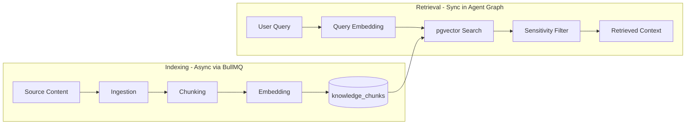
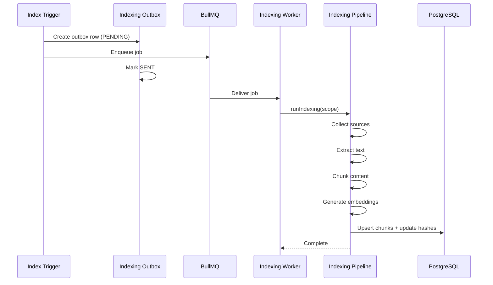
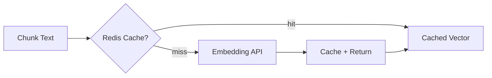
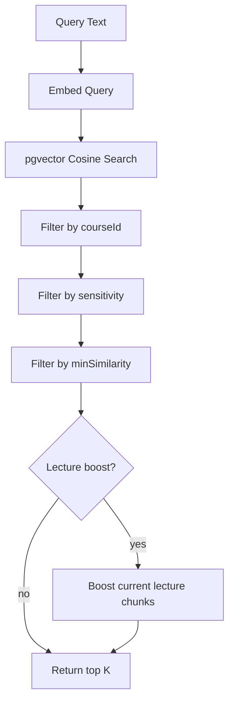
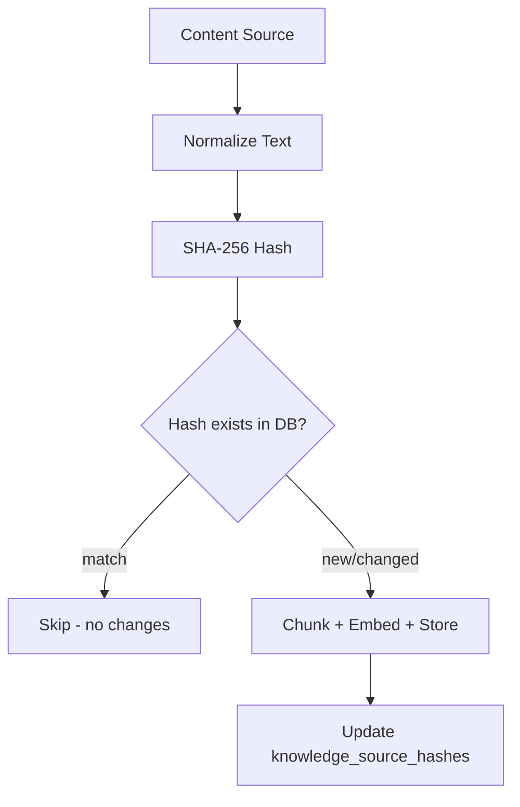

# AI Platform — RAG

> Retrieval-Augmented Generation: indexing, chunking, embeddings, and pgvector retrieval.  
> **Last updated:** August 2026

---

## Table of Contents

1. [Overview](#overview)
2. [Indexing Pipeline](#indexing-pipeline)
3. [Content Ingestion](#content-ingestion)
4. [Chunking Strategies](#chunking-strategies)
5. [Embeddings](#embeddings)
6. [Storage Model](#storage-model)
7. [Retrieval Pipeline](#retrieval-pipeline)
8. [pgvector Implementation](#pgvector-implementation)
9. [Sensitivity Filtering](#sensitivity-filtering)
10. [Incremental Indexing](#incremental-indexing)
11. [Migration from AI Tutor](#migration-from-ai-tutor)

---

## Overview

RAG (Retrieval-Augmented Generation) enables agents to answer questions using course content rather than relying solely on LLM training data. The platform provides a shared RAG pipeline used by the AI Tutor, Course Assistant, and future products.



### Design Principles

1. **Single vector store** — pgvector in the existing PostgreSQL database (no Pinecone, Weaviate, or Qdrant).
2. **Course-scoped retrieval** — Every search is filtered by `courseId` to prevent cross-course leakage.
3. **Sensitivity-aware** — Assessment and instructor-only content is excluded from student-facing retrieval.
4. **Incremental** — Content hashes skip re-indexing of unchanged material.
5. **Async indexing, sync retrieval** — Indexing runs in BullMQ workers; retrieval runs in-request during agent execution.

---

## Indexing Pipeline

Indexing transforms raw course content into searchable vector embeddings.



### Index Triggers

| Trigger | Source | Job Type |
|---------|--------|----------|
| Course published | `courses` feature via `CourseKnowledgeIndexerPort` | `index-course` |
| Lecture updated | Course management action | `index-lecture` |
| Manual reindex | Admin API `/api/tutor/index` | `index-course` or `index-lecture` |
| Bootstrap | Worker startup (unindexed courses) | `index-course` |

### Pipeline Stages

Located in `indexing/pipelines/` and `rag/ingestion/`:

| Stage | Module | Input | Output |
|-------|--------|-------|--------|
| **Collect** | `rag/ingestion/content-collector` | `courseId` or `lectureId` | Raw content sources |
| **Extract** | `rag/ingestion/extractors/` | Raw source (PDF, transcript, code) | Normalized text |
| **Hash** | `indexing/hash/content-hash` | Normalized text | SHA-256 hash |
| **Skip check** | `indexing/hash/` | Hash vs `knowledge_source_hashes` | Skip if unchanged |
| **Chunk** | `rag/chunking/` | Normalized text | `KnowledgeChunk[]` |
| **Embed** | `embeddings/pipeline` | Chunk texts | `float[1536][]` |
| **Store** | `rag/retrieval/` (write path) | Chunks + embeddings | `knowledge_chunks` rows |

---

## Content Ingestion

### Extractor Registry

`rag/ingestion/extractor-registry.ts` maps content types to extractors:

| Content Type | Extractor | Source |
|-------------|-----------|--------|
| `TRANSCRIPT` | `transcript.extractor.ts` | `lecture_transcripts` table |
| `ATTACHMENT` | `pdf.extractor.ts` | Course attachment files (PDF) |
| `CODE` | `code.extractor.ts` | Code blocks in lecture content |
| `INLINE` | `inline.extractor.ts` | Lecture description, notes |
| `NOTES` | `notes.extractor.ts` | Instructor notes |

Extractors implement `TextExtractorPort`:

```typescript
interface TextExtractorPort {
  extract(source: ContentSource): Promise<ExtractedText>;
}

interface ExtractedText {
  text: string;
  metadata: Record<string, string>;
  contentType: KnowledgeContentType;
}
```

### Text Normalization

Before chunking, text passes through normalization (`rag/ingestion/text-normalizer`):

- Unicode normalization (NFC)
- Whitespace collapse
- Arabic diacritics preservation (do not strip — important for educational content)
- Strip HTML tags from inline content
- Remove zero-width characters

Migrated from `ai-tutor/application/services/knowledge-ingestion/text-normalizer.service.ts`.

---

## Chunking Strategies

Chunking splits normalized text into retrieval-sized segments. Strategy selection depends on content type.

### Fixed-Size Chunking

`rag/chunking/fixed-size.chunker.ts`

- **Use for:** Transcripts, long prose
- **Parameters:** `chunkSize: 512 tokens`, `overlap: 64 tokens`
- **Method:** Token-aware splitting with overlap for context continuity

### Structural Chunking

`rag/chunking/structural.chunker.ts`

- **Use for:** Code blocks, markdown headings, lecture sections
- **Method:** Split on structural boundaries (headings, function definitions, class declarations)
- **Preserves:** Code block integrity (never splits mid-function)

### Semantic Chunking (Phase 2)

`rag/chunking/semantic.chunker.ts`

- **Use for:** Long documents where structural boundaries are insufficient
- **Method:** Embed sentences, cluster by similarity, split at low-similarity boundaries
- **Cost:** Higher (requires embedding during indexing); use selectively

### Chunk Metadata

Every chunk carries metadata for filtering and citation:

```typescript
interface ChunkMetadata {
  courseId: string;
  lectureId?: string;
  sectionId?: string;
  contentType: KnowledgeContentType;
  sensitivity: KnowledgeSensitivity;
  sourceTitle: string;
  sourceUrl?: string;
  chunkIndex: number;
  totalChunks: number;
}
```

---

## Embeddings

Embedding generation is handled by `embeddings/pipeline.ts`.

### Pipeline Flow



### Configuration

| Parameter | Value | Source |
|-----------|-------|--------|
| Model | `text-embedding-3-small` | `AI_PLATFORM_EMBEDDING_MODEL` env |
| Dimensions | 1536 | `embeddings/dimensions.ts` |
| Cache TTL | 3600s (1 hour) | `shared/constants.ts` |
| Cache key | `ai:embed:{sha256(text)}` | Redis |

### Dimension Validation

Before storing or querying, the pipeline validates vector dimensions match the configured model. Mismatched dimensions throw `EmbeddingError` with code `DIMENSION_MISMATCH` — preventing silent corruption of the vector index.

### Batch Embedding

During indexing, chunks are embedded in batches (default batch size: 20) to reduce API calls. Batch failures fall back to individual embedding with per-chunk error logging.

---

## Storage Model

### Existing Table: `knowledge_chunks`

Defined in `prisma/schema.prisma` (AI Tutor section). Retained without breaking changes.

| Column | Type | Purpose |
|--------|------|---------|
| `id` | UUID | Primary key |
| `course_id` | UUID | Course scope filter |
| `lecture_id` | UUID? | Lecture scope filter |
| `section_id` | UUID? | Section reference |
| `content` | TEXT | Chunk text |
| `content_type` | ENUM | TRANSCRIPT, CODE, ATTACHMENT, etc. |
| `sensitivity` | ENUM | PUBLIC, ASSESSMENT, INSTRUCTOR |
| `embedding` | `vector(1536)` | pgvector embedding |
| `metadata` | JSONB | Additional chunk metadata |
| `created_at` | TIMESTAMP | Index timestamp |
| `updated_at` | TIMESTAMP | Last re-index |

### Index

```sql
CREATE INDEX knowledge_chunks_embedding_idx
  ON knowledge_chunks
  USING hnsw (embedding vector_cosine_ops);
```

HNSW index provides approximate nearest-neighbor search with good recall at scale. Existing migration: `prisma/migrations/20260729180000_add_knowledge_chunks_pgvector/`.

### Hash Table: `knowledge_source_hashes`

Tracks content hashes for incremental indexing:

| Column | Type | Purpose |
|--------|------|---------|
| `source_id` | TEXT | Unique source identifier |
| `content_hash` | TEXT | SHA-256 of normalized content |
| `course_id` | UUID | Course reference |
| `indexed_at` | TIMESTAMP | Last successful index |

If hash matches on re-index, the source is skipped.

---

## Retrieval Pipeline

Retrieval runs synchronously during agent graph execution in the `retrieve-context` node.

### `retrieveContext()` API

```typescript
interface RetrievalQuery {
  text: string;
  scope: {
    courseId: string;
    lectureId?: string;  // Optional boost for current lecture
  };
  options?: RetrievalOptions;
}

interface RetrievalOptions {
  topK?: number;           // Default: AI_PLATFORM_TOP_K (10)
  minSimilarity?: number;  // Default: AI_PLATFORM_MIN_SIMILARITY (0.7)
  contentTypes?: KnowledgeContentType[];
  sensitivityFilter?: KnowledgeSensitivity[];  // Default: [PUBLIC]
}

interface RetrievedChunk {
  id: string;
  content: string;
  score: number;           // 1 - cosine_distance
  metadata: ChunkMetadata;
}
```

### Retrieval Flow



### Lecture Boost

When `lectureId` is provided, chunks from the current lecture receive a score boost (+0.1) to prioritize contextually relevant material. This improves answer quality when students ask questions while viewing a specific lecture.

Migrated from existing `PostgresVectorSearchAdapter` behavior.

---

## pgvector Implementation

### Query Pattern

`rag/retrieval/postgres-vector-search.adapter.ts` uses raw SQL via Prisma:

```sql
SELECT
  id,
  content,
  content_type,
  sensitivity,
  metadata,
  1 - (embedding <=> $1::vector) AS score
FROM knowledge_chunks
WHERE course_id = $2::uuid
  AND sensitivity = ANY($3::text[])
  AND 1 - (embedding <=> $1::vector) >= $4
ORDER BY embedding <=> $1::vector
LIMIT $5;
```

### Operators

| Operator | Meaning | Usage |
|----------|---------|-------|
| `<=>` | Cosine distance | Primary similarity metric |
| `<->` | L2 distance | Not used (cosine preferred for text) |
| `<#>` | Inner product | Not used |

### Score Calculation

```
score = 1 - cosine_distance
```

- Score of 1.0 = identical vectors
- Score of 0.0 = orthogonal vectors
- Default `minSimilarity` threshold: 0.7

### Write Path

Embeddings are stored via parameterized update:

```sql
UPDATE knowledge_chunks
SET embedding = $1::vector, updated_at = NOW()
WHERE id = $2::uuid;
```

New chunks are inserted with embedding in a single transaction.

### Performance Considerations

| Factor | Guidance |
|--------|----------|
| HNSW index | Handles up to ~1M chunks per course catalog efficiently |
| `course_id` filter | Applied before vector scan — critical for performance |
| `topK` limit | Default 10; increase only with reranking |
| Connection pooling | Use existing Prisma connection pool; no separate vector DB connection |
| Embedding cache | Redis cache eliminates redundant API calls for repeated queries |

---

## Sensitivity Filtering

Content sensitivity prevents students from retrieving assessment answers or instructor-only material.

### Sensitivity Levels

| Level | Enum | Retrieval for Students |
|-------|------|----------------------|
| Public | `PUBLIC` | ✅ Included |
| Assessment | `ASSESSMENT` | ❌ Excluded |
| Instructor | `INSTRUCTOR` | ❌ Excluded |

### Filter Application

1. **At indexing time:** Content is classified during ingestion (migrated from `ai-tutor` educational integrity rules).
2. **At retrieval time:** SQL `WHERE sensitivity = ANY($3)` restricts results.
3. **At generation time:** Output validation node checks for assessment content leakage.

The `rag/filters/sensitivity.filter.ts` module enforces these rules. Product features can override the default filter (e.g., instructor-facing Course Assistant may include `INSTRUCTOR` content).

---

## Incremental Indexing

Re-indexing a course is expensive (API calls for embeddings). Incremental indexing skips unchanged content.

### Hash-Based Skip



### Full vs Partial Reindex

| Mode | Trigger | Behavior |
|------|---------|----------|
| **Full course** | Course published, manual reindex | All lectures, all sources |
| **Single lecture** | Lecture content updated | Only that lecture's sources |
| **Bootstrap** | Worker startup | Courses where `knowledge_indexed_at IS NULL` |

### Stale Chunk Cleanup

When a source changes, old chunks for that source are deleted before new chunks are inserted. This prevents orphaned vectors from appearing in search results.

---

## Migration from AI Tutor

The following `ai-tutor` modules migrate to the platform RAG subsystem:

| AI Tutor Module | Platform Module |
|----------------|----------------|
| `application/services/knowledge-ingestion/` | `rag/ingestion/` |
| `application/services/embedding-pipeline.service.ts` | `embeddings/pipeline.ts` |
| `application/services/content-retriever.service.ts` | `rag/retrieval/retrieve-context.ts` |
| `application/services/rag-helpers.ts` | `rag/retrieval/` (utilities) |
| `infrastructure/adapters/PostgresVectorSearchAdapter.ts` | `rag/retrieval/postgres-vector-search.adapter.ts` |
| `infrastructure/adapters/OpenAIEmbeddingAdapter.ts` | `providers/openai/openai-embedding.adapter.ts` |
| `infrastructure/cache/embedding-cache.ts` | `embeddings/cache/embedding-cache.ts` |
| `infrastructure/queue/course-indexing-*` | `indexing/pipelines/`, `indexing/outbox/` |
| `application/services/course-indexing-runner.service.ts` | `indexing/pipelines/course-indexing.pipeline.ts` |

### What Stays in AI Tutor

- `educational-integrity.service.ts` — tutor-specific assessment blocking logic (calls platform sensitivity filter)
- `prompt-builder.ts` — replaced by Langfuse prompt resolver (Phase 2)
- Tutor-specific retrieval options (lecture boost defaults)

### Cross-Feature Port

`CourseKnowledgeIndexerPort` (defined in `courses` feature) is implemented by `indexing/pipelines/enqueue.ts`. The courses feature continues to call the port; the implementation moves to the platform.

---

## Related Documentation

- [04-agents.md](./04-agents.md) — `retrieve-context` graph node
- [06-memory.md](./06-memory.md) — Conversation context alongside retrieval
- [11-workers.md](./11-workers.md) — Indexing worker lifecycle
- [12-providers.md](./12-providers.md) — Embedding provider adapters
- [AI Tutor Indexing Pipeline](../ai-tutor/04-indexing-pipeline.md) — Pre-platform indexing design
- [15-adrs.md](./15-adrs.md) — ADR-004 (pgvector), ADR-006 (BullMQ outbox)
