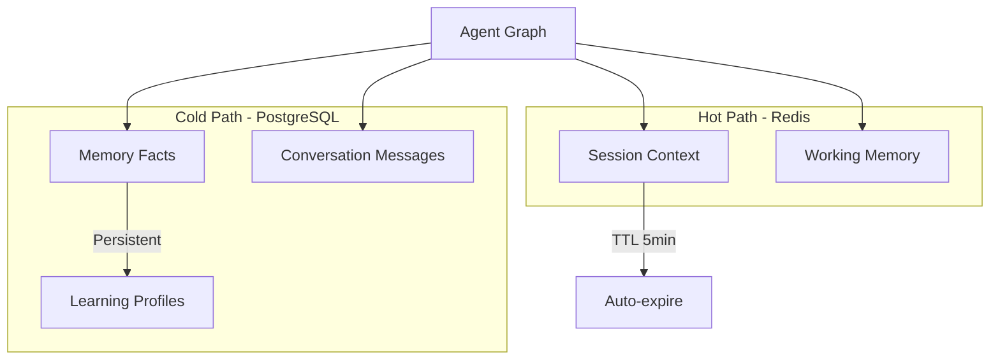
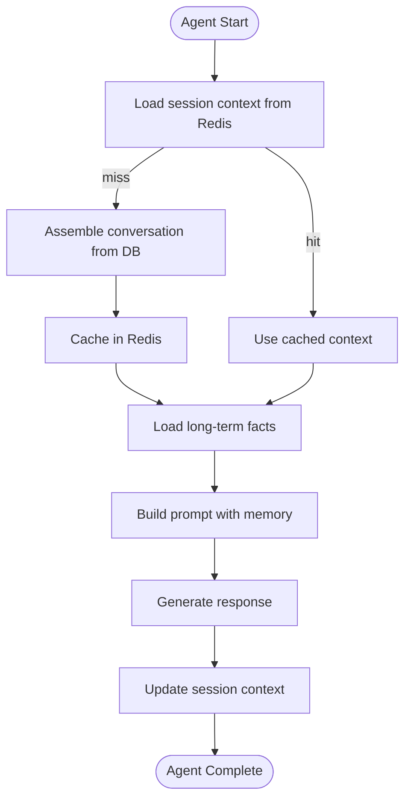

# AI Platform — Memory

> Short-term (Redis), long-term (PostgreSQL), and conversation memory systems.  
> **Last updated:** August 2026

---

## Table of Contents

1. [Overview](#overview)
2. [Memory Tiers](#memory-tiers)
3. [Short-Term Memory (Redis)](#short-term-memory-redis)
4. [Long-Term Memory (PostgreSQL)](#long-term-memory-postgresql)
5. [Conversation Memory](#conversation-memory)
6. [Context Summarization](#context-summarization)
7. [Memory Scopes](#memory-scopes)
8. [Platform vs Feature Tables](#platform-vs-feature-tables)
9. [Memory in Agent Graphs](#memory-in-agent-graphs)

---

## Overview

AI agents need memory to maintain context across interactions. The platform provides a dual-store memory system:



### Design Principles

1. **Redis for speed** — Session context and working memory with TTL-based expiration.
2. **PostgreSQL for durability** — Long-term facts, preferences, and conversation history.
3. **Feature-owned conversations** — Tutor message tables remain in the feature; platform provides assembly utilities.
4. **Token budget awareness** — Memory assembly respects LLM context window limits.
5. **Privacy by default** — Memory is scoped to `userId`; no cross-user access.

---

## Memory Tiers

| Tier | Storage | TTL | Use Case | Module |
|------|---------|-----|----------|--------|
| **Session** | Redis | 5 min | Active conversation context, retrieved docs cache | `memory/short-term/` |
| **Working** | Redis | 30 min | Multi-step agent state between graph nodes | `memory/short-term/` |
| **Conversation** | PostgreSQL | Permanent | Thread message history | Feature repos + `memory/conversation/` |
| **Long-term** | PostgreSQL | Permanent | User preferences, learned facts | `memory/long-term/` |
| **Profile** | PostgreSQL | Permanent | Learning style, explanation depth | Feature tables (tutor) |

---

## Short-Term Memory (Redis)

### Session Context Cache

Migrated from `ai-tutor/infrastructure/cache/redis-session-context.cache.ts`.

**Purpose:** Cache assembled session context to avoid re-querying the database on every message in a conversation.

```typescript
interface SessionContext {
  userId: string;
  courseId: string;
  lectureId?: string;
  threadId: string;
  recentMessages: Message[];       // Last N messages
  retrievedDocuments: Map<string, RetrievedChunk>;
  studentProfile: StudentLearningProfile | null;
  contextSummary: string;
  assembledAt: Date;
}
```

**Redis key pattern:** `ai:session:{threadId}`

**TTL:** 300 seconds (5 minutes)

**Behavior:**
- On cache hit: return cached context (skip DB queries for messages and profile)
- On cache miss: assemble from PostgreSQL, store in Redis, return
- On write (new message): invalidate cache for the thread
- On Redis failure: fall back to direct DB assembly (fail-open on read, log warning)

### Working Memory

**Purpose:** Store intermediate state during multi-step agent graph execution (e.g., retrieved chunks, tool call results, partial generations).

```typescript
interface WorkingMemory {
  runId: string;
  agentId: string;
  state: Record<string, unknown>;  // Partial graph state
  updatedAt: Date;
}
```

**Redis key pattern:** `ai:working:{runId}`

**TTL:** 1800 seconds (30 minutes)

**Behavior:**
- Written by graph nodes during execution
- Read by subsequent nodes in the same run
- Automatically expires after run completion or TTL

### Embedding Cache

While technically part of the embeddings subsystem, the Redis embedding cache (`ai:embed:{sha256}`) serves a memory-like role by caching computed vectors. See [05-rag.md](./05-rag.md#embeddings).

---

## Long-Term Memory (PostgreSQL)

### Memory Facts Table: `ai_memory_facts`

New platform table for durable, cross-session memory.

| Column | Type | Purpose |
|--------|------|---------|
| `id` | UUID | Primary key |
| `user_id` | UUID | Owner |
| `agent_id` | TEXT? | Agent that created the fact (null = global) |
| `scope_type` | TEXT | `course`, `global`, `lecture` |
| `scope_id` | UUID? | Course or lecture ID |
| `fact_type` | TEXT | `preference`, `misconception`, `achievement`, `note` |
| `content` | TEXT | The fact itself |
| `confidence` | FLOAT | 0.0–1.0 confidence score |
| `source_run_id` | UUID? | Agent run that produced this fact |
| `created_at` | TIMESTAMP | Creation time |
| `expires_at` | TIMESTAMP? | Optional expiration |

### Fact Types

| Type | Example | Use Case |
|------|---------|----------|
| `preference` | "Prefers visual explanations" | Personalization |
| `misconception` | "Confuses `let` and `const` scope" | Targeted remediation |
| `achievement` | "Completed recursion module" | Progress-aware tutoring |
| `note` | "Asked about React hooks 3 times" | Frequency tracking |

### Storage API

```typescript
interface MemoryStorePort {
  storeFact(fact: MemoryFact): Promise<void>;
  getFacts(query: MemoryQuery): Promise<MemoryFact[]>;
  deleteFacts(userId: string, scope?: MemoryScope): Promise<void>;
}

interface MemoryQuery {
  userId: string;
  agentId?: string;
  scopeType?: string;
  scopeId?: string;
  factTypes?: string[];
  limit?: number;
}
```

### When Facts Are Created

Facts are created by agent lifecycle hooks or dedicated graph nodes:

1. **Explicit:** Agent asks "I'll remember you prefer concise answers" → stores preference fact
2. **Inferred:** Evaluator detects recurring misconception → stores misconception fact
3. **Admin:** Instructor manually adds notes about student progress

Facts are **never** created automatically without user interaction in Phase 1–2. Automatic inference requires evaluation pipeline (Phase 3).

---

## Conversation Memory

### Assembly

`memory/conversation/conversation-assembler.ts` builds conversation history for prompt context.

```typescript
interface ConversationMemoryPort {
  assembleHistory(query: ConversationQuery): Promise<ConversationMemory>;
}

interface ConversationQuery {
  threadId: string;
  maxMessages?: number;     // Default: 20
  maxTokens?: number;       // Default: 4000
  order?: 'asc' | 'desc';   // Default: 'asc' (chronological)
}

interface ConversationMemory {
  messages: Message[];
  totalMessages: number;
  truncated: boolean;
  estimatedTokens: number;
}
```

### Message Ordering

Messages are returned in **chronological order** (oldest first) for prompt assembly. This is critical for LLM context — the model expects conversation history in temporal order.

> **Known issue:** The current AI Tutor has a history ordering bug (documented in `docs/ai-tutor/09-feature-review.md`). The platform assembler enforces correct ordering by default.

### Token Budget Management

When conversation history exceeds `maxTokens`:

1. Always include the most recent message (current user input)
2. Include the system prompt context
3. Fill remaining budget with most recent messages (newest first, then reverse)
4. If still over budget, trigger summarization (see below)

### Feature-Owned Message Storage

Conversation messages for the AI Tutor remain in feature tables:

- `tutor_conversations` — one per user+course
- `tutor_threads` — one per lecture
- `tutor_messages` — individual messages with `retrievedSources` JSON

The platform's `ConversationMemoryPort` accepts a repository adapter injected by the feature:

```typescript
// Feature provides the message source
const tutorConversationAdapter: ConversationMemoryPort = {
  assembleHistory: async (query) => {
    const messages = await tutorMessageRepo.findByThread(query.threadId, {
      order: 'asc',
      limit: query.maxMessages,
    });
    return { messages, totalMessages: messages.length, truncated: false, estimatedTokens: estimate(messages) };
  },
};
```

This keeps platform decoupled from tutor-specific schema while providing a standard assembly interface.

---

## Context Summarization

`memory/summarizer/context-summarizer.ts` compresses conversation history when it exceeds token budgets.

### When Summarization Triggers

| Condition | Action |
|-----------|--------|
| History > `maxTokens` | Summarize older messages |
| History > 50 messages | Summarize messages beyond last 20 |
| Agent config `summarizeThreshold` | Custom per-agent threshold |

### Summarization Strategy

1. Take messages beyond the recent window
2. Call LLM with a summarization prompt (stored in Langfuse: `memory/summarize-conversation`)
3. Replace old messages with a single summary message: `[Previous conversation summary: ...]`
4. Cache summary in Redis session context to avoid re-summarizing

### Cost Control

Summarization is an LLM call. To control cost:

- Summarize at most once per session (cached in Redis)
- Use a smaller/cheaper model for summarization (routed via `router/`)
- Skip summarization if history is only slightly over budget (truncate instead)

---

## Memory Scopes

Memory is scoped to prevent cross-user and cross-course leakage.

```typescript
type MemoryScopeType = 'session' | 'conversation' | 'course' | 'global';

interface MemoryScope {
  type: MemoryScopeType;
  userId: string;
  courseId?: string;
  lectureId?: string;
  threadId?: string;
}
```

| Scope | Visibility | Storage |
|-------|-----------|---------|
| `session` | Current browser session | Redis (TTL) |
| `conversation` | Current thread | PostgreSQL (feature tables) |
| `course` | All threads in a course for this user | PostgreSQL (platform facts) |
| `global` | All courses for this user | PostgreSQL (platform facts) |

Agents declare their memory scope in the agent definition. The tutor uses `conversation` scope; the course assistant may use `course` scope.

---

## Platform vs Feature Tables

| Data | Table | Owner | Access |
|------|-------|-------|--------|
| Tutor messages | `tutor_messages` | Feature (`ai-tutor`) | Feature repo |
| Tutor threads | `tutor_threads` | Feature (`ai-tutor`) | Feature repo |
| Student learning profile | `student_learning_profiles` | Feature (`ai-tutor`) | Feature repo |
| Memory facts | `ai_memory_facts` | Platform | Platform repo |
| Agent runs | `ai_agent_runs` | Platform | Platform repo |
| Session context | Redis keys | Platform | Platform cache |

### Migration Path

Phase 1: Platform provides assembly utilities; features keep their tables.
Phase 2: `StudentLearningProfile` may migrate to platform `ai_memory_facts` with `fact_type: 'preference'`.
Phase 3: Cross-product memory (e.g., evaluator facts visible to tutor) via platform `ai_memory_facts`.

---

## Memory in Agent Graphs

Memory is accessed in graph nodes, not directly by features during agent execution.



### Graph Node: `load-memory`

A reusable node in `graph/nodes/` that:

1. Checks Redis for session context
2. Falls back to conversation assembler
3. Loads relevant long-term facts
4. Returns memory-enriched state for prompt building

### Graph Node: `update-memory`

Called after generation:

1. Updates Redis session context with new message
2. Optionally stores new facts (if agent detected preferences or misconceptions)
3. Invalidates stale cache entries

---

## Related Documentation

- [04-agents.md](./04-agents.md) — Memory nodes in agent graphs
- [05-rag.md](./05-rag.md) — Retrieved documents in session context
- [06-memory.md](./06-memory.md) — This document
- [13-security.md](./13-security.md) — Memory privacy and data retention
- [15-adrs.md](./15-adrs.md) — ADR-007 (Redis + PostgreSQL dual store)
- [AI Tutor Data Retention](../ai-tutor/10-data-retention.md) — GDPR deletion flows
