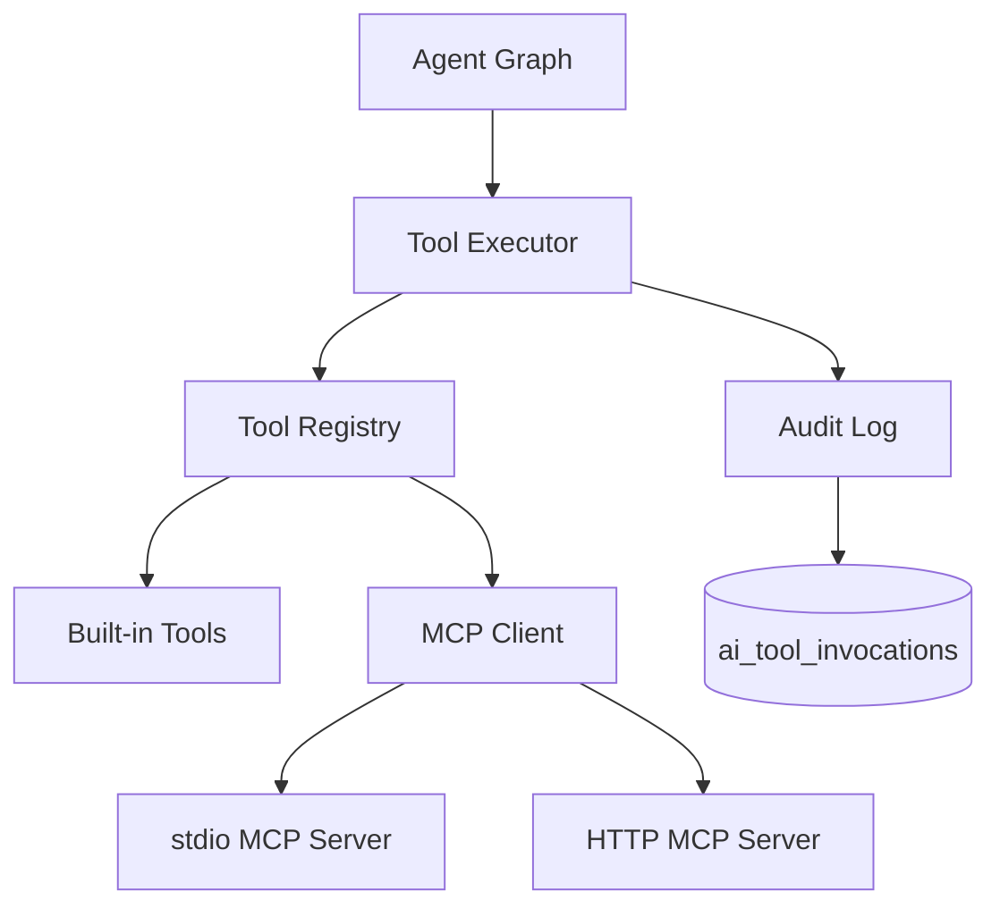
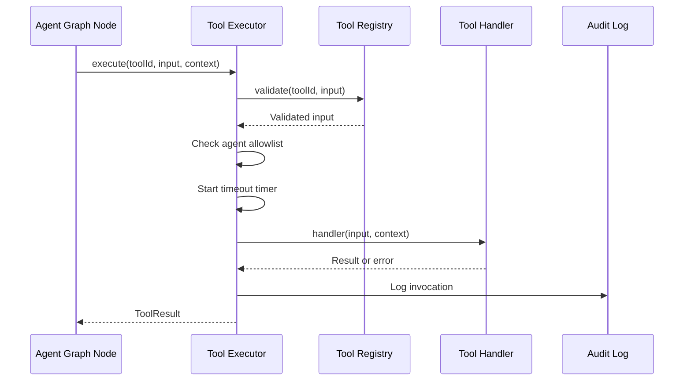
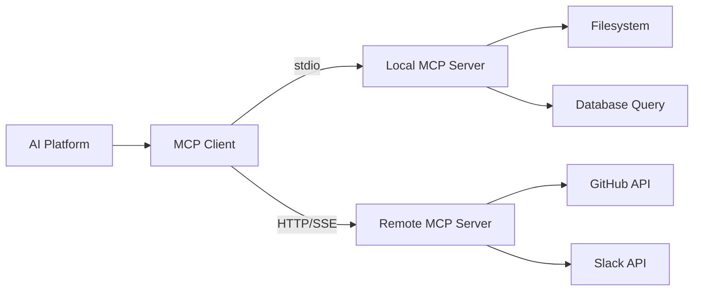
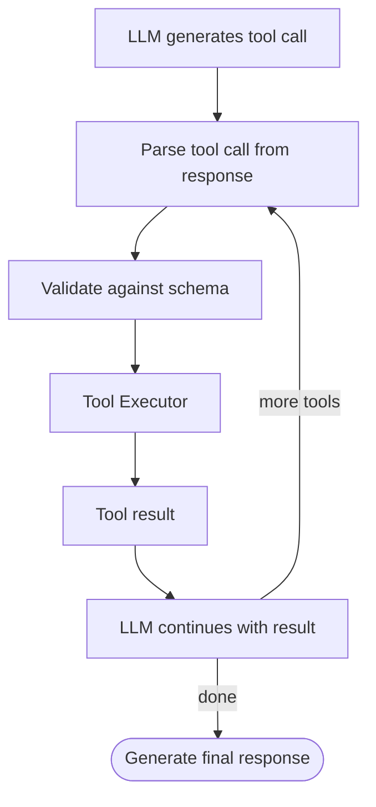

# AI Platform — Tools

> MCP integration, tool registry, and sandboxed tool execution.  
> **Last updated:** August 2026

---

## Table of Contents

1. [Overview](#overview)
2. [Tool Model](#tool-model)
3. [Tool Registry](#tool-registry)
4. [Tool Execution](#tool-execution)
5. [Built-in Tools](#built-in-tools)
6. [MCP Integration](#mcp-integration)
7. [Tool Calling in Agent Graphs](#tool-calling-in-agent-graphs)
8. [Security and Sandboxing](#security-and-sandboxing)
9. [Audit Logging](#audit-logging)
10. [Phase Rollout](#phase-rollout)

---

## Overview

Tools extend agent capabilities beyond text generation — enabling search, calculation, code analysis, and interaction with external systems. The platform provides a unified tool system supporting both native (built-in) tools and MCP (Model Context Protocol) tools.



### Design Principles

1. **Schema-first** — Every tool declares input/output schemas (Zod or JSON Schema).
2. **Allowlist per agent** — Agents declare which tools they can use; no global tool access.
3. **Sandboxed execution** — Timeouts, resource limits, no arbitrary code execution by default.
4. **MCP as extension mechanism** — New tools added via MCP servers without platform code changes.
5. **Audit everything** — Every tool invocation is logged to `ai_tool_invocations`.

---

## Tool Model

```typescript
interface ToolDefinition {
  id: string;                          // Unique identifier: 'search', 'calculator', 'mcp:filesystem'
  name: string;                        // Human-readable name
  description: string;                 // Description for LLM tool selection
  source: 'builtin' | 'mcp';        // Origin
  inputSchema: ZodSchema;             // Input validation
  outputSchema: ZodSchema;            // Output validation
  timeout: number;                    // Max execution time (ms)
  requiresAuth: boolean;              // Whether tool needs user context
  metadata?: Record<string, unknown>;
}

interface ToolInvocation {
  toolId: string;
  input: Record<string, unknown>;
  output?: Record<string, unknown>;
  error?: string;
  durationMs: number;
  agentRunId: string;
  userId: string;
}
```

---

## Tool Registry

`tools/registry/tool-registry.ts` manages tool discovery and validation.

```typescript
interface ToolRegistry {
  register(tool: ToolDefinition, handler: ToolHandler): void;
  get(toolId: string): ToolDefinition;
  list(agentId?: string): ToolDefinition[];  // Filtered by agent allowlist
  validate(toolId: string, input: unknown): ValidationResult;
}

type ToolHandler = (input: Record<string, unknown>, context: ToolContext) => Promise<Record<string, unknown>>;

interface ToolContext {
  userId: string;
  agentRunId: string;
  scope: MemoryScope;
  signal: AbortSignal;  // For timeout cancellation
}
```

### Registration

Tools are registered at platform startup:

```typescript
// Built-in tools registered in ai-platform.container.ts
toolRegistry.register(searchTool, searchHandler);
toolRegistry.register(calculatorTool, calculatorHandler);

// MCP tools discovered at startup from configured servers
await mcpClient.discoverTools();
for (const mcpTool of mcpClient.getTools()) {
  toolRegistry.register(mcpTool, mcpClient.createHandler(mcpTool.id));
}
```

### Agent Allowlist

Each agent definition declares `allowedTools: string[]`. The registry filters available tools per agent:

```typescript
// Tutor agent — no tools in Phase 1
allowedTools: []

// Code reviewer — builtin + MCP tools
allowedTools: ['code-analyze', 'lint-check', 'mcp:filesystem:read']
```

The LLM only sees tools from the agent's allowlist in its tool-calling prompt.

---

## Tool Execution

`tools/executor/tool-executor.ts` runs tools with safety guarantees.

### Execution Flow



### Execution Guarantees

| Guarantee | Implementation |
|-----------|---------------|
| **Timeout** | `AbortSignal` with configurable per-tool timeout (default: 30s) |
| **Input validation** | Zod schema validation before execution |
| **Output validation** | Zod schema validation after execution |
| **Error isolation** | Tool errors do not crash the agent graph; returned as `ToolResult.error` |
| **Concurrency limit** | Max 3 concurrent tool calls per agent run |
| **No side effects by default** | Read-only tools unless explicitly marked |

### Error Handling

```typescript
interface ToolResult {
  success: boolean;
  output?: Record<string, unknown>;
  error?: {
    code: string;       // TIMEOUT | VALIDATION_ERROR | EXECUTION_ERROR | NOT_ALLOWED
    message: string;
    retryable: boolean;
  };
  durationMs: number;
}
```

Tool errors are non-fatal. The agent graph's `tool-call` node passes errors back to the LLM, which can retry or explain the failure to the user.

---

## Built-in Tools

Platform-native tools in `tools/builtin/`:

### `search` — Knowledge Search

Search the course knowledge base (wraps RAG retrieval).

```typescript
{
  id: 'search',
  input: { query: string, courseId: string, topK?: number },
  output: { results: RetrievedChunk[] },
  timeout: 10000,
}
```

### `calculator` — Math Evaluation

Safe mathematical expression evaluation (no `eval()` — uses a math parser).

```typescript
{
  id: 'calculator',
  input: { expression: string },
  output: { result: number },
  timeout: 5000,
}
```

### `code-analyze` — Code Analysis (Phase 3)

Static analysis of code snippets (complexity, patterns, issues).

```typescript
{
  id: 'code-analyze',
  input: { code: string, language: string },
  output: { issues: CodeIssue[], complexity: number },
  timeout: 15000,
}
```

### Adding Built-in Tools

1. Define schema in `tools/schemas/`
2. Implement handler in `tools/builtin/`
3. Register in `ai-platform.container.ts`
4. Add to relevant agent's `allowedTools`

---

## MCP Integration

MCP (Model Context Protocol) enables external tool servers to extend agent capabilities without modifying platform code.

### Architecture



### MCP Client

`tools/mcp/mcp-client.ts` manages connections to MCP servers:

```typescript
interface McpClient {
  connect(config: McpServerConfig): Promise<void>;
  disconnect(serverId: string): Promise<void>;
  discoverTools(): Promise<ToolDefinition[]>;
  callTool(toolId: string, input: Record<string, unknown>): Promise<Record<string, unknown>>;
  listResources(): Promise<McpResource[]>;
  readResource(uri: string): Promise<string>;
}

interface McpServerConfig {
  id: string;
  transport: 'stdio' | 'http';
  command?: string;          // For stdio: executable path
  args?: string[];           // For stdio: command arguments
  url?: string;              // For HTTP: server URL
  env?: Record<string, string>;
  allowedTools?: string[];   // Subset of server tools to expose
}
```

### Transport Types

| Transport | Use Case | Configuration |
|-----------|----------|---------------|
| **stdio** | Local development, sandboxed tools | `command: 'npx', args: ['@modelcontextprotocol/server-filesystem']` |
| **HTTP/SSE** | Remote services, cloud tools | `url: 'https://mcp.example.com/sse'` |

### MCP Server Configuration

MCP servers are configured via environment variables:

```env
AI_PLATFORM_MCP_SERVERS='[
  {
    "id": "filesystem",
    "transport": "stdio",
    "command": "npx",
    "args": ["-y", "@modelcontextprotocol/server-filesystem", "/data/courses"],
    "allowedTools": ["read_file", "list_directory"]
  }
]'
```

### Tool ID Namespacing

MCP tools are namespaced to prevent collisions:

```
mcp:{serverId}:{toolName}
```

Example: `mcp:filesystem:read_file`

### MCP Trust Model

| Trust Level | Servers | Restrictions |
|-------------|---------|-------------|
| **Trusted** | Self-hosted, audited | Full tool access per allowlist |
| **Restricted** | Third-party | Read-only tools, no filesystem write |
| **Blocked** | Unknown | Not connectable |

MCP servers must be explicitly configured. No auto-discovery of MCP servers on the network.

---

## Tool Calling in Agent Graphs

### Graph Node: `tool-call`



### Tool Calling Loop

LangGraph supports cyclic tool calling:

1. `generate-response` node produces a tool call request
2. Conditional edge routes to `tool-call` node
3. `tool-call` executes the tool and appends result to state
4. Edge routes back to `generate-response` with tool result in context
5. Loop continues until LLM produces a final text response (max 5 iterations)

### Max Iterations

To prevent infinite tool calling loops:

- Default max tool call iterations: 5 per agent run
- Configurable per agent definition
- Exceeded limit → agent returns partial response with explanation

---

## Security and Sandboxing

### Threat Model

| Threat | Mitigation |
|--------|-----------|
| **Arbitrary code execution** | No `eval()`; built-in tools use safe parsers; MCP servers are allowlisted |
| **Filesystem access** | MCP filesystem server restricted to `/data/courses` path |
| **Network access** | MCP HTTP servers must be explicitly configured; no outbound network from built-in tools |
| **Resource exhaustion** | Per-tool timeout (30s default); max 3 concurrent calls; max 5 iterations |
| **Data exfiltration** | Tool results are scoped to agent's memory scope; audit log tracks all invocations |
| **Prompt injection via tool output** | Tool results are sanitized before passing to LLM |

### Input Sanitization

Tool inputs are validated against Zod schemas. Free-text inputs (e.g., search queries) pass through the same `sanitize-input` node used for user messages.

### Output Sanitization

Tool outputs are validated against output schemas. Unexpected fields are stripped. Large outputs are truncated to prevent context window overflow (max 4000 tokens per tool result).

---

## Audit Logging

Every tool invocation is logged to `ai_tool_invocations`:

| Column | Type | Purpose |
|--------|------|---------|
| `id` | UUID | Primary key |
| `agent_run_id` | UUID | Parent agent run |
| `user_id` | UUID | User who triggered the run |
| `tool_id` | TEXT | Tool identifier |
| `input` | JSONB | Tool input (PII-redacted) |
| `output` | JSONB | Tool output (truncated if large) |
| `error` | TEXT? | Error message if failed |
| `duration_ms` | INT | Execution time |
| `created_at` | TIMESTAMP | Invocation time |

Audit logs support:
- Security investigations (who accessed what)
- Cost analysis (tool usage patterns)
- Debugging (failed tool calls)

Retention: 90 days (configurable). See [13-security.md](./13-security.md).

---

## Phase Rollout

| Phase | Tools Available | Agents |
|-------|----------------|--------|
| **Phase 1** | None (RAG only) | Tutor |
| **Phase 2** | None (LangGraph migration) | Tutor |
| **Phase 3** | `search`, `calculator`, MCP filesystem | Tutor, Code Reviewer |
| **Future** | GitHub MCP, custom course tools | All agents |

Phase 1–2 intentionally exclude tools to reduce complexity during the ai-tutor migration. Tool infrastructure is documented and stubbed but not activated until Phase 3.

---

## Related Documentation

- [04-agents.md](./04-agents.md) — Tool calling in agent graphs
- [05-rag.md](./05-rag.md) — `search` built-in tool wraps RAG
- [13-security.md](./13-security.md) — Tool sandbox and MCP trust model
- [15-adrs.md](./15-adrs.md) — ADR-008 (MCP for tool extensibility)
