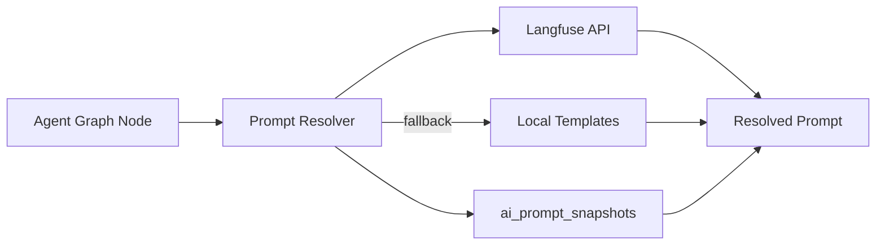
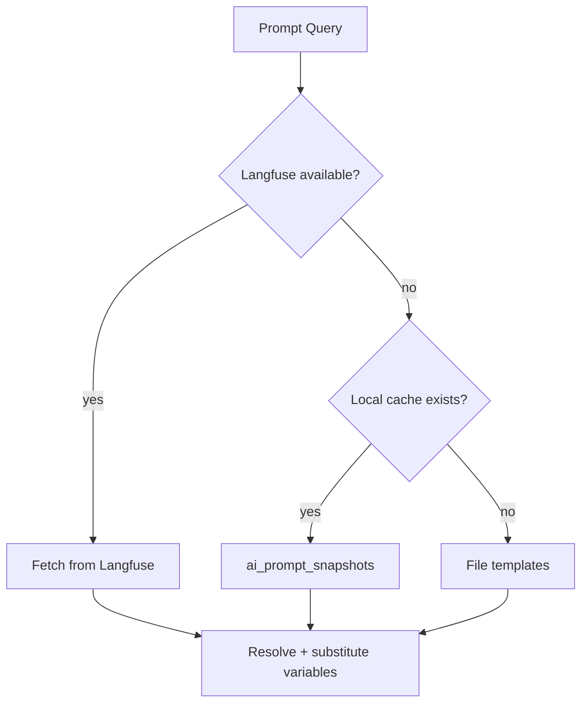
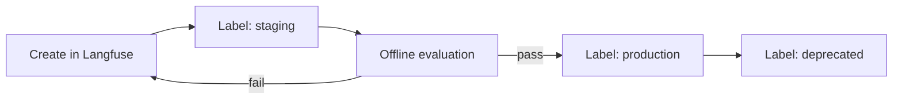

# AI Platform — Prompts

> Prompt management strategy with Langfuse (primary) and local fallback.  
> **Last updated:** August 2026

---

## Table of Contents

1. [Overview](#overview)
2. [Hybrid Strategy: Langfuse + LangSmith](#hybrid-strategy-langfuse--langsmith)
3. [Prompt Repository Port](#prompt-repository-port)
4. [Langfuse Integration](#langfuse-integration)
5. [Local Fallback](#local-fallback)
6. [Prompt Resolution](#prompt-resolution)
7. [Versioning Strategy](#versioning-strategy)
8. [Prompt Templates](#prompt-templates)
9. [A/B Testing](#ab-testing)
10. [Migration from AI Tutor](#migration-from-ai-tutor)

---

## Overview

Prompts are the primary interface between agent logic and LLM behavior. The platform centralizes prompt management so that:

- Prompts are versioned, auditable, and deployable independently of code.
- Product teams can iterate on prompts without code changes.
- Every agent run records which prompt version was used (traceability).
- Arabic and English prompts are managed with locale support.



---

## Hybrid Strategy: Langfuse + LangSmith

The platform uses a **hybrid observability model** for prompts and traces:

| Concern | System | Why |
|---------|--------|-----|
| **Prompt storage & versioning** | Langfuse | Self-hostable, strong versioning, A/B labels, decoupled from trace vendor |
| **Agent run tracing** | LangSmith | Native LangGraph integration, run comparison, debugging |
| **System observability** | OpenTelemetry | Vendor-neutral spans for retrieval, LLM calls, tool invocations |

### Why Not LangSmith for Prompts?

LangSmith has prompt management capabilities, but:

- Langfuse provides better versioning semantics (labels, production promotion).
- Langfuse is self-hostable (important for data residency).
- Decoupling prompts from traces avoids vendor lock-in on both concerns.
- Langfuse's prompt API is optimized for runtime resolution (low latency).

### Why Not Langfuse for Traces?

Langfuse supports tracing, but:

- LangGraph has first-class LangSmith integration (automatic span propagation).
- LangSmith's run comparison and debugging UI is more mature for agent workflows.
- Using LangSmith for traces avoids building custom trace exporters for LangGraph.

---

## Prompt Repository Port

```typescript
// prompts/ports/prompt-repository.port.ts
interface PromptRepositoryPort {
  getPrompt(query: PromptQuery): Promise<ResolvedPrompt>;
  listVersions(promptKey: string): Promise<PromptVersion[]>;
  createVersion(prompt: CreatePromptVersion): Promise<PromptVersion>;
}

interface PromptQuery {
  key: string;              // e.g., 'tutor/system', 'evaluator/rubric'
  version?: string;         // Specific version or 'latest' or 'production'
  label?: string;           // Langfuse label: 'production', 'staging', 'experiment-a'
  locale?: 'ar' | 'en';     // Language variant
  variables?: Record<string, string>;  // Template variable substitution
}

interface ResolvedPrompt {
  key: string;
  version: string;
  content: string;
  locale: string;
  variables: Record<string, string>;
  resolvedAt: Date;
  source: 'langfuse' | 'local' | 'cache';
}
```

---

## Langfuse Integration

### Configuration

```env
LANGFUSE_PUBLIC_KEY=pk-lf-...
LANGFUSE_SECRET_KEY=sk-lf-...
LANGFUSE_HOST=https://cloud.langfuse.com  # or self-hosted URL
```

### Adapter

`prompts/langfuse/langfuse-prompt.adapter.ts` implements `PromptRepositoryPort`:

```typescript
class LangfusePromptAdapter implements PromptRepositoryPort {
  async getPrompt(query: PromptQuery): Promise<ResolvedPrompt> {
    const prompt = await this.langfuse.getPrompt(query.key, {
      version: query.version,
      label: query.label ?? 'production',
      cacheTtlSeconds: 300,  // Cache locally for 5 min
    });

    const content = this.selectLocale(prompt, query.locale);
    const rendered = this.substituteVariables(content, query.variables);

    return {
      key: query.key,
      version: prompt.version.toString(),
      content: rendered,
      locale: query.locale ?? 'ar',
      variables: query.variables ?? {},
      resolvedAt: new Date(),
      source: 'langfuse',
    };
  }
}
```

### Prompt Naming Convention

```
{product}/{purpose}[.{locale}]

Examples:
  tutor/system           # Tutor system prompt (default locale)
  tutor/system.ar        # Tutor system prompt (Arabic)
  tutor/system.en        # Tutor system prompt (English)
  evaluator/rubric       # Assignment evaluator rubric prompt
  code-reviewer/review   # Code review prompt
  memory/summarize       # Conversation summarization prompt
  shared/safety-filter   # Shared safety/injection filter prompt
```

### Langfuse Labels

| Label | Purpose |
|-------|---------|
| `production` | Live prompt used in production (default) |
| `staging` | Pre-production testing |
| `experiment-a` | A/B test variant A |
| `experiment-b` | A/B test variant B |
| `deprecated` | Marked for removal |

---

## Local Fallback

For offline development and CI environments without Langfuse access.

### File-Based Adapter

`prompts/local/file-prompt.adapter.ts` reads from `prompts/templates/`:

```
prompts/templates/
├── tutor-system.ar.md
├── tutor-system.en.md
├── evaluator-rubric.ar.md
├── evaluator-rubric.en.md
├── memory-summarize.ar.md
└── shared-safety-filter.ar.md
```

### Fallback Chain



Priority:
1. Langfuse API (production)
2. `ai_prompt_snapshots` table (cached versions)
3. Local file templates (development fallback)

### Snapshot Cache

`ai_prompt_snapshots` stores the last-known-good version of each prompt:

| Column | Type | Purpose |
|--------|------|---------|
| `prompt_key` | TEXT | Prompt identifier |
| `version` | TEXT | Version string |
| `locale` | TEXT | Language |
| `content` | TEXT | Prompt text |
| `synced_at` | TIMESTAMP | Last sync from Langfuse |

A background job syncs Langfuse prompts to snapshots daily. If Langfuse is unreachable, the platform serves from snapshots.

---

## Prompt Resolution

`prompts/resolver.ts` is the single entry point for all prompt retrieval.

### Resolution Flow

```typescript
async function resolvePrompt(query: PromptQuery): Promise<ResolvedPrompt> {
  // 1. Try primary source (Langfuse)
  try {
    return await langfuseAdapter.getPrompt(query);
  } catch (error) {
    logger.warn({ promptKey: query.key }, 'Langfuse unavailable, falling back');
  }

  // 2. Try snapshot cache
  const cached = await snapshotRepo.find(query.key, query.version, query.locale);
  if (cached) return cached;

  // 3. Try local files
  return await localAdapter.getPrompt(query);
}
```

### Variable Substitution

Prompts use `{{variable}}` syntax for runtime substitution:

```markdown
You are an AI tutor for the course "{{courseName}}".

The student is currently studying: "{{lectureTitle}}"

Student's preferred explanation depth: {{explanationDepth}}

{{#if retrievedContext}}
Use the following course material to answer:
{{retrievedContext}}
{{/if}}
```

Variables are provided by the agent graph node that calls the resolver. The platform does not fetch business data — the feature or graph node provides variables.

### Locale Selection

1. If `locale` is specified in query, use that locale's prompt variant.
2. If no locale-specific variant exists, fall back to the default (Arabic for IthraCode).
3. Locale is determined by the feature based on user preference or `Accept-Language`.

---

## Versioning Strategy

### Version Lifecycle



### Rules

1. **Never edit production prompts in place.** Create a new version and promote it.
2. **Every agent run records the prompt version** in `ai_agent_runs.prompt_version`.
3. **Rollback** = change the `production` label to a previous version in Langfuse.
4. **Code deploys do not change prompts.** Prompt changes are independent of application deploys.

### Version Pinning

For reproducibility in evaluation:

```typescript
// Evaluation runs pin specific prompt versions
resolvePrompt({
  key: 'tutor/system',
  version: '3',  // Pinned version
  locale: 'ar',
});
```

Production uses labels (`production`) for automatic latest promotion. Evaluation pins versions for consistent comparison.

---

## Prompt Templates

Seed templates in `prompts/templates/` are the source of truth for initial Langfuse setup.

### Deployment Sync

On deploy (or via admin command), seed templates are synced to Langfuse:

```bash
pnpm ai-platform:sync-prompts
```

This script:
1. Reads all files from `prompts/templates/`
2. Creates or updates versions in Langfuse
3. Updates `ai_prompt_snapshots`
4. Does **not** change the `production` label (manual promotion required)

### Template Format

Templates are Markdown files with frontmatter:

```markdown
---
key: tutor/system
locale: ar
description: AI Tutor system prompt for Arabic students
variables:
  - courseName
  - lectureTitle
  - explanationDepth
  - retrievedContext
---

أنت مُعلّم ذكي لدورة "{{courseName}}".
...
```

---

## A/B Testing

Langfuse labels enable prompt A/B testing without code changes.

### Setup

1. Create two prompt versions in Langfuse: `experiment-a` and `experiment-b`
2. Configure the resolver to randomly select between labels:

```typescript
function selectExperimentLabel(userId: string): string {
  const hash = sha256(userId + 'tutor-prompt-experiment');
  return parseInt(hash.slice(0, 8), 16) % 2 === 0 ? 'experiment-a' : 'experiment-b';
}
```

3. Run offline evaluation comparing both variants
4. Promote the winner to `production` label

### Metrics for Comparison

Tracked via LangSmith traces and cost ledger:

- Answer quality (Ragas faithfulness, relevancy)
- Student satisfaction (thumbs up/down — feature-level)
- Token usage and cost
- Response latency
- Educational integrity violation rate

---

## Migration from AI Tutor

The current AI Tutor uses hardcoded prompts in `prompt-builder.ts`. Migration path:

| Current | Platform |
|---------|----------|
| `prompt-builder.ts` system prompt | Langfuse `tutor/system.ar` |
| `prompt-builder.ts` context injection | Variable substitution in resolver |
| `educational-integrity-rules.ts` | Langfuse `shared/safety-filter.ar` |
| Hardcoded Arabic templates | `prompts/templates/tutor-system.ar.md` |

### Migration Steps

1. Extract prompt text from `prompt-builder.ts` into `prompts/templates/`
2. Sync templates to Langfuse
3. Replace `prompt-builder.ts` calls with `resolvePrompt({ key: 'tutor/system', ... })`
4. Delete hardcoded prompt strings from feature code
5. Verify via offline evaluation (same quality, same cost)

The `prompt-builder.ts` file is reduced to a thin wrapper that calls the platform resolver with tutor-specific variables.

---

## Related Documentation

- [04-agents.md](./04-agents.md) — Prompt resolution in agent graph nodes
- [09-observability.md](./09-observability.md) — LangSmith tracing (separate from prompts)
- [10-evaluation.md](./10-evaluation.md) — Prompt A/B evaluation
- [15-adrs.md](./15-adrs.md) — ADR-003 (Langfuse + LangSmith hybrid)
