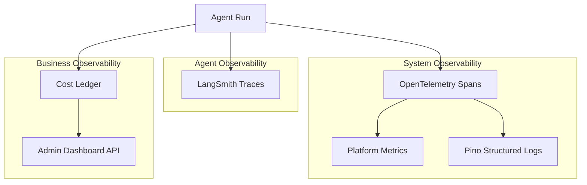
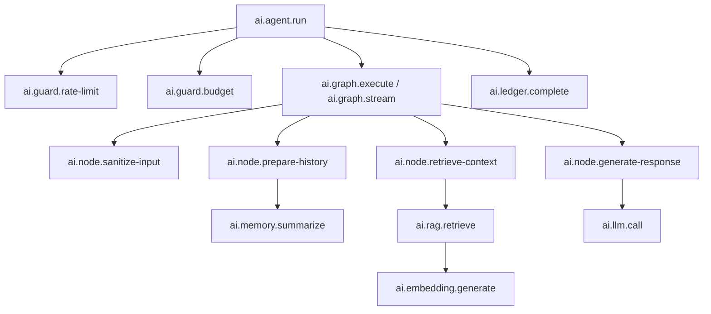
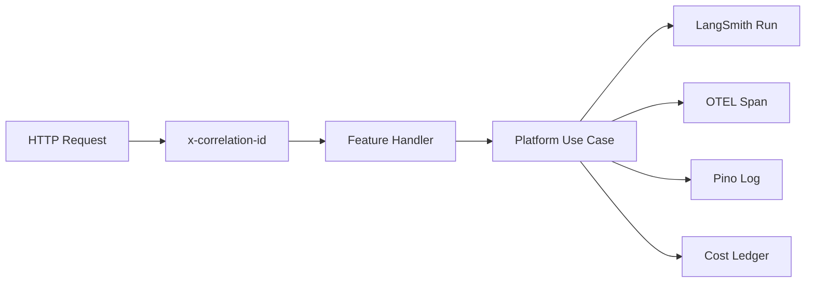

# AI Platform — Observability

> LangSmith tracing, OpenTelemetry spans, cost analytics, and logging.  
> **Last updated:** August 2026

> **Implementation plan:** See [AI Usage + Cost + OpenTelemetry Architecture Plan](./ai-usage-observability-plan.md) for the phased rollout source of truth.

---

## Table of Contents

1. [Overview](#overview)
2. [Observability Stack](#observability-stack)
3. [LangSmith Integration](#langsmith-integration)
4. [OpenTelemetry](#opentelemetry)
5. [Cost Ledger](#cost-ledger)
6. [Metrics](#metrics)
7. [Structured Logging](#structured-logging)
8. [Correlation and Tracing](#correlation-and-tracing)
9. [Cost Analytics Dashboard](#cost-analytics-dashboard)
10. [Alerting](#alerting)
11. [Migration from AI Tutor](#migration-from-ai-tutor)
12. [Implementation Plan](./ai-usage-observability-plan.md)

---

## Overview

Production AI systems require deep observability to debug failures, control costs, and improve quality. The platform provides three layers of observability:



---

## Observability Stack

| Layer | Tool | Purpose | Data |
|-------|------|---------|------|
| **Agent traces** | LangSmith | Debug agent runs, compare prompts, inspect graph nodes | Runs, spans, inputs/outputs |
| **System traces** | OpenTelemetry | Vendor-neutral spans for all platform operations | Spans, attributes, events |
| **Metrics** | OTEL Metrics / Pino counters | Throughput, latency, error rates | Counters, histograms |
| **Logs** | Pino (existing) | Structured event logs with correlation IDs | JSON log lines |
| **Cost** | PostgreSQL (`ai_agent_runs`) | Token usage and estimated cost per run | Rows in platform tables |
| **Dashboard** | Custom admin API | Cost analytics, usage trends | Aggregated queries |

### What Goes Where

| Event | LangSmith | OTEL | Pino | Cost Ledger |
|-------|-----------|------|------|-------------|
| Agent run start/end | ✅ Run | ✅ Span | ✅ Info | ✅ Row |
| LLM call | ✅ Child span | ✅ Span | ✅ Debug | ✅ Tokens |
| RAG retrieval | ✅ Child span | ✅ Span | ✅ Debug | — |
| Tool invocation | ✅ Child span | ✅ Span | ✅ Info | — |
| Embedding generation | — | ✅ Span | ✅ Debug | ✅ Tokens |
| Rate limit hit | — | ✅ Event | ✅ Warn | — |
| Cost cap exceeded | — | ✅ Event | ✅ Warn | — |
| Indexing job | — | ✅ Span | ✅ Info | ✅ Tokens |
| Prompt resolution | — | ✅ Span | ✅ Debug | — |

---

## LangSmith Integration

### Configuration

```env
LANGCHAIN_TRACING_V2=true
LANGCHAIN_API_KEY=lsv2_...
LANGCHAIN_PROJECT=ithracode-ai-platform
LANGCHAIN_ENDPOINT=https://api.smith.langchain.com
```

### Tracer Setup

`observability/langsmith/langsmith-tracer.ts` configures LangSmith for LangGraph:

```typescript
// Automatic tracing via LangGraph + LangSmith integration
// LangGraph nodes automatically create child spans
// Agent runs appear as top-level runs in LangSmith
```

### What LangSmith Captures

| Data | Captured | PII Handling |
|------|----------|-------------|
| Agent input (user message) | ✅ | Redact if configured |
| Agent output (response) | ✅ | Redact if configured |
| System prompt | ✅ | Full (needed for debugging) |
| Retrieved chunks | ✅ | Content included |
| LLM tokens (input/output) | ✅ | — |
| Graph node transitions | ✅ | Node names and state diffs |
| Tool calls and results | ✅ | Input/output |
| Errors and stack traces | ✅ | Full |
| Latency per node | ✅ | — |

### Run Metadata

Every LangSmith run includes metadata for filtering:

```typescript
{
  agentId: 'tutor',
  userId: 'user-uuid',
  courseId: 'course-uuid',
  lectureId: 'lecture-uuid',
  promptVersion: '3',
  locale: 'ar',
  correlationId: 'req-uuid',
}
```

### Run Comparison

LangSmith enables comparing runs across prompt versions:

1. Filter runs by `promptVersion` metadata
2. Compare average latency, token usage, and output quality
3. Use with offline evaluation (Ragas scores) for prompt iteration

---

## OpenTelemetry

### Setup

`observability/opentelemetry/otel-setup.ts` initializes OTEL for the platform:

```typescript
// Exports spans to configured backend (stdout in dev, OTLP in production)
// Integrates with existing Pino logging via correlation IDs
```

### Configuration

```env
OTEL_ENABLED=true
OTEL_SERVICE_NAME=ithracode-ai-platform
OTEL_EXPORTER_OTLP_ENDPOINT=http://127.0.0.1:4318
OTEL_METRICS_PORT=9464
OTEL_TRACES_SAMPLER=parentbased_traceidratio
OTEL_TRACES_SAMPLER_ARG=0.1  # 10% sampling in production
```

When `OTEL_ENABLED=true`:

- **Traces** export to OTLP (`/v1/traces`) when `OTEL_EXPORTER_OTLP_ENDPOINT` is set
- **Metrics** export via Prometheus pull (`OTEL_METRICS_PORT`, default `9464`) and OTLP push (`/v1/metrics`) when endpoint is set
- **Health:** `/api/health/ai-platform` returns JSON status and export URLs — not a duplicate metrics scrape target

Initialization is fail-safe: OTEL exporter failures log a warning and do not block AI requests.

### Span Hierarchy



### Span Attributes

Standard attributes on platform spans are sanitized before export:

- Raw `userId`, `courseId`, `lectureId`, and `threadId` are hashed (`hash:<16-hex>`)
- Forbidden keys (`prompt`, `response`, `content`, `messages`, etc.) are dropped
- Allowed operational fields: `agentId`, `runId`, `correlationId`, `model`, `provider`, token counts, cost, latency, `tokenUsageEstimated`

```typescript
{
  'ai.agent.id': 'tutor',
  'ai.user.id_hash': 'hash:abc123...',
  'ai.correlation.id': 'req-uuid',
  'ai.model': 'gpt-4o-mini',
  'ai.provider': 'openai',
  'ai.tokens.input': 1500,
  'ai.tokens.output': 350,
  'ai.cost.usd': 0.0023,
  'ai.llm.time_to_first_token_ms': 420,
}
```

### Span Helpers

`observability/opentelemetry/span-helpers.ts` provides utilities:

```typescript
async function withSpan<T>(
  name: string,
  attributes: Record<string, string | number>,
  fn: () => Promise<T>,
): Promise<T>;
```

Used by all platform modules to create consistent spans without boilerplate.

### Sampling Strategy

| Environment | Sampling Rate | Rationale |
|-------------|--------------|-----------|
| Development | 100% | Full visibility |
| Staging | 100% | Pre-production debugging |
| Production | 10% | Cost control; LangSmith captures all agent runs |

Agent runs are always traced in LangSmith (100%). OTEL sampling applies to system-level spans only.

---

## Cost Ledger

### Purpose

Track token usage and estimated cost for every AI operation. Enables per-user, per-product, and global cost monitoring.

### Tables

**`ai_agent_runs`** — per-run record:

| Column | Type | Purpose |
|--------|------|---------|
| `id` | UUID | Primary key |
| `agent_id` | TEXT | Agent identifier |
| `user_id` | UUID | User who triggered the run |
| `status` | TEXT | `running`, `completed`, `failed` |
| `input_tokens` | INT | Total input tokens |
| `output_tokens` | INT | Total output tokens |
| `embedding_tokens` | INT | Tokens used for embeddings |
| `token_usage_estimated` | BOOLEAN | `true` when counts are not provider-reported |
| `estimated_cost_usd` | DECIMAL | Calculated cost |
| `model` | TEXT | Model used |
| `provider` | TEXT | Provider used |
| `prompt_version` | TEXT | Prompt version used |
| `latency_ms` | INT | Total run duration |
| `langsmith_run_id` | TEXT | Link to LangSmith trace |
| `correlation_id` | TEXT | Request correlation ID |
| `metadata` | JSONB | Additional context |
| `created_at` | TIMESTAMP | Run start time |
| `completed_at` | TIMESTAMP? | Run end time |

**`ai_usage_daily`** — aggregated daily totals:

| Column | Type | Purpose |
|--------|------|---------|
| `date` | DATE | Aggregation date |
| `user_id` | UUID? | User (null for global) |
| `agent_id` | TEXT? | Agent (null for all agents) |
| `total_runs` | INT | Number of runs |
| `total_input_tokens` | BIGINT | Sum of input tokens |
| `total_output_tokens` | BIGINT | Sum of output tokens |
| `total_cost_usd` | DECIMAL | Sum of estimated cost |

### Token Accounting (Phase 1)

Normalized usage shape (`observability/usage/`):

```typescript
{
  inputTokens: number;
  outputTokens: number;
  totalTokens: number;
  tokenUsageEstimated: boolean; // true = not provider-reported; do not treat as billing truth
}
```

**Provider usage mapping:**

| Provider | Stream | Complete |
|----------|--------|----------|
| OpenAI | `chunk.usage` (`prompt_tokens`, `completion_tokens`) | `response.usage` |
| Anthropic | SSE `message_start` + `message_delta` `usage` | `usage.input_tokens` / `output_tokens` |
| Gemini | `usageMetadata` per SSE chunk | `usageMetadata` in response |

**Fallback:** When provider usage is missing, `resolveTokenUsage()` estimates from text (`chars/4` heuristic) and sets `tokenUsageEstimated=true`. Provider-reported usage is never marked estimated.

**Streaming:** Adapters call `onUsage` once at stream end with final counts. Graph state accumulates via `tokensUsed` reducer across nodes (generate, summarization, evaluator).

See [AI Usage Observability Plan](./ai-usage-observability-plan.md) for full architecture.

### Cost Calculation

`observability/cost/token-pricing.ts` maintains a pricing table:

```typescript
const TOKEN_PRICING: Record<string, { input: number; output: number }> = {
  'gpt-4o-mini':       { input: 0.15 / 1_000_000, output: 0.60 / 1_000_000 },
  'gpt-4o':            { input: 2.50 / 1_000_000, output: 10.0 / 1_000_000 },
  'text-embedding-3-small': { input: 0.02 / 1_000_000, output: 0 },
  'claude-3-5-sonnet': { input: 3.0 / 1_000_000, output: 15.0 / 1_000_000 },
};
```

Cost is calculated at run completion and stored in `ai_agent_runs.estimated_cost_usd`. Daily aggregation runs via a scheduled BullMQ job.

### Cost Cap Integration

Cost caps (migrated from `tutor-cost-cap.guard.ts`) query `ai_usage_daily`:

```typescript
async function checkCostCap(userId: string): Promise<void> {
  const todayUsage = await costLedger.getDailyUsage(userId);
  const cap = AIPlatformConfig.getDailyCostCap();
  if (cap > 0 && todayUsage.totalCostUsd >= cap) {
    throw new CostCapExceededError(userId, todayUsage.totalCostUsd, cap);
  }
}
```

Fail-closed: if the cost ledger is unreachable, deny the request.

---

## Metrics

`observability/metrics/platform-metrics.ts` exposes platform counters:

### Key Metrics

| Metric | Type | Labels |
|--------|------|--------|
| `ai_requests_total` | Counter | `agent_id`, `status` |
| `ai_request_duration_ms` | Histogram | `agent_id` |
| `ai_request_errors_total` | Counter | `agent_id`, `error_code` |
| `ai_tokens_input_total` | Counter | `model`, `provider` |
| `ai_tokens_output_total` | Counter | `model`, `provider` |
| `ai_cost_usd_total` | Counter | `model`, `provider`, `agent_id` |
| `ai_embedding_tokens_total` | Counter | `model` |
| `ai_retrieval_chunks_total` | Counter | `agent_id` |
| `ai_rag_retrieval_duration_ms` | Histogram | `agent_id` |
| `ai_tool_invocations_total` | Counter | `tool_id`, `status` |

Legacy aliases (`ai_agent_runs_total`, `ai_agent_run_duration_ms`, `ai_llm_tokens_total`, `ai_retrieval_latency_ms`) are still emitted for backward compatibility.

### Export

Metrics are recorded through the OpenTelemetry SDK (`platform-metrics.ts` → OTEL meter API).

- **Prometheus:** scrape `http://<host>:9464/metrics` (configurable via `OTEL_METRICS_PORT`)
- **OTLP:** pushed to `<OTEL_EXPORTER_OTLP_ENDPOINT>/v1/metrics` when endpoint is configured
- **Legacy:** in-memory `toPrometheusText()` on `/api/health/ai-platform` removed in Phase 3

---

## Structured Logging

Agent run lifecycle logs use a unified schema via `observability/logging/ai-event-logger.ts`.

### Run Events

| Event | Level | Message tag |
|-------|-------|-------------|
| `ai.agent.run.completed` | info | `[AI_AGENT_RUN_COMPLETED]` |
| `ai.agent.run.failed` | warn | `[AI_AGENT_RUN_FAILED]` |

### Log Structure

```json
{
  "level": "info",
  "event": "ai.agent.run.completed",
  "traceId": "abc123...",
  "spanId": "def456...",
  "runId": "run-uuid",
  "agentId": "tutor",
  "correlationId": "req-uuid",
  "model": "gpt-4o-mini",
  "provider": "openai",
  "inputTokens": 1500,
  "outputTokens": 350,
  "embeddingTokens": 120,
  "costUsd": 0.0023,
  "durationMs": 4200,
  "status": "completed",
  "tokenUsageEstimated": false
}
```

`traceId` / `spanId` are populated from the active OTEL span when available; `runId` / `agentId` come from the agent trace context. Prompt, response, and RAG content are never logged.

### Other Log Tags

| Tag | Level | When |
|-----|-------|------|
| `[AI_LLM_CALL]` | debug | LLM request/response metadata |
| `[AI_RETRIEVAL]` | debug | RAG retrieval results count |
| `[AI_EMBEDDING]` | debug | Embedding generation (cache hit/miss) |
| `[AI_RATE_LIMIT]` | warn | Rate limit exceeded |
| `[AI_COST_CAP]` | warn | Cost cap exceeded |
| `[AI_INDEXING_START]` | info | Indexing job begins |
| `[AI_INDEXING_COMPLETE]` | info | Indexing job succeeds |
| `[AI_TOOL_CALL]` | info | Tool invocation |
| `[AI_PROMPT_RESOLVED]` | debug | Prompt resolved from Langfuse/local |

---

## Correlation and Tracing

`observability/tracing/correlation-context.ts` propagates correlation IDs across platform operations.

### Correlation ID Flow



Extends existing `src/lib/observability/correlation-id.ts` and payment trace context pattern (`AsyncLocalStorage`).

### Context Propagation

```typescript
interface AITraceContext {
  correlationId: string;
  userId: string;
  agentId: string;
  runId: string;
  langsmithRunId?: string;
}
```

Set at agent run start, available via `getAITraceContext()` throughout the call chain.

---

## Cost Analytics Dashboard

The platform exposes analytics queries for admin UI (Phase 6) and ops scripts (Bearer API).

### Data layer

`observability/dashboard/cost-analytics.service.ts`:

| Function | Purpose |
|----------|---------|
| `getOverviewAnalytics()` | Total requests, error rate, avg latency, tokens, cost |
| `getModelBreakdownAnalytics()` | Per model/provider runs, cost, error rate, latency |
| `getCostSummaryAnalytics()` | Completed-run cost/token totals |
| `listAgentRuns()` | Paginated runs (all statuses; optional `status` filter) |
| `getDailyUsageAnalytics()` | Daily rollups from `ai_usage_daily` |
| `getUsageByProvider()` / `getUsageByModel()` | Completed-run aggregations |

Filters are normalized via `analytics-filters.ts` (`agentId`, `provider`, `model`, date range, `tokenUsageEstimated`, `status`).

### Admin UI access (session auth)

Server Actions in `features/admin/actions/ai-analytics.actions.ts` call the analytics service after `requireAdminSession()` (`Role.ADMIN` via NextAuth). No Bearer secret in the browser.

### Ops API access (Bearer auth)

When `AI_ADMIN_API_SECRET` is set:

| Route | Data |
|-------|------|
| `GET /api/admin/ai/overview` | Overview metrics |
| `GET /api/admin/ai/breakdown` | Model breakdown |
| `GET /api/admin/ai/costs` | Cost summary |
| `GET /api/admin/ai/runs` | Paginated runs |
| `GET /api/admin/ai/usage` | Daily usage |
| `GET /api/admin/ai/models` | Usage by model |
| `GET /api/admin/ai/providers` | Usage by provider |

Authorization: `Authorization: Bearer <AI_ADMIN_API_SECRET>`

### Admin UI (session auth)

Route: `/admin/analytics/ai`

The dashboard uses Server Actions from `features/admin/actions/ai-analytics.actions.ts` (ADMIN session). Sections:

- Overview metric cards
- Recharts time-series (cost, tokens, requests vs errors)
- Model breakdown table
- Recent runs table with estimated-usage badge

Date range: `?days=7|30|90` (default 30).

Recharts is lazy-loaded (`lazy-usage-charts.tsx`) to reduce initial admin bundle size.

---

## Production hardening (Phase 8)

### Telemetry failure isolation

Span and metric helpers wrap OTEL calls in `telemetry-isolation.ts` (`runTelemetrySafely` / `runTelemetrySafelyAsync`). Exporter or span-creation failures are logged and **never** propagate into agent request handling.

Structured AI logs (`ai-event-logger.ts`) use the same isolation pattern.

### Metric cardinality guard

`metric-labels.ts` enforces an allowlist per metric name and strips forbidden keys (`user_id`, `course_id`, `thread_id`, prompt/response content). See [`production/cardinality-review.md`](./production/cardinality-review.md).

### Analytics query performance

Indexes on `ai_agent_runs` and `ai_usage_daily` support dashboard date-range and breakdown queries (migration `20260808140000_add_ai_analytics_indexes`).

### Production deployment docs

| Artifact | Purpose |
|----------|---------|
| [`production/vps-observability.env.example`](./production/vps-observability.env.example) | VPS env template |
| [`production/otel-collector.config.yaml`](./production/otel-collector.config.yaml) | Collector pipelines reference |
| [`production/security-privacy-review.md`](./production/security-privacy-review.md) | Security/privacy sign-off |

Optional OTEL batch span processor tuning via `OTEL_BSP_*` env vars (see `.env.example`).

---

## Final verification (Phase 9)

All phases of the [AI Usage Observability Plan](./ai-usage-observability-plan.md) are complete.

| Verification | Result (Aug 2026) |
|--------------|-------------------|
| Unit tests (`pnpm test:unit`) | 85 passed |
| Integration tests (`pnpm test:integration`) | 7 passed |
| Full vitest (`pnpm test`) | 86 passed, 6 skipped |
| ESLint (`pnpm lint`) | 0 errors |
| Type-check (`pnpm type-check`) | Pre-existing `.next/types` failures — not observability-related |

**Deploy sign-off:** [production/production-readiness-checklist.md](./production/production-readiness-checklist.md)

---

## Alerting

### Recommended Alerts (Phase 2+)

| Alert | Condition | Severity |
|-------|-----------|----------|
| Daily cost spike | `total_cost_usd` > 2x 7-day average | Warning |
| Daily cost cap approaching | `total_cost_usd` > 80% of cap | Warning |
| Agent error rate | `failed` runs > 10% in 1 hour | Critical |
| LLM provider down | Provider errors > 5 in 5 minutes | Critical |
| Indexing backlog | Queue depth > 100 jobs for > 30 min | Warning |
| Embedding cache miss rate | Cache hit rate < 50% | Info |

Alerts are configured in the observability backend (Grafana, Datadog, or Pino-based log alerts). The platform emits the metrics; alert rules are infrastructure configuration.

---

## Migration from AI Tutor

| AI Tutor Module | Platform Module |
|----------------|----------------|
| `infrastructure/observability/tutor-request-logger.ts` | `observability/` (generalized) |
| `infrastructure/guards/tutor-cost-cap.guard.ts` | `infrastructure/guards/cost-cap.guard.ts` |
| `infrastructure/guards/tutor-request.guards.ts` | `infrastructure/guards/rate-limit.guard.ts` |
| `api/health/tutor/route.ts` | Platform health check (aggregated) |

The tutor health endpoint (`/api/health/tutor`) remains but delegates to platform infrastructure validation.

---

## Related Documentation

- [AI Usage Observability Plan](./ai-usage-observability-plan.md) — phased implementation (complete)
- [Production Readiness Checklist](./production/production-readiness-checklist.md) — deploy sign-off
- [08-prompts.md](./08-prompts.md) — Langfuse (prompts) vs LangSmith (traces)
- [11-workers.md](./11-workers.md) — Worker heartbeat and logging
- [13-security.md](./13-security.md) — PII in traces and logs
- [14-roadmap.md](./14-roadmap.md) — Observability rollout phases
- [15-adrs.md](./15-adrs.md) — ADR-003 (hybrid observability)
- [Payment Observability](../payment/16-observability.md) — Reference pattern
