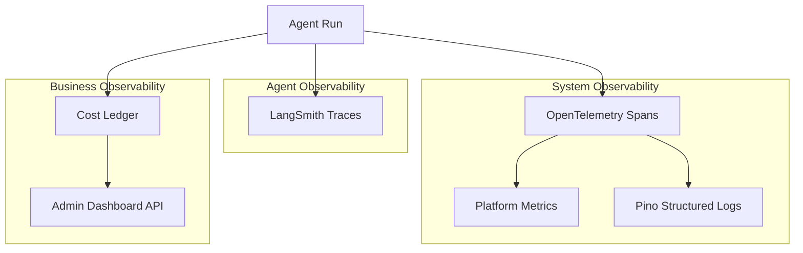
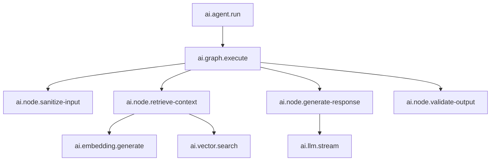
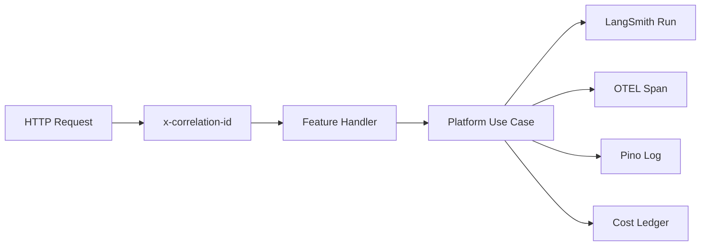

# AI Platform — Observability

> LangSmith tracing, OpenTelemetry spans, cost analytics, and logging.  
> **Last updated:** August 2026

---

## Table of Contents

1. [Overview](#overview)
2. [Observability Stack](#observability-stack)
3. [LangSmith Integration](#langsmith-integration)
4. [OpenTelemetry](#opentelemetry)
5. [Cost Ledger](#cost-ledger)
6. [Metrics](#metrics)
7. [Structured Logging](#structured-logging)
8. [Correlation and Tracing](#correlation-and-tracing)
9. [Cost Analytics Dashboard](#cost-analytics-dashboard)
10. [Alerting](#alerting)
11. [Migration from AI Tutor](#migration-from-ai-tutor)

---

## Overview

Production AI systems require deep observability to debug failures, control costs, and improve quality. The platform provides three layers of observability:



---

## Observability Stack

| Layer | Tool | Purpose | Data |
|-------|------|---------|------|
| **Agent traces** | LangSmith | Debug agent runs, compare prompts, inspect graph nodes | Runs, spans, inputs/outputs |
| **System traces** | OpenTelemetry | Vendor-neutral spans for all platform operations | Spans, attributes, events |
| **Metrics** | OTEL Metrics / Pino counters | Throughput, latency, error rates | Counters, histograms |
| **Logs** | Pino (existing) | Structured event logs with correlation IDs | JSON log lines |
| **Cost** | PostgreSQL (`ai_agent_runs`) | Token usage and estimated cost per run | Rows in platform tables |
| **Dashboard** | Custom admin API | Cost analytics, usage trends | Aggregated queries |

### What Goes Where

| Event | LangSmith | OTEL | Pino | Cost Ledger |
|-------|-----------|------|------|-------------|
| Agent run start/end | ✅ Run | ✅ Span | ✅ Info | ✅ Row |
| LLM call | ✅ Child span | ✅ Span | ✅ Debug | ✅ Tokens |
| RAG retrieval | ✅ Child span | ✅ Span | ✅ Debug | — |
| Tool invocation | ✅ Child span | ✅ Span | ✅ Info | — |
| Embedding generation | — | ✅ Span | ✅ Debug | ✅ Tokens |
| Rate limit hit | — | ✅ Event | ✅ Warn | — |
| Cost cap exceeded | — | ✅ Event | ✅ Warn | — |
| Indexing job | — | ✅ Span | ✅ Info | ✅ Tokens |
| Prompt resolution | — | ✅ Span | ✅ Debug | — |

---

## LangSmith Integration

### Configuration

```env
LANGCHAIN_TRACING_V2=true
LANGCHAIN_API_KEY=lsv2_...
LANGCHAIN_PROJECT=ithracode-ai-platform
LANGCHAIN_ENDPOINT=https://api.smith.langchain.com
```

### Tracer Setup

`observability/langsmith/langsmith-tracer.ts` configures LangSmith for LangGraph:

```typescript
// Automatic tracing via LangGraph + LangSmith integration
// LangGraph nodes automatically create child spans
// Agent runs appear as top-level runs in LangSmith
```

### What LangSmith Captures

| Data | Captured | PII Handling |
|------|----------|-------------|
| Agent input (user message) | ✅ | Redact if configured |
| Agent output (response) | ✅ | Redact if configured |
| System prompt | ✅ | Full (needed for debugging) |
| Retrieved chunks | ✅ | Content included |
| LLM tokens (input/output) | ✅ | — |
| Graph node transitions | ✅ | Node names and state diffs |
| Tool calls and results | ✅ | Input/output |
| Errors and stack traces | ✅ | Full |
| Latency per node | ✅ | — |

### Run Metadata

Every LangSmith run includes metadata for filtering:

```typescript
{
  agentId: 'tutor',
  userId: 'user-uuid',
  courseId: 'course-uuid',
  lectureId: 'lecture-uuid',
  promptVersion: '3',
  locale: 'ar',
  correlationId: 'req-uuid',
}
```

### Run Comparison

LangSmith enables comparing runs across prompt versions:

1. Filter runs by `promptVersion` metadata
2. Compare average latency, token usage, and output quality
3. Use with offline evaluation (Ragas scores) for prompt iteration

---

## OpenTelemetry

### Setup

`observability/opentelemetry/otel-setup.ts` initializes OTEL for the platform:

```typescript
// Exports spans to configured backend (stdout in dev, OTLP in production)
// Integrates with existing Pino logging via correlation IDs
```

### Configuration

```env
OTEL_SERVICE_NAME=ithracode-ai-platform
OTEL_EXPORTER_OTLP_ENDPOINT=https://otel-collector.example.com
OTEL_TRACES_SAMPLER=parentbased_traceidratio
OTEL_TRACES_SAMPLER_ARG=0.1  # 10% sampling in production
```

### Span Hierarchy



### Span Attributes

Standard attributes on all platform spans:

```typescript
{
  'ai.agent.id': 'tutor',
  'ai.user.id': 'user-uuid',
  'ai.course.id': 'course-uuid',
  'ai.correlation.id': 'req-uuid',
  'ai.model': 'gpt-4o-mini',
  'ai.provider': 'openai',
  'ai.tokens.input': 1500,
  'ai.tokens.output': 350,
  'ai.cost.usd': 0.0023,
}
```

### Span Helpers

`observability/opentelemetry/span-helpers.ts` provides utilities:

```typescript
async function withSpan<T>(
  name: string,
  attributes: Record<string, string | number>,
  fn: () => Promise<T>,
): Promise<T>;
```

Used by all platform modules to create consistent spans without boilerplate.

### Sampling Strategy

| Environment | Sampling Rate | Rationale |
|-------------|--------------|-----------|
| Development | 100% | Full visibility |
| Staging | 100% | Pre-production debugging |
| Production | 10% | Cost control; LangSmith captures all agent runs |

Agent runs are always traced in LangSmith (100%). OTEL sampling applies to system-level spans only.

---

## Cost Ledger

### Purpose

Track token usage and estimated cost for every AI operation. Enables per-user, per-product, and global cost monitoring.

### Tables

**`ai_agent_runs`** — per-run record:

| Column | Type | Purpose |
|--------|------|---------|
| `id` | UUID | Primary key |
| `agent_id` | TEXT | Agent identifier |
| `user_id` | UUID | User who triggered the run |
| `status` | TEXT | `running`, `completed`, `failed` |
| `input_tokens` | INT | Total input tokens |
| `output_tokens` | INT | Total output tokens |
| `embedding_tokens` | INT | Tokens used for embeddings |
| `estimated_cost_usd` | DECIMAL | Calculated cost |
| `model` | TEXT | Model used |
| `provider` | TEXT | Provider used |
| `prompt_version` | TEXT | Prompt version used |
| `latency_ms` | INT | Total run duration |
| `langsmith_run_id` | TEXT | Link to LangSmith trace |
| `correlation_id` | TEXT | Request correlation ID |
| `metadata` | JSONB | Additional context |
| `created_at` | TIMESTAMP | Run start time |
| `completed_at` | TIMESTAMP? | Run end time |

**`ai_usage_daily`** — aggregated daily totals:

| Column | Type | Purpose |
|--------|------|---------|
| `date` | DATE | Aggregation date |
| `user_id` | UUID? | User (null for global) |
| `agent_id` | TEXT? | Agent (null for all agents) |
| `total_runs` | INT | Number of runs |
| `total_input_tokens` | BIGINT | Sum of input tokens |
| `total_output_tokens` | BIGINT | Sum of output tokens |
| `total_cost_usd` | DECIMAL | Sum of estimated cost |

### Cost Calculation

`observability/cost/token-pricing.ts` maintains a pricing table:

```typescript
const TOKEN_PRICING: Record<string, { input: number; output: number }> = {
  'gpt-4o-mini':       { input: 0.15 / 1_000_000, output: 0.60 / 1_000_000 },
  'gpt-4o':            { input: 2.50 / 1_000_000, output: 10.0 / 1_000_000 },
  'text-embedding-3-small': { input: 0.02 / 1_000_000, output: 0 },
  'claude-3-5-sonnet': { input: 3.0 / 1_000_000, output: 15.0 / 1_000_000 },
};
```

Cost is calculated at run completion and stored in `ai_agent_runs.estimated_cost_usd`. Daily aggregation runs via a scheduled BullMQ job.

### Cost Cap Integration

Cost caps (migrated from `tutor-cost-cap.guard.ts`) query `ai_usage_daily`:

```typescript
async function checkCostCap(userId: string): Promise<void> {
  const todayUsage = await costLedger.getDailyUsage(userId);
  const cap = AIPlatformConfig.getDailyCostCap();
  if (cap > 0 && todayUsage.totalCostUsd >= cap) {
    throw new CostCapExceededError(userId, todayUsage.totalCostUsd, cap);
  }
}
```

Fail-closed: if the cost ledger is unreachable, deny the request.

---

## Metrics

`observability/metrics/platform-metrics.ts` exposes platform counters:

### Key Metrics

| Metric | Type | Labels |
|--------|------|--------|
| `ai_agent_runs_total` | Counter | `agent_id`, `status` |
| `ai_agent_run_duration_ms` | Histogram | `agent_id` |
| `ai_llm_tokens_total` | Counter | `model`, `direction` (input/output) |
| `ai_retrieval_chunks_total` | Counter | `agent_id` |
| `ai_retrieval_latency_ms` | Histogram | `agent_id` |
| `ai_embedding_cache_hits_total` | Counter | — |
| `ai_rate_limit_exceeded_total` | Counter | `user_id`, `limit_type` |
| `ai_cost_cap_exceeded_total` | Counter | — |
| `ai_indexing_jobs_total` | Counter | `job_type`, `status` |
| `ai_tool_invocations_total` | Counter | `tool_id`, `status` |

### Export

Phase 1: Structured Pino log lines with metric fields (queryable via log aggregator).
Phase 2: OTEL Metrics exporter to Prometheus/Grafana.

---

## Structured Logging

The platform extends the existing Pino logger (`src/lib/logger.ts`) with AI-specific log tags.

### Log Tags

| Tag | Level | When |
|-----|-------|------|
| `[AI_AGENT_RUN_START]` | info | Agent run begins |
| `[AI_AGENT_RUN_COMPLETE]` | info | Agent run succeeds |
| `[AI_AGENT_RUN_FAILED]` | error | Agent run fails |
| `[AI_LLM_CALL]` | debug | LLM request/response metadata |
| `[AI_RETRIEVAL]` | debug | RAG retrieval results count |
| `[AI_EMBEDDING]` | debug | Embedding generation (cache hit/miss) |
| `[AI_RATE_LIMIT]` | warn | Rate limit exceeded |
| `[AI_COST_CAP]` | warn | Cost cap exceeded |
| `[AI_INDEXING_START]` | info | Indexing job begins |
| `[AI_INDEXING_COMPLETE]` | info | Indexing job succeeds |
| `[AI_TOOL_CALL]` | info | Tool invocation |
| `[AI_PROMPT_RESOLVED]` | debug | Prompt resolved from Langfuse/local |

### Log Structure

```json
{
  "level": "info",
  "tag": "AI_AGENT_RUN_COMPLETE",
  "agentId": "tutor",
  "userId": "user-uuid",
  "runId": "run-uuid",
  "correlationId": "req-uuid",
  "inputTokens": 1500,
  "outputTokens": 350,
  "estimatedCostUsd": 0.0023,
  "latencyMs": 2340,
  "model": "gpt-4o-mini",
  "promptVersion": "3"
}
```

---

## Correlation and Tracing

`observability/tracing/correlation-context.ts` propagates correlation IDs across platform operations.

### Correlation ID Flow



Extends existing `src/lib/observability/correlation-id.ts` and payment trace context pattern (`AsyncLocalStorage`).

### Context Propagation

```typescript
interface AITraceContext {
  correlationId: string;
  userId: string;
  agentId: string;
  runId: string;
  langsmithRunId?: string;
}
```

Set at agent run start, available via `getAITraceContext()` throughout the call chain.

---

## Cost Analytics Dashboard

The platform provides a **data layer** for an admin cost analytics UI. UI components live in the admin feature; the platform exposes query functions.

### Data API

`observability/dashboard/cost-analytics.service.ts`:

```typescript
interface CostAnalyticsService {
  getDailySummary(date: Date): Promise<DailyCostSummary>;
  getUserCosts(userId: string, range: DateRange): Promise<UserCostBreakdown>;
  getAgentCosts(agentId: string, range: DateRange): Promise<AgentCostBreakdown>;
  getTopUsers(range: DateRange, limit: number): Promise<UserCostEntry[]>;
  getCostTrend(range: DateRange, granularity: 'hour' | 'day'): Promise<CostTrendPoint[]>;
}
```

### Dashboard Views (Admin Feature)

| View | Data Source | Purpose |
|------|-----------|---------|
| **Daily spend** | `ai_usage_daily` | Total platform cost today |
| **Per-agent breakdown** | `ai_usage_daily` grouped by `agent_id` | Which products cost most |
| **Per-user top spenders** | `ai_agent_runs` aggregated | Identify heavy users |
| **Cost trend** | `ai_usage_daily` time series | Spending over time |
| **Token efficiency** | `ai_agent_runs` avg tokens/run | Optimization opportunities |

### Access Control

Dashboard data API is called from admin routes only. The platform does not enforce admin auth — the admin feature verifies role before calling `getCostSummary()`.

---

## Alerting

### Recommended Alerts (Phase 2+)

| Alert | Condition | Severity |
|-------|-----------|----------|
| Daily cost spike | `total_cost_usd` > 2x 7-day average | Warning |
| Daily cost cap approaching | `total_cost_usd` > 80% of cap | Warning |
| Agent error rate | `failed` runs > 10% in 1 hour | Critical |
| LLM provider down | Provider errors > 5 in 5 minutes | Critical |
| Indexing backlog | Queue depth > 100 jobs for > 30 min | Warning |
| Embedding cache miss rate | Cache hit rate < 50% | Info |

Alerts are configured in the observability backend (Grafana, Datadog, or Pino-based log alerts). The platform emits the metrics; alert rules are infrastructure configuration.

---

## Migration from AI Tutor

| AI Tutor Module | Platform Module |
|----------------|----------------|
| `infrastructure/observability/tutor-request-logger.ts` | `observability/` (generalized) |
| `infrastructure/guards/tutor-cost-cap.guard.ts` | `infrastructure/guards/cost-cap.guard.ts` |
| `infrastructure/guards/tutor-request.guards.ts` | `infrastructure/guards/rate-limit.guard.ts` |
| `api/health/tutor/route.ts` | Platform health check (aggregated) |

The tutor health endpoint (`/api/health/tutor`) remains but delegates to platform infrastructure validation.

---

## Related Documentation

- [08-prompts.md](./08-prompts.md) — Langfuse (prompts) vs LangSmith (traces)
- [11-workers.md](./11-workers.md) — Worker heartbeat and logging
- [13-security.md](./13-security.md) — PII in traces and logs
- [14-roadmap.md](./14-roadmap.md) — Observability rollout phases
- [15-adrs.md](./15-adrs.md) — ADR-003 (hybrid observability)
- [Payment Observability](../payment/16-observability.md) — Reference pattern
