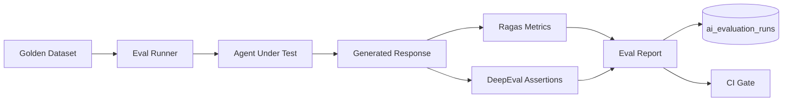
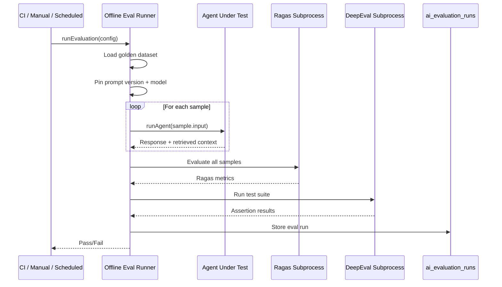

# AI Platform — Evaluation

> Offline evaluation with Ragas and DeepEval for quality assurance and regression testing.  
> **Last updated:** August 2026

---

## Table of Contents

1. [Overview](#overview)
2. [Evaluation Strategy](#evaluation-strategy)
3. [Ragas Integration](#ragas-integration)
4. [DeepEval Integration](#deepeval-integration)
5. [Golden Datasets](#golden-datasets)
6. [Evaluation Runner](#evaluation-runner)
7. [CI Regression Gates](#ci-regression-gates)
8. [Evaluation Worker](#evaluation-worker)
9. [Reporting](#reporting)
10. [Phase Rollout](#phase-rollout)

---

## Overview

AI quality cannot be verified by unit tests alone. The platform provides an offline evaluation pipeline that measures RAG quality, answer faithfulness, and LLM output correctness against golden datasets.



### Design Principles

1. **Offline only** — Evaluation runs in CI and scheduled jobs, never in production request path.
2. **Pinned versions** — Prompt versions and model configs are pinned for reproducible comparison.
3. **Regression gates** — CI fails if metrics drop below thresholds.
4. **Python subprocess** — Ragas and DeepEval run as CLI subprocesses (not embedded in Node.js).
5. **Per-product datasets** — Each AI product maintains its own golden dataset.

---

## Evaluation Strategy

### Testing Pyramid for AI

```
                    ┌─────────────┐
                    │  Offline    │  Ragas + DeepEval (this doc)
                    │  Evaluation │
                    ├─────────────┤
                    │ Integration │  Agent graph end-to-end with mock providers
                    │   Tests     │
                    ├─────────────┤
                    │    Unit     │  Node logic, retrieval filters, prompt resolver
                    │    Tests    │
                    └─────────────┘
```

| Level | Tool | What It Tests | When |
|-------|------|--------------|------|
| **Unit** | Vitest (existing) | Individual nodes, filters, resolvers | Every PR |
| **Integration** | Vitest + mock ports | Agent graph with mocked LLM | Every PR |
| **Offline eval** | Ragas + DeepEval | End-to-end quality against golden data | Nightly + pre-release |
| **Production monitoring** | LangSmith + cost ledger | Live quality drift detection | Continuous |

---

## Ragas Integration

Ragas measures RAG pipeline quality with LLM-based metrics.

### Metrics

| Metric | What It Measures | Threshold |
|--------|-----------------|-----------|
| **Faithfulness** | Is the answer grounded in retrieved context? | ≥ 0.85 |
| **Answer Relevancy** | Does the answer address the question? | ≥ 0.80 |
| **Context Precision** | Are retrieved chunks relevant to the question? | ≥ 0.75 |
| **Context Recall** | Did retrieval find all relevant chunks? | ≥ 0.70 |

### Runner

`evaluation/ragas/ragas-runner.ts` invokes Ragas as a subprocess:

```typescript
interface RagasRunner {
  evaluate(dataset: EvalDataset, agentConfig: EvalAgentConfig): Promise<RagasResult>;
}

interface RagasResult {
  metrics: {
    faithfulness: number;
    answerRelevancy: number;
    contextPrecision: number;
    contextRecall: number;
  };
  perSample: RagasSampleResult[];
  durationMs: number;
}
```

### Execution Model

Ragas is Python-first. The platform runs it as a CLI subprocess:

```bash
# Invoked by evaluation worker
python -m ragas.evaluate \
  --dataset /tmp/eval-dataset.json \
  --output /tmp/eval-results.json \
  --metrics faithfulness,answer_relevancy,context_precision,context_recall
```

The Node.js runner:
1. Serializes the golden dataset to JSON
2. Spawns the Python subprocess
3. Parses results from stdout/file
4. Stores in `ai_evaluation_runs`

### Why Subprocess (Not Embedded)

- Ragas is Python-only with heavy ML dependencies
- Embedding Python in Node.js (via `python-shell`) adds complexity and deployment issues
- Subprocess isolation prevents dependency conflicts
- BullMQ worker process can have Python installed alongside Node.js

---

## DeepEval Integration

DeepEval provides assertion-based LLM output testing.

### Test Types

| Test Type | Example | Use Case |
|-----------|---------|----------|
| **Answer relevancy** | Answer must mention "recursion" when asked about recursion | Tutor accuracy |
| **Faithfulness** | Answer must not contradict retrieved context | RAG grounding |
| **Toxicity** | Answer must not contain harmful content | Safety |
| **Hallucination** | Answer must not invent course content | Educational integrity |
| **Custom G-Eval** | "Answer explains concept at appropriate depth for beginner" | Tutor quality |
| **JSON schema** | Evaluator output matches rubric schema | Structured output agents |

### Runner

`evaluation/deepeval/deepeval-runner.ts`:

```typescript
interface DeepEvalRunner {
  runTestSuite(suite: DeepEvalTestSuite, agentConfig: EvalAgentConfig): Promise<DeepEvalResult>;
}

interface DeepEvalTestSuite {
  name: string;
  testCases: DeepEvalTestCase[];
}

interface DeepEvalTestCase {
  input: string;
  expectedOutput?: string;
  context?: string[];
  assertions: DeepEvalAssertion[];
}

interface DeepEvalAssertion {
  type: 'answer_relevancy' | 'faithfulness' | 'toxicity' | 'hallucination' | 'g_eval' | 'json_schema';
  threshold: number;
  params?: Record<string, unknown>;
}
```

### Execution Model

Same subprocess pattern as Ragas:

```bash
python -m deepeval run \
  --test-file /tmp/deepeval-tests.json \
  --output /tmp/deepeval-results.json
```

---

## Golden Datasets

Stored in `evaluation/datasets/` as version-controlled JSON files.

### Tutor Golden Dataset

`evaluation/datasets/tutor-golden.json`:

```json
{
  "name": "tutor-golden-v1",
  "agentId": "tutor",
  "samples": [
    {
      "id": "tutor-001",
      "input": "ما هو React؟",
      "locale": "ar",
      "scope": { "courseId": "test-course-react", "lectureId": "lecture-intro" },
      "expectedTopics": ["JavaScript library", "UI components", "virtual DOM"],
      "retrievedContext": ["React is a JavaScript library for building user interfaces..."],
      "mustNotContain": ["assessment answer", "quiz solution"]
    }
  ]
}
```

### Dataset Guidelines

| Guideline | Rationale |
|-----------|-----------|
| Minimum 20 samples per product | Statistical significance for metrics |
| Cover Arabic and English | Bilingual platform requirement |
| Include edge cases | Greetings, off-topic, assessment attempts |
| Pin course/lecture IDs | Use test fixtures with known indexed content |
| Version datasets | `tutor-golden-v1`, `tutor-golden-v2` for comparison |
| No PII | Use synthetic user IDs and test data |

### Dataset Maintenance

- Add samples when bugs are found in production (regression prevention)
- Review quarterly for stale content
- Sync test course content via indexing pipeline before eval runs

---

## Evaluation Runner

`evaluation/runners/offline-eval.runner.ts` orchestrates the full evaluation flow.

### Flow



### Configuration

```typescript
interface EvalConfig {
  datasetPath: string;
  agentId: string;
  promptVersion?: string;     // Pin or use 'production'
  modelOverride?: string;    // Pin or use agent default
  metrics: ('ragas' | 'deepeval')[];
  thresholds: EvalThresholds;
  parallelSamples: number;   // Default: 3 (rate limit aware)
}
```

---

## CI Regression Gates

### Nightly Evaluation

A scheduled BullMQ job (or GitHub Actions cron) runs evaluation nightly:

```yaml
# .github/workflows/ai-eval.yml (future)
schedule:
  - cron: '0 2 * * *'  # 2 AM UTC daily
```

### PR Gate (Pre-Release)

Before merging prompt or agent changes:

1. Run evaluation against the changed agent
2. Compare metrics to baseline (last passing run)
3. Fail if any metric drops below threshold

### Threshold Configuration

```typescript
const EVAL_THRESHOLDS = {
  tutor: {
    faithfulness: 0.85,
    answerRelevancy: 0.80,
    contextPrecision: 0.75,
    deepevalPassRate: 0.90,  // 90% of assertions pass
  },
  evaluator: {
    jsonSchemaCompliance: 0.95,
    deepevalPassRate: 0.95,
  },
};
```

### Baseline Comparison

```typescript
interface EvalComparison {
  current: EvalRunResult;
  baseline: EvalRunResult;
  deltas: {
    faithfulness: number;    // e.g., -0.02 (regression)
    answerRelevancy: number; // e.g., +0.01 (improvement)
  };
  passed: boolean;
}
```

A regression is flagged when any metric drops by more than 0.05 from baseline.

---

## Evaluation Worker

### Queue: `ai-evaluation`

| Property | Value |
|----------|-------|
| Queue name | `ai-evaluation` |
| Worker file | `src/server/workers/ai-evaluation.worker.ts` |
| Handler | `evaluation/runners/offline-eval.handler.ts` |
| Concurrency | 1 (eval runs are resource-intensive) |
| Timeout | 30 minutes per job |
| Retries | 1 (eval failures are usually deterministic) |

### Job Types

| Job | Trigger | Payload |
|-----|---------|---------|
| `run-eval` | CI, manual, scheduled | `{ datasetPath, agentId, config }` |
| `compare-runs` | After eval completion | `{ currentRunId, baselineRunId }` |

### Python Environment

The evaluation worker requires Python 3.10+ with Ragas and DeepEval installed:

```bash
# Worker environment setup
pip install ragas deepeval
```

In production, the worker Docker image includes both Node.js and Python runtimes.

---

## Reporting

### Storage: `ai_evaluation_runs`

| Column | Type | Purpose |
|--------|------|---------|
| `id` | UUID | Primary key |
| `agent_id` | TEXT | Agent evaluated |
| `dataset_name` | TEXT | Dataset version |
| `prompt_version` | TEXT | Prompt version used |
| `model` | TEXT | Model used |
| `ragas_scores` | JSONB | Ragas metric results |
| `deepeval_results` | JSONB | DeepEval assertion results |
| `overall_passed` | BOOLEAN | All thresholds met |
| `sample_count` | INT | Number of samples evaluated |
| `duration_ms` | INT | Total evaluation time |
| `baseline_run_id` | UUID? | Comparison baseline |
| `created_at` | TIMESTAMP | Run timestamp |

### Report Service

`evaluation/reports/eval-report.service.ts`:

```typescript
interface EvalReportService {
  getLatestRun(agentId: string): Promise<EvalRunResult>;
  compareRuns(runId: string, baselineId: string): Promise<EvalComparison>;
  getTrend(agentId: string, metric: string, limit: number): Promise<MetricTrendPoint[]>;
  generateReport(runId: string): Promise<EvalReport>;  // Markdown summary
}
```

### LangSmith Integration

Evaluation runs create LangSmith experiment runs for side-by-side comparison with production traces. Each eval sample appears as a LangSmith run with `metadata.evalRunId`.

---

## Phase Rollout

| Phase | Evaluation Capability |
|-------|----------------------|
| **Phase 1** | Unit tests for migrated RAG/embedding modules (Vitest) |
| **Phase 2** | Ragas integration, tutor golden dataset, nightly eval job |
| **Phase 3** | DeepEval assertions, CI regression gates, evaluator dataset |
| **Future** | Production drift detection (compare live traces to golden baselines) |

---

## Related Documentation

- [04-agents.md](./04-agents.md) — Agent under test
- [05-rag.md](./05-rag.md) — RAG metrics (faithfulness, context precision)
- [08-prompts.md](./08-prompts.md) — Prompt version pinning for eval
- [09-observability.md](./09-observability.md) — LangSmith experiment comparison
- [11-workers.md](./11-workers.md) — Evaluation worker queue
- [AI Tutor Testing Strategy](../ai-tutor/05-testing-strategy.md) — Pre-platform testing approach
