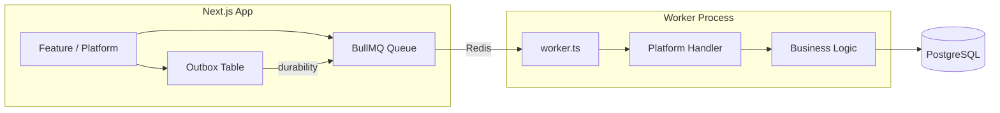
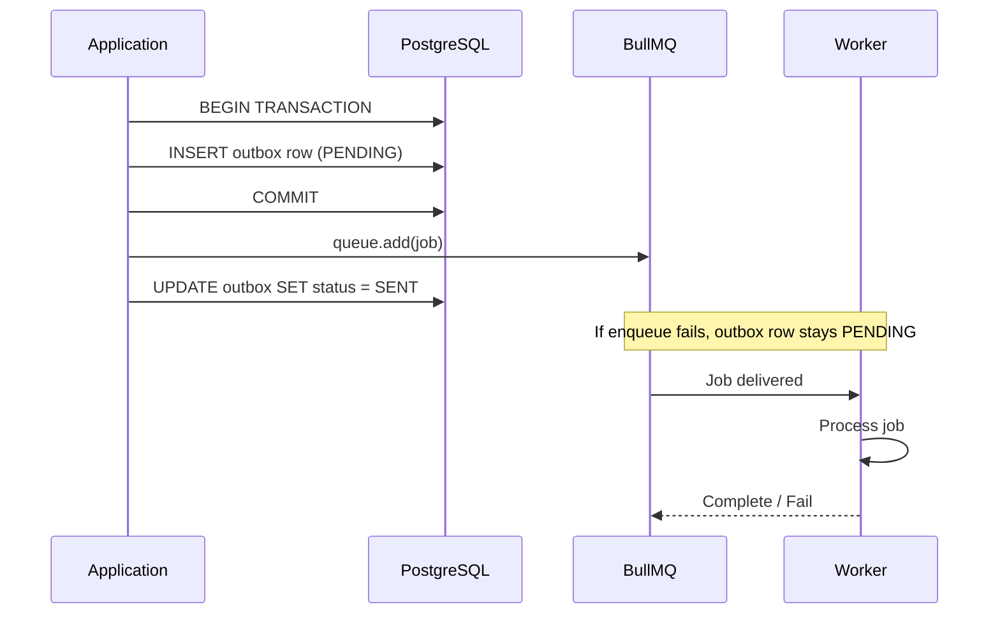
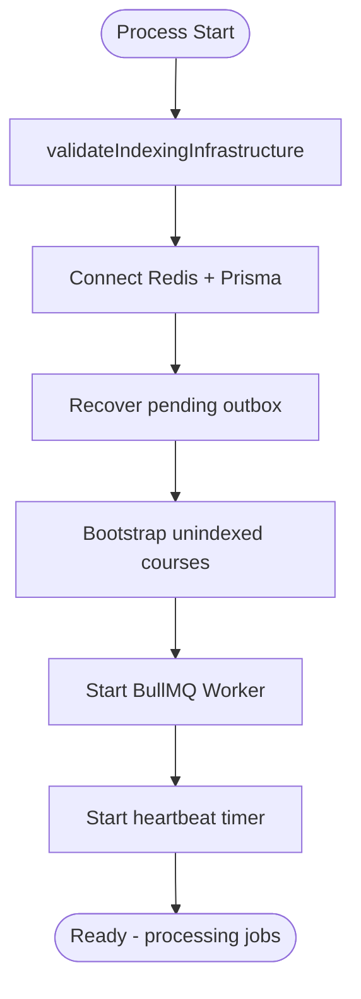

# AI Platform — Workers

> BullMQ architecture, queue design, and worker lifecycle.  
> **Last updated:** August 2026

---

## Table of Contents

1. [Overview](#overview)
2. [Architecture Pattern](#architecture-pattern)
3. [Queue Catalog](#queue-catalog)
4. [Outbox Pattern](#outbox-pattern)
5. [Job Design](#job-design)
6. [Worker Lifecycle](#worker-lifecycle)
7. [Error Handling and Retries](#error-handling-and-retries)
8. [Monitoring and Health](#monitoring-and-health)
9. [Migration from AI Tutor](#migration-from-ai-tutor)

---

## Overview

Background jobs handle operations too slow or too heavy for synchronous request processing: content indexing, offline evaluation, and daily cost aggregation. The platform defines job handlers; worker processes in `src/server/workers/` are thin shells that import and invoke them.



### Design Principles

1. **Thin workers, fat platform** — Worker files only handle process lifecycle; business logic lives in `ai-platform/`.
2. **Outbox durability** — Jobs are persisted to PostgreSQL before enqueueing to BullMQ.
3. **Idempotent handlers** — Jobs can be safely retried without side effects.
4. **Stable job IDs** — Deduplication prevents duplicate indexing jobs.
5. **Graceful shutdown** — Workers drain in-flight jobs before exiting.

---

## Architecture Pattern

### Separation of Concerns

| Component | Location | Responsibility |
|-----------|----------|---------------|
| **Queue definition** | `ai-platform/infrastructure/queue/` | BullMQ `Queue` instance, connection config |
| **Publisher** | `ai-platform/indexing/pipelines/enqueue.ts` | Create outbox row + enqueue job |
| **Handler** | `ai-platform/indexing/workers/` | Business logic for job processing |
| **Worker process** | `src/server/workers/` | Process lifecycle, signal handling, heartbeat |
| **Outbox** | `ai-platform/indexing/outbox/` | Durability before enqueue |

### Why Workers Are Outside the Platform Module

Workers are **separate Node.js processes** (not part of the Next.js server). They live in `src/server/workers/` because:

- They are deployment units (started via `pnpm worker:*` scripts)
- They need independent scaling (more indexing workers without scaling the web server)
- They share the pattern with payment workers (`order-completed.worker.ts`, `reconcile-payments.consumer.worker.ts`)

The platform exports handler functions; workers import them.

---

## Queue Catalog

### Active Queues

| Queue | Worker Script | Handler | Concurrency | Priority |
|-------|--------------|---------|-------------|----------|
| `course-indexing` | `worker:course-indexing` | `indexing/workers/course-indexing.handler.ts` | 2 (configurable) | Normal |
| `ai-evaluation` | `worker:ai-evaluation` (Phase 2) | `evaluation/runners/offline-eval.handler.ts` | 1 | Low |
| `ai-cost-aggregation` | `worker:ai-cost-aggregation` (Phase 2) | `observability/cost/aggregation.handler.ts` | 1 | Low |

### Future Queues

| Queue | Purpose | Phase |
|-------|---------|-------|
| `ai-indexing` | Generic non-course content indexing | Phase 3 |
| `ai-memory-summarize` | Background conversation summarization | Phase 3 |

### Queue Naming Convention

```
{domain}-{action}

Examples:
  course-indexing       # Index course content
  ai-evaluation         # Run offline evaluation
  ai-cost-aggregation   # Daily cost rollup
```

AI platform queues are prefixed with `ai-`. Product-specific queues (like `course-indexing`) retain their existing names for backward compatibility.

### Queue Configuration

```typescript
const DEFAULT_QUEUE_OPTIONS: QueueOptions = {
  connection: redis,  // Shared from src/lib/redis.ts
  defaultJobOptions: {
    attempts: 5,
    backoff: {
      type: 'exponential',
      delay: 60_000,  // 60s initial delay
    },
    removeOnComplete: { count: 1000 },
    removeOnFail: { count: 5000 },
  },
};
```

---

## Outbox Pattern

Jobs that must not be lost (indexing, evaluation) use the transactional outbox pattern.

### Flow



### Outbox Table: `ai_indexing_outbox`

Generalizes the existing `course_indexing_outbox` table:

| Column | Type | Purpose |
|--------|------|---------|
| `id` | UUID | Primary key |
| `job_type` | TEXT | `index-course`, `index-lecture`, `run-eval` |
| `payload` | JSONB | Job data |
| `status` | ENUM | `PENDING`, `SENT`, `FAILED` |
| `job_id` | TEXT | BullMQ job ID (stable, for dedup) |
| `attempts` | INT | Enqueue attempts |
| `last_error` | TEXT? | Last enqueue error |
| `created_at` | TIMESTAMP | Creation time |
| `sent_at` | TIMESTAMP? | Successfully enqueued |

### Outbox Recovery

A background sweeper (runs on worker startup) re-enqueues `PENDING` outbox rows older than 5 minutes:

```typescript
async function recoverPendingOutbox(): Promise<void> {
  const pending = await outboxRepo.findPending({ olderThan: 5 * 60 * 1000 });
  for (const row of pending) {
    await enqueueFromOutbox(row);
  }
}
```

### Stable Job IDs

Job IDs are deterministic for deduplication:

```typescript
// course-indexing
jobId = `index-course:${courseId}`
jobId = `index-lecture:${lectureId}`

// ai-evaluation
jobId = `eval:${agentId}:${datasetVersion}:${timestamp}`
```

BullMQ rejects duplicate job IDs, preventing double-indexing when a publish trigger fires twice.

---

## Job Design

### Job Payload Schema

All jobs use Zod-validated payloads:

```typescript
// Index course job
const IndexCourseJobSchema = z.object({
  courseId: z.string().uuid(),
  trigger: z.enum(['publish', 'manual', 'bootstrap']),
  requestedBy: z.string().uuid().optional(),
});

// Index lecture job
const IndexLectureJobSchema = z.object({
  courseId: z.string().uuid(),
  lectureId: z.string().uuid(),
  trigger: z.enum(['update', 'manual']),
});

// Evaluation job
const EvalJobSchema = z.object({
  agentId: z.string(),
  datasetPath: z.string(),
  promptVersion: z.string().optional(),
  config: z.record(z.unknown()).optional(),
});
```

### Job Types

| Job Name | Queue | Handler | Idempotent |
|----------|-------|---------|-----------|
| `index-course` | `course-indexing` | `handleCourseIndexing` | ✅ (hash-based skip) |
| `index-lecture` | `course-indexing` | `handleLectureIndexing` | ✅ (hash-based skip) |
| `run-eval` | `ai-evaluation` | `handleOfflineEval` | ✅ (pinned versions) |
| `aggregate-costs` | `ai-cost-aggregation` | `handleCostAggregation` | ✅ (upsert daily) |

---

## Worker Lifecycle

### Startup Sequence



Migrated from `course-indexing.worker.ts` startup pattern:

1. `validateIndexingInfrastructure()` — check pgvector, Redis, provider keys (indexing worker). Next.js web process calls `validatePlatformInfrastructure()` when `AI_PLATFORM_ENABLED=true`.
2. Connect to Redis and Prisma
3. Recover pending outbox rows
4. Bootstrap unindexed courses (with distributed lock)
5. Start BullMQ worker with configured concurrency
6. Start heartbeat timer (Redis key, 30s interval)

### Graceful Shutdown

```typescript
async function shutdown(signal: string): Promise<void> {
  logger.info({ signal }, 'Worker shutting down');

  // Stop accepting new jobs
  await worker.close();

  // Wait for in-flight jobs (max 30s)
  await drainWithTimeout(30_000);

  // Disconnect
  await prisma.$disconnect();
  redis.disconnect();

  process.exit(0);
}

process.on('SIGINT', () => shutdown('SIGINT'));
process.on('SIGTERM', () => shutdown('SIGTERM'));
```

### Heartbeat

Workers write a heartbeat to Redis every 30 seconds:

```
Key: ai:worker:{queueName}:heartbeat
TTL: 120 seconds
Value: { workerId, startedAt, jobsProcessed, lastJobAt }
```

Health checks verify heartbeat freshness to detect stuck or dead workers.

### Bootstrap Lock

Only one worker instance runs bootstrap (backfill unindexed courses):

```
Key: course-indexing:bootstrap:lock
TTL: 300 seconds
```

Prevents duplicate bootstrap when multiple worker instances start simultaneously.

---

## Error Handling and Retries

### Retry Strategy

| Error Type | Retryable | Action |
|-----------|-----------|--------|
| Transient LLM error (rate limit, timeout) | ✅ | Exponential backoff (60s base) |
| Transient DB error (connection) | ✅ | Exponential backoff |
| Invalid job payload | ❌ | `UnrecoverableError` — move to failed |
| Content extraction failure (corrupt PDF) | ❌ | Log warning, skip source, continue |
| Embedding dimension mismatch | ❌ | `UnrecoverableError` — config issue |
| Indexing infrastructure missing (no pgvector) | ❌ | `UnrecoverableError` — startup should catch |

### Non-Retryable Errors

```typescript
class IndexingError extends Error {
  constructor(
    public code: string,
    message: string,
    public retryable: boolean = false,
  ) {
    super(message);
  }
}

// In worker handler
if (error instanceof IndexingError && !error.retryable) {
  throw new UnrecoverableError(error.message);
}
```

### Dead Letter Behavior

After 5 failed attempts, jobs remain in the failed set (not auto-deleted). Admin can inspect and retry via BullMQ dashboard or CLI.

---

## Monitoring and Health

### Worker Health Endpoint

Extends existing `/api/health/tutor` pattern:

```
GET /api/health/ai-platform
Authorization: Bearer {INTERNAL_HEALTH_TOKEN}

Response:
{
  "status": "healthy",
  "workers": {
    "course-indexing": { "heartbeat": "2026-08-03T15:30:00Z", "alive": true },
    "ai-evaluation": { "heartbeat": null, "alive": false }
  },
  "queues": {
    "course-indexing": { "waiting": 0, "active": 1, "failed": 0 },
    "ai-evaluation": { "waiting": 0, "active": 0, "failed": 0 }
  },
  "infrastructure": {
    "pgvector": true,
    "redis": true,
    "openai": true
  }
}
```

### Queue Metrics

Exposed via `observability/metrics/platform-metrics.ts`:

- `ai_indexing_jobs_total` (counter by job_type, status)
- `ai_indexing_job_duration_ms` (histogram)
- `ai_indexing_queue_depth` (gauge)

### npm Scripts

```json
{
  "worker:course-indexing": "tsx src/server/workers/course-indexing.worker.ts",
  "worker:ai-evaluation": "tsx src/server/workers/ai-evaluation.worker.ts",
  "worker:ai-cost-aggregation": "tsx src/server/workers/ai-cost-aggregation.worker.ts"
}
```

---

## Migration from AI Tutor

| AI Tutor Module | Platform Module |
|----------------|----------------|
| `infrastructure/queue/course-indexing-queue.ts` | `infrastructure/queue/queue-factory.ts` |
| `infrastructure/queue/course-indexing.publisher.ts` | `indexing/pipelines/enqueue.ts` |
| `infrastructure/queue/course-indexing-outbox.service.ts` | `indexing/outbox/indexing-outbox.service.ts` |
| `infrastructure/queue/course-indexing-bootstrap.ts` | `indexing/pipelines/bootstrap.ts` |
| `infrastructure/queue/course-indexing.constants.ts` | `shared/constants.ts` |
| `infrastructure/startup/validate-indexing-infrastructure.ts` | `infrastructure/startup/validate-platform-infrastructure.ts` |
| `server/workers/course-indexing.worker.ts` | Stays in `server/workers/`; imports platform handler |

### Backward Compatibility

- Queue name `course-indexing` unchanged
- Job names `index-course`, `index-lecture` unchanged
- `CourseKnowledgeIndexerPort` implementation moves to platform; courses feature unchanged
- Existing `course_indexing_outbox` table retained; new jobs also write to `ai_indexing_outbox`

---

## Related Documentation

- [05-rag.md](./05-rag.md) — Indexing pipeline executed by workers
- [09-observability.md](./09-observability.md) — Worker metrics and health
- [10-evaluation.md](./10-evaluation.md) — Evaluation worker
- [AI Tutor Production Operations](../ai-tutor/08-production-operations.md) — Current worker operations
- [15-adrs.md](./15-adrs.md) — ADR-006 (BullMQ + outbox), ADR-011 (worker placement)
