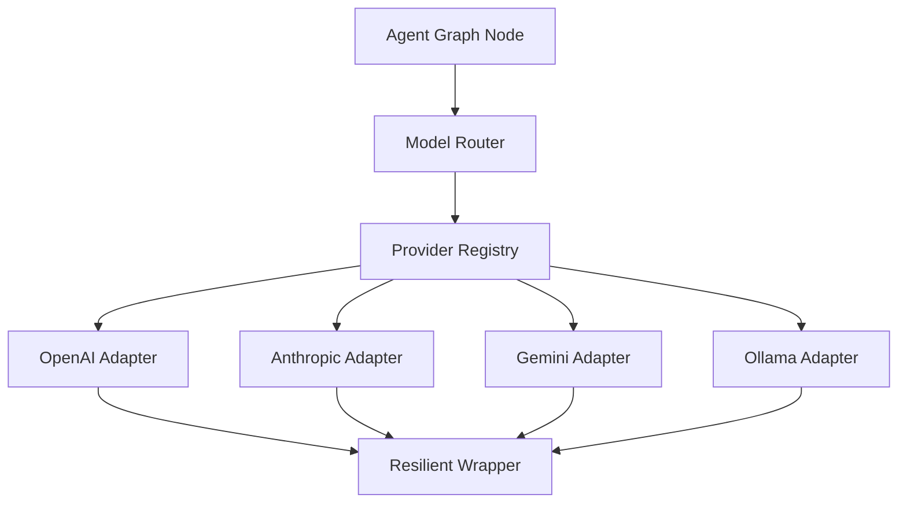
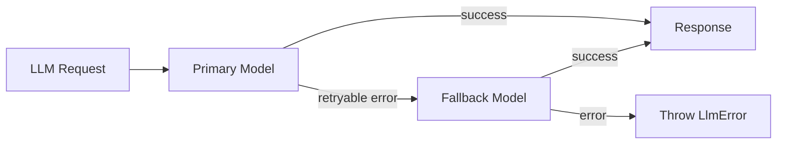

# AI Platform — Providers

> LLM and embedding provider abstraction with multi-vendor support.  
> **Last updated:** August 2026

---

## Table of Contents

1. [Overview](#overview)
2. [Port Interfaces](#port-interfaces)
3. [Provider Registry](#provider-registry)
4. [OpenAI](#openai)
5. [Anthropic](#anthropic)
6. [Google Gemini](#google-gemini)
7. [Ollama](#ollama)
8. [Resilient Wrapper](#resilient-wrapper)
9. [Model Router](#model-router)
10. [Fallback Chains](#fallback-chains)
11. [Configuration](#configuration)
12. [Migration from AI Tutor](#migration-from-ai-tutor)

---

## Overview

The platform abstracts LLM and embedding providers behind port interfaces. Product features and agent graphs never import provider SDKs directly — they use `LlmPort` and `EmbeddingPort` resolved by the DI container.



### Design Principles

1. **Port/adapter pattern** — Inherited from AI Tutor ADR-001; proven in production.
2. **Provider-agnostic graphs** — Agent nodes call `LlmPort`, not OpenAI SDK.
3. **Runtime routing** — Model selection via `router/`, not hardcoded in features.
4. **Resilience by default** — All providers wrapped with retry logic.
5. **OpenRouter compatible** — OpenAI adapter supports custom base URL.

---

## Port Interfaces

### LlmPort

Migrated from `src/features/ai-tutor/domain/ports/LlmPort.ts`:

```typescript
interface LlmPort {
  streamAnswer(options: LlmStreamOptions): AsyncIterableIterator<string>;
  complete?(options: LlmCompleteOptions): Promise<string>;
}

interface LlmStreamOptions {
  messages: LlmMessage[];
  systemPrompt: string;
  temperature?: number;
  maxTokens?: number;
  model?: string;  // Override default model
}

interface LlmMessage {
  role: 'user' | 'assistant' | 'system';
  content: string;
}

class LlmError extends Error {
  constructor(
    public code: string,
    message: string,
    public retryable: boolean = false,
  ) { super(message); }
}

const LlmErrorCodes = {
  RATE_LIMITED: 'RATE_LIMITED',
  TIMEOUT: 'TIMEOUT',
  INVALID_REQUEST: 'INVALID_REQUEST',
  AUTHENTICATION_FAILED: 'AUTHENTICATION_FAILED',
  SERVICE_UNAVAILABLE: 'SERVICE_UNAVAILABLE',
  UNKNOWN: 'UNKNOWN',
} as const;
```

### EmbeddingPort

```typescript
interface EmbeddingPort {
  embed(texts: string[]): Promise<number[][]>;
  embedSingle(text: string): Promise<number[]>;
  getDimensions(): number;
}

class EmbeddingError extends Error {
  constructor(
    public code: string,
    message: string,
    public retryable: boolean = false,
  ) { super(message); }
}
```

### Location

Port interfaces are defined in `domain/ports/` and re-exported from `providers/ports/` for provider implementations.

---

## Provider Registry

`providers/registry/provider-registry.ts` resolves the correct adapter by model ID.

```typescript
interface ProviderRegistry {
  registerLlm(provider: string, adapter: LlmPort, models: string[]): void;
  registerEmbedding(provider: string, adapter: EmbeddingPort, models: string[]): void;
  getLlm(model: string): LlmPort;
  getEmbedding(model: string): EmbeddingPort;
  getProviderForModel(model: string): string;
  listModels(): ModelInfo[];
}

interface ModelInfo {
  id: string;
  provider: string;
  type: 'llm' | 'embedding';
  maxTokens: number;
  supportsStreaming: boolean;
  costPerInputToken: number;
  costPerOutputToken: number;
}
```

### Model-to-Provider Mapping

| Model ID | Provider | Type |
|----------|----------|------|
| `gpt-4o-mini` | openai | LLM |
| `gpt-4o` | openai | LLM |
| `text-embedding-3-small` | openai | Embedding |
| `claude-3-5-sonnet-20241022` | anthropic | LLM |
| `claude-3-5-haiku-20241022` | anthropic | LLM |
| `gemini-2.0-flash` | gemini | LLM |
| `llama3.2` | ollama | LLM |

Registry is populated at startup in `ai-platform.container.ts`.

---

## OpenAI

Primary provider. Migrated from `OpenAILlmAdapter` and `OpenAIEmbeddingAdapter`.

### Adapter Location

- `providers/openai/openai-llm.adapter.ts`
- `providers/openai/openai-embedding.adapter.ts`

### Configuration

```env
OPENAI_API_KEY=sk-...
OPENAI_BASE_URL=https://api.openai.com/v1  # Optional: OpenRouter, Azure, etc.
AI_PLATFORM_LLM_MODEL=gpt-4o-mini
AI_PLATFORM_EMBEDDING_MODEL=text-embedding-3-small
```

### OpenRouter Compatibility

Setting `OPENAI_BASE_URL` to an OpenRouter endpoint enables access to multiple models through a single API key:

```env
OPENAI_BASE_URL=https://openrouter.ai/api/v1
OPENAI_API_KEY=sk-or-...
AI_PLATFORM_LLM_MODEL=anthropic/claude-3.5-sonnet
```

The OpenAI adapter passes the base URL to the SDK; no code changes required.

### Streaming

Uses OpenAI SDK `chat.completions.create({ stream: true })`. Tokens are yielded as they arrive for SSE forwarding to the client.

### Embedding

Uses `embeddings.create({ model, input })`. Batch embedding supported natively.

---

## Anthropic

### Adapter Location

`providers/anthropic/anthropic-llm.adapter.ts`

### Configuration

```env
ANTHROPIC_API_KEY=sk-ant-...
```

### Streaming

Uses Anthropic SDK `messages.stream()`. Maps Anthropic message format to `LlmMessage` internally.

### Differences from OpenAI

| Aspect | OpenAI | Anthropic |
|--------|--------|-----------|
| System prompt | `system` message in array | `system` parameter |
| Max tokens param | `max_tokens` | `max_tokens` |
| Streaming events | `delta.content` | `content_block_delta` |
| Tool calling | `tool_calls` in response | `tool_use` content blocks |

The adapter normalizes these differences so agent graphs remain provider-agnostic.

---

## Google Gemini

### Adapter Location

`providers/gemini/gemini-llm.adapter.ts`

### Configuration

```env
GOOGLE_AI_API_KEY=...
```

### Use Cases

- Cost optimization (Gemini Flash is cheaper for simple tasks)
- Fallback when OpenAI is rate-limited
- Multimodal support (future: image input for course materials)

### Streaming

Uses Google AI SDK `generateContentStream()`.

---

## Ollama

### Adapter Location

`providers/ollama/ollama-llm.adapter.ts`

### Configuration

```env
OLLAMA_BASE_URL=http://localhost:11434
OLLAMA_MODEL=llama3.2
```

### Use Cases

- **Local development** — No API costs during development
- **Offline evaluation** — Run eval pipelines without external API calls
- **CI testing** — Mock LLM responses in integration tests
- **Privacy-sensitive content** — Process data locally without sending to cloud

### Limitations

- No embedding support (use OpenAI embeddings even in dev)
- Smaller models may produce lower quality for Arabic content
- Not suitable for production (single-machine, no SLA)

---

## Resilient Wrapper

`providers/resilient/resilient-llm.adapter.ts` wraps any `LlmPort` with retry logic.

Migrated from `ResilientLlmAdapter` in ai-tutor.

### Retry Policy

```typescript
const RETRY_CONFIG = {
  maxAttempts: 3,
  baseDelayMs: 1000,
  maxDelayMs: 30_000,
  retryableErrors: [
    LlmErrorCodes.RATE_LIMITED,
    LlmErrorCodes.TIMEOUT,
    LlmErrorCodes.SERVICE_UNAVAILABLE,
  ],
};
```

### Behavior

1. On retryable error: wait with exponential backoff + jitter
2. On non-retryable error: throw immediately
3. After max attempts: throw with aggregated error context
4. Each retry is logged with `[AI_LLM_RETRY]` tag

### Circuit Breaker (Phase 2)

After 5 consecutive failures to a provider, the circuit opens for 60 seconds. Subsequent requests skip to the fallback provider in the chain.

---

## Model Router

`router/model-router.ts` selects the provider and model for a given task.

### Routing Policies

`router/routing-policies.ts`:

```typescript
interface RoutingPolicy {
  task: string;              // 'education', 'evaluation', 'summarization', 'code-review'
  preferredModel: string;
  fallbackModel?: string;
  maxTokens: number;
  temperature: number;
  maxCostPerRequest?: number;
}

const ROUTING_POLICIES: RoutingPolicy[] = [
  {
    task: 'education',
    preferredModel: 'gpt-4o-mini',
    fallbackModel: 'gemini-2.0-flash',
    maxTokens: 1500,
    temperature: 0.7,
  },
  {
    task: 'evaluation',
    preferredModel: 'gpt-4o',
    maxTokens: 4000,
    temperature: 0.3,
  },
  {
    task: 'summarization',
    preferredModel: 'gpt-4o-mini',
    maxTokens: 500,
    temperature: 0.3,
  },
  {
    task: 'code-review',
    preferredModel: 'claude-3-5-sonnet-20241022',
    fallbackModel: 'gpt-4o',
    maxTokens: 3000,
    temperature: 0.2,
  },
];
```

### Selection Logic

```typescript
function route(task: string, overrides?: Partial<RoutingPolicy>): ResolvedRoute {
  const policy = ROUTING_POLICIES.find(p => p.task === task) ?? DEFAULT_POLICY;
  const model = overrides?.preferredModel ?? policy.preferredModel;
  const provider = registry.getProviderForModel(model);
  const llm = registry.getLlm(model);

  return { llm, model, provider, policy: { ...policy, ...overrides } };
}
```

Agents declare their `defaultModelPolicy.task` in the agent definition. The router resolves at runtime.

---

## Fallback Chains

`router/fallback-chain.ts` handles provider failures.



### Chain Configuration

```typescript
const FALLBACK_CHAINS: Record<string, string[]> = {
  'gpt-4o-mini': ['gemini-2.0-flash', 'llama3.2'],
  'gpt-4o': ['claude-3-5-sonnet-20241022'],
  'claude-3-5-sonnet-20241022': ['gpt-4o'],
};
```

### Fallback Rules

1. Only retryable errors trigger fallback (not auth failures or invalid requests)
2. Fallback model may produce different quality — log warning
3. Cost is tracked for the model that actually responded
4. In production, Ollama is excluded from fallback chains

---

## Configuration

### Environment Variables

```env
# OpenAI (primary)
OPENAI_API_KEY=
OPENAI_BASE_URL=                    # Optional: OpenRouter, Azure

# Anthropic
ANTHROPIC_API_KEY=                  # Optional

# Google Gemini
GOOGLE_AI_API_KEY=                  # Optional

# Ollama (development)
OLLAMA_BASE_URL=http://localhost:11434
OLLAMA_MODEL=llama3.2

# Platform defaults
AI_PLATFORM_LLM_MODEL=gpt-4o-mini
AI_PLATFORM_EMBEDDING_MODEL=text-embedding-3-small
AI_PLATFORM_LLM_TIMEOUT_MS=60000
AI_PLATFORM_LLM_MAX_TOKENS=1500
```

### Config Module

`infrastructure/config/ai-platform.config.ts` wraps env vars (extends `src/config/env.ts` pattern from `ai-tutor.config.ts`):

```typescript
class AIPlatformConfig {
  static getLlmConfig(): LlmConfig { ... }
  static getEmbeddingConfig(): EmbeddingConfig { ... }
  static getProviderKeys(): ProviderKeys { ... }
  static isEnabled(): boolean { ... }
}
```

### Feature Flag

```env
AI_PLATFORM_ENABLED=true
```

**Staging:** set `AI_PLATFORM_ENABLED=true` alongside `AI_TUTOR_ENABLED=true` so the tutor delegates providers, guards, and indexing to the platform module.

When disabled, all platform getters throw or return 503 (same pattern as `AI_TUTOR_ENABLED`).

---

## Migration from AI Tutor

| AI Tutor | Platform |
|----------|----------|
| `domain/ports/LlmPort.ts` | `domain/ports/llm.port.ts` |
| `domain/ports/EmbeddingPort.ts` | `domain/ports/embedding.port.ts` |
| `infrastructure/adapters/OpenAILlmAdapter.ts` | `providers/openai/openai-llm.adapter.ts` |
| `infrastructure/adapters/OpenAIEmbeddingAdapter.ts` | `providers/openai/openai-embedding.adapter.ts` |
| `infrastructure/adapters/ResilientLlmAdapter.ts` | `providers/resilient/resilient-llm.adapter.ts` |
| `infrastructure/config/ai-tutor.config.ts` | `infrastructure/config/ai-platform.config.ts` |
| `infrastructure/di/ai-tutor-container.ts` | Delegates to `ai-platform.container.ts` |

### Backward Compatibility

During migration, `ai-tutor-container.ts` re-exports platform getters:

```typescript
// ai-tutor-container.ts (transitional)
export const getLlmPort = () => getPlatformLlmPort();
export const getEmbeddingPort = () => getPlatformEmbeddingPort();
```

Existing ai-tutor code continues to work without import changes. Imports are updated to `@/ai-platform` in a later cleanup pass.

---

## Related Documentation

- [04-agents.md](./04-agents.md) — LLM calls in agent graph nodes
- [05-rag.md](./05-rag.md) — Embedding provider for RAG
- [09-observability.md](./09-observability.md) — Provider metrics and cost tracking
- [12-providers.md](./12-providers.md) — This document
- [15-adrs.md](./15-adrs.md) — ADR-009 (port/adapter pattern)
- [AI Tutor ADR-001](../ai-tutor/06-adr/ADR-001-port-adapter-pattern.md) — Original port/adapter decision
