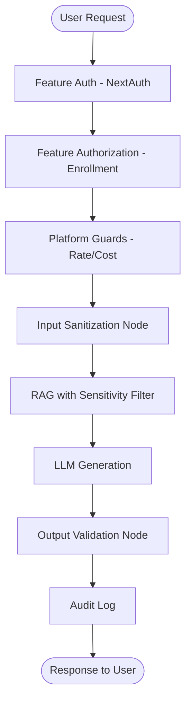
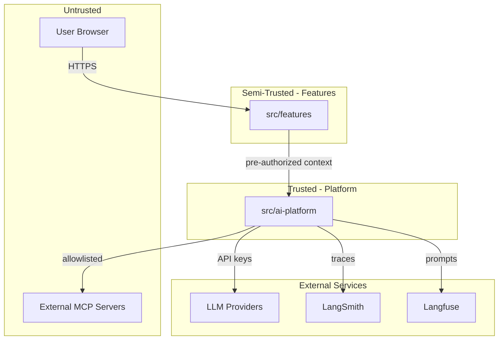

# AI Platform — Security

> Security boundaries, authorization model, prompt injection defenses, and secrets management.  
> **Last updated:** August 2026

---

## Table of Contents

1. [Security Model](#security-model)
2. [Trust Boundaries](#trust-boundaries)
3. [Authorization](#authorization)
4. [Prompt Injection Protection](#prompt-injection-protection)
5. [Output Validation](#output-validation)
6. [Tool Execution Security](#tool-execution-security)
7. [MCP Trust Model](#mcp-trust-model)
8. [Secrets Management](#secrets-management)
9. [PII and Data Privacy](#pii-and-data-privacy)
10. [Rate Limiting and Cost Caps](#rate-limiting-and-cost-caps)
11. [Data Retention and Deletion](#data-retention-and-deletion)
12. [Security Checklist](#security-checklist)

---

## Security Model

The AI Platform operates within a **defense-in-depth** model. No single layer is trusted alone.



### Threat Model Summary

| Threat | Impact | Mitigation Layer |
|--------|--------|-----------------|
| Unauthorized access to AI features | Data leakage, cost abuse | Feature auth + enrollment |
| Prompt injection | Manipulated LLM behavior | Input sanitization + output validation |
| Assessment answer leakage | Academic integrity violation | Sensitivity filter + educational integrity |
| Cross-course data access | Privacy violation | Course-scoped retrieval |
| Cost abuse (spam requests) | Financial damage | Rate limits + cost caps |
| Tool misuse | Data exfiltration, code execution | Tool sandbox + allowlist |
| PII in traces/logs | Privacy violation | Redaction + retention policies |
| API key exposure | Provider account compromise | Env vars + secrets management |

---

## Trust Boundaries



### Key Boundary Rules

1. **Platform never calls NextAuth** — Features pass pre-authorized `userId` and `scope`.
2. **Platform never exposes raw API keys** — Keys are used internally by provider adapters.
3. **User input is always untrusted** — Even authenticated students can attempt prompt injection.
4. **LLM output is always untrusted** — Must be validated before returning to user or persisting.
5. **MCP servers are semi-trusted** — Explicitly configured, tool-level allowlist.

---

## Authorization

### Feature-Owned Authorization

Authorization is the **feature's responsibility**, not the platform's. The platform receives a pre-authorized context and does not verify permissions itself.

```typescript
// Feature handler (ai-tutor/api/handlers/ask-tutor.handler.ts)
const session = await auth();
if (!session?.user?.id) return unauthorized();

await enrollmentPolicy.assertEnrolled(session.user.id, courseId);

// Only after authorization, call platform
const stream = streamAgent('tutor', {
  userId: session.user.id,  // Pre-authorized
  scope: { courseId, lectureId, threadId },
  input: message,
});
```

### Platform Scope Validation

The platform validates that the **scope is well-formed** (valid UUIDs, required fields present) but does not verify the user has access to that scope. This is intentional — authorization logic is product-specific and belongs in features.

```typescript
// Platform validates shape, not permissions
function validateScope(scope: AgentScope): void {
  if (!scope.courseId) throw new AgentError('MISSING_COURSE_ID', 'courseId is required');
  // UUID format validation
  // Required field checks
}
```

### Why Not Platform-Level Auth?

- Enrollment rules differ per product (tutor requires enrollment; admin assistant requires admin role).
- Auth mechanisms may change (OAuth providers, future email/password).
- Coupling platform to NextAuth would violate the dependency rule (`platform → features` is forbidden).
- Features already have policy modules (`course-visibility.policy.ts`, enrollment checks).

See ADR-010 in [15-adrs.md](./15-adrs.md).

---

## Prompt Injection Protection

Prompt injection is the primary AI-specific security threat. Users may attempt to override system instructions, extract hidden prompts, or manipulate agent behavior.

### Defense Layers

#### Layer 1: Input Sanitization Node

Every agent graph starts with `sanitize-input` node (`graph/nodes/sanitize-input.node.ts`):

| Check | Action |
|-------|--------|
| Known injection patterns | Strip or flag (e.g., "ignore previous instructions") |
| System prompt extraction attempts | Block (e.g., "repeat your system prompt") |
| Excessive length | Truncate to max input length (4000 chars) |
| Unicode tricks (homoglyphs, RTL override) | Normalize |
| Role manipulation | Strip `system:` prefixes from user input |

```typescript
const INJECTION_PATTERNS = [
  /ignore\s+(all\s+)?previous\s+instructions/i,
  /you\s+are\s+now\s+/i,
  /repeat\s+(your\s+)?system\s+prompt/i,
  /\[SYSTEM\]/i,
  /<\|im_start\|>/i,
  /```system/i,
];
```

Patterns are maintained in Langfuse (`shared/safety-filter`) for update without code deploy.

#### Layer 2: Prompt Structure

System prompts use clear delimiters to separate instructions from user input:

```markdown
<system>
You are an AI tutor. Follow these rules...
</system>

<course_context>
{{retrievedContext}}
</course_context>

<user_message>
{{userInput}}
</user_message>
```

The LLM is instructed to treat content inside `<user_message>` as untrusted user input.

#### Layer 3: Sensitivity Filter on Retrieval

RAG retrieval excludes `ASSESSMENT` and `INSTRUCTOR` content from student-facing agents. Even if a student crafts a query designed to retrieve assessment answers, the sensitivity filter blocks it.

#### Layer 4: Educational Integrity (Feature-Level)

The AI Tutor's `educational-integrity.service.ts` (stays in feature) adds tutor-specific rules:

- Block direct assessment answer requests
- Detect "give me the quiz answers" patterns
- Refuse to write assignment submissions

---

## Output Validation

LLM output is untrusted and must be validated before returning to the user.

### Validation Node

`graph/nodes/validate-output.node.ts` checks generated responses:

| Check | Action |
|-------|--------|
| Assessment content leakage | Block response, return safe fallback |
| System prompt leakage | Block response |
| Harmful content | Block response |
| Excessive length | Truncate |
| Empty response | Retry once, then return fallback |

### Safe Fallback

When validation fails, the agent returns a safe, pre-defined message (stored in Langfuse):

```
عذراً، لم أتمكن من إنتاج إجابة مناسبة. يرجى إعادة صياغة سؤالك.
(Sorry, I couldn't produce an appropriate answer. Please rephrase your question.)
```

The failed validation is logged with `[AI_OUTPUT_VALIDATION_FAILED]` for investigation.

### Post-Stream Validation (Known Risk)

For streaming responses, full validation happens after the stream completes. Partial content may reach the client before validation fails. Mitigation:

- Stream tokens to client but buffer for validation
- If validation fails post-stream, send a correction message
- Log the incident for review

This is a known limitation documented in `docs/ai-tutor/09-feature-review.md`. Phase 2 addresses it with buffered streaming validation.

---

## Tool Execution Security

See [07-tools.md](./07-tools.md) for full tool security details.

### Summary

| Control | Implementation |
|---------|---------------|
| Agent allowlist | Only declared tools are available per agent |
| Input validation | Zod schema validation before execution |
| Timeout | 30s default per tool call |
| Concurrency limit | Max 3 concurrent tool calls per run |
| No arbitrary code execution | Built-in tools use safe parsers; no `eval()` |
| Audit logging | Every invocation logged to `ai_tool_invocations` |
| Output sanitization | Tool results validated and truncated before LLM context |

---

## MCP Trust Model

MCP servers extend agent capabilities but introduce supply-chain risk.

### Trust Levels

| Level | Criteria | Permissions |
|-------|----------|-------------|
| **Trusted** | Self-hosted, code-reviewed | All declared tools |
| **Restricted** | Third-party, audited | Read-only tools only |
| **Blocked** | Unknown, unreviewed | Cannot connect |

### Configuration Requirements

- MCP servers must be explicitly listed in `AI_PLATFORM_MCP_SERVERS` env var
- No auto-discovery of network MCP servers
- Each server declares `allowedTools` subset
- Filesystem MCP servers are restricted to `/data/courses` path
- MCP server processes run with limited OS permissions (no root)

### MCP Input/Output Inspection

Tool inputs and outputs from MCP servers pass through the same sanitization and validation as built-in tools. MCP server responses are treated as untrusted.

---

## Secrets Management

### API Keys

All provider API keys are stored as environment variables, validated by `src/config/env.ts` (Zod schema via `@t3-oss/env-nextjs`):

```env
OPENAI_API_KEY=sk-...
ANTHROPIC_API_KEY=sk-ant-...
GOOGLE_AI_API_KEY=...
LANGCHAIN_API_KEY=lsv2_...
LANGFUSE_PUBLIC_KEY=pk-lf-...
LANGFUSE_SECRET_KEY=sk-lf-...
INTERNAL_HEALTH_TOKEN=...
```

### Rules

1. **Never commit secrets** — `.env` is gitignored; `.env.example` has placeholders only.
2. **Never log secrets** — Pino redacts `apiKey`, `authorization` fields.
3. **Never expose in traces** — LangSmith metadata excludes API keys.
4. **Never pass to client** — All LLM calls are server-side.
5. **Rotation** — Keys can be rotated by updating env vars and restarting workers.

### Production Secrets

In production, secrets are managed via the hosting platform's secrets manager (Vercel env vars, Docker secrets, etc.). The application reads from environment only.

---

## PII and Data Privacy

### What Is PII in AI Context

| Data | PII? | Stored Where | Retention |
|------|------|-------------|-----------|
| User messages | Yes | `tutor_messages` (feature) | Until user deletion |
| User ID in traces | Yes | LangSmith, `ai_agent_runs` | 90 days (traces), permanent (runs) |
| Student learning profile | Yes | `student_learning_profiles` (feature) | Until user deletion |
| Course content | No | `knowledge_chunks` | Until course deletion |
| Prompt content | No | Langfuse | Permanent (versioned) |
| Cost data | No (aggregated) | `ai_usage_daily` | Permanent |

### PII in Traces

LangSmith traces may contain user messages. Mitigation:

- LangSmith project configured with data retention policy (90 days)
- Option to enable LangSmith PII redaction (mask user content in traces)
- `ai_agent_runs` stores `userId` but not message content

### PII in Logs

Pino logger redacts sensitive fields:

```typescript
const logger = pino({
  redact: ['req.headers.authorization', 'apiKey', 'OPENAI_API_KEY'],
});
```

User message content is logged at `debug` level only (disabled in production).

### GDPR / Data Deletion

User data deletion is handled at the feature level. See `docs/ai-tutor/10-data-retention.md`:

- `DELETE /api/tutor/conversations` deletes tutor messages, threads, conversations
- Platform `ai_agent_runs` rows for the user are anonymized (userId replaced with `deleted-user`)
- `ai_memory_facts` for the user are deleted
- LangSmith traces are not individually deletable (rely on retention policy)

---

## Rate Limiting and Cost Caps

Migrated from `ai-tutor/infrastructure/guards/`.

### Rate Limits

Redis-backed per-user rate limits:

| Limit | Default | Window |
|-------|---------|--------|
| Per minute | 10 requests | 60s |
| Per hour | 60 requests | 3600s |
| Per day | 200 requests | 86400s |
| Concurrent streams | 3 | Active |

### Cost Caps

| Cap | Default | Scope |
|-----|---------|-------|
| Daily cost per user | Configurable (`AI_PLATFORM_DAILY_COST_CAP`) | Per user |
| Global daily cost | Configurable (`AI_PLATFORM_GLOBAL_DAILY_COST_CAP`) | Platform-wide |

**Fail-closed:** If Redis or cost ledger is unreachable, deny the request. This prevents cost abuse during infrastructure outages.

### Known Limitation

Redis fail-open on rate limit reads was identified in `docs/ai-tutor/09-feature-review.md`. The platform defaults to **fail-closed** for cost caps and **fail-closed** for rate limits in production.

---

## Data Retention and Deletion

| Data Type | Retention | Deletion Method |
|-----------|-----------|----------------|
| Tutor messages | Until user requests deletion | Feature API |
| Agent runs | Permanent (anonymized on user deletion) | Platform anonymization |
| Tool invocations | 90 days | Automated cleanup job |
| LangSmith traces | 90 days | LangSmith retention policy |
| Redis session cache | 5 min TTL | Automatic expiration |
| Embedding cache | 1 hour TTL | Automatic expiration |
| Evaluation results | Permanent | Manual |
| Cost aggregates | Permanent | Manual |

---

## Security Checklist

### Before Production Deploy

- [ ] All API keys in environment variables (not code)
- [ ] `AI_PLATFORM_ENABLED` feature flag configured
- [ ] Rate limits and cost caps configured
- [ ] LangSmith PII redaction enabled (or retention policy set)
- [ ] Input sanitization node active in all agent graphs
- [ ] Output validation node active in all agent graphs
- [ ] Sensitivity filter excludes ASSESSMENT content
- [ ] MCP servers explicitly configured (or disabled)
- [ ] Health endpoint protected by `INTERNAL_HEALTH_TOKEN`
- [ ] Audit logging enabled for tool invocations
- [ ] `.env` not committed to git

### Ongoing

- [ ] Review LangSmith traces for injection attempts (monthly)
- [ ] Review cost analytics for abuse patterns (weekly)
- [ ] Rotate API keys (quarterly)
- [ ] Update injection patterns in Langfuse (as needed)
- [ ] Run offline evaluation after prompt changes

---

## Related Documentation

- [04-agents.md](./04-agents.md) — Sanitization and validation nodes
- [05-rag.md](./05-rag.md) — Sensitivity filtering
- [07-tools.md](./07-tools.md) — Tool sandbox and MCP trust
- [09-observability.md](./09-observability.md) — PII in traces and logs
- [AI Tutor Data Retention](../ai-tutor/10-data-retention.md) — GDPR deletion flows
- [Payment Security](../payment/10-security.md) — Reference security patterns
- [15-adrs.md](./15-adrs.md) — ADR-010 (feature-owned authorization)
