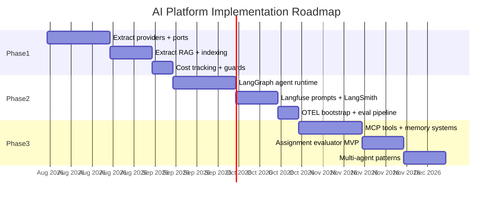
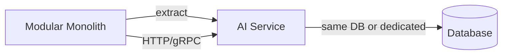

# AI Platform — Roadmap

> Implementation phases and future evolution criteria.  
> **Last updated:** August 2026

---

## Table of Contents

1. [Overview](#overview)
2. [Phase 1: Foundation](#phase-1-foundation)
3. [Phase 2: Agent Runtime](#phase-2-agent-runtime)
4. [Phase 3: Intelligence](#phase-3-intelligence)
5. [Future Evolution](#future-evolution)
6. [Service Extraction Criteria](#service-extraction-criteria)
7. [Dependencies and Prerequisites](#dependencies-and-prerequisites)
8. [Risk Register](#risk-register)

---

## Overview

The AI Platform is built incrementally using a **strangler fig pattern** — extracting shared capabilities from the existing AI Tutor while keeping it operational throughout migration.



**Total estimated duration:** 14–18 weeks for a single developer.

---

## Phase 1: Foundation

**Duration:** 4–6 weeks  
**Goal:** Extract shared infrastructure from AI Tutor into `src/ai-platform` without breaking existing functionality.

### Deliverables

| # | Deliverable | Source (ai-tutor) | Target (ai-platform) |
|---|------------|-------------------|---------------------|
| 1.1 | Port interfaces | `domain/ports/LlmPort.ts`, `EmbeddingPort.ts`, `VectorSearchPort.ts` | `domain/ports/` |
| 1.2 | OpenAI adapters | `infrastructure/adapters/OpenAI*.ts` | `providers/openai/` |
| 1.3 | Resilient wrapper | `infrastructure/adapters/ResilientLlmAdapter.ts` | `providers/resilient/` |
| 1.4 | Vector search | `PostgresVectorSearchAdapter.ts` | `rag/retrieval/` |
| 1.5 | Embedding pipeline | `embedding-pipeline.service.ts` | `embeddings/pipeline.ts` |
| 1.6 | Embedding cache | `infrastructure/cache/embedding-cache.ts` | `embeddings/cache/` |
| 1.7 | Indexing pipeline | `knowledge-ingestion/`, `course-indexing-runner` | `rag/ingestion/`, `indexing/pipelines/` |
| 1.8 | Indexing queue + outbox | `infrastructure/queue/course-indexing-*` | `indexing/outbox/`, `infrastructure/queue/` |
| 1.9 | Guards | `tutor-request.guards.ts`, `tutor-cost-cap.guard.ts` | `infrastructure/guards/` |
| 1.10 | DI container | `ai-tutor-container.ts` | `infrastructure/di/ai-platform.container.ts` |
| 1.11 | Config | `ai-tutor.config.ts` | `infrastructure/config/ai-platform.config.ts` |
| 1.12 | Platform tables | — | `ai_agent_runs`, `ai_usage_daily` (Prisma migration) |
| 1.13 | Public API barrel | — | `index.ts` |
| 1.14 | Documentation | — | `docs/ai-platform/` (this set) |

### Migration Strategy

1. Create `src/ai-platform/` with folder structure (empty modules with re-exports).
2. Move code file-by-file, updating imports.
3. `ai-tutor-container.ts` delegates to `ai-platform.container.ts`.
4. Run existing ai-tutor tests after each move — all must pass.
5. No changes to API routes or UI.

### Exit Criteria

- [ ] All ai-tutor tests pass using platform modules
- [ ] `ai-tutor-container.ts` is a thin delegate to platform container
- [ ] Cost tracking records runs in `ai_agent_runs`
- [ ] Indexing worker imports handlers from platform
- [ ] No duplicate code between ai-tutor and ai-platform
- [ ] `AI_PLATFORM_ENABLED` feature flag works

### What Does NOT Change in Phase 1

- AI Tutor API routes (`/api/tutor/*`)
- AI Tutor UI components
- Agent orchestration (still hand-rolled in `ask-tutor.use-case.ts`)
- Prompt management (still hardcoded in `prompt-builder.ts`)
- LangGraph, LangSmith, Langfuse, OTEL (not yet integrated)

---

## Phase 2: Agent Runtime

**Duration:** 4–6 weeks  
**Goal:** Introduce LangGraph orchestration, Langfuse prompts, LangSmith tracing, and OTEL observability.

### Deliverables

| # | Deliverable | Description |
|---|------------|-------------|
| 2.1 | LangGraph integration | Install `@langchain/langgraph`, create graph compiler |
| 2.2 | Tutor agent graph | Replace hand-rolled pipeline with `tutor.graph.ts` |
| 2.3 | Reusable nodes | `sanitize-input`, `retrieve-context`, `generate-response`, `validate-output` |
| 2.4 | Agent registry | Register tutor agent definition |
| 2.5 | Langfuse integration | Prompt resolver, sync templates, migrate `prompt-builder.ts` |
| 2.6 | LangSmith tracing | Configure tracing for all agent runs |
| 2.7 | OTEL bootstrap | Install OTEL SDK, create spans for platform operations |
| 2.8 | Cost ledger | Full token tracking with daily aggregation worker |
| 2.9 | Ragas evaluation | Golden dataset, nightly eval job, `ai-evaluation` queue |
| 2.10 | Admin cost API | `observability/dashboard/cost-analytics.service.ts` |
| 2.11 | Model router | Basic routing policies for tutor task |
| 2.12 | Health endpoint | Aggregated `/api/health/ai-platform` |

### New Dependencies

```
@langchain/langgraph
@langchain/core
langsmith
langfuse
@opentelemetry/sdk-node
@opentelemetry/api
```

### Migration: ask-tutor.use-case.ts

Before (Phase 1):
```typescript
// Hand-rolled: context → RAG → prompt → stream → persist
```

After (Phase 2):
```typescript
export async function* askTutorUseCase(input, deps) {
  await deps.enrollmentPolicy.assertEnrolled(input.userId, input.courseId);
  yield* streamAgent('tutor', { userId: input.userId, input: input.message, scope: { ... } });
  // Feature persists messages via lifecycle hook
}
```

### Exit Criteria

- [ ] Tutor uses LangGraph graph (not hand-rolled pipeline)
- [ ] Prompts served from Langfuse (not hardcoded)
- [ ] All agent runs traced in LangSmith
- [ ] OTEL spans exported (stdout in dev, OTLP in staging)
- [ ] Nightly Ragas evaluation runs and stores results
- [ ] Admin can query cost analytics via platform API
- [ ] Offline evaluation pass rate ≥ baseline

---

## Phase 3: Intelligence

**Duration:** 6–8 weeks  
**Goal:** MCP tools, advanced memory, multi-agent patterns, and the first new AI product (Assignment Evaluator).

### Deliverables

| # | Deliverable | Description |
|---|------------|-------------|
| 3.1 | Tool registry + executor | Built-in tools, sandbox, audit logging |
| 3.2 | MCP client | stdio + HTTP transport, server configuration |
| 3.3 | Long-term memory | `ai_memory_facts` table, memory store, fact creation |
| 3.4 | Context summarization | Token budget management, summarizer node |
| 3.5 | Anthropic + Gemini adapters | Multi-provider support |
| 3.6 | Fallback chains | Provider failover |
| 3.7 | Assignment Evaluator agent | New feature: `src/features/ai-assignment-evaluator` |
| 3.8 | Evaluator graph | Structured output, rubric-based evaluation |
| 3.9 | DeepEval integration | Assertion-based tests, CI regression gates |
| 3.10 | Code Reviewer agent stub | Agent definition + graph skeleton |
| 3.11 | Multi-agent supervisor | Basic supervisor pattern for intent routing |
| 3.12 | `ai_tool_invocations` table | Tool audit logging |

### New Feature: AI Assignment Evaluator

```
src/features/ai-assignment-evaluator/
├── application/use-cases/evaluate-submission.use-case.ts
├── api/handlers/evaluate-submission.handler.ts
├── domain/models/evaluation-result.ts
└── presentation/components/evaluation-feedback.tsx
```

Calls `runAgent('evaluator', { input: submission, scope: { assignmentId, courseId } })`.

### Exit Criteria

- [ ] Tutor can use `search` and `calculator` built-in tools
- [ ] MCP filesystem server configured for code review
- [ ] Long-term memory stores and retrieves user preferences
- [ ] Assignment Evaluator evaluates submissions with structured JSON output
- [ ] DeepEval CI gate blocks PRs that degrade quality
- [ ] Multi-provider routing works with fallback
- [ ] At least 2 AI products running on the platform

---

## Future Evolution

Beyond Phase 3, the platform evolves based on product needs:

| Capability | Trigger | Estimated Effort |
|-----------|---------|-----------------|
| **AI Code Reviewer** (full) | Instructor demand for automated code feedback | 4 weeks |
| **AI Course Assistant** (admin) | Admin team needs cross-course search | 3 weeks |
| **Semantic chunking** | Retrieval quality plateaus with fixed-size chunks | 2 weeks |
| **Reranking** | Retrieval precision needs improvement | 2 weeks |
| **Production drift detection** | Live quality degradation detected | 3 weeks |
| **Human-in-the-loop** | Evaluator needs instructor approval gate | 2 weeks |
| **Voice input/output** | Accessibility requirements | 4 weeks |
| **Multimodal** (image input) | Course materials include diagrams | 3 weeks |

Items from `docs/ai-tutor/07-future-roadmap.md` (memory systems, MCP, multi-agent) are absorbed into Phases 2–3 above.

---

## Service Extraction Criteria

The platform is designed as an internal module. Extraction into a separate AI service is **not planned** but may become necessary. Document the criteria now to guide future decisions.

### Extract to Separate Service When ALL of These Are True

| Criterion | Threshold | Current State |
|-----------|-----------|---------------|
| **Team size** | ≥ 3 engineers working on AI full-time | 1 developer |
| **Request volume** | > 1000 agent runs/minute sustained | < 10/minute |
| **Deployment independence** | AI changes deploy more than 5x/week independently | Monolith deploys |
| **Resource isolation** | AI workloads cause web server latency spikes | Not observed |
| **Multi-app consumption** | ≥ 2 separate applications need the AI platform | 1 application |
| **Cost of monolith coupling** | AI-specific scaling costs > 2x shared infra | Not applicable |

### Extract to Separate Service When ANY of These Are True

| Criterion | Rationale |
|-----------|-----------|
| Regulatory requirement for AI data isolation | Compliance mandate |
| GPU/workload requirements incompatible with Next.js runtime | Hardware constraints |
| External API customers need AI capabilities | B2B product |

### What Extraction Would Look Like

If criteria are met, the migration path is:



1. Move `src/ai-platform/` to a new repository
2. Expose the current TypeScript API as HTTP endpoints (the platform already has typed contracts)
3. Features call HTTP instead of direct function calls
4. Workers move to the AI service deployment
5. Database: either shared PostgreSQL (simpler) or dedicated (isolated)

**The current direct TypeScript API design makes this extraction straightforward** — ports and DTOs become API contracts. See ADR-001 and ADR-005.

### What NOT to Do Prematurely

- Do not extract because "microservices are best practice"
- Do not extract before Phase 3 is complete
- Do not extract without observability to measure the coupling cost
- Do not create an AI Gateway before extraction is needed

---

## Dependencies and Prerequisites

### Infrastructure Prerequisites

| Prerequisite | Status | Required By |
|-------------|--------|-------------|
| PostgreSQL with pgvector | ✅ Installed | Phase 1 |
| Redis | ✅ Installed | Phase 1 |
| BullMQ workers | ✅ Running | Phase 1 |
| OpenAI API key | ✅ Configured | Phase 1 |
| Langfuse account/instance | ❌ Not yet | Phase 2 |
| LangSmith account | ❌ Not yet | Phase 2 |
| OTEL collector | ❌ Not yet | Phase 2 |
| Python 3.10+ (for eval) | ❌ Not yet | Phase 2 |
| Anthropic API key | ❌ Optional | Phase 3 |
| Google AI API key | ❌ Optional | Phase 3 |

### Documentation Prerequisites

| Document | Status |
|----------|--------|
| `docs/ai-platform/` (this set) | ✅ Complete |
| `docs/ai-tutor/` deprecation banners | Pending (add after Phase 1) |
| Admin cost dashboard UI spec | Pending (Phase 2) |

---

## Risk Register

| Risk | Likelihood | Impact | Mitigation |
|------|-----------|--------|------------|
| Migration breaks live tutor | Medium | High | Strangler pattern; test after each move |
| LangGraph learning curve | Medium | Medium | Start with simple linear graph; add complexity incrementally |
| Langfuse/LangSmith vendor dependency | Low | Medium | Local prompt fallback; OTEL for vendor-neutral traces |
| Arabic content quality regression | Medium | High | Golden dataset with Arabic samples; Ragas eval gate |
| Cost spike from new products | Medium | Medium | Cost caps enforced from Phase 1 |
| Python eval environment in CI | Medium | Low | Docker image with Python pre-installed |
| Single developer bottleneck | High | Medium | Documentation enables future contributors; phases are independent |
| pgvector scale limits | Low | Medium | HNSW handles 1M+ chunks; monitor query latency |

---

## Related Documentation

- [01-overview.md](./01-overview.md) — Vision and scope
- [02-architecture.md](./02-architecture.md) — Architecture that phases build toward
- [15-adrs.md](./15-adrs.md) — Decision rationale for all phases
- [AI Tutor Future Roadmap](../ai-tutor/07-future-roadmap.md) — Absorbed into this roadmap
- [AI Tutor Implementation Roadmap](../ai-tutor/01-implementation-roadmap.md) — Completed sprints
