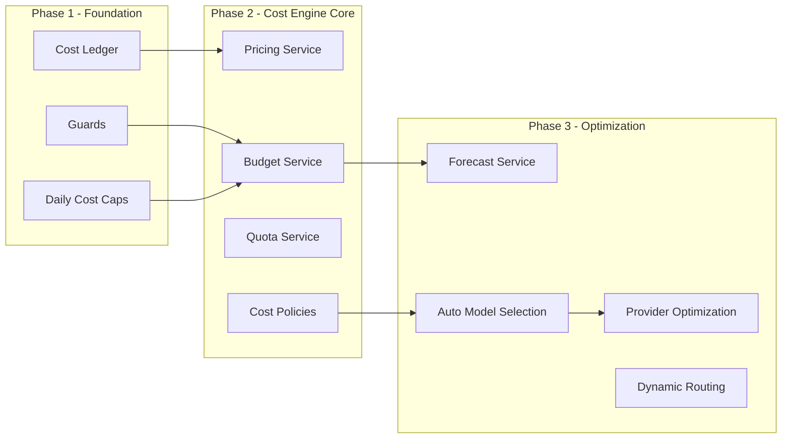
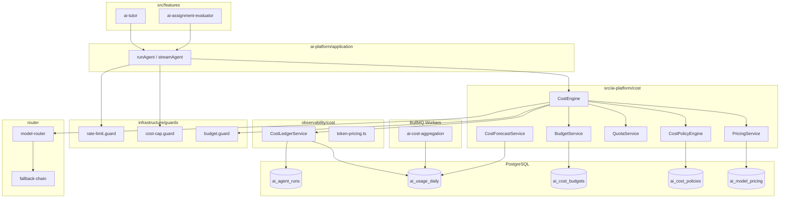
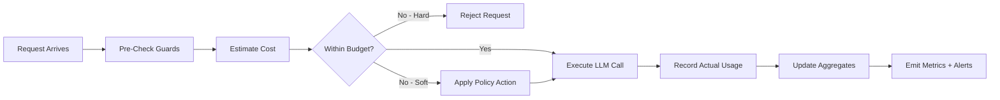
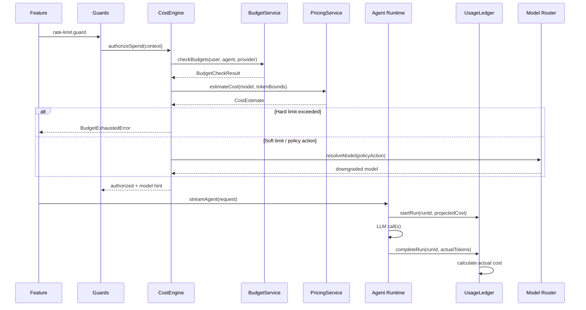
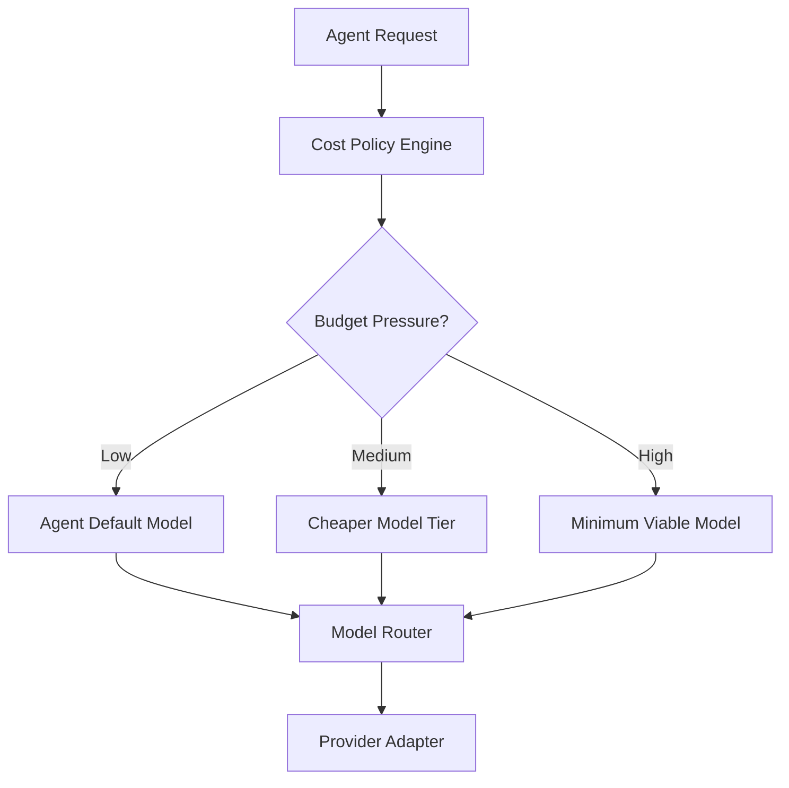
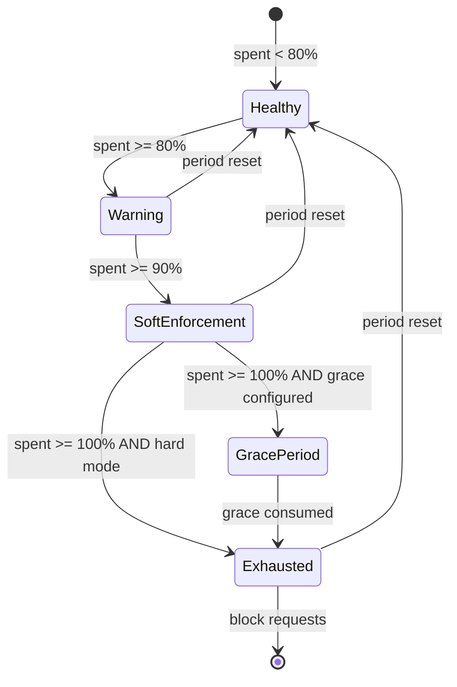
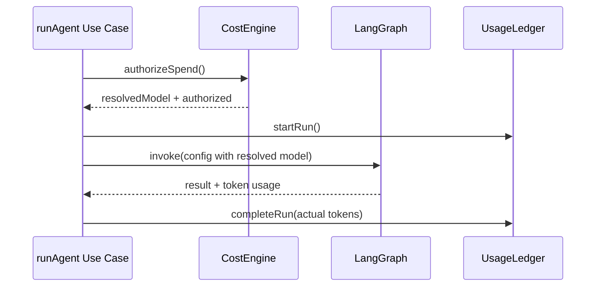
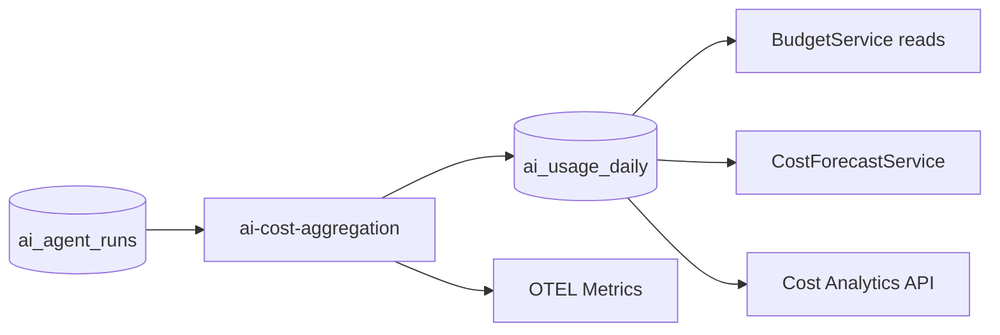

# AI Platform — Cost Engine

> Cost governance, quotas, budgets, forecasting, pricing policies, and model optimization.  
> **Last updated:** August 2026

---

## Table of Contents

1. [Overview](#overview)
2. [Why Cost Ledger Is Not Enough](#why-cost-ledger-is-not-enough)
3. [Cost Engine Responsibilities](#cost-engine-responsibilities)
4. [Design Principles](#design-principles)
5. [Architecture Diagram](#architecture-diagram)
6. [Cost Pipeline](#cost-pipeline)
7. [Request Lifecycle](#request-lifecycle)
8. [Pricing Service](#pricing-service)
9. [Usage Ledger](#usage-ledger)
10. [Quotas](#quotas)
11. [Daily Limits](#daily-limits)
12. [Monthly Budgets](#monthly-budgets)
13. [Per-User Budgets](#per-user-budgets)
14. [Per-Feature Budgets](#per-feature-budgets)
15. [Per-Provider Budgets](#per-provider-budgets)
16. [Cost Forecasting](#cost-forecasting)
17. [Cost Policies](#cost-policies)
18. [Automatic Model Selection](#automatic-model-selection)
19. [Provider Optimization](#provider-optimization)
20. [Budget Enforcement](#budget-enforcement)
21. [Cost Guard Integration](#cost-guard-integration)
22. [Cost Engine APIs](#cost-engine-apis)
23. [Cost Engine Domain Models](#cost-engine-domain-models)
24. [Database Tables](#database-tables)
25. [Integration with Agent Runtime](#integration-with-agent-runtime)
26. [Integration with Providers](#integration-with-providers)
27. [Integration with Observability](#integration-with-observability)
28. [Integration with Daily Aggregation Workers](#integration-with-daily-aggregation-workers)
29. [Failure Handling](#failure-handling)
30. [Alerting](#alerting)
31. [Dashboard Metrics](#dashboard-metrics)
32. [Future Evolution](#future-evolution)
33. [Phase Rollout](#phase-rollout)
34. [Migration Strategy](#migration-strategy)
35. [ADR Alignment](#adr-alignment)

---

## Overview

The **Cost Engine** is the platform's cost governance subsystem. It extends the existing **cost ledger** (see [09-observability.md](./09-observability.md#cost-ledger)) with budgets, quotas, pricing policies, forecasting, and model optimization — without becoming a separate service or database.

| Attribute | Value |
|-----------|-------|
| **Module location** | `src/ai-platform/cost/` |
| **Deployment** | In-process inside the modular monolith |
| **Database** | Same PostgreSQL instance (`ai_agent_runs`, `ai_usage_daily`, new `ai_cost_*` tables) |
| **Public API** | Exported via `@/ai-platform` barrel (Phase 2+) |
| **Phase 1 status** | **Not required** — cost ledger + guards suffice |

Phase 1 ships with metering and enforcement primitives already proven in AI Tutor: token tracking, daily cost caps, and rate limits. The Cost Engine is introduced incrementally in Phases 2 and 3 as products multiply and spend governance needs grow beyond simple caps.



---

## Why Cost Ledger Is Not Enough

The cost ledger answers **"what did we spend?"** It records per-run token counts and estimated cost in `ai_agent_runs`, aggregates daily totals in `ai_usage_daily`, and powers the admin cost analytics API.

That is sufficient for Phase 1 with a single AI product and one developer. It becomes insufficient when:

| Gap | Cost Ledger Limitation | Cost Engine Addition |
|-----|------------------------|---------------------|
| **Pre-run decisions** | Ledger is write-heavy, post-hoc | Pre-authorization checks before LLM calls |
| **Multi-dimensional budgets** | Daily per-user cap only | Monthly, per-feature, per-provider budgets |
| **Quota types** | Token totals only | Request counts, concurrency, embedding volume |
| **Pricing changes** | Static table in `token-pricing.ts` | Versioned pricing with effective dates |
| **Spend prediction** | Historical sums only | Forecasting from run-rate trends |
| **Cost optimization** | None | Policy-driven model downgrades and provider routing |
| **Policy composition** | Single global cap | Layered hard/soft limits with grace periods |

The cost ledger remains the **source of truth for actual usage**. The Cost Engine reads from it, writes policy state to dedicated tables, and coordinates guards and the model router — it does not duplicate run-level records.

---

## Cost Engine Responsibilities

| Responsibility | Owner | Phase |
|----------------|-------|-------|
| Record per-run tokens and estimated cost | Cost Ledger (`observability/cost/`) | 1 |
| Enforce rate limits and daily cost caps | Guards (`infrastructure/guards/`) | 1 |
| Aggregate daily usage | Daily aggregation worker | 2 |
| Versioned model pricing | Pricing Service | 2 |
| Budget allocation and exhaustion | Budget Service | 2 |
| Request/token quotas | Quota Service | 2 |
| Declarative cost policies | Cost Policy Engine | 2 |
| Spend forecasting | Cost Forecast Service | 3 |
| Automatic model selection | Cost Engine + Model Router | 3 |
| Provider cost optimization | Cost Engine + Fallback Chain | 3 |
| Dynamic routing under budget pressure | Cost Engine + Router | 3 |

### What the Cost Engine Does NOT Do

- **Authorization** — Features verify enrollment and roles before calling the platform (ADR-010).
- **Billing/invoicing** — No chargeback to users; internal cost governance only.
- **Provider API key management** — Stays in `providers/` and `infrastructure/config/`.
- **Replace LangSmith/OTEL** — Cost metrics complement traces; observability remains separate.

---

## Design Principles

1. **Ledger-first** — Actual spend is always derived from `ai_agent_runs`. The Cost Engine never invents usage; it governs and projects it.
2. **Fail-closed on enforcement** — If budget/quota state cannot be read, deny the request (consistent with [13-security.md](./13-security.md#rate-limiting-and-cost-caps)).
3. **Pre-check, post-record** — Estimate cost before the LLM call; record actual cost after completion. Never block on post-record failures.
4. **Layered limits** — Hard limits block; soft limits warn and may trigger downgrade. Policies declare which layer applies.
5. **Single developer maintainability** — Prefer configuration over code generation; one pricing table, one policy schema, minimal moving parts.
6. **No separate service** — All logic in `src/ai-platform/cost/`; same process, same database, direct TypeScript APIs (ADR-001, ADR-005).
7. **Gradual activation** — Phase 1 works without Cost Engine imports. Features and guards call ledger APIs directly until Phase 2 wiring is complete.
8. **Extraction-ready contracts** — Ports (`UsageLedgerPort`, service interfaces) mirror the platform's port/adapter pattern so a future HTTP wrapper is straightforward.

---

## Architecture Diagram



### Folder Structure

```
src/ai-platform/cost/
├── domain/
│   ├── models/
│   │   ├── cost-estimate.ts
│   │   ├── budget.ts
│   │   ├── quota.ts
│   │   ├── cost-policy.ts
│   │   └── pricing-tier.ts
│   ├── ports/
│   │   ├── usage-ledger.port.ts
│   │   ├── pricing.port.ts
│   │   ├── budget.port.ts
│   │   └── quota.port.ts
│   └── enums/
│       ├── limit-type.ts
│       ├── budget-scope.ts
│       └── enforcement-mode.ts
├── application/
│   ├── services/
│   │   ├── cost-engine.service.ts
│   │   ├── pricing.service.ts
│   │   ├── budget.service.ts
│   │   ├── quota.service.ts
│   │   └── cost-forecast.service.ts
│   └── policies/
│       └── cost-policy.engine.ts
├── infrastructure/
│   ├── persistence/
│   │   ├── budget.repository.ts
│   │   ├── quota.repository.ts
│   │   ├── pricing.repository.ts
│   │   └── policy.repository.ts
│   └── guards/
│       └── budget.guard.ts
└── index.ts                          # Internal barrel; re-exported from ai-platform/index.ts
```

The existing cost ledger stays in `observability/cost/`. The Cost Engine **consumes** the ledger via `UsageLedgerPort`; it does not relocate ledger code in Phase 2.

---

## Cost Pipeline

Cost flows through three stages: **estimate → execute → actualize**.



### Cost Types

| Type | When Calculated | Purpose | Stored In |
|------|-----------------|---------|-----------|
| **Estimated Cost** | Before LLM call | Pre-authorization, budget checks, model selection | Ephemeral (request context); optional `ai_agent_runs` row at start |
| **Actual Cost** | After LLM call completes | Billing truth, dashboards, aggregation | `ai_agent_runs.estimated_cost_usd` (naming is historical; value is post-run actual) |
| **Forecast Cost** | Background job / on-demand query | Projected end-of-period spend | Computed; cached in Redis or `ai_cost_forecasts` (Phase 3) |

**Naming note:** `ai_agent_runs.estimated_cost_usd` was introduced in Phase 1 before the Cost Engine existed. The column stores the **actual calculated cost** at run completion based on token counts × pricing. Phase 2 may add `projected_cost_usd` at run start for audit; the ledger column name is retained for backward compatibility.

### Estimation Formula

```
estimatedCostUsd = (inputTokens × inputPricePerToken)
                 + (outputTokens × outputPricePerToken)
                 + (embeddingTokens × embeddingPricePerToken)
```

Pre-run estimation uses **expected token bounds** from agent definition defaults (max tokens, typical prompt size) when exact counts are unknown. Post-run actualization uses provider-reported token counts.

---

## Request Lifecycle



### Lifecycle Stages

| Stage | Component | Action |
|-------|-----------|--------|
| 1. Rate limit | `rate-limit.guard.ts` | Redis token bucket per user |
| 2. Daily cap (Phase 1) | `cost-cap.guard.ts` | Query `ai_usage_daily` for today |
| 3. Budget check (Phase 2+) | `budget.guard.ts` → `CostEngine` | Multi-scope budget evaluation |
| 4. Quota check (Phase 2+) | `QuotaService` | Request count, token quota |
| 5. Policy evaluation (Phase 2+) | `CostPolicyEngine` | Model downgrade, provider switch |
| 6. Model resolution (Phase 3) | `ModelRouter` + `CostEngine` | Cost-optimized routing |
| 7. Run execution | LangGraph agent runtime | Stream/complete |
| 8. Cost recording | `CostLedgerService` | Write `ai_agent_runs` |
| 9. Aggregation (async) | `ai-cost-aggregation` worker | Upsert `ai_usage_daily` |

---

## Pricing Service

The Pricing Service replaces the static `TOKEN_PRICING` map with a **versioned, queryable pricing catalog** stored in PostgreSQL. Phase 1 continues using `observability/cost/token-pricing.ts`; Phase 2 migrates to the Pricing Service with a fallback to the static table.

```typescript
interface PricingService {
  /** Price per token for a model at a point in time */
  getModelPricing(modelId: string, asOf?: Date): Promise<ModelPricing>;

  /** Estimate cost from token counts (pre- or post-run) */
  estimateCost(input: CostEstimateInput): Promise<CostEstimate>;

  /** List all active models and prices (admin) */
  listActivePricing(): Promise<ModelPricing[]>;

  /** Admin: create new pricing version with effective date */
  upsertPricing(entry: ModelPricingInput): Promise<ModelPricing>;
}

interface ModelPricing {
  modelId: string;
  provider: string;
  inputPricePerMillion: number;
  outputPricePerMillion: number;
  embeddingPricePerMillion: number;
  effectiveFrom: Date;
  effectiveTo?: Date;
  currency: 'USD';
}

interface CostEstimateInput {
  modelId: string;
  inputTokens: number;
  outputTokens: number;
  embeddingTokens?: number;
  asOf?: Date;
}

interface CostEstimate {
  modelId: string;
  inputTokens: number;
  outputTokens: number;
  embeddingTokens: number;
  totalUsd: number;
  pricingVersion: string;
  calculatedAt: Date;
}
```

### Pricing Update Workflow

1. Admin updates provider price sheet (manual, quarterly).
2. New row inserted in `ai_model_pricing` with `effective_from`.
3. Previous row gets `effective_to` set.
4. Runs after `effective_from` use new prices; historical runs retain stored cost at time of completion.
5. Redis cache (`ai:pricing:{modelId}`) invalidated on upsert; TTL 1 hour as safety net.

**Trade-off:** Manual price updates vs. provider API sync. Manual is chosen for single-developer maintainability; provider APIs are inconsistent and add failure modes.

---

## Usage Ledger

The Usage Ledger is the **append-only record of actual consumption**. Implemented by `CostLedgerService` in Phase 1; exposed to the Cost Engine via port.

```typescript
interface UsageLedgerPort {
  /** Create run row at start (status: running) */
  startRun(input: StartRunInput): Promise<string>;

  /** Finalize run with token counts and actual cost */
  completeRun(runId: string, usage: RunUsage): Promise<void>;

  /** Mark run failed (still record partial usage if available) */
  failRun(runId: string, usage?: Partial<RunUsage>): Promise<void>;

  /** Daily aggregated usage for a scope */
  getDailyUsage(scope: UsageScope, date: Date): Promise<DailyUsage>;

  /** Sum usage over a date range */
  getUsageInRange(scope: UsageScope, range: DateRange): Promise<UsageSummary>;

  /** Current month-to-date for budget checks */
  getMonthToDate(scope: UsageScope): Promise<UsageSummary>;
}

interface StartRunInput {
  agentId: string;
  userId: string;
  model: string;
  provider: string;
  correlationId: string;
  projectedCostUsd?: number;
  metadata?: Record<string, unknown>;
}

interface RunUsage {
  inputTokens: number;
  outputTokens: number;
  embeddingTokens: number;
  actualCostUsd: number;
  latencyMs: number;
}

interface UsageScope {
  userId?: string;
  agentId?: string;
  provider?: string;
}

interface DailyUsage {
  date: Date;
  totalRuns: number;
  totalInputTokens: number;
  totalOutputTokens: number;
  totalCostUsd: number;
}
```

The Cost Engine **reads** from `UsageLedgerPort` for budget and forecast calculations. It **never writes** run rows directly — the agent runtime and ledger service own that path.

---

## Quotas

Quotas limit **discrete resources** (requests, runs, embedding calls) distinct from **spend budgets** (USD).

```typescript
interface QuotaService {
  /** Check and optionally consume quota atomically */
  checkAndConsume(input: QuotaCheckInput): Promise<QuotaCheckResult>;

  /** Read-only check for dashboards */
  getRemaining(scope: QuotaScope, quotaType: QuotaType): Promise<QuotaRemaining>;

  /** Admin: set quota for scope */
  setQuota(quota: QuotaDefinition): Promise<void>;
}

type QuotaType =
  | 'agent_runs_per_day'
  | 'agent_runs_per_hour'
  | 'llm_calls_per_run'
  | 'embedding_requests_per_day'
  | 'indexing_jobs_per_day';

interface QuotaScope {
  userId?: string;
  agentId?: string;
  global?: boolean;
}

interface QuotaCheckResult {
  allowed: boolean;
  quotaType: QuotaType;
  limit: number;
  consumed: number;
  remaining: number;
  resetsAt: Date;
}
```

### Quota vs. Budget

| Mechanism | Unit | Example | Enforcement |
|-----------|------|---------|-------------|
| **Quota** | Count | 50 tutor messages/day/user | Hard block |
| **Budget** | USD | $2.00/month/user on evaluator | Hard or soft |
| **Daily cap** | USD | $0.50/day/user (Phase 1) | Hard block |

Quotas are stored in `ai_cost_quotas` with Redis counters for fast enforcement (`ai:quota:{scope}:{type}:{period}`). PostgreSQL is the source of truth; Redis is the hot path with periodic reconciliation.

---

## Daily Limits

Daily limits are the **Phase 1 cost control** mechanism, implemented by `cost-cap.guard.ts` without the full Cost Engine.

| Limit | Config Key | Scope | Phase |
|-------|-----------|-------|-------|
| Per-user daily spend | `AI_PLATFORM_DAILY_COST_CAP` | `userId` | 1 |
| Global daily spend | `AI_PLATFORM_GLOBAL_DAILY_COST_CAP` | Platform | 1 |
| Per-user daily runs | `AI_PLATFORM_DAILY_RUN_CAP` | `userId` | 2 (quota) |

### Phase 1 Behavior

```typescript
// infrastructure/guards/cost-cap.guard.ts (Phase 1 — no Cost Engine)
async function assertDailyCostCap(userId: string): Promise<void> {
  const today = await usageLedger.getDailyUsage({ userId }, new Date());
  const cap = config.getDailyCostCap();
  if (cap > 0 && today.totalCostUsd >= cap) {
    throw new CostCapExceededError(userId, today.totalCostUsd, cap);
  }
}
```

### Phase 2 Migration

Daily limits become a **special case of the Budget Service** with `period: 'daily'`. The guard delegates to `CostEngine.checkLimits()` which evaluates daily budgets alongside monthly budgets. Existing env vars map to default daily budget rows seeded at migration.

---

## Monthly Budgets

Monthly budgets cap **USD spend** over a calendar month.

```typescript
interface BudgetService {
  checkBudget(input: BudgetCheckInput): Promise<BudgetCheckResult>;
  getBudgetStatus(scope: BudgetScope): Promise<BudgetStatus>;
  setBudget(budget: BudgetDefinition): Promise<Budget>;
  listBudgets(filter: BudgetFilter): Promise<Budget[]>;
}

interface BudgetDefinition {
  scope: BudgetScope;
  period: 'daily' | 'monthly';
  limitUsd: number;
  enforcement: EnforcementMode;
  gracePercent?: number;       // e.g. 5 = allow 5% over before hard block
  warningThresholds?: number[]; // e.g. [0.8, 0.9] → warn at 80%, 90%
}

type BudgetScope =
  | { type: 'user'; userId: string }
  | { type: 'agent'; agentId: string }
  | { type: 'provider'; provider: string }
  | { type: 'global' };

type EnforcementMode = 'hard' | 'soft' | 'warn_only';

interface BudgetCheckResult {
  allowed: boolean;
  scope: BudgetScope;
  spentUsd: number;
  limitUsd: number;
  percentUsed: number;
  enforcement: EnforcementMode;
  action?: PolicyAction;  // e.g. downgrade model on soft exceed
}
```

**Month boundary:** Budgets reset at `00:00 UTC` on the first day of each month. Usage is summed from `ai_agent_runs` (real-time for checks) with `ai_usage_daily` as the fast path for historical days.

---

## Per-User Budgets

Per-user budgets protect against individual abuse and align spend with subscription tiers (future).

| Scenario | Default (Phase 2) | Enforcement |
|----------|-------------------|-------------|
| Free learner | $1.00/month AI spend | Soft → downgrade to `gpt-4o-mini` |
| Enrolled student | Inherited from daily cap + $5/month | Hard at monthly limit |
| Admin/test account | Exempt (`budget_exempt` flag in metadata) | None |

```typescript
// Example: feature passes user context; Cost Engine resolves user budget
const result = await costEngine.authorizeSpend({
  userId: 'user-uuid',
  agentId: 'tutor',
  estimatedCostUsd: 0.003,
  modelId: 'gpt-4o',
});
```

User budgets are evaluated **before** agent and provider budgets. The most restrictive applicable limit wins for hard enforcement.

---

## Per-Feature Budgets

Per-feature (agent) budgets cap spend **per product** regardless of which user triggered the run.

| Agent | Example Monthly Budget | Rationale |
|-------|------------------------|-----------|
| `tutor` | $500 | Highest volume product |
| `evaluator` | $200 | Batch evaluation spikes |
| `code-reviewer` | $100 | Lower initial adoption |
| `indexing` | $150 | Embedding-heavy, non-interactive |

Feature budgets protect the platform when a single product has a bug (e.g., infinite retry loop in evaluator). They are **hard limits** by default — when exhausted, all users of that agent receive `FeatureBudgetExhaustedError`.

---

## Per-Provider Budgets

Per-provider budgets cap spend to a **single LLM vendor** (OpenAI, Anthropic, Gemini).

| Use Case | Behavior |
|----------|----------|
| OpenAI monthly cap reached | Route new requests to Anthropic via fallback chain (Phase 3) |
| All provider budgets exhausted | Hard block with `ProviderBudgetExhaustedError` |
| Provider outage | Failover is handled by `resilient/` adapter; budget exhaustion is a separate concern |

Provider budgets align with **invoice cycles** and API key billing accounts. A single developer can set conservative caps per provider to avoid surprise invoices.

---

## Cost Forecasting

Forecasting projects **end-of-period spend** from current run-rate. Phase 3 capability; not required for launch.

```typescript
interface CostForecastService {
  /** Project spend to end of current period */
  forecast(scope: BudgetScope, period: 'daily' | 'monthly'): Promise<CostForecast>;

  /** Platform-wide forecast for admin dashboard */
  forecastGlobal(period: 'daily' | 'monthly'): Promise<CostForecast>;

  /** Will scope exceed budget before period end? */
  willExceedBudget(scope: BudgetScope): Promise<ForecastAlert | null>;
}

interface CostForecast {
  scope: BudgetScope;
  period: 'daily' | 'monthly';
  spentUsd: number;
  forecastUsd: number;          // projected total at period end
  budgetLimitUsd?: number;
  forecastConfidence: 'low' | 'medium' | 'high';
  basedOnDays: number;
  calculatedAt: Date;
}
```

### Forecast Methods

| Method | When Used | Formula |
|--------|-----------|---------|
| **Linear run-rate** | Default | `(spent / elapsedDays) × totalDays` |
| **7-day moving average** | Stable products | Weighted average of last 7 days daily spend |
| **Hour-of-day adjusted** | High traffic variance | Same-day prior week pattern (Phase 3+) |

**Forecast vs. Estimate vs. Actual:**

| | Estimate | Forecast | Actual |
|---|----------|----------|--------|
| **Horizon** | Single request | Full period | Completed runs |
| **Timing** | Pre-run | Background / on-demand | Post-run |
| **Use** | Authorize this call | Alert ops before overrun | Financial truth |

Forecasts are **informational** unless wired to a cost policy (e.g., "if forecast > 90% of monthly budget, downgrade all tutor requests to mini model").

---

## Cost Policies

Cost policies are **declarative rules** that map budget/quota state to actions. Evaluated by `CostPolicyEngine`.

```typescript
interface CostPolicy {
  id: string;
  name: string;
  priority: number;
  conditions: PolicyCondition[];
  action: PolicyAction;
  enabled: boolean;
}

interface PolicyCondition {
  type: 'budget_percent' | 'quota_percent' | 'forecast_percent' | 'agent_id' | 'time_window';
  operator: 'gte' | 'lte' | 'eq';
  value: number | string;
}

type PolicyAction =
  | { type: 'allow' }
  | { type: 'warn'; channel: 'log' | 'metric' | 'alert' }
  | { type: 'downgrade_model'; targetModelId: string }
  | { type: 'switch_provider'; targetProvider: string }
  | { type: 'block'; reason: string }
  | { type: 'grace'; extraPercent: number };
```

### Example Policies

| Policy | Condition | Action |
|--------|-----------|--------|
| Tutor soft cap | User budget ≥ 80% | Warn + downgrade to `gpt-4o-mini` |
| Evaluator protection | Agent budget ≥ 100% | Hard block |
| Provider failover | OpenAI budget ≥ 95% | Switch to Anthropic |
| Night grace | 22:00–06:00 UTC + budget ≥ 100% | 5% grace allowance for in-flight threads |

Policies are stored in `ai_cost_policies` as JSONB. Priority ordering resolves conflicts (lower number = higher priority).

---

## Automatic Model Selection

Phase 3 integrates the Cost Engine with `router/model-router.ts` for **cost-aware model selection**.



### Selection Inputs

| Input | Source |
|-------|--------|
| Agent default model | `agents/<product>/*.definition.ts` |
| Task complexity hint | Graph node metadata (e.g., `evaluation` vs `chat`) |
| Budget remaining | `BudgetService` |
| Policy actions | `CostPolicyEngine` |
| Quality floor | Agent definition `minModelTier` (never below) |

**Trade-off:** Automatic downgrades save money but may reduce quality. Each agent declares a `minModelTier` so the Cost Engine cannot downgrade below product-approved quality (e.g., evaluator never below `gpt-4o`).

---

## Provider Optimization

Provider optimization selects the **cheapest capable provider** for a given task when multiple providers support the required model tier.

| Strategy | Phase | Description |
|----------|-------|-------------|
| Static fallback chain | 3 | Primary → secondary on error ([12-providers.md](./12-providers.md#fallback-chains)) |
| Cost-ranked routing | 3 | Choose lowest `PricingService` cost for equivalent tier |
| Budget-driven failover | 3 | Switch provider when per-provider budget threshold hit |
| Latency-cost tradeoff | Future | Weight cost × p95 latency (not Phase 3) |

```typescript
// CostEngine hint passed to ModelRouter
interface RoutingHint {
  preferProvider?: string;
  excludeProviders?: string[];
  maxCostPerRequestUsd?: number;
  minModelTier: 'mini' | 'standard' | 'premium';
}
```

Provider optimization **does not** change provider adapters — it only influences `ModelRouter.resolve()` inputs.

---

## Budget Enforcement

### Limit Types

| Type | Behavior | User Experience | Example |
|------|----------|-----------------|---------|
| **Hard limit** | Request blocked | Error response immediately | Daily cap exceeded |
| **Soft limit** | Request allowed with degradation | Slower/cheaper model, warning header | 80% monthly budget |
| **Warning** | Request allowed | Logged metric, no UX change | 70% provider budget |
| **Grace period** | Temporary overage allowed | Works until grace exhausted | 5% over monthly for 24h |

### Budget Exhaustion Flow



### Fallback Models

When soft enforcement triggers `downgrade_model`:

1. Cost Engine sets `RoutingHint.minModelTier` and `targetModelId`.
2. Model Router resolves to the cheapest model meeting the tier.
3. Agent graph runs unchanged — nodes use resolved model from `RunnableConfig`.
4. Run metadata records `originalModel` and `resolvedModel` for analytics.

### Provider Fallback

When provider budget triggers `switch_provider`:

1. Cost Engine excludes exhausted provider from routing.
2. Fallback chain selects next provider with available budget.
3. If all providers exhausted or unavailable → `ProviderBudgetExhaustedError`.

---

## Cost Guard Integration

Guards remain in `infrastructure/guards/`; the Cost Engine is invoked **from** guards, not replacing them.

| Guard | Phase | Calls | Purpose |
|-------|-------|-------|---------|
| `rate-limit.guard.ts` | 1 | Redis | Request frequency |
| `cost-cap.guard.ts` | 1 | `UsageLedgerPort` | Daily USD cap |
| `concurrency-slot.guard.ts` | 1 | Redis | Parallel run limit |
| `budget.guard.ts` | 2 | `CostEngine.authorizeSpend()` | Full budget/quota/policy check |

```typescript
interface CostEngine {
  /** Primary pre-run authorization — called by budget.guard */
  authorizeSpend(input: AuthorizeSpendInput): Promise<AuthorizeSpendResult>;

  /** Post-run reconciliation (optional; ledger owns truth) */
  reconcileRun(runId: string): Promise<void>;

  /** Admin: current spend snapshot */
  getSpendSnapshot(scope: UsageScope): Promise<SpendSnapshot>;
}

interface AuthorizeSpendInput {
  userId: string;
  agentId: string;
  provider?: string;
  modelId: string;
  estimatedCostUsd: number;
  correlationId: string;
}

interface AuthorizeSpendResult {
  authorized: boolean;
  estimatedCostUsd: number;
  resolvedModelId: string;
  resolvedProvider: string;
  warnings: string[];
  policyActionsApplied: PolicyAction[];
}
```

### Guard Call Order (Phase 2+)

```
rate-limit → concurrency-slot → budget.guard (→ CostEngine) → agent runtime
```

Phase 1 omits `budget.guard`; `cost-cap.guard` runs instead of full Cost Engine.

---

## Cost Engine APIs

Public exports from `@/ai-platform` (Phase 2+):

```typescript
// Re-exported from src/ai-platform/index.ts

export { getCostEngine } from './cost/application/services/cost-engine.service';
export { getPricingService } from './cost/application/services/pricing.service';
export { getBudgetService } from './cost/application/services/budget.service';
export { getQuotaService } from './cost/application/services/quota.service';
export { getCostForecastService } from './cost/application/services/cost-forecast.service';

export type {
  CostEstimate,
  Budget,
  BudgetCheckResult,
  QuotaCheckResult,
  CostForecast,
  AuthorizeSpendResult,
} from './cost/domain/models';

// Phase 1 exports (unchanged)
export { recordAgentRun, getCostSummary } from './observability/cost/cost-ledger.service';
```

Features **do not** call `CostEngine` directly in normal flows — guards and `runAgent` invoke it internally. Admin dashboards and ops scripts may call services directly.

---

## Cost Engine Domain Models

```typescript
// domain/models/budget.ts
interface Budget {
  id: string;
  scope: BudgetScope;
  period: 'daily' | 'monthly';
  limitUsd: number;
  enforcement: EnforcementMode;
  gracePercent: number;
  warningThresholds: number[];
  createdAt: Date;
  updatedAt: Date;
}

// domain/models/quota.ts
interface Quota {
  id: string;
  scope: QuotaScope;
  quotaType: QuotaType;
  limit: number;
  period: 'hourly' | 'daily' | 'monthly';
}

// domain/models/cost-policy.ts
interface CostPolicyRecord {
  id: string;
  name: string;
  priority: number;
  conditions: PolicyCondition[];
  action: PolicyAction;
  enabled: boolean;
  createdAt: Date;
}

// domain/models/cost-estimate.ts
interface SpendSnapshot {
  scope: UsageScope;
  daily: DailyUsage;
  monthToDate: UsageSummary;
  budgets: BudgetStatus[];
  quotas: QuotaRemaining[];
}

interface UsageSummary {
  totalRuns: number;
  totalInputTokens: number;
  totalOutputTokens: number;
  totalCostUsd: number;
  from: Date;
  to: Date;
}
```

---

## Database Tables

### Existing Tables (Phase 1)

See [09-observability.md](./09-observability.md#cost-ledger) for `ai_agent_runs` and `ai_usage_daily` schemas.

### New Tables (Phase 2)

**`ai_model_pricing`**

| Column | Type | Purpose |
|--------|------|---------|
| `id` | UUID | Primary key |
| `model_id` | TEXT | Model identifier |
| `provider` | TEXT | Provider name |
| `input_price_per_million` | DECIMAL | Input token price |
| `output_price_per_million` | DECIMAL | Output token price |
| `embedding_price_per_million` | DECIMAL | Embedding price |
| `effective_from` | TIMESTAMP | Price effective start |
| `effective_to` | TIMESTAMP? | Price effective end |
| `created_at` | TIMESTAMP | Row creation |

**`ai_cost_budgets`**

| Column | Type | Purpose |
|--------|------|---------|
| `id` | UUID | Primary key |
| `scope_type` | TEXT | `user`, `agent`, `provider`, `global` |
| `scope_id` | TEXT? | userId, agentId, or provider (null for global) |
| `period` | TEXT | `daily`, `monthly` |
| `limit_usd` | DECIMAL | Budget cap |
| `enforcement` | TEXT | `hard`, `soft`, `warn_only` |
| `grace_percent` | DECIMAL | Grace allowance |
| `warning_thresholds` | JSONB | Array of thresholds |
| `enabled` | BOOLEAN | Active flag |

**`ai_cost_quotas`**

| Column | Type | Purpose |
|--------|------|---------|
| `id` | UUID | Primary key |
| `scope_type` | TEXT | `user`, `agent`, `global` |
| `scope_id` | TEXT? | Scope identifier |
| `quota_type` | TEXT | e.g. `agent_runs_per_day` |
| `period` | TEXT | `hourly`, `daily`, `monthly` |
| `limit_value` | INT | Max count |
| `enabled` | BOOLEAN | Active flag |

**`ai_cost_policies`**

| Column | Type | Purpose |
|--------|------|---------|
| `id` | UUID | Primary key |
| `name` | TEXT | Human-readable name |
| `priority` | INT | Evaluation order |
| `conditions` | JSONB | Policy conditions |
| `action` | JSONB | Policy action |
| `enabled` | BOOLEAN | Active flag |

### New Tables (Phase 3)

**`ai_cost_forecasts`** (optional cache)

| Column | Type | Purpose |
|--------|------|---------|
| `id` | UUID | Primary key |
| `scope_type` | TEXT | Budget scope type |
| `scope_id` | TEXT? | Scope identifier |
| `period` | TEXT | `daily`, `monthly` |
| `forecast_usd` | DECIMAL | Projected spend |
| `confidence` | TEXT | `low`, `medium`, `high` |
| `calculated_at` | TIMESTAMP | Computation time |

### Indexes

```sql
CREATE INDEX idx_ai_agent_runs_user_created ON ai_agent_runs (user_id, created_at);
CREATE INDEX idx_ai_agent_runs_agent_created ON ai_agent_runs (agent_id, created_at);
CREATE INDEX idx_ai_usage_daily_lookup ON ai_usage_daily (date, user_id, agent_id);
CREATE INDEX idx_ai_model_pricing_model_effective ON ai_model_pricing (model_id, effective_from DESC);
```

---

## Integration with Agent Runtime

The agent runtime (`application/use-cases/run-agent.use-case.ts`, LangGraph executor) integrates at three points:



| Hook | Responsibility |
|------|----------------|
| **Pre-run** | `authorizeSpend` via guards; pass `resolvedModelId` in graph config |
| **Run start** | `startRun` creates `ai_agent_runs` row with `status: running` |
| **Per LLM node** | Token counts accumulated in graph state |
| **Run complete** | `completeRun` writes actual tokens and cost |
| **Run failure** | `failRun` records partial usage if available |

Agent definitions may include cost metadata:

```typescript
interface AgentDefinition {
  id: string;
  defaultModel: string;
  minModelTier: 'mini' | 'standard' | 'premium';
  estimatedTokensPerRun: { input: number; output: number };
  dailyCostCapOverride?: number;  // optional per-agent daily cap
}
```

---

## Integration with Providers

Providers report token usage after each LLM/embedding call. The Cost Engine does not intercept provider SDK calls — it receives usage **from the agent runtime** after the fact.

| Integration Point | Direction | Data |
|-------------------|-----------|------|
| `LlmPort` stream/complete | Provider → Graph state | Input/output token counts |
| `EmbeddingPort.embed` | Provider → Indexing handler | Embedding token counts |
| `PricingService` | Cost Engine → Router | Price per model |
| `ModelRouter` | Cost Engine → Provider | Resolved model/provider |
| `ResilientLlmAdapter` | Provider → Observability | Retry metrics (not cost) |

Provider adapters remain unaware of budgets. Separation keeps adapters simple and testable (ADR-009).

---

## Integration with Observability

| Concern | Observability Module | Cost Engine Relationship |
|---------|---------------------|-------------------------|
| Run records | `observability/cost/cost-ledger.service.ts` | Ledger is write path; Cost Engine reads via port |
| Token pricing | `observability/cost/token-pricing.ts` | Phase 1 source; Phase 2 delegates to Pricing Service |
| OTEL spans | `observability/opentelemetry/` | `ai.cost.usd` attribute on spans |
| Metrics | `observability/metrics/platform-metrics.ts` | Budget/quota counters added Phase 2 |
| Dashboard | `observability/dashboard/cost-analytics.service.ts` | Extended with budget/forecast views Phase 2–3 |
| LangSmith | `observability/langsmith/` | Metadata: `resolvedModel`, `policyActions` |

### New Metrics (Phase 2+)

| Metric | Type | Labels |
|--------|------|--------|
| `ai_budget_check_total` | Counter | `scope`, `result` (allowed/denied) |
| `ai_budget_percent_used` | Gauge | `scope_type`, `scope_id` |
| `ai_quota_consumed_total` | Counter | `quota_type`, `scope` |
| `ai_policy_action_total` | Counter | `action_type` |
| `ai_model_downgrade_total` | Counter | `agent_id`, `from_model`, `to_model` |
| `ai_forecast_exceed_prediction` | Gauge | `scope` |

---

## Integration with Daily Aggregation Workers

The `ai-cost-aggregation` worker (Phase 2) rolls up `ai_agent_runs` into `ai_usage_daily`.



### Aggregation Handler

```
Handler: observability/cost/aggregation.handler.ts (Phase 1 location)
         OR cost/infrastructure/workers/aggregation.handler.ts (if relocated)

Schedule: Daily at 00:15 UTC (cron via BullMQ repeatable job)
Idempotent: UPSERT on (date, user_id, agent_id)
Backfill: Re-run for date range if runs arrived late
```

### Worker ↔ Cost Engine

| Step | Owner |
|------|-------|
| Sum yesterday's runs | Aggregation worker |
| Upsert `ai_usage_daily` | Aggregation worker |
| Invalidate budget cache | Budget Service listener (optional event) |
| Recompute forecasts | Cost Forecast Service (Phase 3, post-aggregation) |

Budget **checks** use real-time queries against `ai_agent_runs` for today plus `ai_usage_daily` for prior days — aggregation lag does not block same-day enforcement.

---

## Failure Handling

| Failure | Behavior | Rationale |
|---------|----------|-----------|
| PostgreSQL unreachable (budget read) | **Fail-closed** — deny request | Prevent cost abuse |
| Redis unreachable (quota counter) | **Fail-closed** — deny request | Consistent with security model |
| Pricing cache miss | Fetch from DB; fallback to static table | Degraded but functional |
| Cost Engine disabled (`AI_COST_ENGINE_ENABLED=false`) | Fall back to Phase 1 guards only | Safe rollout |
| `completeRun` fails after successful LLM | Log error; do not fail user response | User already received answer |
| Aggregation worker fails | Retry with backoff; alert on 3 failures | Dashboard stale, enforcement still works |
| Forecast job fails | Skip; last forecast retained | Non-critical path |

### Partial Run Failure

If an agent run fails mid-stream:

1. `failRun` records partial token usage if the provider returned counts.
2. Partial cost counts toward budgets (actual spend occurred).
3. No refund/quota rollback — quotas are consumed at authorize time for simplicity.

**Trade-off:** Quota-at-authorize may over-count failed runs. Acceptable at current scale; Phase 3 may add quota release on `failRun` if needed.

---

## Alerting

| Alert | Condition | Severity | Phase |
|-------|-----------|----------|-------|
| Daily cost spike | Today > 2× 7-day average | Warning | 1 (ledger) |
| Daily cap approaching | > 80% of daily cap | Warning | 1 |
| Monthly budget warning | > 80% of monthly budget | Warning | 2 |
| Monthly budget exhausted | 100% hard limit hit | Critical | 2 |
| Feature budget exhausted | Agent scope at 100% | Critical | 2 |
| Provider budget warning | > 90% provider budget | Warning | 2 |
| Forecast overrun predicted | Forecast > budget | Warning | 3 |
| Quota exhaustion rate | > 50 users hit quota/day | Info | 2 |
| Policy downgrade spike | `ai_model_downgrade_total` > 100/hour | Warning | 3 |

Alerts are emitted via OTEL metrics and Pino structured logs. Alert rules live in the observability backend (Grafana/Datadog) — not in application code.

---

## Dashboard Metrics

Admin dashboard views (data layer in platform; UI in admin feature):

| View | Data Source | Phase |
|------|-------------|-------|
| Daily spend | `ai_usage_daily` | 1 |
| Per-agent breakdown | `ai_usage_daily` by `agent_id` | 1 |
| Per-user top spenders | `ai_agent_runs` aggregated | 1 |
| Cost trend | `ai_usage_daily` time series | 1 |
| Budget utilization | `ai_cost_budgets` + usage | 2 |
| Quota utilization | `ai_cost_quotas` + Redis counters | 2 |
| Policy actions log | `ai_agent_runs.metadata` | 2 |
| Forecast vs. actual | `ai_cost_forecasts` + daily | 3 |
| Model downgrade rate | Metrics | 3 |
| Provider cost split | `ai_agent_runs` by `provider` | 2 |

---

## Future Evolution

| Capability | Trigger | Effort |
|-----------|---------|--------|
| Subscription-tier budgets | Paid plans with AI allowances | 2 weeks |
| Cost chargeback reports | Finance needs per-department billing | 1 week |
| Automated pricing sync | Provider API price feeds stabilize | 1 week |
| Request-level cost attribution | Tool calls need per-step cost | 2 weeks |
| GPU workload costing | Local model hosting | 3 weeks |
| Cross-region pricing | Multi-region deployment | 2 weeks |

---

## Phase Rollout

### Phase 1: Foundation (Cost Engine NOT Required)

| Capability | Implementation |
|-------------|----------------|
| Cost ledger | `observability/cost/cost-ledger.service.ts` |
| Static pricing | `observability/cost/token-pricing.ts` |
| Daily cost caps | `infrastructure/guards/cost-cap.guard.ts` |
| Rate limits | `infrastructure/guards/rate-limit.guard.ts` |
| Usage tracking | `ai_agent_runs`, `ai_usage_daily` |
| Daily aggregation | `ai-cost-aggregation` worker (basic) |

No imports from `src/ai-platform/cost/`. Guards query ledger directly.

### Phase 2: Cost Engine Core

| Capability | Implementation |
|-------------|----------------|
| Pricing Service | `cost/application/services/pricing.service.ts` |
| Budget Service | `cost/application/services/budget.service.ts` |
| Quota Service | `cost/application/services/quota.service.ts` |
| Cost policies | `cost/application/policies/cost-policy.engine.ts` |
| Budget guard | `cost/infrastructure/guards/budget.guard.ts` |
| DB tables | `ai_model_pricing`, `ai_cost_budgets`, `ai_cost_quotas`, `ai_cost_policies` |
| Dashboard extensions | Budget/quota views |

`cost-cap.guard` delegates to `CostEngine`; env vars seed default budgets.

### Phase 3: Optimization

| Capability | Implementation |
|-------------|----------------|
| Cost Forecast Service | `cost/application/services/cost-forecast.service.ts` |
| Automatic model selection | `CostEngine` + `router/model-router.ts` |
| Provider optimization | `CostEngine` + `router/fallback-chain.ts` |
| Dynamic routing | Cost policies drive router hints |
| Forecast cache | `ai_cost_forecasts` (optional) |
| Forecast-driven policies | Policy conditions on `forecast_percent` |

---

## Migration Strategy

### Phase 1 → Phase 2

1. Create `src/ai-platform/cost/` module structure (empty services with ports).
2. Add Prisma migration for `ai_model_pricing`, `ai_cost_budgets`, `ai_cost_quotas`, `ai_cost_policies`.
3. Seed `ai_model_pricing` from existing `TOKEN_PRICING` map.
4. Seed `ai_cost_budgets` from `AI_PLATFORM_DAILY_COST_CAP` and `AI_PLATFORM_GLOBAL_DAILY_COST_CAP`.
5. Implement `PricingService`; switch ledger cost calculation to use it.
6. Implement `BudgetService` and `QuotaService`.
7. Add `budget.guard.ts`; wire into `runAgent` after existing guards.
8. Feature flag `AI_COST_ENGINE_ENABLED` — default `false` in staging, enable after validation.
9. Deprecate direct `cost-cap.guard` DB queries (guard becomes thin wrapper).

### Phase 2 → Phase 3

1. Implement `CostForecastService` and nightly forecast job.
2. Extend `CostPolicyEngine` with `forecast_percent` conditions.
3. Wire `CostEngine.authorizeSpend()` output to `ModelRouter`.
4. Add `minModelTier` to agent definitions.
5. Enable provider budget failover in fallback chain.
6. Monitor downgrade rate and quality metrics (Ragas) for regressions.

### Rollback

Each phase is independently revertible:

1. Set `AI_COST_ENGINE_ENABLED=false` → Phase 1 guards resume.
2. Revert Prisma migration (budget tables unused when flag off).
3. Ledger and `ai_agent_runs` are unaffected — no data loss.

---

## ADR Alignment

| ADR | Alignment |
|-----|-----------|
| [ADR-001](./15-adrs.md#adr-001-internal-module-vs-separate-ai-service) | Cost Engine is an internal module in `src/ai-platform/cost/`; no separate service |
| [ADR-005](./15-adrs.md#adr-005-direct-typescript-api-over-internal-rest) | Features call guards/use cases; Cost Engine exposed via typed functions |
| [ADR-006](./15-adrs.md#adr-006-bullmq--outbox-for-async-indexing) | Aggregation and forecast jobs use BullMQ workers |
| [ADR-009](./15-adrs.md#adr-009-portadapter-provider-abstraction) | `UsageLedgerPort` abstracts ledger; providers stay unaware of budgets |
| [ADR-010](./15-adrs.md#adr-010-feature-owned-authorization) | Cost Engine governs spend, not permissions |
| [ADR-011](./15-adrs.md#adr-011-workers-in-srcserverworkers) | Worker shells in `src/server/workers/`; handlers in platform |

### Proposed ADR-013 (Future)

When Phase 2 ships, record **ADR-013: Cost Engine as Ledger Extension** — formalizing the decision to build governance atop the existing ledger rather than replacing it or extracting a billing service.

---

## Service Extraction Criteria

The Cost Engine follows the same extraction criteria as the platform ([14-roadmap.md](./14-roadmap.md#service-extraction-criteria)). Extraction is **not planned**.

If the platform is extracted to a separate service:

1. `UsageLedgerPort` and budget tables move with the service.
2. Guards in the monolith become HTTP middleware calling the service's authorize endpoint.
3. `ai_agent_runs` stays in shared PostgreSQL (simpler) or moves with the service (isolated).
4. Daily aggregation worker moves to the AI service deployment.

**Do not extract** the Cost Engine alone — it is inseparable from the agent runtime and ledger.

---

## Related Documentation

- [09-observability.md](./09-observability.md) — Cost ledger, metrics, dashboard
- [11-workers.md](./11-workers.md) — `ai-cost-aggregation` queue
- [12-providers.md](./12-providers.md) — Model router and fallback chains
- [13-security.md](./13-security.md) — Rate limits and cost caps
- [14-roadmap.md](./14-roadmap.md) — Phase timeline
- [15-adrs.md](./15-adrs.md) — Architecture decisions
- [03-folder-structure.md](./03-folder-structure.md) — Module layout (update when `cost/` is added)
