# AI Platform — Runtime

> Execution lifecycle, orchestration pipeline, request processing, streaming, and runtime coordination.  
> **Last updated:** August 2026

---

## Table of Contents

1. [Overview](#overview)
2. [Runtime Responsibilities](#runtime-responsibilities)
3. [Runtime Design Principles](#runtime-design-principles)
4. [Runtime Architecture](#runtime-architecture)
5. [Runtime Components](#runtime-components)
6. [Agent Execution Lifecycle](#agent-execution-lifecycle)
7. [Request Lifecycle](#request-lifecycle)
8. [Runtime Pipeline](#runtime-pipeline)
9. [Runtime State](#runtime-state)
10. [Runtime Context](#runtime-context)
11. [Context Builder](#context-builder)
12. [Guard Execution](#guard-execution)
13. [Memory Loading](#memory-loading)
14. [Retrieval Coordination](#retrieval-coordination)
15. [Prompt Resolution](#prompt-resolution)
16. [Graph Execution](#graph-execution)
17. [Tool Execution Lifecycle](#tool-execution-lifecycle)
18. [Streaming Lifecycle](#streaming-lifecycle)
19. [Structured Output Handling](#structured-output-handling)
20. [Persistence](#persistence)
21. [Observability Integration](#observability-integration)
22. [Cost Tracking Integration](#cost-tracking-integration)
23. [Error Handling](#error-handling)
24. [Retry Strategy](#retry-strategy)
25. [Cancellation](#cancellation)
26. [Timeout Management](#timeout-management)
27. [Runtime Events](#runtime-events)
28. [Runtime Hooks](#runtime-hooks)
29. [Runtime Interfaces](#runtime-interfaces)
30. [Runtime Sequence Diagram](#runtime-sequence-diagram)
31. [Failure Scenarios](#failure-scenarios)
32. [Future Evolution](#future-evolution)
33. [Migration Strategy](#migration-strategy)
34. [ADR Alignment](#adr-alignment)

---

## Overview

The **Runtime** is the execution engine of the AI Platform. It coordinates every platform capability during an agent run — guards, memory, retrieval, prompts, LangGraph, providers, streaming, persistence, observability, and cost tracking — without replacing any of them.

| Attribute | Value |
|-----------|-------|
| **Module location** | `src/ai-platform/application/runtime/` |
| **Entry points** | `runAgent()`, `streamAgent()` (via `application/use-cases/`) |
| **Deployment** | In-process inside the modular monolith |
| **Phase 1 status** | Hand-rolled pipeline in `ai-tutor` (pre-Runtime extraction) |
| **Phase 2 status** | **Required** — Runtime introduced with LangGraph migration |

The Runtime is **not** another orchestration framework. **LangGraph** remains responsible for graph orchestration — node sequencing, conditional edges, tool loops, and checkpointing. The Runtime owns the **lifecycle around** LangGraph: everything that happens before `graph.invoke()`, during cross-cutting concerns, and after the graph completes.

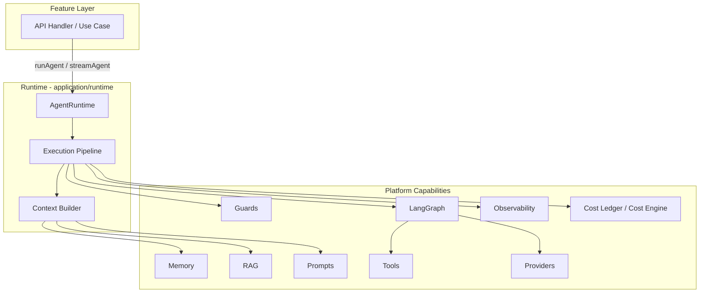

### Runtime vs LangGraph vs Agent vs Provider

| Concept | What It Is | Owns | Does NOT Own |
|---------|-----------|------|--------------|
| **Runtime** | Cross-cutting execution coordinator | Request validation, guards, context assembly, trace/cost wiring, streaming bridge, persistence orchestration, cancellation | Graph node logic, LLM API calls, vector search implementation |
| **LangGraph** | Stateful graph orchestration engine | Node sequencing, conditional routing, tool loops, checkpointing, graph state reducers | Authorization, rate limits, prompt storage, provider adapters |
| **Agent** | Declarative product configuration | Capabilities, default model policy, allowed tools, memory scope, guard thresholds, graph reference | Execution mechanics; agents are data registered in `AgentRegistry` |
| **Provider** | LLM/embedding adapter behind ports | API communication, token counting, streaming normalization, provider-specific retries | Budget enforcement, graph routing, prompt resolution |

**Mental model:** A feature calls `streamAgent('tutor', request)`. The **Runtime** validates the request, runs guards, builds context, and invokes the **Agent**'s compiled **LangGraph**. Graph nodes call **Providers** for inference. The Runtime observes, meters, and streams results back to the feature.

---

## Runtime Responsibilities

| Responsibility | Owner | Runtime Role |
|----------------|-------|--------------|
| Request shape validation | Runtime | Validate DTO; reject malformed scope before any I/O |
| Agent resolution | Runtime + `AgentRegistry` | Load `AgentDefinition` by `agentId` |
| Guard enforcement | Runtime orchestrates; guards execute | Ordered guard chain before graph invocation |
| Context assembly | Runtime `ContextBuilder` | Merge memory, retrieval, prompts into graph-ready state |
| LangGraph invocation | Runtime delegates to `GraphExecutor` | Pass `RunnableConfig` with injected ports |
| Provider routing | Graph nodes via `ModelRouter` | Runtime passes resolved model from Cost Engine (Phase 2+) |
| Streaming bridge | Runtime `StreamCoordinator` | Adapt provider/graph token stream to `AsyncIterable` |
| Structured output | Runtime + graph `structured-output` node | Parse, validate schema, surface typed result |
| Run persistence | Runtime orchestrates | `ai_agent_runs` via cost ledger; feature hooks for messages |
| Observability | Runtime wires trace context | LangSmith run, OTEL root span, correlation ID |
| Cost tracking | Runtime hooks | Pre-authorize, startRun, completeRun/failRun |
| Cancellation | Runtime | Propagate `AbortSignal` through pipeline |
| Timeout enforcement | Runtime | Per-run and per-phase deadlines |

### What the Runtime Does NOT Do

- **Authorization** — Features verify enrollment and roles before calling the platform (ADR-010).
- **Graph node implementation** — Nodes live in `graph/nodes/`; Runtime does not embed business logic.
- **Indexing / evaluation jobs** — Async workers have separate handlers; Runtime is for synchronous agent runs.
- **Replace LangGraph** — No custom state machine for graph routing; LangGraph is the orchestration engine (ADR-002).

---

## Runtime Design Principles

1. **LangGraph stays in charge of graphs** — Runtime coordinates around graphs; it does not reimplement conditional edges or tool loops.
2. **Single pipeline, two modes** — `runAgent` (batch) and `streamAgent` (streaming) share the same pipeline with a mode flag; only the output bridge differs.
3. **Request-scoped isolation** — Every execution gets a unique `runId`, `RuntimeContext`, and `AbortSignal`. No global mutable run state.
4. **Fail-closed on guards** — If guard state cannot be read (Redis/DB unavailable), deny the request (consistent with [13-security.md](./13-security.md#rate-limiting-and-cost-caps)).
5. **Fail-open on observability** — Trace and cost recording failures must not block user responses.
6. **Pre-authorized context only** — Runtime validates scope shape, not permissions (ADR-010).
7. **Ports, not implementations** — Runtime depends on domain ports (`PromptRepositoryPort`, `MemoryStorePort`, `CostLedgerPort`); adapters injected via DI.
8. **Extraction-ready contracts** — `AgentRuntimePort`, DTOs, and events mirror the public API so a future HTTP wrapper is straightforward (ADR-001, ADR-005).
9. **Single developer maintainability** — One pipeline module, explicit phase ordering, no plugin framework in Phase 2.
10. **Thin use cases** — `run-agent.use-case.ts` delegates to `AgentRuntime`; use cases contain no LangGraph imports.

---

## Runtime Architecture

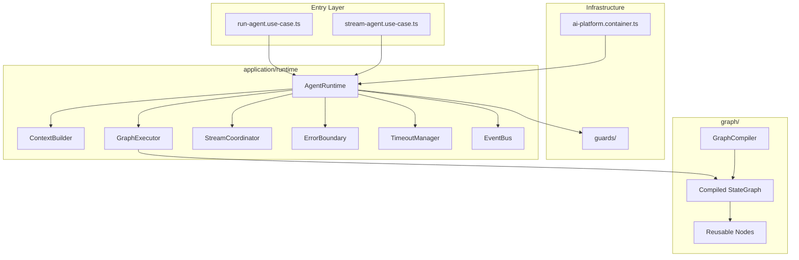

### Layer Placement

The Runtime lives in the **application layer** because it orchestrates use-case-level workflows across capabilities. It imports capability modules (`graph/`, `memory/`, `rag/`, etc.) but capabilities never import the Runtime.

```
domain/          ← RuntimeContext, RuntimeState, AgentExecution models
application/     ← AgentRuntime, ContextBuilder, GraphExecutor, StreamCoordinator
  runtime/       ← Runtime-specific services and pipeline
graph/           ← LangGraph compilation and nodes (invoked by Runtime)
infrastructure/  ← Guards, DI, persistence adapters
```

---

## Runtime Components

| Component | Path | Responsibility |
|-----------|------|----------------|
| **AgentRuntime** | `runtime/agent-runtime.ts` | Pipeline orchestrator; public execution API for use cases |
| **ExecutionPipeline** | `runtime/execution-pipeline.ts` | Ordered phase execution with error boundaries |
| **ContextBuilder** | `runtime/context-builder.ts` | Assemble memory, retrieval, prompts into initial graph state |
| **GraphExecutor** | `runtime/graph-executor.ts` | Invoke compiled LangGraph with `RunnableConfig` |
| **StreamCoordinator** | `runtime/stream-coordinator.ts` | Bridge graph/provider streams to consumer `AsyncIterable` |
| **GuardRunner** | `runtime/guard-runner.ts` | Ordered guard chain with consistent error mapping |
| **TimeoutManager** | `runtime/timeout-manager.ts` | Per-run and per-phase deadline enforcement |
| **ErrorBoundary** | `runtime/error-boundary.ts` | Classify errors, map to `AgentError`, trigger hooks |
| **RuntimeEventBus** | `runtime/runtime-event-bus.ts` | Emit typed events for hooks and observability |
| **StructuredOutputParser** | `runtime/structured-output-parser.ts` | Schema validation for non-streaming agents |
| **RetrievalCoordinator** | `application/services/retrieval-coordinator.service.ts` | Scope-aware RAG invocation (shared with direct `retrieveContext`) |

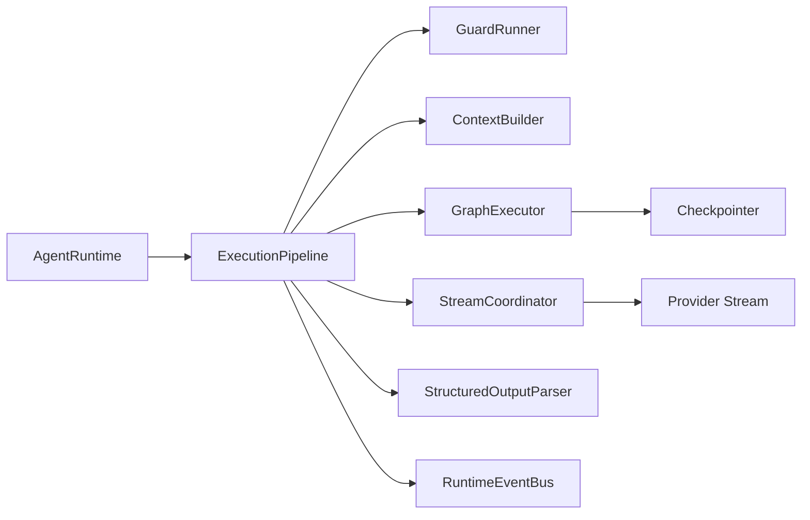

---

## Agent Execution Lifecycle

An **AgentExecution** is a single runtime instance from request acceptance to terminal state.

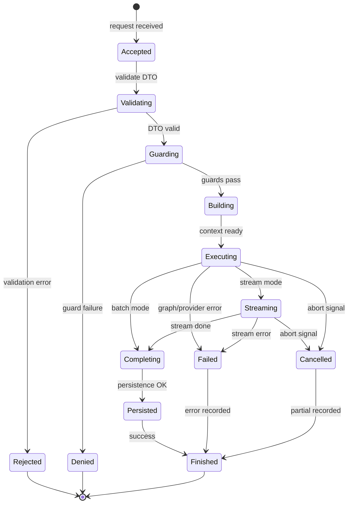

### Lifecycle Stages

| Stage | `RuntimeState` | Primary Component |
|-------|----------------|-------------------|
| Accept | `accepted` | `AgentRuntime.execute()` |
| Validate | `validating` | DTO Zod schema + scope shape validation |
| Guard | `guarding` | `GuardRunner` |
| Build context | `building` | `ContextBuilder` |
| Execute graph | `executing` | `GraphExecutor` |
| Stream tokens | `streaming` | `StreamCoordinator` (stream mode only) |
| Complete | `completing` | Structured output parse, hooks |
| Persist | `persisting` | Cost ledger, feature hooks |
| Terminal | `finished` / `failed` / `cancelled` / `denied` | Event emission, span close |

---

## Request Lifecycle

A request enters the platform after the feature has authenticated and authorized the caller. The Runtime owns everything from the platform boundary inward.

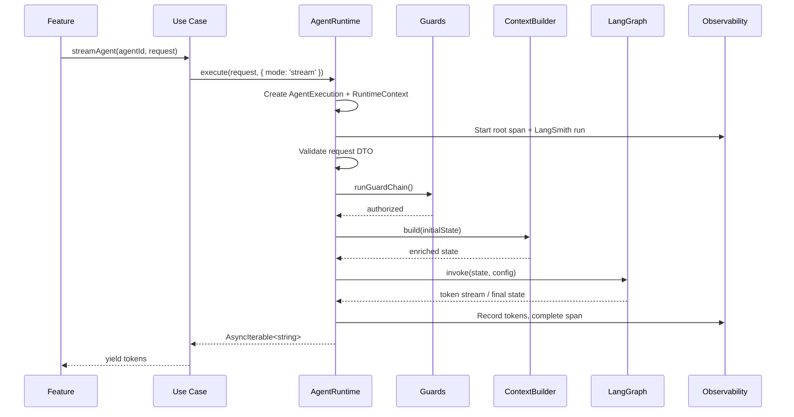

### Caller Contract

Features pass an `AgentRunRequest` with pre-authorized context:

```typescript
interface AgentRunRequest {
  userId: string;
  input: string;
  locale?: 'ar' | 'en';
  scope: AgentScope;           // Product-specific: courseId, threadId, etc.
  options?: AgentRunOptions;
}

interface AgentRunOptions {
  promptVersion?: string;
  promptLabel?: string;
  modelOverride?: string;      // Admin/debug only; subject to Cost Engine
  maxTokens?: number;
  signal?: AbortSignal;        // Client disconnect cancellation
  correlationId?: string;
  metadata?: Record<string, unknown>;
}
```

The Runtime returns:

```typescript
// Batch mode
interface AgentRunResult {
  runId: string;
  output: string;
  structuredOutput?: unknown;    // When agent has STRUCTURED_OUTPUT capability
  tokensUsed: TokenUsage;
  estimatedCost: number;
  promptVersion: string;
  model: string;
  durationMs: number;
}

// Stream mode: AsyncIterable<string> with metadata available via hooks/events
```

---

## Runtime Pipeline

The pipeline executes phases in a fixed order. Each phase is an **error boundary** — failures are classified, recorded, and mapped to typed errors without leaking internal details.

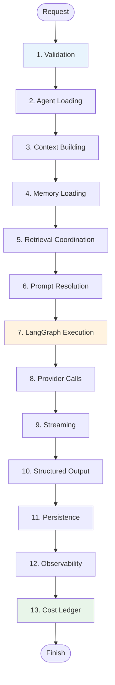

| Phase | Executes In | Skipped When |
|-------|-------------|--------------|
| 1. Validation | Runtime | Never |
| 2. Agent Loading | Runtime + `AgentRegistry` | Never |
| 3. Context Building | `ContextBuilder` | Never |
| 4. Memory Loading | `ContextBuilder` → memory ports | Agent has no memory capability |
| 5. Retrieval | `ContextBuilder` → `RetrievalCoordinator` | Agent lacks `RAG` capability |
| 6. Prompt Resolution | `ContextBuilder` → `PromptRepositoryPort` | Prompt pre-resolved in options (debug only) |
| 7. LangGraph Execution | `GraphExecutor` | Never |
| 8. Provider Calls | Inside graph nodes | N/A — Runtime does not call providers directly |
| 9. Streaming | `StreamCoordinator` | `runAgent` batch mode |
| 10. Structured Output | `StructuredOutputParser` | Agent lacks `STRUCTURED_OUTPUT` |
| 11. Persistence | Runtime + hooks | Configurable per agent |
| 12. Observability | Runtime event handlers | Never (fail-open) |
| 13. Cost Ledger | `CostLedgerService` | Never (fail-open on write failure) |

Phases 4–6 run inside **Context Building** but are documented separately because each integrates a distinct platform subsystem.

---

## Runtime State

`RuntimeState` tracks the execution state machine for a single `AgentExecution`. It is distinct from **LangGraph state** (`BaseAgentState`) — Runtime state is meta-orchestration; graph state is domain data flowing through nodes.

```typescript
type RuntimePhase =
  | 'accepted'
  | 'validating'
  | 'guarding'
  | 'building'
  | 'executing'
  | 'streaming'
  | 'completing'
  | 'persisting'
  | 'finished'
  | 'failed'
  | 'cancelled'
  | 'denied';

interface RuntimeState {
  runId: string;
  agentId: string;
  phase: RuntimePhase;
  mode: 'batch' | 'stream';

  startedAt: Date;
  phaseStartedAt: Date;
  completedAt?: Date;

  // Accumulated across phases
  tokenUsage: TokenUsage;
  estimatedCost: number;
  resolvedModelId?: string;
  promptVersion?: string;

  // Error tracking
  error?: AgentError;
  partialOutput?: string;

  // Phase timing (for observability)
  phaseDurations: Partial<Record<RuntimePhase, number>>;
}

interface TokenUsage {
  input: number;
  output: number;
  embedding?: number;
}
```

### State Transitions

| From | Event | To |
|------|-------|-----|
| `accepted` | `VALIDATION_START` | `validating` |
| `validating` | `VALIDATION_PASS` | `guarding` |
| `validating` | `VALIDATION_FAIL` | `denied` |
| `guarding` | `GUARD_PASS` | `building` |
| `guarding` | `GUARD_DENY` | `denied` |
| `building` | `CONTEXT_READY` | `executing` |
| `executing` | `GRAPH_START` | `executing` |
| `executing` | `STREAM_START` | `streaming` |
| `streaming` | `STREAM_END` | `completing` |
| `executing` | `GRAPH_END` | `completing` |
| `completing` | `PERSIST_START` | `persisting` |
| `persisting` | `PERSIST_DONE` | `finished` |
| any active | `ERROR` | `failed` |
| any active | `CANCEL` | `cancelled` |

Runtime state is held in-memory for the request duration. Durable run records live in `ai_agent_runs` (observability/cost).

---

## Runtime Context

`RuntimeContext` is the **request-scoped coordination object** passed through every pipeline phase, hook, and graph `RunnableConfig.configurable`. It bundles identity, dependencies, cancellation, and tracing metadata.

```typescript
interface RuntimeContext {
  // Identity
  runId: string;
  agentId: string;
  userId: string;
  locale: 'ar' | 'en';
  scope: AgentScope;
  mode: 'batch' | 'stream';
  correlationId: string;

  // Agent configuration (resolved at load time)
  agent: AgentDefinition;

  // Execution control
  signal: AbortSignal;
  deadlines: RuntimeDeadlines;

  // Resolved runtime dependencies (injected via DI)
  ports: RuntimePorts;

  // Observability
  trace: TraceContext;          // LangSmith run ID, OTEL span context

  // Mutable execution state
  state: RuntimeState;

  // Options from caller
  options: AgentRunOptions;
}

interface RuntimePorts {
  promptRepository: PromptRepositoryPort;
  memoryStore: MemoryStorePort;
  conversationMemory: ConversationMemoryPort;
  retrievalCoordinator: RetrievalCoordinatorPort;
  costLedger: CostLedgerPort;
  costEngine?: CostEnginePort;  // Phase 2+
  toolExecutor: ToolExecutorPort;
  modelRouter: ModelRouterPort;
}

interface RuntimeDeadlines {
  runDeadline: Date;              // Total run timeout (default: 120s)
  guardDeadline: Date;            // Guard chain timeout (default: 5s)
  contextBuildDeadline: Date;     // Memory + RAG + prompts (default: 15s)
  graphDeadline: Date;            // LangGraph execution (default: 90s)
}

interface TraceContext {
  langsmithRunId?: string;
  otelSpan?: Span;
  metadata: Record<string, string>;
}
```

### Request-Scoped State Rules

1. **One context per execution** — Created at pipeline start; never shared across concurrent runs.
2. **Immutable identity** — `runId`, `userId`, `agentId` do not change after creation.
3. **Mutable `state`** — `RuntimeState` updated by pipeline phases; graph nodes update LangGraph state separately.
4. **Signal propagation** — `AbortSignal` linked to client disconnect (API route) and timeout manager.
5. **No global singletons** — Ports resolved from DI container but context is per-request.
6. **Thread-safe assumption** — Single Node.js event loop per request; no cross-thread sharing.

---

## Context Builder

The `ContextBuilder` assembles everything the LangGraph needs before invocation. It runs during the **building** phase and produces the initial graph state plus `RunnableConfig`.

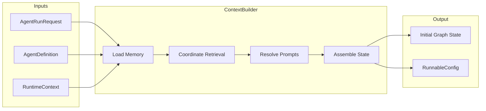

```typescript
interface ContextBuilderPort {
  build(
    request: AgentRunRequest,
    context: RuntimeContext,
  ): Promise<BuiltContext>;
}

interface BuiltContext {
  initialState: AgentState;       // Product-specific state (e.g., TutorAgentState)
  runnableConfig: RunnableConfig; // LangGraph config with injected ports
  metadata: {
    promptVersion: string;
    memoryFactCount: number;
    retrievedChunkCount: number;
    conversationMessageCount: number;
  };
}
```

### Assembly Order

1. **Conversation history** — `ConversationMemoryPort.assembleHistory()` scoped to `threadId` in `scope`.
2. **Session cache** — Redis session context if available (see [06-memory.md](./06-memory.md#short-term-memory-redis)).
3. **Long-term facts** — `MemoryStorePort.getFacts()` when agent `memoryScope` includes long-term.
4. **Retrieval** — `RetrievalCoordinator.retrieve()` when agent has `RAG` capability.
5. **Prompt resolution** — `PromptRepositoryPort.getPrompt()` for system prompt and node-specific prompts.
6. **State merge** — Populate `BaseAgentState` fields: `systemPrompt`, `conversationHistory`, `retrievedChunks`, `input`, `locale`.

The builder respects `context.deadlines.contextBuildDeadline`. If memory or retrieval exceeds the deadline, the builder fails with `CONTEXT_BUILD_TIMEOUT` rather than silently omitting context.

---

## Guard Execution

Guards run after validation and before context building. The `GuardRunner` executes an ordered chain; the first failure short-circuits the pipeline.

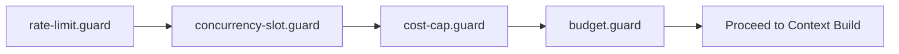

| Guard | Phase | Fail Mode | Phase |
|-------|-------|-----------|-------|
| `rate-limit.guard` | 1 | Fail-closed | 1 |
| `concurrency-slot.guard` | 1 | Fail-closed | 1 |
| `cost-cap.guard` | 1 | Fail-closed | 1 |
| `budget.guard` | 2+ | Fail-closed | 2 |

```typescript
interface GuardRunnerPort {
  runChain(
    agent: AgentDefinition,
    context: RuntimeContext,
  ): Promise<GuardResult>;
}

interface GuardResult {
  allowed: boolean;
  resolvedModelId?: string;       // From CostEngine.authorizeSpend (Phase 2+)
  policyActions?: string[];       // e.g., 'model_downgrade'
  denialReason?: GuardDenialCode;
}

type GuardDenialCode =
  | 'RATE_LIMIT_EXCEEDED'
  | 'CONCURRENCY_LIMIT'
  | 'DAILY_COST_CAP'
  | 'BUDGET_EXHAUSTED'
  | 'QUOTA_EXCEEDED';
```

Guard thresholds come from `AgentDefinition.guards` with global env fallbacks. The Runtime maps denials to `AgentError` with appropriate HTTP status hints for features (429 for rate limit, 402 for cost cap).

See [13-security.md](./13-security.md#rate-limiting-and-cost-caps) and [16-cost-engine.md](./16-cost-engine.md#cost-guard-integration).

---

## Memory Loading

Memory loading is part of context building, scoped by the agent's `memoryScope` capability.

| `memoryScope` | Loads | Source |
|---------------|-------|--------|
| `SESSION` | Session context cache | Redis `ai:session:{threadId}` |
| `CONVERSATION` | Thread message history | Feature repo via `ConversationMemoryPort` |
| `LONG_TERM` | User facts and preferences | PostgreSQL `ai_memory_facts` |

```typescript
interface MemoryLoadResult {
  conversationHistory: Message[];
  sessionContext?: SessionContext;
  longTermFacts: MemoryFact[];
  tokenEstimate: number;          // For context budget checks
}
```

### Token Budget

Before passing history to the graph, the builder applies token budget policy (`domain/policies/token-budget.policy.ts`):

1. Count estimated tokens in conversation history.
2. If over budget, invoke context summarizer (`memory/summarizer/`) — Phase 3.
3. Phase 2: truncate oldest messages until within budget.
4. Record `memory_truncated` event if truncation occurs.

### Cache Behavior

- **Redis hit** — Skip DB assembly for session context; still load conversation if `CONVERSATION` scope.
- **Redis miss** — Assemble from PostgreSQL; write-through to Redis.
- **Redis failure** — Fail-open on read; log warning; proceed with DB assembly.

---

## Retrieval Coordination

When the agent declares `RAG` capability, the `ContextBuilder` invokes `RetrievalCoordinator` — the same service backing the public `retrieveContext()` API.

```typescript
interface RetrievalCoordinatorPort {
  retrieve(
    query: RetrievalQuery,
    options: RetrievalOptions,
    context: RuntimeContext,
  ): Promise<RetrievedChunk[]>;
}

interface RetrievalQuery {
  text: string;
  scope: RetrievalScope;        // courseId, lectureId, sensitivity filters
  locale: 'ar' | 'en';
}

interface RetrievalOptions {
  topK?: number;                // Default from agent definition
  minScore?: number;
  rerank?: boolean;
}
```

### Coordination vs Graph Node Retrieval

| Approach | When | Rationale |
|----------|------|-----------|
| **Pre-fetch in ContextBuilder** | Default for tutor-like agents | Single retrieval before generation; lower latency |
| **Deferred in `retrieve-context` node** | Multi-step graphs with conditional retrieval | Retrieval only when classify-intent routes to RAG |

The Runtime supports both: `ContextBuilder` pre-fetches when `agent.capabilities` includes `RAG` and `agent.retrievalMode === 'eager'`. Otherwise, initial state contains the query and the graph's `retrieve-context` node performs retrieval at runtime.

Retrieval respects course scope and sensitivity filters per [05-rag.md](./05-rag.md). Retrieved chunks are stored in graph state as `retrievedChunks`.

---

## Prompt Resolution

Prompts are resolved via `PromptRepositoryPort` during context building (eager) or by graph nodes (lazy per node).

```typescript
interface PromptResolution {
  systemPrompt: ResolvedPrompt;
  nodePrompts?: Record<string, ResolvedPrompt>;  // e.g., 'validate-output'
  totalResolutionMs: number;
}
```

### Resolution Flow

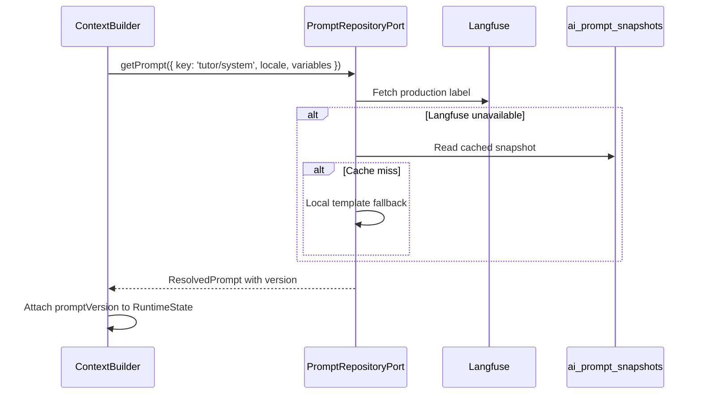

Every resolved prompt's `version` is recorded in:

- `RuntimeState.promptVersion`
- LangSmith run metadata
- OTEL span attribute `ai.prompt.version`
- `ai_agent_runs.prompt_version` column

See [08-prompts.md](./08-prompts.md).

---

## Graph Execution

`GraphExecutor` invokes the compiled LangGraph produced by `GraphCompiler`. The Runtime does not interpret graph structure — it passes state and config, then awaits completion or stream.

```typescript
interface GraphExecutorPort {
  invoke(
    graphId: string,
    initialState: AgentState,
    config: RunnableConfig,
    context: RuntimeContext,
  ): Promise<GraphExecutionResult>;

  stream(
    graphId: string,
    initialState: AgentState,
    config: RunnableConfig,
    context: RuntimeContext,
  ): AsyncIterable<GraphStreamEvent>;
}

interface RunnableConfig {
  configurable: {
    runtimeContext: RuntimeContext;
    ports: RuntimePorts;
    resolvedModelId: string;
  };
  callbacks: BaseCallbackHandler[];  // LangSmith tracing
  signal: AbortSignal;
  recursionLimit: number;            // Default: 25 (tool loops)
}

interface GraphExecutionResult {
  finalState: AgentState;
  tokenUsage: TokenUsage;
  nodeExecutions: NodeExecutionSummary[];
}
```

### Graph Compiler Integration

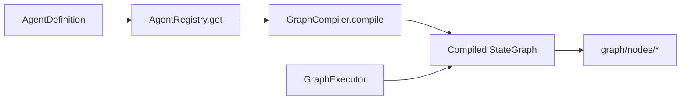

Compiled graphs are cached as singletons at startup. The executor retrieves by `agent.graphId`.

### Checkpointing

When a checkpointer is configured, LangGraph persists state after each node. The Runtime:

- Passes `runId` as checkpoint thread ID
- Does not manage checkpoint storage directly
- On resume (future), accepts `checkpointId` in `AgentRunOptions`

See [04-agents.md](./04-agents.md#checkpointing).

---

## Tool Execution Lifecycle

Tool execution occurs **inside** LangGraph via the `tool-call` node. The Runtime provides the `ToolExecutorPort` through `RunnableConfig` but does not invoke tools directly.

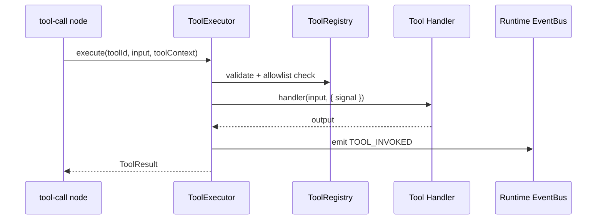

### Tool Context from Runtime

```typescript
interface ToolContext {
  userId: string;
  agentRunId: string;             // Same as RuntimeContext.runId
  scope: AgentScope;
  signal: AbortSignal;            // Linked to RuntimeContext.signal
}
```

### Tool Loop Limits

| Limit | Default | Enforced By |
|-------|---------|-------------|
| Max tool iterations per run | 5 | LangGraph `recursionLimit` |
| Max concurrent tool calls | 3 | `ToolExecutor` semaphore |
| Per-tool timeout | 30s | `ToolExecutor` + `AbortSignal` |
| Agent allowlist | Per definition | `ToolRegistry.list(agentId)` |

Tool errors are non-fatal — passed back to the LLM for retry or explanation. See [07-tools.md](./07-tools.md).

---

## Streaming Lifecycle

`streamAgent()` activates the streaming pipeline. The `StreamCoordinator` bridges LangGraph/provider token events to a consumer-friendly `AsyncIterable<string>`.

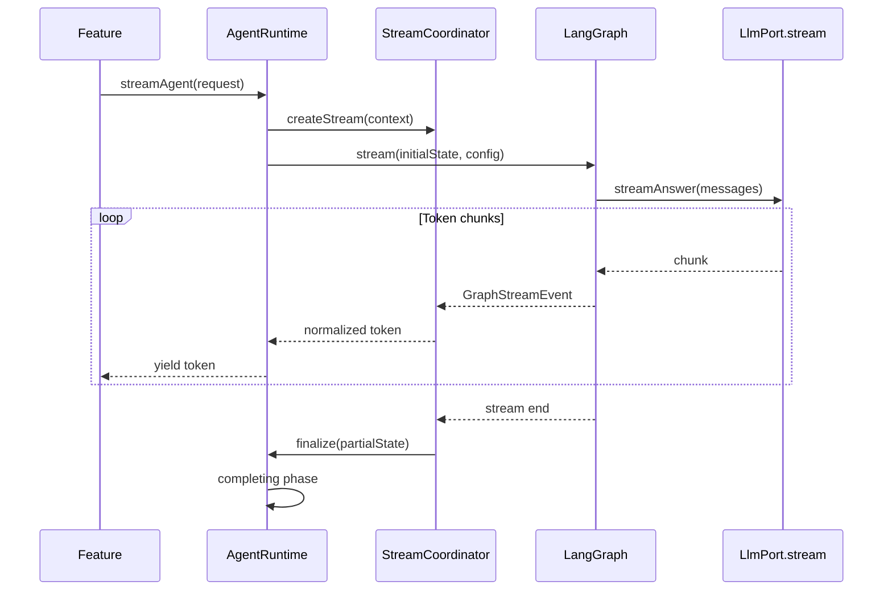

### Stream Events

```typescript
type GraphStreamEvent =
  | { type: 'token'; content: string }
  | { type: 'tool_start'; toolId: string }
  | { type: 'tool_end'; toolId: string; durationMs: number }
  | { type: 'node_start'; nodeId: string }
  | { type: 'node_end'; nodeId: string }
  | { type: 'error'; error: AgentError }
  | { type: 'done'; finalState: AgentState };

interface StreamCoordinatorPort {
  createStream(
    graphStream: AsyncIterable<GraphStreamEvent>,
    context: RuntimeContext,
  ): AsyncIterable<string>;
}
```

### Streaming Coordination Rules

1. **Backpressure** — Consumer `for await` pace controls pull; no unbounded buffering.
2. **Normalization** — Provider-specific stream formats normalized to string tokens in coordinator.
3. **Partial state** — Coordinator accumulates `partialOutput` in `RuntimeState` for cancellation/failure recovery.
4. **Hook firing** — `onToken` runtime hook (optional) fires per chunk for features needing side effects.
5. **Client disconnect** — API route aborts `signal`; coordinator stops consuming graph stream.
6. **Validation deferral** — Output validation runs after stream completes (in graph `validate-output` node), not per token.

### SSE Bridge (Feature Responsibility)

The Runtime yields tokens; features wrap in SSE (`text/event-stream`). The platform provides `shared/streaming.ts` helpers but does not own HTTP response formatting.

---

## Structured Output Handling

Agents with `STRUCTURED_OUTPUT` capability (e.g., Assignment Evaluator) use batch mode. The graph's `structured-output` node produces JSON; the Runtime validates against the agent's declared schema.

```typescript
interface StructuredOutputConfig {
  schema: ZodSchema | JSONSchema;
  maxRepairAttempts: number;      // Default: 1 — re-prompt on parse failure
}

interface StructuredOutputResult<T> {
  data: T;
  raw: string;
  repairAttempts: number;
  valid: boolean;
}
```

### Handling Flow

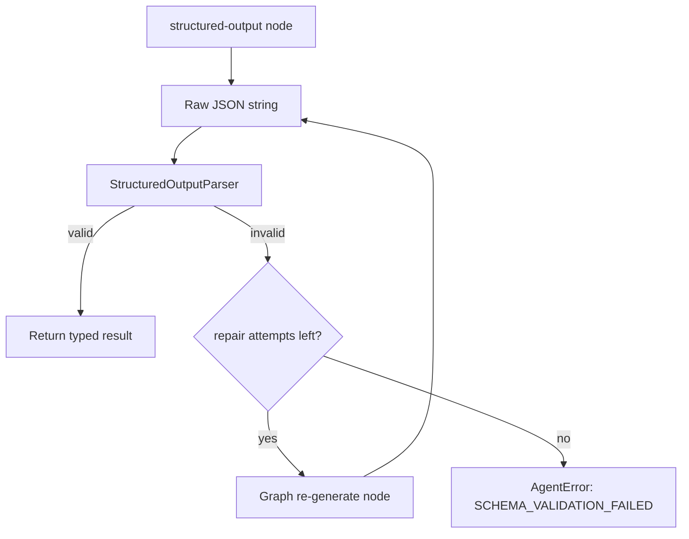

The parser runs in the **completing** phase. Validation failures are `AgentError` with `retryable: false` — features should not auto-retry schema failures without user input.

---

## Persistence

Persistence is split between platform run metadata and feature-owned conversation data.

| Data | Owner | When | Storage |
|------|-------|------|---------|
| Run record (tokens, cost, status) | Platform (`CostLedgerService`) | Start + complete/fail | `ai_agent_runs` |
| Conversation messages | Feature (via lifecycle hook) | `onComplete` hook | Feature tables (e.g., `tutor_messages`) |
| Tool invocations | Platform | Per tool call | `ai_tool_invocations` (Phase 3) |
| Memory facts | Platform | `onComplete` or graph node | `ai_memory_facts` (Phase 3) |
| LangGraph checkpoints | Platform | Per node (if enabled) | PostgreSQL checkpointer table |

```typescript
interface PersistenceCoordinator {
  startRun(context: RuntimeContext): Promise<void>;
  completeRun(context: RuntimeContext, result: AgentRunResult): Promise<void>;
  failRun(context: RuntimeContext, error: AgentError): Promise<void>;
}
```

### Persistence Ordering

1. `startRun` — Insert `ai_agent_runs` with `status: running` (after guards pass).
2. Graph executes — Token counts accumulate in graph state.
3. `completeRun` / `failRun` — Update run row with final tokens, cost, status, duration.
4. Feature `onComplete` hook — Persist messages (outside platform tables).

Post-record failures are logged but do not fail the user response (consistent with Cost Engine pre-check/post-record pattern in [16-cost-engine.md](./16-cost-engine.md#design-principles)).

---

## Observability Integration

The Runtime is the **root span** for every agent execution. It wires tracing context before validation and closes spans in the terminal phase.

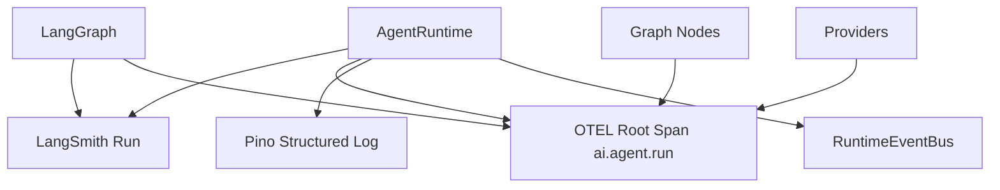

### Integration Points

| Lifecycle Point | LangSmith | OTEL | Pino | Cost Ledger |
|-----------------|-----------|------|------|-------------|
| Run start | Create run | `ai.agent.run` span | `agent.run.start` | `startRun()` |
| Guard deny | Metadata event | `ai.guard.denied` event | `warn` | — |
| Context built | Metadata | `ai.context.build` child span | `debug` | — |
| Graph invoke | Auto child spans | `ai.graph.execute` | `debug` | — |
| LLM call | Auto child spans | `ai.llm.stream` | `debug` | Token accumulate |
| Stream complete | Run end | Close spans | `agent.run.complete` | `completeRun()` |
| Error | Run error | Span error status | `error` | `failRun()` |

### Correlation

`RuntimeContext.correlationId` propagates to:

- Pino `correlationId` field
- OTEL `ai.correlation.id` attribute
- LangSmith run metadata
- Feature API response headers (`X-Correlation-Id`)

See [09-observability.md](./09-observability.md).

---

## Cost Tracking Integration

The Runtime integrates with the cost ledger (Phase 1) and Cost Engine (Phase 2+) at three points — matching [16-cost-engine.md](./16-cost-engine.md#integration-with-agent-runtime).

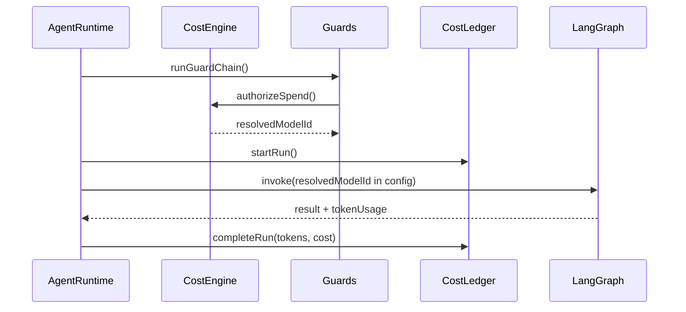

| Hook | When | Action |
|------|------|--------|
| **Pre-run** | Guard phase | `CostEngine.authorizeSpend()` → `resolvedModelId` |
| **Run start** | After guards | `CostLedgerService.startRun()` |
| **Per LLM node** | During graph | Tokens accumulate in graph state |
| **Run complete** | Completing phase | `CostLedgerService.completeRun()` |
| **Run failure** | Error boundary | `CostLedgerService.failRun()` with partial usage |

Phase 1: Guards call ledger directly for daily caps. Phase 2: `budget.guard` delegates to `CostEngine`. The Runtime does not change its integration contract — only the guard implementation evolves.

---

## Error Handling

The `ErrorBoundary` classifies errors by origin and maps them to the platform error taxonomy.

```typescript
interface AgentError {
  code: AgentErrorCode;
  message: string;
  retryable: boolean;
  cause?: Error;
  runId: string;
  phase: RuntimePhase;
}

type AgentErrorCode =
  | 'VALIDATION_FAILED'
  | 'AGENT_NOT_FOUND'
  | 'GUARD_DENIED'
  | 'CONTEXT_BUILD_FAILED'
  | 'CONTEXT_BUILD_TIMEOUT'
  | 'RETRIEVAL_FAILED'
  | 'PROMPT_RESOLUTION_FAILED'
  | 'GRAPH_EXECUTION_FAILED'
  | 'PROVIDER_ERROR'
  | 'STREAM_INTERRUPTED'
  | 'SCHEMA_VALIDATION_FAILED'
  | 'RUN_TIMEOUT'
  | 'CANCELLED'
  | 'INTERNAL_ERROR';
```

### Error Boundaries

Each pipeline phase is an error boundary:

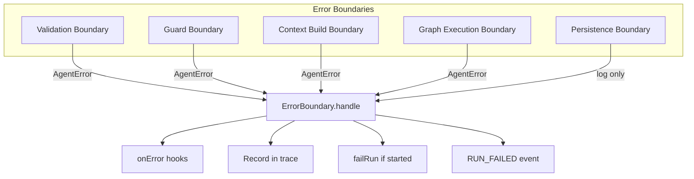

| Boundary | User-Facing | Record Run | Trigger `onError` |
|----------|-------------|------------|-------------------|
| Validation | Yes — 400 | No | No |
| Guard | Yes — 429/402 | No | No |
| Context Build | Yes — 500 | If started | Yes |
| Graph Execution | Yes — 502 | Yes | Yes |
| Persistence | No — silent log | Best effort | No |

### Provider Error Mapping

Provider adapters throw `ProviderError` with `retryable` flag. The graph's `generate-response` node catches provider errors; the Runtime maps them at the graph boundary:

- `retryable: true` → `PROVIDER_ERROR` (may trigger resilient adapter retry inside node)
- `retryable: false` → `PROVIDER_ERROR` (auth, invalid request — no retry)

---

## Retry Strategy

Retries occur at **three layers** — each with distinct scope and ownership.

```mermaid
flowchart TB
  subgraph layer1 [Layer 1 - Provider Adapter]
    RA[ResilientLlmAdapter]
    RA -->|429, 5xx, timeout| Backoff[Exponential backoff 3x]
  end

  subgraph layer2 [Layer 2 - Model Router]
    FB[Fallback Chain]
    FB -->|retryable provider error| Alt[Alternate model/provider]
  end

  subgraph layer3 [Layer 3 - Graph Node]
    GN[validate-output node]
    GN -->|policy violation| ReGen[Re-generate once]
  end

  subgraph noRetry [No Retry - Runtime]
    RT[AgentRuntime]
    RT -->|guard deny, validation, cancel| Fail[Immediate fail]
  end
```

| Layer | Owner | Retries | Scope |
|-------|-------|---------|-------|
| **Provider adapter** | `providers/resilient/` | Up to 3 with backoff | Single LLM call |
| **Fallback chain** | `router/fallback-chain.ts` | 1 per fallback model | Single LLM call |
| **Graph node** | `validate-output`, `structured-output` | 1 re-generation | Single node cycle |
| **Runtime pipeline** | `AgentRuntime` | **None** | Full run |
| **Tool executor** | `tools/executor/` | None — LLM decides retry | Single tool call |

### Why the Runtime Does Not Retry Full Runs

- Retrying a full run doubles cost and latency.
- Guard state may change between attempts (rate limit).
- Partial streaming output cannot be cleanly retried.
- Provider-level retries handle transient failures with minimal scope.

Features may implement their own retry for `retryable: true` `PROVIDER_ERROR` at the API layer — the Runtime exposes this signal but does not auto-retry.

---

## Cancellation

Cancellation propagates via `AbortSignal` from the client through the entire execution stack.

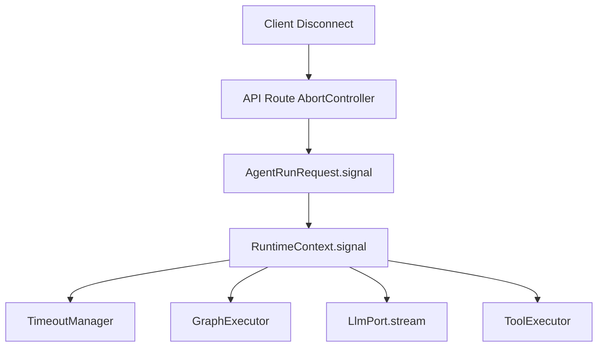

### Cancellation Rules

1. **Signal linking** — API route links client disconnect to `AbortSignal` passed in request options.
2. **Timeout linking** — `TimeoutManager` calls `abort()` on run deadline exceeded.
3. **Cooperative cancellation** — All async operations check `signal.aborted` between awaits.
4. **Stream cleanup** — `StreamCoordinator` destroys underlying generator on abort.
5. **State transition** — `RuntimeState.phase` → `cancelled`.
6. **Partial persistence** — `failRun()` with partial tokens and `partialOutput` if available.
7. **No orphan spans** — OTEL span and LangSmith run closed with `cancelled` status.

```typescript
interface CancellationResult {
  runId: string;
  partialOutput: string;
  tokensUsed: TokenUsage;
  cancelledAt: Date;
  cancelReason: 'client_abort' | 'timeout' | 'manual';
}
```

### Cancellation vs Timeout

| Trigger | `cancelReason` | Typical Source |
|---------|----------------|----------------|
| Client closes SSE connection | `client_abort` | API route `req.on('close')` |
| Run deadline exceeded | `timeout` | `TimeoutManager` |
| Feature calls `AbortController.abort()` | `manual` | Admin cancel (future) |

---

## Timeout Management

`TimeoutManager` enforces nested deadlines to prevent hung runs from consuming concurrency slots.

```typescript
interface TimeoutConfig {
  runTimeoutMs: number;           // Default: 120_000
  guardTimeoutMs: number;         // Default: 5_000
  contextBuildTimeoutMs: number;  // Default: 15_000
  graphTimeoutMs: number;         // Default: 90_000
  streamInactivityMs: number;       // Default: 30_000 — no token received
}

interface TimeoutManagerPort {
  createDeadlines(config: TimeoutConfig): RuntimeDeadlines;
  watchRun(context: RuntimeContext): void;
  clear(runId: string): void;
}
```

### Timeout Policies

| Policy | Behavior |
|--------|----------|
| **Run timeout** | Hard limit on total execution; aborts all in-flight operations |
| **Phase timeout** | Guard and context-build have independent shorter limits |
| **Stream inactivity** | If no token received within `streamInactivityMs`, abort stream (provider may be hung) |
| **Tool timeout** | Per-tool limit in `ToolExecutor` (30s default), independent of run timeout |
| **Graph recursion** | LangGraph `recursionLimit` prevents infinite tool loops |

### Per-Agent Overrides

```typescript
interface AgentDefinition {
  // ...
  timeouts?: Partial<TimeoutConfig>;
}
```

Evaluator agents may use longer `graphTimeoutMs` (300s) for large submissions. Tutor streaming uses shorter `streamInactivityMs` (15s) for responsive UX.

---

## Runtime Events

`RuntimeEventBus` emits typed events for observability, hooks, and future event-driven extensions.

```typescript
type RuntimeEventType =
  | 'RUN_ACCEPTED'
  | 'RUN_VALIDATED'
  | 'GUARD_PASSED'
  | 'GUARD_DENIED'
  | 'CONTEXT_BUILT'
  | 'GRAPH_STARTED'
  | 'GRAPH_NODE_STARTED'
  | 'GRAPH_NODE_COMPLETED'
  | 'STREAM_STARTED'
  | 'TOKEN_EMITTED'
  | 'STREAM_ENDED'
  | 'TOOL_INVOKED'
  | 'TOOL_COMPLETED'
  | 'STRUCTURED_OUTPUT_PARSED'
  | 'RUN_COMPLETED'
  | 'RUN_FAILED'
  | 'RUN_CANCELLED';

interface RuntimeEvent<T extends RuntimeEventType = RuntimeEventType> {
  type: T;
  runId: string;
  agentId: string;
  timestamp: Date;
  payload: RuntimeEventPayload[T];
}

interface RuntimeEventPayload {
  RUN_ACCEPTED: { mode: 'batch' | 'stream' };
  GUARD_DENIED: { code: GuardDenialCode };
  CONTEXT_BUILT: { promptVersion: string; chunkCount: number };
  TOKEN_EMITTED: { token: string; index: number };
  TOOL_INVOKED: { toolId: string; input: Record<string, unknown> };
  RUN_COMPLETED: { durationMs: number; tokensUsed: TokenUsage };
  RUN_FAILED: { error: AgentError };
  RUN_CANCELLED: { reason: string; partialOutput: string };
  // ... other payloads
}
```

### Event Consumers

| Consumer | Events Used | Purpose |
|----------|-------------|---------|
| OTEL span helpers | `GRAPH_*`, `TOOL_*` | Child span creation |
| Platform metrics | `RUN_*`, `GUARD_*` | Throughput, error rate counters |
| Runtime hooks | `RUN_COMPLETED`, `RUN_FAILED` | Feature side effects |
| Debug mode | All | `AI_PLATFORM_DEBUG_EVENTS=true` structured logs |

Events are synchronous within the request (in-process). No external message broker — consistent with ADR-005.

---

## Runtime Hooks

Runtime hooks extend execution at well-defined points without modifying the pipeline. They complement **agent lifecycle hooks** defined in [04-agents.md](./04-agents.md#lifecycle-hooks).

### Runtime Hooks vs Agent Lifecycle Hooks

| Aspect | Runtime Hooks | Agent Lifecycle Hooks |
|--------|---------------|----------------------|
| **Defined in** | `application/runtime/runtime-hooks.ts` | `agents/base/agent-lifecycle.ts` |
| **Scope** | Platform-wide extension points | Per-agent product side effects |
| **Registered by** | Platform (DI container) | Agent definition |
| **Examples** | Metrics, debug logging | Persist tutor message after completion |

```typescript
interface RuntimeHooks {
  // Pipeline lifecycle
  onRunAccepted?(context: RuntimeContext): Promise<void>;
  onGuardPassed?(context: RuntimeContext, result: GuardResult): Promise<void>;
  onContextBuilt?(context: RuntimeContext, built: BuiltContext): Promise<void>;
  onGraphStarted?(context: RuntimeContext): Promise<void>;
  onGraphCompleted?(context: RuntimeContext, result: GraphExecutionResult): Promise<void>;

  // Streaming
  onStreamStarted?(context: RuntimeContext): Promise<void>;
  onToken?(context: RuntimeContext, token: string, index: number): Promise<void>;
  onStreamEnded?(context: RuntimeContext, partialOutput: string): Promise<void>;

  // Terminal
  onRunCompleted?(context: RuntimeContext, result: AgentRunResult): Promise<void>;
  onRunFailed?(context: RuntimeContext, error: AgentError): Promise<void>;
  onRunCancelled?(context: RuntimeContext, result: CancellationResult): Promise<void>;
}
```

```typescript
interface AgentLifecycleHooks {
  onStart?(context: AgentRunContext): Promise<void>;
  onNodeComplete?(nodeId: string, state: AgentState): Promise<void>;
  onComplete?(result: AgentRunResult): Promise<void>;
  onError?(error: AgentError): Promise<void>;
}
```

### Hook Execution Order (Success Path)

1. `RuntimeHooks.onRunAccepted`
2. `AgentLifecycleHooks.onStart`
3. `RuntimeHooks.onGuardPassed`
4. `RuntimeHooks.onContextBuilt`
5. `RuntimeHooks.onGraphStarted`
6. `RuntimeHooks.onStreamStarted` (stream mode)
7. `RuntimeHooks.onToken` × N (stream mode)
8. `AgentLifecycleHooks.onNodeComplete` × N (per graph node)
9. `RuntimeHooks.onStreamEnded` (stream mode)
10. `RuntimeHooks.onGraphCompleted`
11. `AgentLifecycleHooks.onComplete`
12. `RuntimeHooks.onRunCompleted`

Hook failures in feature code (`AgentLifecycleHooks`) propagate as errors. Platform `RuntimeHooks` catch and log failures (fail-open) — metrics must not break agent runs.

---

## Runtime Interfaces

Core ports and types for the Runtime module.

```typescript
// application/runtime/ports/agent-runtime.port.ts
interface AgentRuntimePort {
  run(request: AgentRunRequest): Promise<AgentRunResult>;
  stream(request: AgentRunRequest): AsyncIterable<string>;
}

// domain/models/agent-execution.ts
interface AgentExecution {
  id: string;                     // Same as runId
  agentId: string;
  userId: string;
  mode: 'batch' | 'stream';
  context: RuntimeContext;
  state: RuntimeState;
  createdAt: Date;
}

// application/runtime/runtime-hooks.ts
interface RuntimeHooksRegistry {
  register(hooks: Partial<RuntimeHooks>): void;
  getHooks(): RuntimeHooks;
}

// application/runtime/runtime-event-bus.ts
interface RuntimeEventBusPort {
  emit<E extends RuntimeEventType>(event: RuntimeEvent<E>): void;
  on<E extends RuntimeEventType>(
    type: E,
    handler: (event: RuntimeEvent<E>) => void,
  ): void;
}
```

### Public API (Features)

Features interact only with use cases — not Runtime internals:

```typescript
// src/ai-platform/index.ts
export { runAgent, streamAgent } from './application/use-cases/run-agent.use-case';
export type { AgentRunRequest, AgentRunResult, AgentRunOptions } from './domain/models';
```

### Internal API (Platform)

```typescript
// application/use-cases/run-agent.use-case.ts
export async function runAgent(
  agentId: string,
  request: AgentRunRequest,
): Promise<AgentRunResult> {
  const runtime = getAgentRuntime();  // From DI container
  return runtime.run({ ...request, agentId });
}

export async function* streamAgent(
  agentId: string,
  request: AgentRunRequest,
): AsyncIterable<string> {
  const runtime = getAgentRuntime();
  yield* runtime.stream({ ...request, agentId });
}
```

---

## Runtime Sequence Diagram

End-to-end sequence for a streaming tutor request:

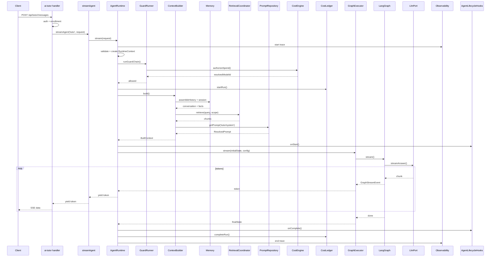

---

## Failure Scenarios

| Scenario | Phase | Behavior | User Impact |
|----------|-------|----------|-------------|
| Invalid `agentId` | Agent Loading | `AGENT_NOT_FOUND` — immediate fail | 404 |
| Malformed scope (missing `courseId`) | Validation | `VALIDATION_FAILED` | 400 |
| Rate limit exceeded | Guards | `GUARD_DENIED` — fail-closed | 429 |
| Redis unavailable (guards) | Guards | Fail-closed — deny request | 503 |
| Redis unavailable (session cache) | Memory | Fail-open — assemble from DB | Slight latency increase |
| Langfuse unavailable | Prompts | Fallback to local templates / cache | None if fallback succeeds |
| pgvector query timeout | Retrieval | `RETRIEVAL_FAILED` — fail run | 500 with retryable flag |
| OpenAI 429 | Provider | Resilient adapter retries 3× | Brief delay or fallback model |
| OpenAI 401 | Provider | Non-retryable `PROVIDER_ERROR` | 502 |
| Client disconnect mid-stream | Streaming | `CANCELLED` — partial persist | Stream ends |
| Run timeout (120s) | Any | `RUN_TIMEOUT` — abort all | 504 |
| LangSmith unavailable | Observability | Fail-open — log warning | None |
| Ledger write failure | Persistence | Fail-open — log error | None |
| Output validation failure | Graph | Re-generate once; then fail | Regenerated or error response |
| Tool timeout | Tool | Error returned to LLM | LLM explains failure |
| Budget exhausted (Phase 2) | Guards | `GUARD_DENIED` — `BUDGET_EXHAUSTED` | 402 |

### Cascading Failure Prevention

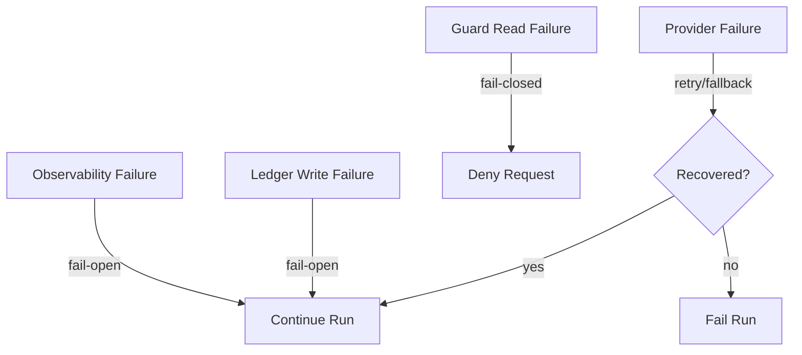

---

## Future Evolution

| Capability | Trigger | Runtime Impact |
|-----------|---------|----------------|
| **Resumable runs** | Worker crash mid-generation | Accept `checkpointId` in options; resume via GraphExecutor |
| **Human-in-the-loop** | Evaluator approval gate | Pause runtime at checkpoint; resume on approval event |
| **Multi-agent supervisor** | Intent routing across agents | Runtime delegates to supervisor graph; same pipeline |
| **Async agent runs** | Long-running code review | New `enqueueAgentRun()` — worker invokes same Runtime |
| **Runtime metrics dashboard** | Ops visibility | Event bus → OTEL metrics (already scaffolded) |
| **Per-tenant isolation** | B2B expansion | Scope validation extended; same pipeline |
| **GPU workload offload** | Local model inference | Provider adapter change only; Runtime unchanged |

### Extraction Readiness

If service extraction criteria are met ([14-roadmap.md](./14-roadmap.md#service-extraction-criteria)):

1. `AgentRuntimePort` becomes an HTTP handler boundary.
2. `RuntimeContext` serializes to request headers + body.
3. `StreamCoordinator` bridges to SSE over HTTP.
4. `AbortSignal` maps to connection close on server.
5. Guards and Cost Engine remain co-located with Runtime.

The Runtime's explicit pipeline phases and port dependencies make it the natural extraction unit — not LangGraph graphs alone.

---

## Migration Strategy

### Phase 1 → Phase 2: Introduce Runtime with LangGraph

The AI Tutor's hand-rolled pipeline in `ask-tutor.use-case.ts` is the migration source.

| Step | Action |
|------|--------|
| 1 | Create `application/runtime/` module structure with ports and types |
| 2 | Implement `AgentRuntime` with pipeline phases matching current tutor flow |
| 3 | Extract guard chain from tutor into `GuardRunner` (may already be in `infrastructure/guards/`) |
| 4 | Implement `ContextBuilder` from tutor's context-building logic |
| 5 | Wire `GraphExecutor` to compiled `tutor.graph.ts` |
| 6 | Implement `StreamCoordinator` from tutor's streaming bridge |
| 7 | Change `run-agent.use-case.ts` to delegate to `AgentRuntime` |
| 8 | Update `ask-tutor.use-case.ts` to call `streamAgent()` only |
| 9 | Move lifecycle hooks (message persistence) to `AgentLifecycleHooks` |
| 10 | Verify ai-tutor test suite passes |

### Phase 2 → Phase 3: Tools and Advanced Memory

| Step | Action |
|------|--------|
| 1 | Pass `ToolExecutorPort` through `RunnableConfig` |
| 2 | Add `TOOL_INVOKED` / `TOOL_COMPLETED` events |
| 3 | Extend `ContextBuilder` for long-term memory facts |
| 4 | Add `StructuredOutputParser` for evaluator agent |
| 5 | Register evaluator agent — same Runtime, different graph |

### Rollback

Each step is independently revertible:

1. `ask-tutor.use-case.ts` reverts to hand-rolled pipeline (git revert).
2. `AgentRuntime` module can remain unused without affecting Phase 1 paths.
3. No database migrations required for Runtime introduction.

### Feature Flag

```
AI_PLATFORM_ENABLED=true   # Required for LangGraph tutor runtime and shared AI APIs
```

When `false`, use cases fall back to Phase 1 hand-rolled path during transition.

---

## ADR Alignment

| ADR | Alignment |
|-----|-----------|
| [ADR-001](./15-adrs.md#adr-001-internal-module-vs-separate-ai-service) | Runtime is in-process in `application/runtime/`; no separate service |
| [ADR-002](./15-adrs.md#adr-002-langgraph-for-orchestration) | Runtime coordinates around LangGraph; does not replace it |
| [ADR-003](./15-adrs.md#adr-003-hybrid-observability--langfuse--langsmith) | Runtime starts LangSmith runs; prompt version in metadata |
| [ADR-005](./15-adrs.md#adr-005-direct-typescript-api-over-internal-rest) | Features call `runAgent`/`streamAgent`; Runtime is internal |
| [ADR-007](./15-adrs.md#adr-007-redis--postgresql-dual-memory-store) | ContextBuilder uses both stores per memory scope |
| [ADR-009](./15-adrs.md#adr-009-portadapter-provider-abstraction) | Runtime depends on ports; providers invoked inside graph nodes |
| [ADR-010](./15-adrs.md#adr-010-feature-owned-authorization) | Runtime validates scope shape only; features authorize |
| [ADR-012](./15-adrs.md#adr-012-ai-tutor-migration-via-strangler-pattern) | Runtime extracted from tutor pipeline incrementally |

### Proposed ADR-014 (Future)

When Phase 2 ships, record **ADR-014: Agent Runtime as Lifecycle Coordinator** — formalizing the decision that LangGraph handles graph orchestration while a dedicated Runtime module owns cross-cutting execution lifecycle, distinct from both the use case entry point and the graph engine.

---

## Related Documentation

- [02-architecture.md](./02-architecture.md) — High-level architecture and request flows
- [03-folder-structure.md](./03-folder-structure.md) — Module layout (`application/runtime/` to be added)
- [04-agents.md](./04-agents.md) — Agent definitions and LangGraph integration
- [06-memory.md](./06-memory.md) — Memory tiers and assembly
- [07-tools.md](./07-tools.md) — Tool execution and sandboxing
- [08-prompts.md](./08-prompts.md) — Prompt resolution
- [09-observability.md](./09-observability.md) — Tracing and cost ledger
- [13-security.md](./13-security.md) — Guards and fail-closed policies
- [14-roadmap.md](./14-roadmap.md) — Phase 2 Agent Runtime delivery
- [16-cost-engine.md](./16-cost-engine.md) — Cost governance integration
