# AI Platform — Structured Output

> Typed AI responses, schema validation, output repair, and reliable machine-readable generation.  
> **Last updated:** August 2026

---

## Table of Contents

1. [Overview](#overview)
2. [Why Structured Output](#why-structured-output)
3. [Design Principles](#design-principles)
4. [Architecture](#architecture)
5. [Structured Output Pipeline](#structured-output-pipeline)
6. [JSON Schema Strategy](#json-schema-strategy)
7. [Schema Registry](#schema-registry)
8. [Output Validation](#output-validation)
9. [Output Repair](#output-repair)
10. [Retry Strategy](#retry-strategy)
11. [Partial Outputs](#partial-outputs)
12. [Streaming Structured Output](#streaming-structured-output)
13. [Typed Responses](#typed-responses)
14. [Error Handling](#error-handling)
15. [Schema Versioning](#schema-versioning)
16. [Backward Compatibility](#backward-compatibility)
17. [Integration with Runtime](#integration-with-runtime)
18. [Integration with LangGraph](#integration-with-langgraph)
19. [Integration with Providers](#integration-with-providers)
20. [Integration with Features](#integration-with-features)
21. [Domain Models](#domain-models)
22. [Interfaces](#interfaces)
23. [Failure Scenarios](#failure-scenarios)
24. [Performance Considerations](#performance-considerations)
25. [Security Considerations](#security-considerations)
26. [Future Evolution](#future-evolution)
27. [Migration Strategy](#migration-strategy)
28. [ADR Alignment](#adr-alignment)

---

## Overview

The **Structured Output** subsystem standardizes AI responses into validated, typed objects that application features can safely consume. It sits between LLM generation and feature business logic — turning unreliable free-form text into contracts features can depend on.

| Attribute | Value |
|-----------|-------|
| **Module location** | `src/ai-platform/structured-output/` |
| **Deployment** | In-process inside the modular monolith |
| **Database** | PostgreSQL for schema registry metadata (optional Phase 2); schemas primarily version-controlled |
| **Public API** | Exported via `@/ai-platform` barrel (Phase 2+) |
| **Phase 1 status** | **Not required** — AI Tutor streams plain text |

Phase 1 products (AI Tutor) return human-readable streamed text. Structured Output becomes essential when products need machine-readable results: rubric scores, code review findings, grading metadata, and admin analytics payloads.

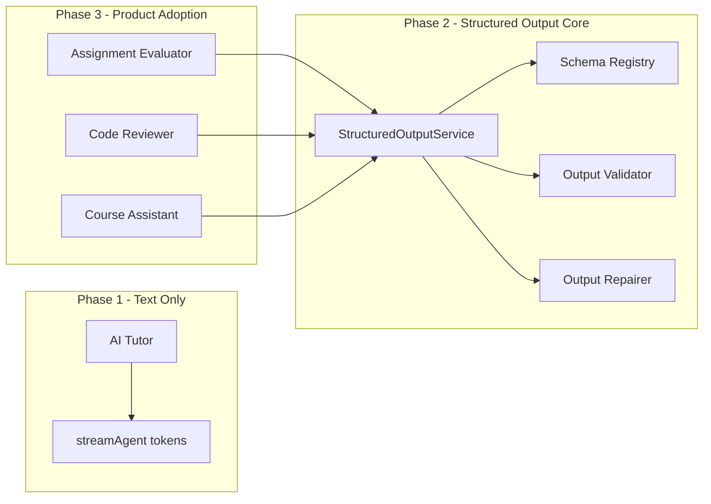

### Supported Products

| Product | Structured Output Use | Schema Example | Phase |
|---------|----------------------|----------------|-------|
| **AI Tutor** | Optional metadata blocks (citations, confidence) | `tutor-citation.v1` | 3 (optional) |
| **AI Assignment Evaluator** | Rubric scores + feedback | `evaluator-rubric.v1` | 3 |
| **AI Code Reviewer** | Findings list with severity | `code-review.v1` | 3 |
| **AI Course Assistant** | Action suggestions, scope tags | `course-assistant.v1` | Future |
| **Future Agents** | Product-specific contracts | `agent-<id>.v1` | 3+ |

---

## Why Structured Output

Free-form LLM text is sufficient for conversational products. It fails for products that **execute business logic** on AI output.

| Gap | Raw Text Limitation | Structured Output Addition |
|-----|---------------------|---------------------------|
| **Downstream automation** | Features parse JSON with ad-hoc `JSON.parse` + hope | Validated objects with guaranteed shape |
| **Grading workflows** | Rubric scores buried in prose | Typed `RubricScore[]` with numeric bounds |
| **API contracts** | Handlers return inconsistent shapes | Stable DTOs shared between platform and features |
| **Evaluation** | DeepEval JSON schema tests are brittle without platform support | Same schema in prod and eval pipelines |
| **Provider variance** | OpenAI JSON mode vs Anthropic vs markdown fences | Normalized pipeline regardless of provider |
| **Failure diagnosis** | "Bad JSON" with no context | Validation errors, repair attempts, confidence scores in traces |

The subsystem does **not** replace the existing `validate-output` graph node (see [04-agents.md](./04-agents.md#reusable-nodes)). That node enforces **policy** (leakage, educational integrity). Structured Output enforces **shape** (schema, types, required fields).

---

## Design Principles

1. **Schema-first contracts** — Every structured product declares an `OutputSchema` in the Schema Registry before shipping. No implicit shapes.
2. **Validate before trust** — Features never call `JSON.parse` on raw LLM output. They receive objects from `StructuredOutputService` or `AgentRunResult.structuredOutput`.
3. **Repair before reject** — Deterministic repair (extract JSON, coerce types) runs before expensive LLM retries.
4. **Provider-native when available** — Prefer provider structured-generation APIs (`response_format`, JSON schema mode) to reduce repair need; fall back to parse pipeline when unsupported.
5. **Fail with diagnostics** — Rejected outputs include validation errors, repair log, and attempt count — attached to LangSmith traces and `ai_agent_runs.metadata`.
6. **Single developer maintainability** — One registry, one service, declarative schemas in version-controlled files; no per-feature parsers.
7. **No separate service** — All logic in `src/ai-platform/structured-output/`; direct TypeScript APIs (ADR-001, ADR-005).
8. **Gradual activation** — Phase 1 Tutor unchanged. Phase 2 ships the module; Phase 3 products opt in via agent capability `STRUCTURED_OUTPUT`.

---

## Architecture

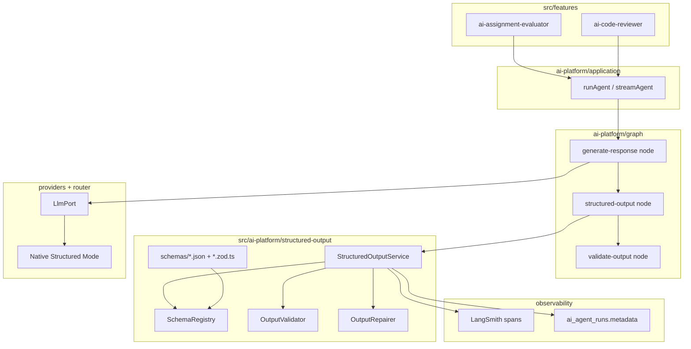

### Module Layout

```
src/ai-platform/structured-output/
├── domain/
│   ├── models/
│   │   ├── structured-output.ts
│   │   ├── output-schema.ts
│   │   └── validation-result.ts
│   └── ports/
│       └── schema-registry.port.ts
├── application/
│   └── services/
│       ├── structured-output.service.ts
│       ├── output-validator.service.ts
│       └── output-repairer.service.ts
├── infrastructure/
│   └── registry/
│       └── schema-registry.ts
├── schemas/
│   ├── evaluator-rubric.v1.json
│   ├── evaluator-rubric.v1.zod.ts
│   ├── code-review.v1.json
│   └── code-review.v1.zod.ts
└── repair/
    ├── extract-json.repair.ts
    ├── coerce-types.repair.ts
    └── llm-repair.strategy.ts
```

The `graph/nodes/structured-output.node.ts` file remains a thin adapter that delegates to `StructuredOutputService` — consistent with other reusable nodes (see [04-agents.md](./04-agents.md#reusable-nodes)).

---

## Structured Output Pipeline

Every structured generation follows the same pipeline. The LLM may use native structured mode or free text; the pipeline normalizes the result.

```
LLM
  ↓
Raw Output
  ↓
Schema Validation
  ↓
Repair
  ↓
Retry (re-generate if repair insufficient)
  ↓
Typed Object
  ↓
Application (feature use case)
```

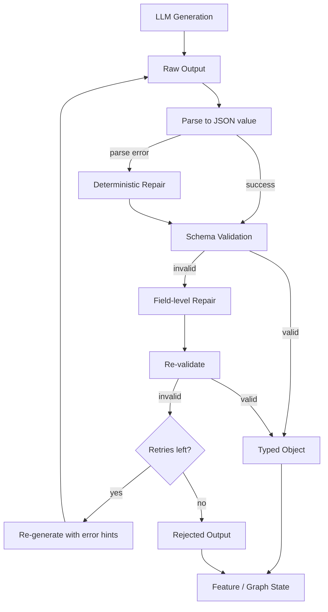

### Output States

| State | Definition | Stored In | Consumer Behavior |
|-------|------------|-----------|-------------------|
| **Raw output** | Unprocessed string from LLM (may include markdown fences, preamble, trailing commentary) | Graph state `rawLlmOutput`; trace span input | Never passed to features |
| **Validated output** | JSON value that passes JSON Schema + Zod without repair | `StructuredOutput.data` with `status: 'valid'` | Safe for business logic |
| **Repaired output** | JSON value that passed only after deterministic or LLM repair | `StructuredOutput.data` with `status: 'repaired'`; `repairLog` populated | Safe for business logic; lower confidence score |
| **Rejected output** | Failed validation after max repair and retry attempts | `StructuredOutput.status: 'rejected'`; `errors` populated | Feature handles fallback (manual review queue, error UI) |

### State Transitions

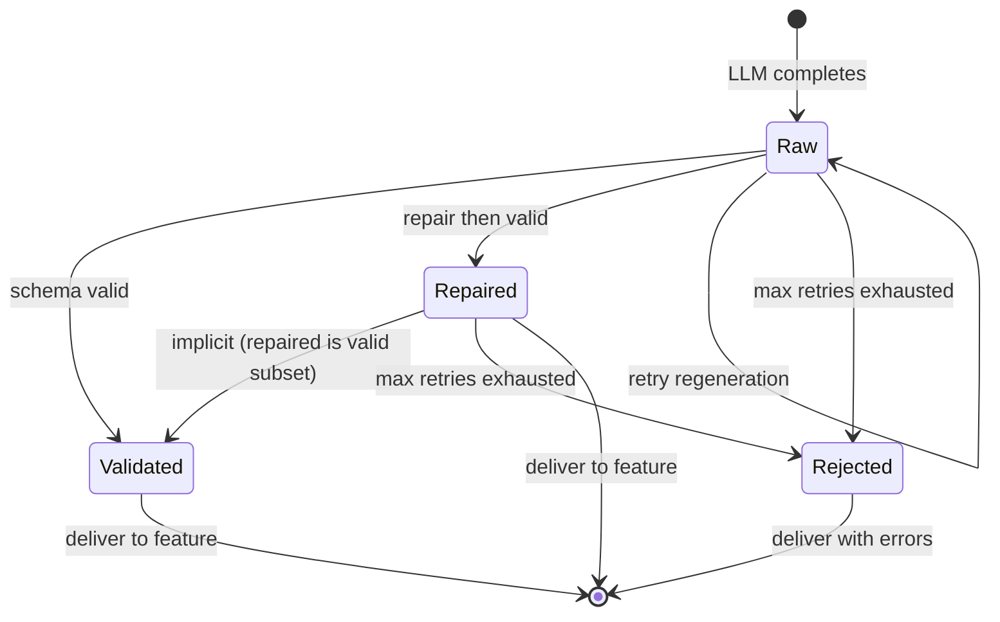

---

## JSON Schema Strategy

Structured Output uses a **dual-schema** approach: JSON Schema for portability and provider integration; Zod for TypeScript-native validation and inferred types.

| Layer | Role | Location |
|-------|------|----------|
| **JSON Schema** | Provider `response_format`, registry metadata, DeepEval assertions, cross-language eval | `structured-output/schemas/*.json` |
| **Zod** | Runtime validation in Node.js, TypeScript type inference, DTO guards at feature boundary | `structured-output/schemas/*.zod.ts` |

### Why Both

- **JSON Schema** is the interchange format OpenAI and other providers accept for structured generation. It is also what [10-evaluation.md](./10-evaluation.md) references for DeepEval `json_schema` assertions.
- **Zod** gives compile-time types for features (`EvaluationResult`, `CodeReviewFindings`) and catches schema drift in CI via `zod-to-json-schema` comparison tests.

### Schema Pairing Rule

Each logical schema has a **versioned pair**:

```
evaluator-rubric.v1.json   ← canonical for providers + registry
evaluator-rubric.v1.zod.ts ← Zod schema; must accept same values as JSON Schema
```

CI verifies parity: sample fixtures validate against both representations.

### JSON Schema Conventions

| Rule | Rationale |
|------|-----------|
| `$id` = `ithra/<schema-name>.v<version>` | Stable registry keys |
| `additionalProperties: false` on objects | Prevent silent field injection |
| Explicit `required` arrays | Clear contract for repair |
| `enum` for categorical fields | Bounded repair space |
| `minimum` / `maximum` on numbers | Rubric scores, severities |
| No `$ref` chains deeper than 2 levels | Simpler repair and provider compatibility |

### Zod Conventions

| Rule | Rationale |
|------|-----------|
| Export inferred type: `type EvaluatorRubricV1 = z.infer<typeof evaluatorRubricV1Schema>` | Feature DTOs |
| Use `z.strictObject()` where JSON Schema uses `additionalProperties: false` | Parity |
| Coercion only in repair layer, not in primary Zod parse | Validated vs repaired distinction |

### Validation Strategies

| Strategy | When Applied | Strictness |
|----------|--------------|------------|
| **Strict JSON Schema** | Primary validation via Ajv | No coercion; exact types |
| **Zod strict parse** | After Ajv pass; double-check in TypeScript | Runtime type guard |
| **Coercion repair** | Repair phase only | `"85"` → `85` for numeric rubric fields |
| **Enum normalization** | Repair phase | `"High"` → `"high"` if enum case-insensitive policy enabled |
| **Provider mode verification** | When native structured mode used | Re-validate anyway — providers are not infallible |

---

## Schema Registry

The **Schema Registry** is the central catalog of output contracts. It mirrors the pattern of `AgentRegistry` and `ProviderRegistry`.

### Responsibilities

| Responsibility | Owner |
|----------------|-------|
| Register schemas at startup | `SchemaRegistry.register()` |
| Resolve schema by ID + version | `SchemaRegistry.get(schemaId, version?)` |
| List schemas for an agent | `SchemaRegistry.getForAgent(agentId)` |
| Provide JSON Schema for provider calls | `OutputSchema.jsonSchema` |
| Provide Zod parser | `OutputSchema.zodSchema` |

### Registration

Schemas are registered statically at platform startup in `ai-platform.container.ts` — same pattern as agent definitions. Dynamic runtime registration is reserved for future plugin scenarios.

```typescript
// Startup registration (conceptual)
schemaRegistry.register({
  id: 'evaluator-rubric',
  version: 1,
  agentIds: ['evaluator'],
  jsonSchema: evaluatorRubricV1Json,
  zodSchema: evaluatorRubricV1Schema,
  description: 'Assignment rubric scores and feedback',
});
```

### Schema ID Convention

```
<product>-<purpose>.v<version>

Examples:
  evaluator-rubric.v1
  code-review.v1
  course-assistant-actions.v1
```

### Optional Persistence (Phase 2)

Schema **definitions** remain in version-controlled files. An optional `ai_output_schemas` table stores metadata for admin UI and audit:

| Column | Purpose |
|--------|---------|
| `schema_id` | Logical ID |
| `version` | Integer version |
| `agent_ids` | JSON array of bound agents |
| `is_active` | Production promotion flag |
| `created_at` | Audit |

The table does not replace file-based schemas — it mirrors them for operators.

---

## Output Validation

`OutputValidator` performs schema validation on parsed JSON values.

### Validation Pipeline

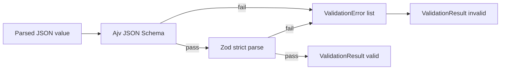

### ValidationResult Shape

Validation produces a structured result — never a thrown exception for expected schema failures (exceptions reserved for infrastructure faults).

| Field | Purpose |
|-------|---------|
| `valid` | Overall pass/fail |
| `errors` | Ajv/Zod error paths (`/scores/0/score: must be <= 100`) |
| `confidence` | Base confidence before repair penalties |
| `validatedAt` | Timestamp |

### Field-Level Diagnostics

Errors include JSON Pointer paths so repair strategies and retry prompts can target specific failures:

```
/scores/2/score: must be number
/feedback: required property missing
/overallGrade: enum value "A++" not allowed
```

---

## Output Repair

`OutputRepairer` attempts to fix invalid or unparseable output **before** triggering an expensive LLM retry.

### Repair Strategies

| Strategy | Order | Input | Action |
|----------|-------|-------|--------|
| **Extract JSON** | 1 | Raw string with markdown fences or preamble | Regex / brace-balancing extract first `{...}` or `[...]` |
| **Strip commentary** | 2 | JSON with trailing explanation | Remove text after closing brace |
| **Coerce types** | 3 | Valid JSON, wrong types | String numbers → number; string booleans → boolean |
| **Fill defaults** | 4 | Missing optional fields | Apply schema `default` keywords |
| **Enum normalize** | 5 | Case-mismatched enums | Map via schema enum list |
| **LLM repair** | 6 | Still invalid after deterministic steps | Small `complete()` call: "Fix JSON to match schema" with errors |

### Repair Rules

1. **Never invent required fields** in deterministic repair — only coercion and extraction.
2. **LLM repair** may suggest values for missing required fields only when agent policy `allowLlmRepair: true` (evaluator: yes; code reviewer: conservative).
3. Each repair attempt appends to `repairLog` for observability.
4. Repair success still marks output `status: 'repaired'`, not `'valid'`.

### RepairResult Shape

| Field | Purpose |
|-------|---------|
| `success` | Repair produced parseable value |
| `data` | Repaired JSON value (pre-validation) |
| `strategiesApplied` | Ordered list of strategy names |
| `confidencePenalty` | Subtracted from base confidence |

---

## Retry Strategy

When repair cannot produce a valid object, the pipeline **re-generates** from the LLM.

### Retry Configuration

Per-schema defaults in `OutputSchema.retryPolicy`:

| Parameter | Default | Evaluator Override |
|-----------|---------|-------------------|
| `maxAttempts` | 2 | 3 |
| `includeValidationErrorsInPrompt` | `true` | `true` |
| `temperatureDelta` | -0.1 per retry | -0.15 |
| `escalateModel` | `false` | `true` (mini → full model) |

### Retry Flow

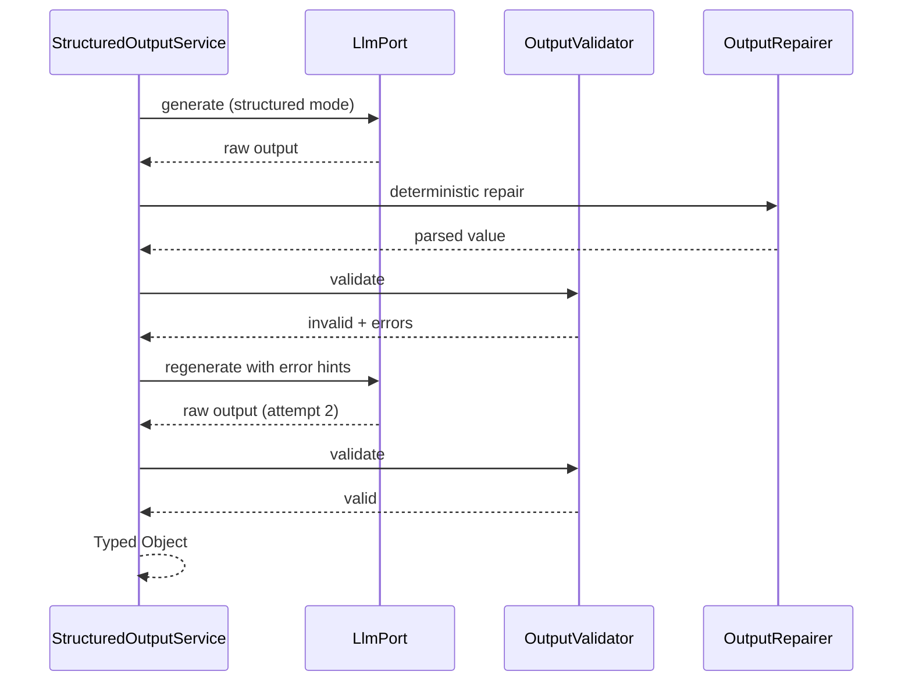

### Retry vs Provider Retry

| Layer | Scope | Owner |
|-------|-------|-------|
| **Provider retry** | HTTP failures, rate limits | `resilient-llm.adapter.ts` |
| **Structured output retry** | Schema validation failures | `StructuredOutputService` |

These are independent. A single structured-output attempt may include provider-level retries without counting against schema retry budget.

### Confidence Scoring

Confidence guides feature fallbacks (auto-accept vs manual review).

| Signal | Weight | Notes |
|--------|--------|-------|
| Native structured mode used | +0.1 | Provider enforced shape |
| `status: 'valid'` (no repair) | Base 1.0 | — |
| Each deterministic repair strategy | -0.05 | Capped at -0.2 |
| LLM repair used | -0.15 | — |
| Retry attempt used | -0.1 per attempt | — |
| Provider logprobs (if available) | Blended 0.2 | Future Phase 3 |

Final score clamped to `[0, 1]`. Features define thresholds (e.g., evaluator auto-publishes if `confidence >= 0.85`).

---

## Partial Outputs

Some products benefit from **incremental** structured data before the full object is valid.

### Non-Streaming Partial

During multi-field validation, individual valid fields are captured in `PartialStructuredOutput`:

| Field | Purpose |
|-------|---------|
| `validFields` | Key-value pairs that passed field-level validation |
| `pendingFields` | Required fields not yet valid |
| `raw` | Latest raw string |

Used internally during repair loops — not exposed to features until finalization unless streaming mode enabled.

### Use Cases

| Product | Partial Behavior |
|---------|----------------|
| **Evaluator** | Show rubric scores as they validate; feedback text last |
| **Code Reviewer** | Stream findings array elements |
| **Tutor** | Not used (plain text stream) |

---

## Streaming Structured Output

Streaming structured output combines token streaming with incremental JSON parsing.

### Modes

| Mode | API | Use Case |
|------|-----|----------|
| **Complete** | `runAgent()` → `AgentRunResult.structuredOutput` | Background grading jobs |
| **Structured stream** | `streamStructuredAgent()` → `AsyncIterable<StructuredOutputChunk>` | Live UI with progressive rubric fill |
| **Text stream** (existing) | `streamAgent()` → tokens | Tutor conversational UI |

### Streaming Flow

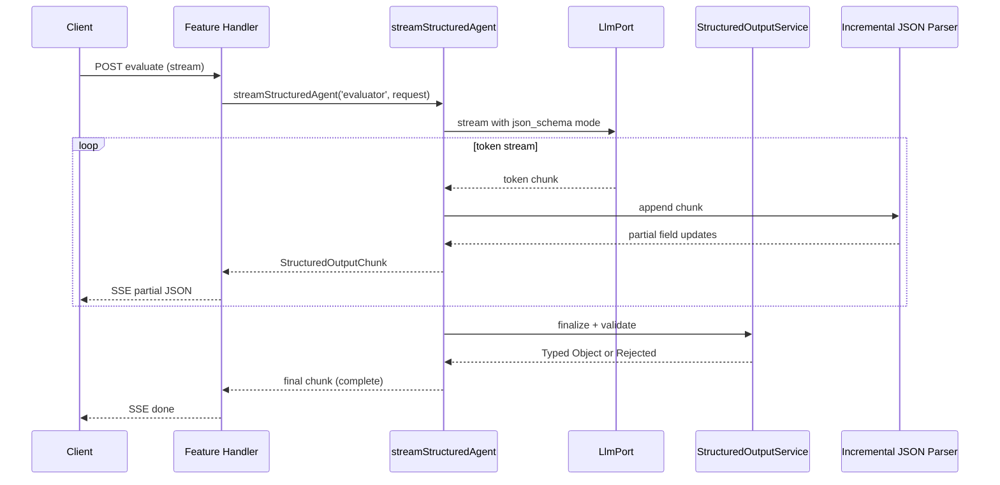

### Streaming Validation

1. **During stream** — Incremental parser emits `partial` chunks for complete JSON sub-trees (e.g., each finding object closed).
2. **On stream end** — Full schema validation runs on assembled value.
3. **On validation fail** — Repair + optional retry via non-streaming `complete()` (stream retry is poor UX; one repair attempt only).

### StructuredOutputChunk Types

| Type | Payload | UI Behavior |
|------|---------|-------------|
| `partial` | `{ field, value }` or `{ path, value }` | Update single UI field |
| `progress` | `{ bytesReceived, estimatedComplete }` | Progress bar |
| `complete` | Full `StructuredOutput` | Final state |
| `error` | `StructuredOutputError` | Error panel |

---

## Typed Responses

Features consume **inferred TypeScript types** from Zod schemas — not generic `Record<string, unknown>`.

### AgentRunResult Extension

```typescript
interface AgentRunResult {
  agentId: string;
  runId: string;
  // Text path (Tutor)
  text?: string;
  // Structured path (Evaluator, Reviewer)
  structuredOutput?: StructuredOutput<unknown>;
  tokensUsed: TokenUsage;
  estimatedCost: number;
  latencyMs: number;
}
```

### Feature-Side Typing

Features import schema types from `@/ai-platform` or define local types that match Zod exports:

```typescript
import type { EvaluatorRubricV1 } from '@/ai-platform';

function publishGrade(result: StructuredOutput<EvaluatorRubricV1>) {
  if (result.status === 'rejected') {
    return enqueueManualReview(result.errors);
  }
  const rubric = result.data; // EvaluatorRubricV1 — fully typed
  await gradeRepository.save(rubric);
}
```

### Generic StructuredOutput

`StructuredOutput<T>` wraps typed data with pipeline metadata:

| Field | Type | Purpose |
|-------|------|---------|
| `schemaId` | `string` | Registry key |
| `schemaVersion` | `number` | Version used |
| `status` | `'valid' \| 'repaired' \| 'rejected'` | Pipeline outcome |
| `data` | `T` | Typed payload (only when not rejected) |
| `confidence` | `number` | 0–1 score |
| `repairLog` | `RepairLogEntry[]` | Audit trail |
| `errors` | `ValidationError[]` | Present when rejected |
| `rawOutput` | `string` | Original LLM string (for debugging; not for logic) |

---

## Error Handling

### Error Categories

| Category | Type | Retryable | User Message |
|----------|------|-----------|--------------|
| **Parse failure** | `StructuredOutputParseError` | Yes (repair/retry) | Internal only |
| **Validation failure** | `StructuredOutputValidationError` | Yes (repair/retry) | Internal only |
| **Max retries exhausted** | `StructuredOutputRejectedError` | No | "Could not grade automatically" |
| **Schema not found** | `SchemaNotFoundError` | No | Config error — alert ops |
| **Provider structured mode unsupported** | Falls back to text parse | Yes | None |

### Fail-Open vs Fail-Close

| Context | Behavior |
|---------|----------|
| **Evaluator grading** | Fail-close — rejected output → manual review queue, no silent partial grade |
| **Code reviewer** | Fail-close — rejected → show "analysis failed" with retry button |
| **Optional tutor metadata** | Fail-open — omit metadata block, still stream answer text |
| **Observability recording** | Fail-open — trace/ledger write failure does not block delivery |

### Error Propagation

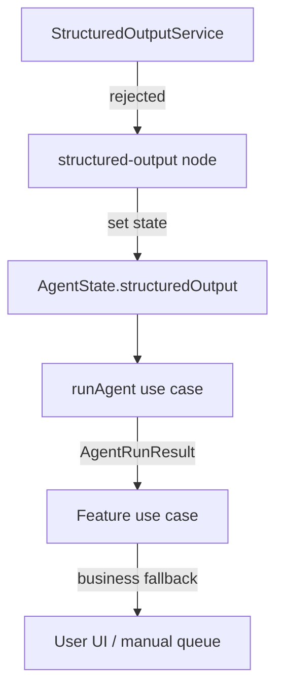

---

## Schema Versioning

Schemas evolve as products mature. Versioning is explicit and integer-based.

### Version Rules

| Rule | Detail |
|------|--------|
| **Immutable published versions** | `v1` files never change after production promotion |
| **New version = new file** | `evaluator-rubric.v2.json` alongside `v1` |
| **Agent binding** | `AgentDefinition.outputSchemaId` + `outputSchemaVersion` |
| **Default version** | Registry `get(id)` returns latest active unless version specified |

### Promotion Workflow

1. Author `*.v2` schema pair in `structured-output/schemas/`.
2. Register in `SchemaRegistry` with `isActive: false`.
3. Run offline eval ([10-evaluation.md](./10-evaluation.md)) with DeepEval `json_schema` on golden dataset.
4. Promote via Langfuse-style flag or `ai_output_schemas.is_active` (Phase 2).
5. Update agent definition to pin `outputSchemaVersion: 2`.

---

## Backward Compatibility

### Feature Compatibility

| Scenario | Strategy |
|----------|----------|
| Feature expects `v1`, platform returns `v2` | Agent pins version; features never see unexpected versions |
| Feature updated before platform | Feature imports `v2` types; agent still on `v1` until promotion |
| Stored historical grades | Feature DB stores `schemaVersion` per record; deserialize with matching Zod schema |

### API Compatibility

`StructuredOutputService.parse()` accepts optional `version` parameter. Default is agent's pinned version from `AgentDefinition`.

### Rollback

Revert agent definition `outputSchemaVersion` to previous integer. Old schema files remain in repo — no data migration required for rollback.

---

## Integration with Runtime

The agent runtime (`application/use-cases/run-agent.use-case.ts`, `stream-agent.use-case.ts`) orchestrates structured output for agents with capability `STRUCTURED_OUTPUT`.

### Runtime Integration Diagram

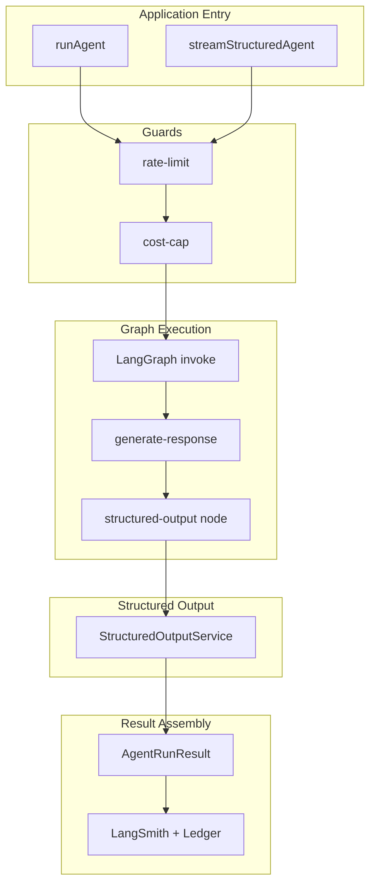

### Runtime Responsibilities

| Step | Component | Action |
|------|-----------|--------|
| 1 | `runAgent` | Resolve agent; verify `STRUCTURED_OUTPUT` capability if structured API used |
| 2 | `AgentRunner` | Pass `outputSchemaId` into graph `RunnableConfig.configurable` |
| 3 | `generate-response` | Call `LlmPort` with structured options when schema provided |
| 4 | `structured-output` | Invoke `StructuredOutputService.process(raw, schemaId)` |
| 5 | `runAgent` | Map graph state → `AgentRunResult.structuredOutput` |
| 6 | `observability` | Record `structured_output_status`, `confidence`, `repair_count` in run metadata |

### Configurable Injection

```typescript
// RunnableConfig.configurable (injected by GraphCompiler)
interface StructuredOutputConfigurable {
  structuredOutputService: StructuredOutputService;
  schemaRegistry: SchemaRegistry;
  outputSchemaId: string;
  outputSchemaVersion: number;
}
```

---

## Integration with LangGraph

Structured Output is a **reusable graph node**, not a separate graph.

### Node Placement

Typical evaluator graph:

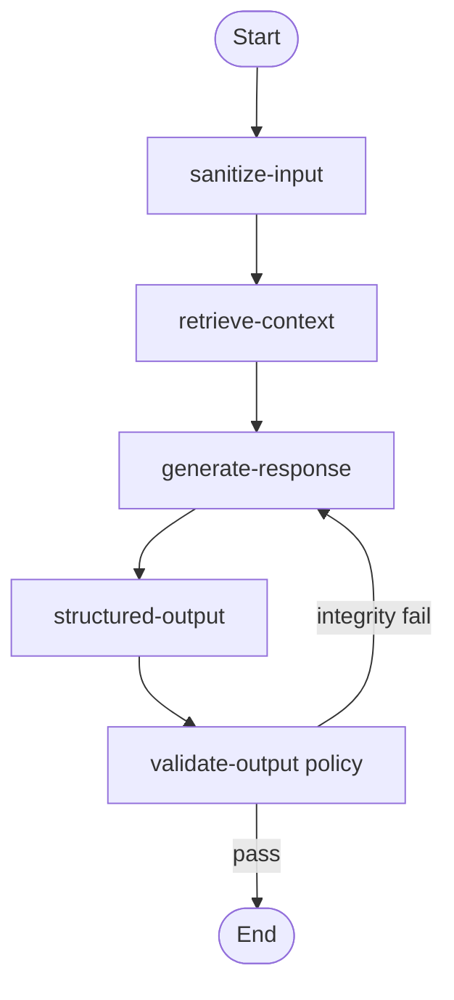

| Node | Subsystem | Checks |
|------|-----------|--------|
| `structured-output` | Structured Output | JSON shape, types, required fields |
| `validate-output` | Content policy | Assessment leakage, toxicity, scope |

### State Fields

```typescript
interface EvaluatorAgentState extends BaseAgentState {
  rawLlmOutput: string;
  structuredOutput: StructuredOutput<EvaluatorRubricV1> | null;
  submissionId: string;
  rubricId: string;
}
```

### Conditional Edges

| Condition | Target | Purpose |
|-----------|--------|---------|
| `structuredOutput.status === 'rejected'` | `handle-rejection` node | Enqueue manual review |
| `structuredOutput.confidence < threshold` | `low-confidence-review` node | Flag for instructor |
| Policy validation fail | `generate-response` | Regenerate (separate from schema retry) |

### Checkpointing

Structured output state is checkpointed after `structured-output` node completes — enables resume if downstream persistence fails.

---

## Integration with Providers

Providers support structured generation through `LlmPort` extensions. Adapters normalize differences across vendors.

### LlmPort Extension

```typescript
interface LlmStructuredOptions {
  messages: LlmMessage[];
  systemPrompt: string;
  outputSchema: OutputSchema;       // JSON Schema from registry
  structuredMode: 'json_schema' | 'json_object' | 'text';
  temperature?: number;
  maxTokens?: number;
  model?: string;
}

interface LlmPort {
  streamAnswer(options: LlmStreamOptions): AsyncIterableIterator<string>;
  complete?(options: LlmCompleteOptions): Promise<string>;
  completeStructured?(options: LlmStructuredOptions): Promise<string>;
  streamStructured?(options: LlmStructuredOptions): AsyncIterableIterator<string>;
}
```

### Provider Support Matrix

| Provider | Native Mode | Mechanism | Fallback |
|----------|-------------|-----------|----------|
| **OpenAI** | `json_schema` | `response_format: { type: 'json_schema', json_schema: {...} }` | `json_object` then parse |
| **Anthropic** | Structured outputs | Tool-style schema or beta JSON mode | Text + extract repair |
| **Gemini** | `responseSchema` | `generationConfig.responseSchema` | Text + extract repair |
| **Ollama** | Limited | Prompt-injected JSON instructions | Text + extract repair |

### Adapter Behavior

1. **Prefer native** — Adapter selects strongest structured mode available for model.
2. **Always re-validate** — `StructuredOutputService` validates provider output regardless of mode.
3. **Structured options in router** — `RoutingPolicy.structuredOutputPreferred: true` for evaluation task.
4. **Token budget** — Structured outputs often need higher `maxTokens`; agent definition overrides defaults.

### Provider Flow

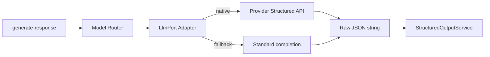

---

## Integration with Features

Features receive **strongly typed objects** at the use-case boundary — never raw LLM strings for structured products.

### Integration Pattern

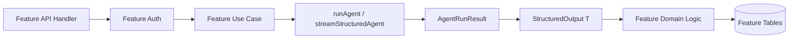

### Product Examples

#### AI Assignment Evaluator

```typescript
// Feature use case (conceptual)
const result = await runAgent('evaluator', {
  userId,
  input: submissionText,
  scope: { submissionId, rubricId, courseId },
});

const output = result.structuredOutput as StructuredOutput<EvaluatorRubricV1>;
if (output.status === 'rejected') {
  return manualReviewQueue.enqueue(submissionId, output.errors);
}
await gradeService.publish({
  submissionId,
  scores: output.data.scores,
  feedback: output.data.feedback,
  confidence: output.confidence,
  schemaVersion: output.schemaVersion,
});
```

#### AI Code Reviewer

```typescript
const stream = streamStructuredAgent('code-reviewer', request);
for await (const chunk of stream) {
  if (chunk.type === 'partial' && chunk.path?.startsWith('/findings')) {
    yield displayFinding(chunk.value);
  }
}
```

#### AI Tutor (Phase 3 optional)

Tutor remains text-first. Optional `tutor-citation.v1` schema attaches citation metadata without changing `streamAgent` token API.

### Feature Responsibilities

| Responsibility | Owner |
|----------------|-------|
| Authorization | Feature (ADR-010) |
| Business thresholds (`confidence` cutoffs) | Feature |
| Persisting typed results | Feature repository |
| Schema definition authorship | Shared — platform `schemas/`, feature reviews |
| Manual review queues | Feature |

---

## Domain Models

### StructuredOutput

```typescript
type StructuredOutputStatus = 'valid' | 'repaired' | 'rejected';

interface StructuredOutput<T> {
  schemaId: string;
  schemaVersion: number;
  status: StructuredOutputStatus;
  data: T;
  confidence: number;
  repairLog: RepairLogEntry[];
  errors: ValidationError[];
  rawOutput: string;
  attempts: number;
  processedAt: Date;
}

interface RepairLogEntry {
  strategy: string;
  timestamp: Date;
  detail?: string;
}

interface ValidationError {
  path: string;
  message: string;
  keyword?: string;
}
```

### OutputSchema

```typescript
interface OutputSchema {
  id: string;
  version: number;
  description: string;
  agentIds: string[];
  jsonSchema: Record<string, unknown>;   // JSON Schema document
  zodSchema: ZodType;                      // Zod parser
  retryPolicy: OutputRetryPolicy;
  repairPolicy: OutputRepairPolicy;
  isActive: boolean;
}

interface OutputRetryPolicy {
  maxAttempts: number;
  includeValidationErrorsInPrompt: boolean;
  temperatureDelta: number;
  escalateModel: boolean;
}

interface OutputRepairPolicy {
  allowDeterministicRepair: boolean;
  allowLlmRepair: boolean;
  allowEnumNormalization: boolean;
}
```

### ValidationResult

```typescript
interface ValidationResult {
  valid: boolean;
  errors: ValidationError[];
  confidence: number;
  validatedAt: Date;
}
```

### RepairResult

```typescript
interface RepairResult {
  success: boolean;
  data: unknown | null;
  strategiesApplied: string[];
  confidencePenalty: number;
}
```

---

## Interfaces

### StructuredOutputService

```typescript
interface StructuredOutputService {
  process<T>(
    rawOutput: string,
    schemaId: string,
    options?: ProcessOptions,
  ): Promise<StructuredOutput<T>>;

  processWithRetry<T>(
    generate: () => Promise<string>,
    schemaId: string,
    options?: ProcessOptions,
  ): Promise<StructuredOutput<T>>;

  validate(
    value: unknown,
    schemaId: string,
    version?: number,
  ): ValidationResult;
}

interface ProcessOptions {
  schemaVersion?: number;
  skipRepair?: boolean;
  skipRetry?: boolean;
  correlationId?: string;
}
```

### SchemaRegistry

```typescript
interface SchemaRegistry {
  register(schema: OutputSchema): void;
  get(schemaId: string, version?: number): OutputSchema;
  getForAgent(agentId: string): OutputSchema | null;
  list(): OutputSchemaSummary[];
  has(schemaId: string, version?: number): boolean;
}

interface OutputSchemaSummary {
  id: string;
  version: number;
  description: string;
  agentIds: string[];
  isActive: boolean;
}
```

### OutputValidator

```typescript
interface OutputValidator {
  validate(
    value: unknown,
    schema: OutputSchema,
  ): ValidationResult;

  validateField(
    value: unknown,
    schema: OutputSchema,
    path: string,
  ): ValidationResult;
}
```

### OutputRepairer

```typescript
interface OutputRepairer {
  repair(
    rawOutput: string,
    schema: OutputSchema,
    validationErrors?: ValidationError[],
  ): RepairResult;

  extractJson(raw: string): unknown | null;
}
```

---

## Failure Scenarios

| Scenario | Detection | System Response | User Impact |
|----------|-----------|-----------------|-------------|
| LLM returns prose instead of JSON | Parse failure | Extract repair → retry | Delay; possible manual review |
| Numeric score as string `"92"` | Validation failure | Coerce repair | None if repair succeeds |
| Score out of range (150/100) | Validation failure | Retry with error hints | Manual review if retries fail |
| Missing required `feedback` field | Validation failure | LLM repair if allowed → retry | Partial UI in stream mode |
| Provider JSON mode silently ignored | Re-validation catches | Fall back to text repair pipeline | Slight latency increase |
| Schema file missing at startup | `SchemaNotFoundError` at boot | Platform fails startup validation | Ops alert — no user traffic |
| Native mode unsupported for model | Adapter logs warning | Text generation + parse pipeline | None |
| Stream interrupted mid-JSON | Incomplete buffer on end | Single repair attempt; else rejected | "Analysis interrupted" UI |
| Confidence below feature threshold | Feature logic | Route to instructor review | Grade held pending review |

### Observability on Failure

Every rejected output records in `ai_agent_runs.metadata`:

```json
{
  "structured_output": {
    "schema_id": "evaluator-rubric",
    "schema_version": 1,
    "status": "rejected",
    "confidence": 0.42,
    "attempts": 3,
    "repair_strategies": ["extract-json", "coerce-types", "llm-repair"],
    "error_count": 2
  }
}
```

---

## Performance Considerations

| Concern | Mitigation |
|---------|------------|
| **Double validation (Ajv + Zod)** | Ajv on hot path; Zod only after Ajv pass (~microseconds for typical schemas) |
| **LLM repair latency** | Cap at one LLM repair per process call; use smallest model |
| **Retry cost** | Budget counted by Cost Engine; evaluator `maxAttempts: 3` capped |
| **Schema registry** | In-memory map at startup; O(1) lookup |
| **Streaming parser** | Incremental parser avoids full re-parse each token |
| **Large outputs (code review)** | Stream findings array; validate elements incrementally |
| **JSON Schema compilation** | Ajv compiles schemas at registration — not per request |

### Latency Budget (Evaluator)

| Stage | Target p95 |
|-------|------------|
| LLM generation (structured) | 3–8s |
| Deterministic repair | < 50ms |
| Validation | < 10ms |
| LLM repair (if needed) | 1–3s |
| Retry generation | 3–8s |

Total p95 under 15s for 3 attempts — acceptable for async grading; streaming improves perceived latency.

---

## Security Considerations

Structured Output intersects with [13-security.md](./13-security.md) prompt injection and data handling policies.

| Threat | Mitigation |
|--------|------------|
| **Schema injection via user input** | User content in prompts only; schema comes from registry — never from request body |
| ** oversized JSON bomb** | `maxRawOutputBytes` limit (default 64KB); reject before parse |
| **Prototype pollution** | `JSON.parse` with reviver disabled; Ajv `strict` mode |
| **LLM repair prompt injection** | Repair prompt uses schema + errors only; user content truncated in retry hints |
| **Sensitive data in rawOutput** | `rawOutput` stored in run metadata only when `AI_PLATFORM_STORE_RAW_OUTPUT=true` (default false in prod) |
| **Enum normalization bypass** | Normalization maps only to declared enums — no open-ended values |
| **Additional properties** | `additionalProperties: false` rejects unexpected fields that could confuse downstream logic |

### Authorization

Schema IDs in requests are **ignored**. The agent definition's pinned `outputSchemaId` determines the contract (ADR-010 — features pass scope, not platform config).

---

## Future Evolution

| Capability | Trigger | Effort |
|-----------|---------|--------|
| **Discriminated union schemas** | Multi-type reviewer findings | 1 week |
| **Provider logprob confidence** | OpenAI logprobs stabilized for JSON mode | 1 week |
| **Schema diff tooling** | v1 → v2 migration automation | 2 weeks |
| **Admin schema UI** | Operators promote schemas without deploy | 2 weeks |
| **Cross-field constraints** | Rubric sum validation (`sum(scores) <= max`) | 1 week |
| **Parallel schema validation** | Multi-agent merge outputs | 2 weeks |
| **JSON Schema 2020-12 `$dynamicRef`** | Complex nested rubrics | Defer — keep schemas flat |

---

## Migration Strategy

### Phase 1 → Phase 2

Phase 1 does not import `structured-output/`. Tutor continues `streamAgent` text tokens.

1. Create `src/ai-platform/structured-output/` module structure with ports and stub services.
2. Add `structured-output.node.ts` to `graph/nodes/` (delegates to service).
3. Extend `LlmPort` with optional `completeStructured` / `streamStructured`.
4. Register first schema pair: `evaluator-rubric.v1` (inactive until Phase 3).
5. Add startup validation: schemas compile in Ajv and Zod.
6. Export types from `index.ts` barrel.
7. Wire observability metadata fields on `ai_agent_runs`.

### Phase 2 → Phase 3

1. Implement `Assignment Evaluator` agent with `STRUCTURED_OUTPUT` capability.
2. Activate `evaluator-rubric.v1` in registry.
3. OpenAI adapter: native `json_schema` mode for `gpt-4o`.
4. Feature `ai-assignment-evaluator` calls `runAgent('evaluator', ...)`.
5. DeepEval golden suite uses same `evaluator-rubric.v1.json` ([10-evaluation.md](./10-evaluation.md)).
6. Code Reviewer adopts `code-review.v1` with `streamStructuredAgent`.

### Rollback

1. Disable evaluator agent registration — feature falls back to manual grading UI.
2. `structured-output` node returns skip when capability not declared.
3. No database migration rollback required — schema metadata table optional.

### Strangler Alignment (ADR-012)

Structured Output extraction follows the same strangler pattern as providers and RAG:

| Step | Action |
|------|--------|
| 1 | Platform module owns all schema/validation logic |
| 2 | Features delete ad-hoc JSON parsers |
| 3 | Evaluator feature is thin — calls `runAgent`, persists typed result |

---

## ADR Alignment

| ADR | Alignment |
|-----|-----------|
| [ADR-001](./15-adrs.md#adr-001-internal-module-vs-separate-ai-service) | Structured Output is an internal module in `src/ai-platform/structured-output/`; no separate service |
| [ADR-002](./15-adrs.md#adr-002-langgraph-for-orchestration) | `structured-output` is a reusable LangGraph node; pipeline invoked from graph execution |
| [ADR-003](./15-adrs.md#adr-003-hybrid-observability--langfuse--langsmith) | Validation/repair spans in LangSmith; schema version in trace metadata |
| [ADR-005](./15-adrs.md#adr-005-direct-typescript-api-over-internal-rest) | Features receive typed `StructuredOutput<T>` via `runAgent` — no HTTP serialization |
| [ADR-009](./15-adrs.md#adr-009-portadapter-provider-abstraction) | `LlmPort` extended for structured mode; adapters normalize provider differences |
| [ADR-010](./15-adrs.md#adr-010-feature-owned-authorization) | Schema selection from agent definition; features do not supply arbitrary schemas |
| [ADR-012](./15-adrs.md#adr-012-ai-tutor-migration-via-strangler-pattern) | Module ships in Phase 2; products adopt in Phase 3 without Tutor rewrite |

### Proposed ADR-014 (Future)

When Phase 2 ships, record **ADR-014: Dual JSON Schema + Zod Contracts** — formalizing the paired schema files, registry pattern, and validate-repair-retry pipeline as the platform standard for machine-readable AI output.

---

## Related Documentation

- [04-agents.md](./04-agents.md) — Agent capabilities, `structured-output` node, evaluator agent
- [10-evaluation.md](./10-evaluation.md) — DeepEval JSON schema assertions, golden datasets
- [12-providers.md](./12-providers.md) — `LlmPort`, provider adapters, resilient wrapper
- [02-architecture.md](./02-architecture.md) — Runtime request flow, public API contract
- [03-folder-structure.md](./03-folder-structure.md) — Module layout (update when `structured-output/` is added)
- [13-security.md](./13-security.md) — Prompt injection, output validation policies
- [14-roadmap.md](./14-roadmap.md) — Phase 3 evaluator delivery
- [15-adrs.md](./15-adrs.md) — Architecture decisions
- [16-cost-engine.md](./16-cost-engine.md) — Retry cost accounting, budget enforcement
