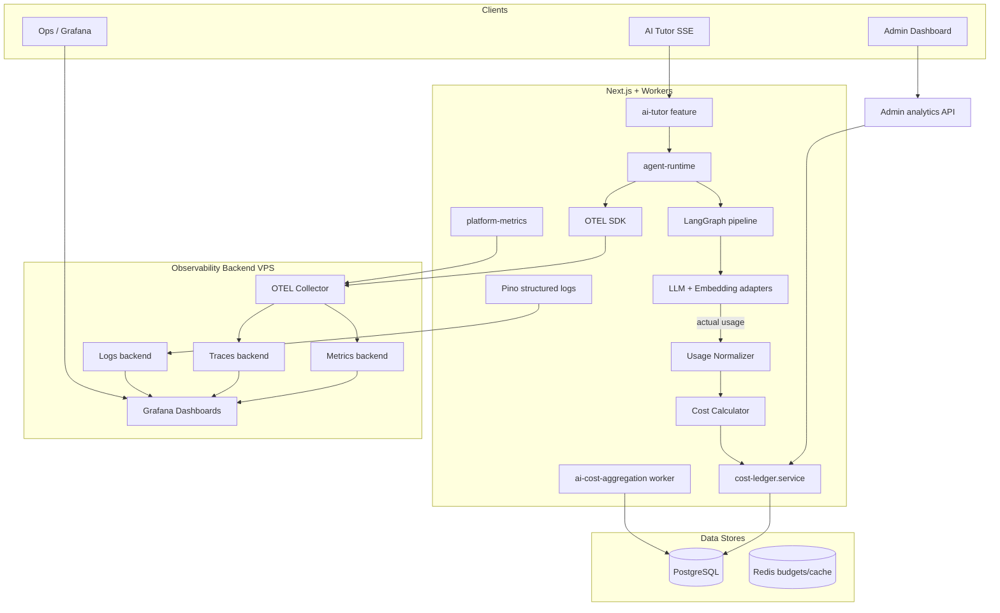

# AI Usage + Cost + OpenTelemetry — Architecture Plan

> **Source of truth** for AI usage tracking, cost accounting, observability, and
> admin dashboard implementation.  
> **Status:** **All phases complete (1–9).** Implementation verified August 2026.  
> **Checklist:** [production/production-readiness-checklist.md](./production/production-readiness-checklist.md)  
> **Last updated:** August 2026

---

## Table of Contents

1. [Current State](#1-current-state)
2. [Problems Found](#2-problems-found)
3. [Target Architecture](#3-target-architecture)
4. [Data Ownership](#4-data-ownership)
5. [Token Accounting](#5-token-accounting)
6. [Cost Architecture](#6-cost-architecture)
7. [OpenTelemetry Architecture](#7-opentelemetry-architecture)
8. [Privacy and Security](#8-privacy-and-security)
9. [Dashboard Architecture](#9-dashboard-architecture)
10. [VPS Deployment Strategy](#10-vps-deployment-strategy)
11. [Testing Strategy](#11-testing-strategy)
12. [Phased Implementation Plan](#12-phased-implementation-plan)
13. [Risks](#13-risks)

---

## 1. Current State

> **Historical snapshot** from Phase 0 discovery. For post-implementation status, see
> [production/production-readiness-checklist.md](./production/production-readiness-checklist.md)
> and [09-observability.md](./09-observability.md).

### Token accounting — Partial (OpenAI only)

| Area | Status | Location |
|------|--------|----------|
| OpenAI streaming usage | **Done** — `stream_options.include_usage` → `onUsage` callback | [`openai-llm.adapter.ts`](../../src/ai-platform/providers/openai/openai-llm.adapter.ts) |
| OpenAI non-streaming usage | **Done** — `response.usage` | same file |
| Anthropic usage | **Missing** — no `onUsage` / `usage` parsing | `providers/anthropic/` |
| Gemini usage | **Missing** — same | `providers/gemini/` |
| Graph state aggregation | **Done** — additive `tokensUsed` reducer | [`shared-channels.ts`](../../src/ai-platform/graph/state/shared-channels.ts) |
| Embedding tokens (RAG) | **Done** — provider-reported; 0 on cache hit | [`content-retriever.service.ts`](../../src/ai-platform/rag/retrieval/content-retriever.service.ts) |
| `chars/4` fallback | **Active** when provider usage absent | [`generate-response.node.ts`](../../src/ai-platform/graph/nodes/generate-response.node.ts), [`evaluate-rubric.node.ts`](../../src/ai-platform/graph/nodes/evaluate-rubric.node.ts), [`context-summarizer.ts`](../../src/ai-platform/memory/summarizer/context-summarizer.ts) |
| `tokenUsageEstimated` flag | **Internal only** — set in graph, **not persisted** | `generate-response.node.ts` |
| Unbilled LLM calls | **Gap** — history summarization in `prepare-history` discards usage | [`context-summarizer.ts`](../../src/ai-platform/memory/summarizer/context-summarizer.ts) |
| Indexing embeddings | **Not ledgered** — OTEL span only | [`course-indexing.pipeline.ts`](../../src/ai-platform/indexing/pipelines/course-indexing.pipeline.ts) |

### Cost tracking — Mostly done (Phase 1 ledger)

| Area | Status | Location |
|------|--------|----------|
| Per-run ledger | **Done** — `startAgentRun` / `completeAgentRun` / `failAgentRun` | [`cost-ledger.service.ts`](../../src/ai-platform/observability/cost/cost-ledger.service.ts) |
| Static pricing table | **Done** — USD/token per model | [`token-pricing.ts`](../../src/ai-platform/observability/cost/token-pricing.ts) |
| Daily aggregation | **Done** — BullMQ worker → `ai_usage_daily` | [`aggregation.handler.ts`](../../src/ai-platform/observability/cost/aggregation.handler.ts), [`ai-cost-aggregation.worker.ts`](../../src/server/workers/ai-cost-aggregation.worker.ts) |
| Budget guards | **Done** — Redis reserve/reconcile/release | [`cost-cap.guard.ts`](../../src/ai-platform/infrastructure/guards/cost-cap.guard.ts) |
| Cost Engine (budgets/quotas/forecast) | **Docs only** — not implemented | [`16-cost-engine.md`](./16-cost-engine.md) |

### Provider abstraction — Done

- `LlmPort` with `onUsage?: (usage) => void` — [`llm.port.ts`](../../src/ai-platform/domain/ports/llm.port.ts)
- Registry + model router + fallback chain + resilient wrapper
- AI Tutor consumes via `streamAgent('tutor')` only — no duplicate tracking in feature layer

### Observability — Partial

| Layer | Status | Notes |
|-------|--------|-------|
| OTEL traces | **Partial** — OTLP HTTP when `OTEL_EXPORTER_OTLP_ENDPOINT` set | [`otel-setup.ts`](../../src/ai-platform/observability/opentelemetry/otel-setup.ts) |
| OTEL metrics | **Partial** — Prometheus pull on `:9464` only; **no OTLP metrics export** | same |
| Manual spans | **Done** — `ai.agent.run`, `ai.graph.*`, `ai.llm.call`, `ai.node.*`, `ai.rag.retrieve` | [`span-helpers.ts`](../../src/ai-platform/observability/opentelemetry/span-helpers.ts), [`agent-runtime.ts`](../../src/ai-platform/application/runtime/agent-runtime.ts) |
| LangSmith | **Done** — RunTree + PII redaction | [`langsmith-tracer.ts`](../../src/ai-platform/observability/langsmith/langsmith-tracer.ts), [`trace-redactor.ts`](../../src/ai-platform/observability/langsmith/trace-redactor.ts) |
| Langfuse | **Prompts only** — not observability | [`langfuse-prompt.adapter.ts`](../../src/ai-platform/prompts/langfuse/langfuse-prompt.adapter.ts) |
| Legacy metrics endpoint | **Duplicate path** — in-memory `toPrometheusText()` at `/api/health/ai-platform` | [`platform-metrics.ts`](../../src/ai-platform/observability/metrics/platform-metrics.ts) |

### Logging — Partial

- Pino via `@/lib/logger` — warn/error on ledger/budget/LangSmith failures
- Tutor feature logs: `tutor.request.completed` / `failed` — [`tutor-request-logger.ts`](../../src/features/ai-tutor/infrastructure/observability/tutor-request-logger.ts)
- **Missing:** traceId/correlationId on all AI structured logs; no unified AI log schema

### Metrics — Partial

Existing OTEL counters/histograms in [`platform-metrics.ts`](../../src/ai-platform/observability/metrics/platform-metrics.ts):

- `ai_agent_runs_total`, `ai_agent_run_duration_ms`, `ai_llm_tokens_total`, `ai_tool_invocations_total`, `ai_retrieval_chunks_total`, `ai_retrieval_latency_ms`, budget/rate-limit/auth rejections

**Missing:** `ai_cost_total`, `ai_request_errors_total` (as dedicated counter), provider label on token metrics, cost histogram

### Tracing — Partial

Span hierarchy exists but streaming lifecycle (first-token, stream-abort) not fully instrumented. OTEL inactive unless `OTEL_ENABLED=true` (graceful no-op via `isOtelActive()`).

### Dashboard — Backend only

| Component | Status |
|-----------|--------|
| Analytics service | **Done** — [`cost-analytics.service.ts`](../../src/ai-platform/observability/dashboard/cost-analytics.service.ts) |
| Admin API routes | **Done** — `/api/admin/ai/{costs,usage,runs,models,providers}` |
| Admin UI | **Missing** — no pages under `/admin/analytics` |
| Chart library | **Missing** — no recharts/chart.js; CSS chart tokens exist in [`globals.css`](../../src/app/globals.css) |

### Persistence — Done (minimal schema)

```prisma
AiAgentRun   → ai_agent_runs    (per-run: tokens, cost, model, provider, latency, status)
AiUsageDaily → ai_usage_daily   (daily rollups + JSON breakdowns)
```

**Schema gaps for production accuracy:**

- No `tokenUsageEstimated` boolean
- No `actualModel` / `actualProvider` when fallback chain switches
- No `feature` column (use `agentId` as feature identifier — document this convention)
- No indexing-run ledger rows

### AuthZ — Split model

- **Admin UI routes** (`/admin/*`): NextAuth `Role.ADMIN` via [`proxy.ts`](../../src/proxy.ts) + page checks
- **AI analytics API**: Bearer `AI_ADMIN_API_SECRET` via [`ai-admin-auth.ts`](../../src/lib/admin/ai-admin-auth.ts) — **not** session RBAC
- **Student tutor access**: enrollment + feature flags + platform guards

### Streaming — Done

`streamAgent` → LangGraph stream → SSE; final `usage` from graph `tokensUsed` at `done` event. Delivery policy (`LiveStreamGuard`) separate from billing.

---

## 2. Problems Found

| # | Issue | Severity | Impact |
|---|-------|----------|--------|
| P1 | `chars/4` fallback used for Arabic text and non-OpenAI providers | High | Inaccurate cost/usage; violates "no chars/4 as source of truth" |
| P2 | Anthropic/Gemini adapters don't parse API `usage` | High | All non-OpenAI runs estimated |
| P3 | History summarization LLM call not added to `tokensUsed` | Medium | Under-billing |
| P4 | `tokenUsageEstimated` not persisted to ledger/API | Medium | Operators can't filter unreliable rows |
| P5 | Fallback model not recorded — cost priced on initial resolved model | Medium | Wrong cost when fallback serves |
| P6 | Dual metrics systems (OTEL + legacy in-memory) | Medium | Confusion in production; two scrape targets |
| P7 | No OTLP metrics export — only Prometheus pull | Medium | VPS stack likely uses OTLP collector |
| P8 | No dashboard UI | Medium | Backend exists but unusable for admins |
| P9 | Admin API uses shared secret, not ADMIN session | Low–Med | Inconsistent with admin UI auth model |
| P10 | No tests for ledger, analytics, OTEL, token accuracy | High | Regression risk |
| P11 | Indexing embedding cost not in ledger | Low | Blind spot for indexing spend |
| P12 | `.env.example` missing `AI_ADMIN_API_SECRET`, `OTEL_SERVICE_NAME`, `OTEL_METRICS_PORT` | Low | Ops friction |
| P13 | Evaluator node always `chars/4` | Low | Minor until evaluator agent used in prod |
| P14 | Logs lack `traceId` correlation | Medium | Hard to debug across systems |

**Do not duplicate:** cost ledger, aggregation worker, OTEL bootstrap, span helpers, admin API routes, token-pricing, platform-metrics (extend, don't rewrite).

---

## 3. Target Architecture



**Integration rule:** AI Tutor remains a consumer of `@/ai-platform` — no usage tracking in the feature layer.

---

## 4. Data Ownership

### PostgreSQL — historical / billing truth

Source of truth for:

- Per-request runs (`ai_agent_runs`): tokens, cost, model, provider, agentId (feature), status, timestamps, latency
- Daily aggregates (`ai_usage_daily`): rollups + breakdowns JSON
- Tool audit (`ai_tool_invocations`)

Written at request completion by `cost-ledger.service`. Read by dashboard APIs and aggregation worker.

### OpenTelemetry — operational truth

Source of truth for:

- Distributed traces (request lifecycle, RAG, LLM, validation)
- Real-time metrics (latency percentiles, error rates, throughput)
- Span attributes (model, provider, agentId — **never content**)

**Not** used for billing reconciliation — PG ledger is authoritative for cost history.

### Provider response — usage truth (when available)

When provider returns `usage` object:

1. Provider response is authoritative for that call
2. Normalized into `LlmTokenUsage { input, output }`
3. Aggregated in graph state → ledger → metrics

When provider does **not** return usage:

1. Mark `tokenUsageEstimated = true` in ledger
2. Use tiktoken (or provider-specific tokenizer) as fallback — **not** `chars/4`
3. Document in span attribute `ai.usage.estimated = true`

---

## 5. Token Accounting

### Current flow

```
LLM adapter → onUsage callback (OpenAI only)
           → generate-response.node accumulates tokensUsed
           → graph reducer sums across tool-call loops
           → agent-runtime reads finalState.tokensUsed
           → completeAgentRun(inputTokens, outputTokens, embeddingTokens)
```

### Per-provider matrix (target)

| Provider | Stream | Complete | Action in Phase 1 |
|----------|--------|----------|-------------------|
| OpenAI | `chunk.usage` | `response.usage` | Keep; remove chars/4 pre-estimate when usage arrives |
| Anthropic | SSE `message_delta` / final `usage` | `usage` in response | Parse and call `onUsage` |
| Gemini | `usageMetadata` in stream | same in response | Parse and call `onUsage` |

### Streaming behavior

- OpenAI: usage arrives in **final** stream chunk — `onUsage` fires once at end (correct)
- Billing uses graph-final `tokensUsed`, not per-chunk counts
- `streamedTokenCount` is delivery-only

### Normalization layer (new, Phase 1)

Create `observability/usage/usage-normalizer.ts`:

- Input: raw provider usage + model + provider name
- Output: `{ inputTokens, outputTokens, estimated: boolean, source: 'provider' | 'tokenizer' }`
- Single entry point for all adapters

### Issues to fix (documented, not chars/4)

1. **Summarization** — wire `context-summarizer` usage into graph `tokensUsed` via `prepare-history.node`
2. **Evaluator** — use provider usage from `structured-output.service` / `complete()`
3. **Fallback model** — record `actualModel`/`actualProvider` from adapter that served
4. **Persist `tokenUsageEstimated`** — new column on `AiAgentRun` (boolean, default false)

---

## 6. Cost Architecture

### Current chain (reuse)

```
Provider → Model → TOKEN_PRICING[model] → inputTokens × inputRate + outputTokens × outputRate
                                                  + embeddingTokens × embeddingRate
                                                  → estimatedCostUsd → ai_agent_runs
```

Implemented in [`token-pricing.ts`](../../src/ai-platform/observability/cost/token-pricing.ts).

### Phase 2 enhancements (minimal)

- Price using **actual** model (after fallback fix)
- Add `AI_PLATFORM_MODEL_PRICING_JSON` env override (optional JSON blob) — avoids code deploy for price updates
- Expose `tokenUsageEstimated` in analytics filters
- **Do not** implement full Cost Engine (`ai_cost_budgets`, quotas) — out of scope for V1

### Cost Engine doc

[`16-cost-engine.md`](./16-cost-engine.md) remains future work. V1 = ledger + static/env pricing + existing Redis guards.

---

## 7. OpenTelemetry Architecture

### Traces (extend existing)

```
ai.agent.run                          [root]
├── ai.guard.budget                   [new]
├── ai.guard.rate-limit               [new]
├── ai.graph.stream / ai.graph.execute
│   ├── ai.node.sanitize-input
│   ├── ai.node.load-history
│   ├── ai.node.prepare-history       [+ summarization sub-span]
│   ├── ai.node.retrieve-context
│   │   └── ai.rag.retrieve
│   │       └── ai.embedding.generate
│   ├── ai.node.generate-response
│   │   └── ai.llm.call
│   ├── ai.node.validate-output
│   └── ai.node.persist-turn
└── ai.ledger.complete                [new]
```

### Metrics (standardize names)

| Metric | Type | Labels | Status |
|--------|------|--------|--------|
| `ai_requests_total` | Counter | agent_id, status | Rename/alias from `ai_agent_runs_total` |
| `ai_request_duration_ms` | Histogram | agent_id | Exists |
| `ai_request_errors_total` | Counter | agent_id, error_code | **New** |
| `ai_tokens_input_total` | Counter | model, provider | Extend `ai_llm_tokens_total` |
| `ai_tokens_output_total` | Counter | model, provider | Extend |
| `ai_cost_usd_total` | Counter | model, provider, agent_id | **New** |
| `ai_rag_retrieval_duration_ms` | Histogram | agent_id | Exists as `ai_retrieval_latency_ms` |
| `ai_embedding_tokens_total` | Counter | model | **New** |

**Cardinality rules:** Never label by `userId`, `courseId`, `threadId`, or `prompt`. Use `agent_id`, `model`, `provider`, `status` only.

### Logs

Extend Pino child logger pattern:

```typescript
{
  event,
  traceId,
  spanId,
  runId,
  agentId,
  model,
  provider,
  inputTokens,
  outputTokens,
  costUsd,
  durationMs,
  status,
}
```

**Never:** prompt, response, RAG chunks, API keys.

### Production config

| Setting | Dev | Production VPS |
|---------|-----|----------------|
| `OTEL_ENABLED` | `false` | `true` |
| `OTEL_EXPORTER_OTLP_ENDPOINT` | optional | `http://otel-collector:4318` |
| `OTEL_SERVICE_NAME` | `ithracode-ai-platform` | same |
| `OTEL_METRICS_PORT` | `9464` | `9464` (Prometheus scrape) |
| Sampling | 100% | 10–20% traces (head-based via env `OTEL_TRACES_SAMPLER_ARG`) |
| Failure mode | no-op | **Telemetry failure must never throw** — existing `isOtelActive()` pattern |

### Consolidation (Phase 3)

- Deprecate legacy `toPrometheusText()` / in-memory counters
- Single export path: OTEL Prometheus exporter + OTLP
- Keep `/api/health/ai-platform` as health check only (or proxy OTEL metrics)

---

## 8. Privacy and Security

### Allowed in telemetry

`provider`, `model`, `agentId`, `status`, `latency`, `token counts`, `cost`, `traceId`, `runId`, `correlationId`, `tokenUsageEstimated`, `errorCode` (typed, not stack with user data)

### Forbidden

`prompt`, `response`, `course content`, `RAG chunks`, `API keys`, `Authorization` headers, raw `userId` in OTEL attributes (hash if needed — reuse [`trace-redactor.ts`](../../src/ai-platform/observability/langsmith/trace-redactor.ts) patterns)

### AuthZ for dashboard (V1 recommendation)

- **Admin UI:** NextAuth `Role.ADMIN` session (consistent with `/admin/*`)
- **Server Actions / RSC:** call `cost-analytics.service` directly (no Bearer secret in browser)
- **Keep Bearer API** for external ops/Grafana scripts — document both paths
- Fail-closed budget guards remain unchanged per [`13-security.md`](./13-security.md)

---

## 9. Dashboard Architecture

### Route

`src/app/(admin)/admin/analytics/ai/page.tsx` (+ optional sub-routes)

### Data source

Server Component or React Query → Server Action wrapping `cost-analytics.service` (not client-side Bearer secret).

### V1 sections

**Overview cards:** Total Tokens, Total Cost, Requests, Avg Cost/Request, Error Rate, Avg Latency

**Charts:** Cost over time, Tokens over time, Requests + Errors (use `ai_usage_daily` + `ai_agent_runs`)

**Model breakdown table:** Provider, Model, Requests, Tokens, Cost, Error Rate, Latency

**Recent requests table:** timestamp, model, provider, tokens, cost, latency, status, `tokenUsageEstimated` badge

### Chart library

Add **Recharts** (recommended) — works with shadcn patterns, supports CSS variable theming via `chart-1`…`chart-5` tokens already in [`globals.css`](../../src/app/globals.css).

### Design system rules

- Use `Card`, `Badge`, `Skeleton`, `Select`, `Table` from [`src/components/ui/`](../../src/components/ui/)
- Colors: `bg-card`, `text-muted-foreground`, `chart-primary-stroke`, `chart-error-stroke` — **no hardcoded zinc/cyan**
- RTL: inherit root `dir="rtl"`; charts use logical margins
- Dark mode: automatic via `next-themes` + CSS variables

---

## 10. VPS Deployment Strategy

### Process layout

```
┌─────────────────────────────────────────┐
│ VPS                                      │
│  ┌──────────────┐  ┌──────────────────┐ │
│  │ Next.js app  │  │ BullMQ workers   │ │
│  │ :3000        │  │ (cost-agg, etc.) │ │
│  └──────┬───────┘  └────────┬─────────┘ │
│         │ OTEL_ENABLED=true  │           │
│         └────────┬───────────┘           │
│                  ▼                       │
│         ┌─────────────────┐              │
│         │ OTEL Collector  │ :4318        │
│         └────────┬────────┘              │
│      ┌───────────┼───────────┐           │
│      ▼           ▼           ▼           │
│   Tempo/Jaeger Prometheus  Loki          │
│                  │                       │
│                  ▼                       │
│              Grafana :3001               │
└─────────────────────────────────────────┘
```

### Environment variables (add to `.env.example`)

```bash
# Existing
OTEL_ENABLED=true
OTEL_SERVICE_NAME=ithracode-ai-platform
OTEL_EXPORTER_OTLP_ENDPOINT=http://127.0.0.1:4318
OTEL_METRICS_PORT=9464

# New (Phase 3+)
OTEL_TRACES_SAMPLER=parentbased_traceidratio
OTEL_TRACES_SAMPLER_ARG=0.1

# Admin
AI_ADMIN_API_SECRET=...          # ops API only
```

### Graceful failure (critical)

- All OTEL calls guarded by `isOtelActive()` — already implemented
- Ledger write failures: log warn, **do not fail request** (current behavior in `cost-ledger.service`)
- Budget guard failures: **fail-closed** (deny request) — keep existing security posture
- OTEL exporter down: SDK buffers then drops — AI requests continue

### Resource limits

- OTEL batch span processor defaults; tune `OTEL_BSP_MAX_QUEUE_SIZE` if needed
- Prometheus scrape interval: 15s
- `ai_usage_daily` aggregation: daily cron via existing worker

---

## 11. Testing Strategy

Follow existing conventions: `tests/unit/`, `tests/integration/`, `tests/helpers/integration.ts`, `VITEST_INTEGRATION=true`.

| Phase | Tests |
|-------|-------|
| 1 — Token accounting | Unit: usage normalizer, per-provider usage parsing (mocked responses); integration: ledger rows with `tokenUsageEstimated` |
| 2 — Cost | Unit: `computeRunCostUsd` with actual model, env pricing override; integration: aggregation rollups |
| 3 — OTEL foundation | Unit: `isOtelActive` no-op when disabled; verify init doesn't throw without endpoint |
| 4 — Tracing | Unit: span attributes contain no forbidden fields; integration: trace context propagation |
| 5 — Metrics/logs | Unit: metric label cardinality; log shape validation |
| 6 — Dashboard API | Unit: analytics queries; integration: ADMIN auth rejection |
| 7 — Dashboard UI | Component tests (optional); E2E manual checklist |
| 8 — Hardening | Telemetry failure isolation test: mock OTEL throw → request succeeds |
| 9 — Final | `pnpm test`, `pnpm test:integration`, `pnpm type-check`, `pnpm lint` |

**Existing tests to extend:** [`budget-reservation.test.ts`](../../tests/unit/budget-reservation.test.ts), [`live-stream-guard.test.ts`](../../tests/unit/live-stream-guard.test.ts)

---

## 12. Phased Implementation Plan

### Phase 0 — Discovery and documentation ✅

- Write this document
- Cross-link from [`09-observability.md`](./09-observability.md)
- **No implementation code**

### Phase 1 — Usage and token accounting ✅

**Completed (August 2026):**

- Added [`observability/usage/`](../../src/ai-platform/observability/usage/) module:
  - `NormalizedTokenUsage` (`inputTokens`, `outputTokens`, `totalTokens`, `tokenUsageEstimated`)
  - `resolveTokenUsage()` — provider-first, text estimate only when missing
  - Provider mappers for OpenAI, Anthropic, Gemini
- **OpenAI:** existing `usage` via mapper (stream + complete)
- **Anthropic:** SSE `message_start` / `message_delta` usage + complete `usage`
- **Gemini:** `usageMetadata` in stream + complete
- Graph nodes wired: `generate-response`, `prepare-history` (summarization), `evaluate-rubric`
- `tokenUsageEstimated` persisted on `ai_agent_runs` + exposed in runtime/API responses
- Tests: [`usage-normalizer.test.ts`](../../tests/unit/usage-normalizer.test.ts), [`llm-provider-usage.test.ts`](../../tests/unit/llm-provider-usage.test.ts)

**Deferred to Phase 2:**

- `actualModel` / `actualProvider` on fallback chain
- Env-driven pricing override
- Analytics API filters for `tokenUsageEstimated`
- Tiktoken dependency (last-resort fallback remains centralized `chars/4` with `tokenUsageEstimated=true`)

### Phase 2 — Cost ledger hardening ✅

**Completed (August 2026):**

- Price ledger completions on **actual** model after fallback (`actualModel` / `actualProvider` columns + `onModelServed` in fallback chain)
- `AI_PLATFORM_MODEL_PRICING_JSON` env override for per-model USD/token rates
- `tokenUsageEstimated` filter on analytics APIs (`?tokenUsageEstimated=true|false`)
- Ledger service tests (`cost-ledger.test.ts`, `token-pricing.test.ts`, `fallback-chain.test.ts`)
- `.env.example` updated with pricing override, OTEL, and `AI_ADMIN_API_SECRET`

### Phase 3 — OpenTelemetry foundation ✅

**Completed (August 2026):**

- OTLP metrics exporter alongside Prometheus pull (`PeriodicExportingMetricReader` + `/v1/metrics`)
- Trace sampling via `OTEL_TRACES_SAMPLER` / `OTEL_TRACES_SAMPLER_ARG`
- Removed legacy in-memory `platformMetrics.toPrometheusText()` duplicate path
- `/api/health/ai-platform` returns JSON health + export hints (metrics via OTEL exporters)
- AI workers (`ai-cost-aggregation`, `course-indexing`) call `initOtel()` at startup
- Graceful OTEL init failure (warn log, request path unaffected)
- Tests: [`otel-setup.test.ts`](../../tests/unit/otel-setup.test.ts)

### Phase 4 — AI tracing ✅

**Completed (August 2026):**

- Completed span hierarchy under `ai.agent.run`:
  - `ai.guard.rate-limit`, `ai.guard.budget`
  - `ai.memory.summarize` (history summarization sub-span)
  - `ai.ledger.complete`
- Privacy-safe OTEL attributes via `otel-attributes.ts` (hashed user/course/lecture IDs; forbidden prompt/response keys stripped)
- Streaming lifecycle attributes:
  - `ai.llm.time_to_first_token_ms`, `ai.llm.stream.duration_ms`, `ai.llm.stream.aborted`
  - `ai.stream.time_to_first_token_ms` on agent stream span
- Stream trace context propagation fixed so graph/guard spans nest under `ai.agent.run`
- Tests: [`otel-attributes.test.ts`](../../tests/unit/otel-attributes.test.ts)

### Phase 5 — Metrics and structured logging ✅

**Completed (August 2026):**

- Standardized OTEL counters/histograms:
  - `ai_requests_total`, `ai_request_duration_ms` (aliases alongside legacy names)
  - `ai_request_errors_total` (`agent_id`, `error_code`)
  - `ai_tokens_input_total`, `ai_tokens_output_total` (with `model`, `provider`)
  - `ai_cost_usd_total` (`model`, `provider`, `agent_id`)
  - `ai_embedding_tokens_total` (`model`)
  - `ai_rag_retrieval_duration_ms` (alias for retrieval latency)
- `platformMetrics.recordRunOutcome()` consolidates completion metrics
- Unified AI log schema in `observability/logging/ai-event-logger.ts`:
  - `ai.agent.run.completed` / `ai.agent.run.failed`
  - Correlates `traceId`, `spanId`, `runId`, `agentId`, token/cost/latency fields
  - Forbidden prompt/response fields stripped
- Agent runtime logs + metrics on both success and failure paths
- Tests: [`ai-observability-phase5.test.ts`](../../tests/unit/ai-observability-phase5.test.ts)

### Phase 6 — Dashboard backend ✅

**Completed (August 2026):**

- Admin Server Actions with NextAuth `Role.ADMIN` session auth:
  - `getAiAnalyticsOverviewAction`, `getAiAnalyticsRunsAction`, `getAiAnalyticsModelBreakdownAction`, etc.
  - Located in `features/admin/actions/ai-analytics.actions.ts`
- Analytics service enhancements:
  - `getOverviewAnalytics()` — requests, error rate, avg latency, cost/token totals
  - `getModelBreakdownAnalytics()` — per model/provider error rate + latency
  - `listAgentRuns()` now includes all statuses (filterable via `status`)
- Shared filter parsing in `analytics-filters.ts`
- Bearer ops API preserved and extended:
  - Existing: `/api/admin/ai/{costs,usage,runs,models,providers}`
  - New: `/api/admin/ai/overview`, `/api/admin/ai/breakdown`
- Tests: [`cost-analytics.test.ts`](../../tests/unit/cost-analytics.test.ts)

### Phase 7 — Dashboard UI ✅

**Completed (August 2026):**

- Added **Recharts** and admin route `/admin/analytics/ai`
- Overview cards: tokens, cost, requests, avg cost/request, error rate, avg latency
- Time-series charts: cost, tokens, completed vs failed requests
- Model breakdown table with error rate and latency
- Recent runs table with status and `tokenUsageEstimated` badge
- Date range filter (7 / 30 / 90 days) via URL search params
- RTL-aware layout, theme tokens (`chart-primary-stroke`, `chart-error-stroke`, etc.)
- Server Actions only (no Bearer secret in browser)
- Tests: [`ai-analytics-dashboard.test.ts`](../../tests/unit/ai-analytics-dashboard.test.ts)

### Phase 8 — Production hardening ✅

- VPS env template + collector config example (docs only) — [`production/`](./production/)
- Cardinality review — [`production/cardinality-review.md`](./production/cardinality-review.md)
- Security/privacy review — [`production/security-privacy-review.md`](./production/security-privacy-review.md)
- Performance: analytics query indexes — migration `20260808140000_add_ai_analytics_indexes`
- Telemetry failure isolation — `telemetry-isolation.ts`, `metric-labels.ts`, tests in `telemetry-isolation.test.ts`
- Dashboard bundle: lazy-loaded Recharts via `lazy-usage-charts.tsx`

### Phase 9 — Final verification ✅

- Full test suite — see results in [`production/production-readiness-checklist.md`](./production/production-readiness-checklist.md)
- Production-readiness checklist — [`production/production-readiness-checklist.md`](./production/production-readiness-checklist.md)
- Docs updated — plan, `09-observability.md`, production artifacts

**Verification (Aug 2026):**

| Command | Result |
|---------|--------|
| `pnpm test:unit` | 85 passed |
| `pnpm test:integration` | 7 passed |
| `pnpm test` | 86 passed, 6 skipped |
| `pnpm lint` | 0 errors |
| `pnpm type-check` | Pre-existing `.next/types` failures (unrelated) |

**Rule:** After each phase — implement only that phase, run its tests, update docs, provide summary, **stop and wait for approval**.

---

## 13. Risks

| Risk | Mitigation |
|------|------------|
| Arabic token underestimation with chars/4 | Phase 1 tiktoken + provider usage |
| OTEL overhead on VPS | Sampling + async export |
| High metric cardinality | Strict label allowlist |
| Dual auth models confuse admins | Phase 6: UI uses session; document Bearer for ops |
| Prisma migration on production `ai_agent_runs` | Additive columns only; nullable defaults |
| Chart library bundle size | Recharts tree-shake; lazy-load dashboard page |
| Cost Engine scope creep | Explicitly out of V1; reference doc only |

---

## Related docs

- [09-observability.md](./09-observability.md) — current observability reference
- [production/production-readiness-checklist.md](./production/production-readiness-checklist.md) — deploy sign-off
- [16-cost-engine.md](./16-cost-engine.md) — future cost governance (out of V1 scope)
- [13-security.md](./13-security.md) — fail-closed guards and privacy
