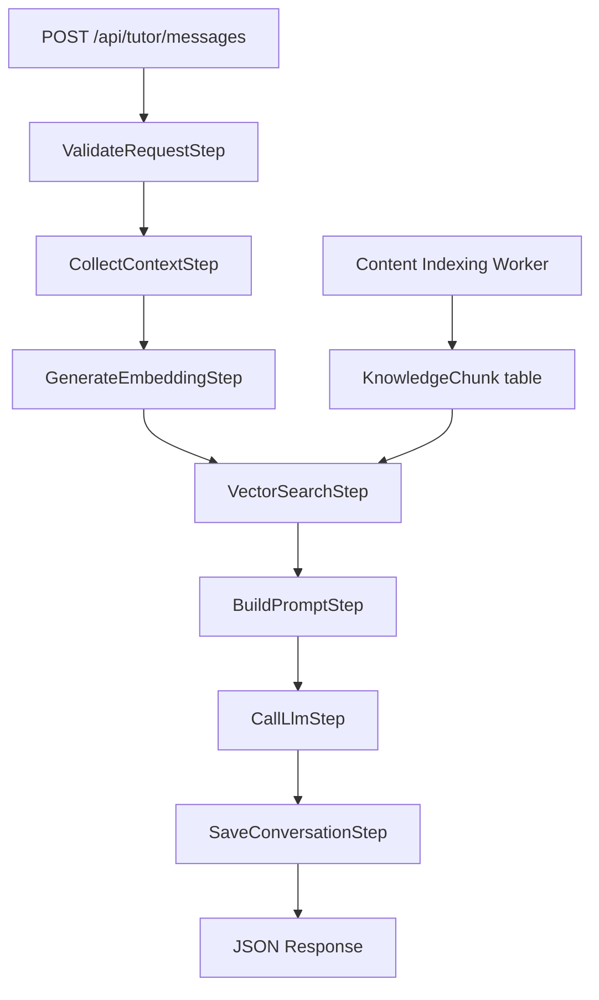
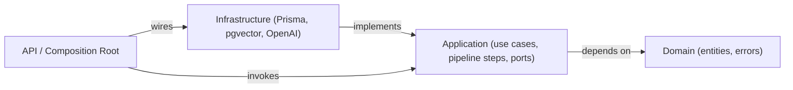
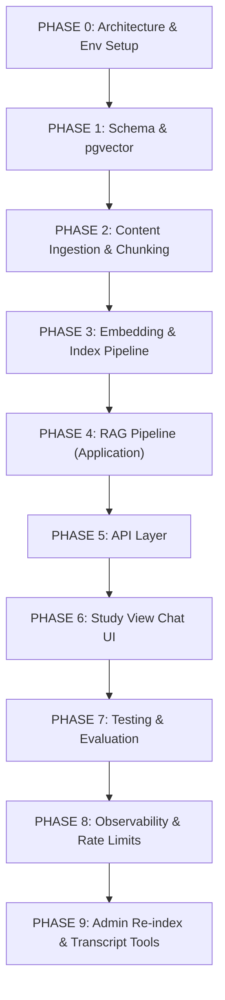

# 01 - AI Tutor RAG Pipeline Implementation Plan

## Purpose

This document is the official engineering roadmap for the **AI Tutor Question Processing Pipeline** on IthraCode. It defines how student questions are answered using **course knowledge only** via Retrieval-Augmented Generation (RAG).

The pipeline ensures responses are accurate, contextual, and grounded in platform learning materials — not general web knowledge.

**Last updated:** July 2026

---

## Guiding Principles

1. **Retrieval before generation.** Semantic search selects context; the LLM synthesizes only what was retrieved.
2. **Course-grounded responses.** Answers must align with indexed course content for the enrolled course.
3. **No hallucinations.** When retrieval returns nothing relevant, the tutor refuses to answer and guides the student.
4. **Modular architecture.** Each pipeline stage is an independent, testable component behind clear interfaces.
5. **Provider-agnostic AI layer.** Embedding and LLM vendors are infrastructure; application code depends on ports only.
6. **Observable pipeline.** Every stage emits structured logs, timings, and correlation IDs for debugging.
7. **Conversation persistence.** Multi-turn chat is stored server-side and scoped to student + course (+ lecture).
8. **Enrollment is mandatory.** Unauthenticated or non-enrolled users cannot invoke the tutor.

These mirror the payment platform's Clean Architecture approach (`docs/payment/02-payment-implementation-plan.md`).

---

## Current Platform State

| Area | Status | Evidence |
|---|---|---|
| AI Assistant UI | UI shell only | `course-sidebar-assistant.tsx` — placeholder with "بدء المحادثة" |
| Lecture content | Partial | `Lecture.content`, `Lecture.description`, `Attachment.content` in Prisma |
| Video transcripts | Not modeled | `Video` has Bunny metadata only; no transcript table |
| Vector search | Not implemented | No pgvector, Pinecone, or embedding deps in `package.json` |
| LLM integration | Not implemented | No OpenAI/Anthropic env vars or clients |
| Conversation storage | Not modeled | No `TutorConversation` / `TutorMessage` in schema |
| Student progress | Live | `Progress`, `Enrollment` models + `getLectureDetails` actions |
| Learning paths | Live | `Path`, `Track` models; path context available for enrolled paths |
| FAQs | Schema only | `Faq` model exists; not wired to study view |

**Implication:** Phases 0–3 build foundation (schema, indexing, ingestion). Phases 4–6 deliver the live question pipeline and UI. Phases 7–8 add hardening and observability.

---

## Pipeline Overview

```
Student Question
        │
        ▼
┌───────────────────┐
│ 1. Receive &       │  Validate auth, enrollment, course/lecture scope
│    Normalize       │
└─────────┬─────────┘
          ▼
┌───────────────────┐
│ 2. Context         │  Course, section, lecture, progress, history
│    Collection      │
└─────────┬─────────┘
          ▼
┌───────────────────┐
│ 3. Embedding       │  Vectorize student question (not sent to LLM)
│    Generation      │
└─────────┬─────────┘
          ▼
┌───────────────────┐
│ 4. Vector Search   │  Top-K chunks scoped to courseId
│    (RAG)           │
└─────────┬─────────┘
          ▼
┌───────────────────┐
│ 5. Prompt Builder  │  System + context + history + question
└─────────┬─────────┘
          ▼
┌───────────────────┐
│ 6. LLM Call        │  Generate grounded answer
└─────────┬─────────┘
          ▼
┌───────────────────┐
│ 7. Persist         │  Save question, answer, metadata
│    Conversation    │
└───────────────────┘
```



---

## Target Module Layout

New feature module: `src/features/ai-tutor/`

```
src/features/ai-tutor/
├── domain/
│   ├── tutor-message.entity.ts
│   ├── tutor-conversation.entity.ts
│   ├── knowledge-chunk.entity.ts
│   └── errors/
│       └── tutor.errors.ts
├── application/
│   ├── ports/
│   │   ├── embedding.port.ts
│   │   ├── llm.port.ts
│   │   ├── vector-search.port.ts
│   │   ├── tutor-conversation.repository.ts
│   │   ├── knowledge-chunk.repository.ts
│   │   ├── course-context.port.ts
│   │   └── content-ingestion.port.ts
│   ├── use-cases/
│   │   ├── ask-tutor.use-case.ts          # Main RAG pipeline orchestrator
│   │   ├── get-conversation.use-case.ts
│   │   └── index-course-content.use-case.ts
│   ├── pipeline/
│   │   ├── validate-request.step.ts
│   │   ├── collect-context.step.ts
│   │   ├── generate-embedding.step.ts
│   │   ├── vector-search.step.ts
│   │   ├── build-prompt.step.ts
│   │   ├── call-llm.step.ts
│   │   └── save-conversation.step.ts
│   └── services/
│       ├── prompt-builder.service.ts
│       └── chunking.service.ts
├── infrastructure/
│   ├── openai/
│   │   ├── openai-embedding.client.ts
│   │   └── openai-llm.client.ts
│   ├── prisma/
│   │   ├── repositories/
│   │   ├── mappers/
│   │   └── *.select.ts
│   └── pgvector/
│       └── pgvector-search.client.ts
├── api/
│   ├── dto/
│   ├── handlers/
│   └── routes/
├── presentation/
│   └── components/                        # Chat UI (study sidebar)
└── workers/
    └── content-indexing.worker.ts
```

API route (composition root): `src/app/api/tutor/messages/route.ts`

---

## Layer Dependency Rules



- Domain has zero framework or vendor imports.
- Application defines `EmbeddingPort`, `LlmPort`, `VectorSearchPort`; never imports OpenAI SDK.
- Infrastructure maps Prisma rows ↔ domain entities and executes vector SQL.
- Only route handlers and workers know concrete adapter classes.

---

## Data Model (Prisma)

### New models

```prisma
enum KnowledgeSourceType {
  LECTURE_CONTENT
  LECTURE_DESCRIPTION
  LECTURE_TRANSCRIPT
  ATTACHMENT
  COURSE_DESCRIPTION
  FAQ
  ASSIGNMENT
  CODE_EXAMPLE
}

enum TutorMessageRole {
  STUDENT
  ASSISTANT
  SYSTEM
}

model LectureTranscript {
  id        String   @id @default(cuid())
  lectureId String   @unique @map("lecture_id")
  language  String   @default("ar")
  text      String   @db.Text
  source    String   @default("manual") // manual | bunny | whisper
  createdAt DateTime @default(now()) @map("created_at")
  updatedAt DateTime @updatedAt @map("updated_at")

  lecture Lecture @relation(fields: [lectureId], references: [id], onDelete: Cascade)

  @@map("lecture_transcripts")
}

model KnowledgeChunk {
  id          String              @id @default(cuid())
  courseId    String              @map("course_id")
  lectureId   String?             @map("lecture_id")
  sectionId   String?             @map("section_id")
  sourceType  KnowledgeSourceType @map("source_type")
  sourceId    String              @map("source_id")
  content     String              @db.Text
  tokenCount  Int                 @map("token_count")
  chunkIndex  Int                 @map("chunk_index")
  metadata    Json?
  embedding   Unsupported("vector(1536)")?  // pgvector; dimension matches embedding model
  createdAt   DateTime            @default(now()) @map("created_at")
  updatedAt   DateTime            @updatedAt @map("updated_at")

  course Course @relation(fields: [courseId], references: [id], onDelete: Cascade)

  @@index([courseId])
  @@index([courseId, lectureId])
  @@index([sourceType, sourceId])
  @@map("knowledge_chunks")
}

model TutorConversation {
  id        String   @id @default(cuid())
  studentId String   @map("student_id")
  courseId  String   @map("course_id")
  lectureId String?  @map("lecture_id")
  createdAt DateTime @default(now()) @map("created_at")
  updatedAt DateTime @updatedAt @map("updated_at")

  student  User           @relation(fields: [studentId], references: [id], onDelete: Cascade)
  course   Course         @relation(fields: [courseId], references: [id], onDelete: Cascade)
  lecture  Lecture?       @relation(fields: [lectureId], references: [id], onDelete: SetNull)
  messages TutorMessage[]

  @@unique([studentId, courseId, lectureId])
  @@index([studentId])
  @@index([courseId])
  @@map("tutor_conversations")
}

model TutorMessage {
  id             String           @id @default(cuid())
  conversationId String           @map("conversation_id")
  role           TutorMessageRole
  content        String           @db.Text
  retrievedChunkIds String[]       @map("retrieved_chunk_ids")
  model          String?
  latencyMs      Int?             @map("latency_ms")
  createdAt      DateTime         @default(now()) @map("created_at")

  conversation TutorConversation @relation(fields: [conversationId], references: [id], onDelete: Cascade)

  @@index([conversationId])
  @@map("tutor_messages")
}
```

### Infrastructure notes

- Enable `pgvector` extension on PostgreSQL: `CREATE EXTENSION IF NOT EXISTS vector;`
- Prisma `Unsupported("vector(1536)")` requires raw SQL for similarity search; repository hides this.
- Alternative for MVP: store embeddings in a dedicated vector DB (e.g. Pinecone) with `KnowledgeChunk` metadata in Postgres only — defer unless pgvector ops are blocked.

---

## Pipeline Step Specifications

### Step 1 — Receive Student Question

**Input (API body):**

```json
{
  "courseId": "cuid",
  "lectureId": "cuid",
  "message": "What is React Context?"
}
```

**Responsibilities (`ValidateRequestStep`):**

| Check | Rule |
|---|---|
| Authentication | Session via NextAuth; reject 401 if missing |
| Enrollment | `Enrollment` ACTIVE for `studentId` + `courseId` |
| Course scope | `courseId` must match enrolled course |
| Lecture scope | If `lectureId` provided, lecture must belong to `courseId` |
| Message | Non-empty, max length (e.g. 2 000 chars), trim whitespace |
| Rate limit | Per student: e.g. 30 messages / hour (Redis or in-memory for dev) |

**Output:** `NormalizedTutorRequest` — `{ studentId, courseId, lectureId?, message, conversationId? }`

---

### Step 2 — Collect Context

**Responsibilities (`CollectContextStep` via `CourseContextPort`):**

| Context slice | Source |
|---|---|
| Current course | `Course.title`, `description`, `slug` |
| Current section | Section of `lectureId` if provided |
| Current lecture | `Lecture.title`, `description`, `content` |
| Lecture transcript | `LectureTranscript.text` |
| Lecture notes | `Attachment` where `type` in TEXT, CODE, HTML |
| Previous conversation | Last N `TutorMessage` rows (e.g. N = 10) |
| Student progress | `Progress` for enrollment — completed lectures, `timeSpent` |
| Learning path | If course is in an enrolled path, path title + position |

**Output:** `TutorSessionContext` — single structured object passed to prompt builder (not to embedding step).

---

### Step 3 — Generate Embedding

**Responsibilities (`GenerateEmbeddingStep` via `EmbeddingPort`):**

- Input: normalized `message` string only (optionally prefixed with lecture title for disambiguation).
- Output: `float[]` embedding vector.
- **Not sent to LLM** — used only for vector search.

**Default provider:** OpenAI `text-embedding-3-small` (1536 dims) behind `EmbeddingPort`.

---

### Step 4 — Vector Search (RAG)

**Responsibilities (`VectorSearchStep` via `VectorSearchPort`):**

Search scope filters:

```sql
WHERE course_id = :courseId
  AND (lecture_id = :lectureId OR :lectureId IS NULL)  -- optional lecture bias
ORDER BY embedding <=> :queryEmbedding
LIMIT :topK
```

**Source types indexed:**

| Source | Origin |
|---|---|
| Transcript | `LectureTranscript` |
| Lecture notes | `Lecture.content`, `Lecture.description` |
| Attachments | `Attachment.content` (PDF text extraction in ingestion) |
| Code examples | `Attachment` type CODE |
| Assignments | `Lecture` type ASSIGNMENT |
| Documentation | Course `description`, section descriptions |
| FAQs | `Faq` rows linked to course |

**Parameters:**

- `topK`: default 5, max 8
- `minScore`: cosine similarity threshold (e.g. 0.72); below threshold → treat as no results

**Output:** `RetrievedChunk[]` — `{ id, content, sourceType, lectureId?, score }`

---

### Step 5 — Build Prompt

**Responsibilities (`BuildPromptStep` + `PromptBuilderService`):**

**System prompt (always included):**

```
You are the IthraCode AI Tutor for this course. Answer ONLY using the retrieved course materials below.
- Explain clearly in the same language the student used (Arabic or English).
- If the materials do not contain enough information, say you cannot answer reliably.
- Do not use outside knowledge or invent facts.
- Reference which part of the course the answer comes from when possible.
```

**Prompt structure:**

```
[System Prompt]
+ [Course Information]
+ [Lecture Information] (if lectureId)
+ [Retrieved Documents] (numbered chunks with source labels)
+ [Conversation History] (prior turns, excluding current question)
+ [Student Progress Summary] (optional, brief)
+ [Student Question]
```

**Output:** `LlmPrompt` — `{ system, messages: ChatMessage[] }`

---

### Step 6 — Call LLM

**Responsibilities (`CallLlmStep` via `LlmPort`):**

- Model: configurable (e.g. `gpt-4o-mini` for cost, `gpt-4o` for quality).
- Temperature: low (0.2) to reduce creativity/hallucination.
- Max tokens: capped (e.g. 1 024).
- Timeout: 30s with single retry on transient errors.

**Input:** constructed prompt only — never full course corpus.

---

### Step 7 — Generate Response

Example grounded answer:

> React Context allows data to be shared between components without manually passing props through every level of the component tree. In this course, the instructor introduces Context after explaining prop drilling. The lecture demonstrates creating a Context using `createContext()`, wrapping components with `Context.Provider`, and consuming values with `useContext()`.

---

### Step 8 — Save Conversation

**Responsibilities (`SaveConversationStep`):**

Persist:

| Field | Value |
|---|---|
| Student message | Original `message`, role `STUDENT` |
| AI response | LLM output, role `ASSISTANT` |
| `retrievedChunkIds` | IDs from Step 4 |
| `courseId`, `lectureId` | From request |
| `model`, `latencyMs` | Telemetry |
| `createdAt` | Server timestamp |

Upsert `TutorConversation` per `(studentId, courseId, lectureId)` or create thread per session — **decision: one conversation per student+course+lecture** (unique constraint above).

---

## Error Handling

### No relevant documents

When `VectorSearchStep` returns empty or all scores below `minScore`:

1. Do **not** call the LLM (save cost and prevent hallucination).
2. Return a fixed assistant message (Arabic default for platform):

> لم أجد معلومات عن هذا الموضوع في مواد الدورة الحالية، لذلك لا يمكنني تقديم شرح موثوق. يُرجى طرح سؤال آخر متعلق بمفاهيم مغطاة في هذه الدورة.

English variant when student message is detected as English.

3. Still persist the exchange for conversation continuity.

### Other errors

| Error | HTTP | Student-facing |
|---|---|---|
| Not authenticated | 401 | Redirect to sign-in |
| Not enrolled | 403 | لا يمكنك استخدام المساعد في دورة غير مسجّل فيها |
| Invalid lecture | 400 | المحاضرة غير موجودة في هذه الدورة |
| Rate limited | 429 | عدد كبير من الأسئلة — انتظر قليلاً |
| LLM timeout | 503 | المساعد غير متاح مؤقتاً — حاول مرة أخرى |
| Embedding failure | 503 | Same as LLM |

---

## High-Level Roadmap



---

## Phase 0: Architecture & Environment Setup

- **Why:** Establish ports, env validation, and feature flag before schema work.
- **Deliverables:**
  - `src/features/ai-tutor/` skeleton (empty ports + `AskTutorUseCase` stub).
  - Env vars in `src/env.ts`: `OPENAI_API_KEY`, `TUTOR_LLM_MODEL`, `TUTOR_EMBEDDING_MODEL`, `TUTOR_ENABLED` (feature flag).
  - `EmbeddingPort`, `LlmPort`, `VectorSearchPort` interface definitions.
- **Exit criteria:** Type-check passes; tutor disabled by default in production until Phase 5.

---

## Phase 1: Schema & pgvector

- **Why:** Persistence and vector search require tables before any ingestion or query code.
- **Deliverables:**
  - Prisma models: `LectureTranscript`, `KnowledgeChunk`, `TutorConversation`, `TutorMessage`.
  - Migration with `pgvector` extension and HNSW index on `knowledge_chunks.embedding`.
  - `TutorConversationRepository` port + Prisma implementation (CRUD only).
- **Depends on:** Phase 0.
- **Exit criteria:** Migration applies; can insert/read conversation rows; pgvector similarity query works in raw SQL test.

---

## Phase 2: Content Ingestion & Chunking

- **Why:** RAG quality depends on how source material is split and labeled.
- **Deliverables:**
  - `ChunkingService` — split text by ~500 tokens with overlap (~50 tokens); preserve `sourceType`, `sourceId`, `lectureId`, `sectionId`.
  - `IndexCourseContentUseCase` — reads all ingestible sources for a `courseId`.
  - PDF text extraction for `Attachment` type PDF (e.g. `pdf-parse` or server-side worker).
  - CLI script: `pnpm tutor:index --courseId=<id>`.
- **Sources (priority order):**
  1. `Lecture.content` + `description`
  2. `LectureTranscript`
  3. `Attachment.content` (TEXT, CODE, HTML)
  4. `Course.description`
  5. `Faq` (when linked to course)
- **Exit criteria:** Running index script produces `KnowledgeChunk` rows with text but no embeddings yet.

---

## Phase 3: Embedding & Index Pipeline

- **Why:** Chunks must be vectorized before semantic search works.
- **Deliverables:**
  - `OpenAiEmbeddingClient implements EmbeddingPort`.
  - `PgVectorSearchClient implements VectorSearchPort`.
  - Batch embedding in `IndexCourseContentUseCase` (batch size 100).
  - Worker: `pnpm worker:tutor-index` for async re-index on course publish.
  - Idempotent upsert: delete stale chunks for `(sourceType, sourceId)` before re-insert.
- **Depends on:** Phases 1–2.
- **Exit criteria:** Index script completes with embeddings; manual similarity query returns relevant chunks for test questions.

---

## Phase 4: RAG Pipeline (Application Layer)

- **Why:** Core business orchestration — the heart of the tutor.
- **Deliverables:**
  - Pipeline steps: validate → context → embed → search → prompt → LLM → save.
  - `AskTutorUseCase` orchestrator with step injection for testing.
  - `CourseContextPort` implementation reading Prisma (`my-courses` select patterns).
  - `PromptBuilderService` with system prompt versioning (`TUTOR_SYSTEM_PROMPT_V1`).
  - `GetConversationUseCase` for UI history load.
  - Unit tests: mocked ports for each step; golden tests for prompt structure.
- **Depends on:** Phase 3.
- **Exit criteria:** `AskTutorUseCase` passes tests with fake LLM returning deterministic output; no-results path skips LLM.

---

## Phase 5: API Layer

- **Why:** Expose pipeline to client with auth and validation at the edge.
- **Deliverables:**
  - `POST /api/tutor/messages` — ask question (returns assistant message + `conversationId`).
  - `GET /api/tutor/conversations?courseId=&lectureId=` — load history.
  - Zod request/response DTOs + OpenAPI registration at `/docs`.
  - Route wires: auth → enrollment check → `AskTutorUseCase`.
- **Depends on:** Phase 4.
- **Exit criteria:** E2E script `pnpm tutor:e2e` completes ask + history round-trip against dev DB.

---

## Phase 6: Study View Chat UI

- **Why:** Replace AI Assistant shell with functional chat wired to API.
- **Deliverables:**
  - Replace `CourseSidebarAssistant` placeholder with `TutorChatPanel`:
    - Message list (student / assistant bubbles).
    - Input with submit, loading state, error toast.
    - Auto-scroll, RTL support, Arabic-first labels.
  - Pass `courseId`, `lectureId` from study view context (`lecture-details` page).
  - Optimistic UI optional; server is source of truth for messages.
- **Depends on:** Phase 5.
- **Exit criteria:** Student in enrolled course can ask a question from sidebar and receive grounded answer in UI.

---

## Phase 7: Testing & Evaluation

- **Why:** RAG systems need regression datasets, not only unit tests.
- **Deliverables:**
  - Fixture course with known Q&A pairs (`scripts/tutor/eval-dataset.json`).
  - Eval script: retrieval recall@K, answer contains expected phrases.
  - Integration tests: enrollment gate, no-results path, conversation persistence.
  - Load test baseline: 10 concurrent asks, p95 latency budget documented.
- **Exit criteria:** Eval script runs in CI (optional job); no-results and auth tests required in CI.

---

## Phase 8: Observability & Rate Limits

- **Why:** Production tutor must be debuggable and abuse-resistant.
- **Deliverables:**
  - Structured logs per step: `tutor.ask.start`, `tutor.retrieve`, `tutor.llm`, `tutor.ask.complete`.
  - Correlation ID: `tutorRequestId` on all log lines.
  - Metrics: `tutor_requests_total`, `tutor_latency_ms`, `tutor_no_results_total`.
  - Redis rate limiter per `studentId` (reuse payment Redis if available).
  - `GET /api/health/tutor` — checks DB + embedding API reachability.
- **Depends on:** Phase 5.
- **Exit criteria:** Health endpoint returns 200 when dependencies up; rate limit returns 429 in test.

---

## Phase 9: Admin Re-index & Transcript Tools

- **Why:** Instructors need to refresh index when content changes; transcripts must be capturable.
- **Deliverables:**
  - Admin action: "Re-index course for AI Tutor" on course management.
  - Instructor API: upload/paste lecture transcript → `LectureTranscript` → trigger re-index for lecture.
  - Future hook: Bunny / Whisper auto-transcription (document only; implement when media pipeline ready).
- **Exit criteria:** Content edit → re-index → new questions use updated chunks.

---

## API Contract (Summary)

### `POST /api/tutor/messages`

**Request:**

```json
{
  "courseId": "clx...",
  "lectureId": "clx...",
  "message": "ما هو React Context؟"
}
```

**Response (success):**

```json
{
  "conversationId": "clx...",
  "message": {
    "id": "clx...",
    "role": "ASSISTANT",
    "content": "...",
    "createdAt": "2026-07-28T20:00:00.000Z"
  },
  "sources": [
    { "chunkId": "clx...", "sourceType": "LECTURE_TRANSCRIPT", "lectureId": "clx..." }
  ]
}
```

### `GET /api/tutor/conversations`

Query: `courseId`, optional `lectureId`.

**Response:** `{ conversationId, messages: [...] }`

---

## Environment Variables

| Variable | Required | Description |
|---|---|---|
| `OPENAI_API_KEY` | Yes (when enabled) | Embedding + LLM provider |
| `TUTOR_ENABLED` | No | Feature flag; default `false` |
| `TUTOR_LLM_MODEL` | No | Default `gpt-4o-mini` |
| `TUTOR_EMBEDDING_MODEL` | No | Default `text-embedding-3-small` |
| `TUTOR_TOP_K` | No | Default `5` |
| `TUTOR_MIN_SIMILARITY` | No | Default `0.72` |
| `TUTOR_MAX_HISTORY` | No | Default `10` messages |
| `TUTOR_RATE_LIMIT_PER_HOUR` | No | Default `30` |

---

## Future Extensions (Out of Scope for Phases 0–9)

The pipeline architecture intentionally leaves extension points:

| Extension | Hook |
|---|---|
| Tool calling | `LlmPort` extended with `tools`; steps after retrieval |
| Long-term memory | New `StudentMemory` table + retrieval step before prompt |
| Code execution | Tool: sandbox runner; not in v1 |
| Quiz generation | Separate use case sharing `VectorSearchPort` |
| Assignment evaluation | Instructor flow; uses same chunk index |
| Personalized recommendations | Progress + retrieval over path catalog |
| Multi-agent workflows | Orchestrator above `AskTutorUseCase` |
| Instructor feedback | `TutorMessage.instructorRating` + analytics |
| Learning analytics | Event stream from `tutor.ask.complete` logs |

---

## Dependencies & Sequencing Constraints

| Constraint | Reason |
|---|---|
| Schema before ingestion | Chunks need `KnowledgeChunk` table |
| Ingestion before embeddings | Text must exist before vectorization |
| Embeddings before RAG use case | Search step needs indexed vectors |
| API before UI | UI depends on stable contract |
| Enrollment check in validate step | Security invariant — never skip |

---

## Success Criteria (MVP Launch)

- [ ] Enrolled student asks question in study view sidebar.
- [ ] Answer references only retrieved course chunks.
- [ ] No-results path returns refusal message without LLM call.
- [ ] Multi-turn conversation persists across page refresh.
- [ ] Non-enrolled / guest users cannot access tutor API.
- [ ] Course content update triggers re-index within admin workflow.
- [ ] p95 end-to-end latency &lt; 8s on staging (embedding + LLM).

---

## Related Documentation

- [FEATURES.md](../FEATURES.md) — AI course assistant listed as sidebar UI only (🔶 Partial).
- [Payment Implementation Plan](../payment/02-payment-implementation-plan.md) — architectural pattern reference.
- Study view: `src/features/my-courses/components/study-view/`

---

<p align="center">
  <em>IthraCode AI Tutor — Course-grounded learning assistance</em>
</p>
