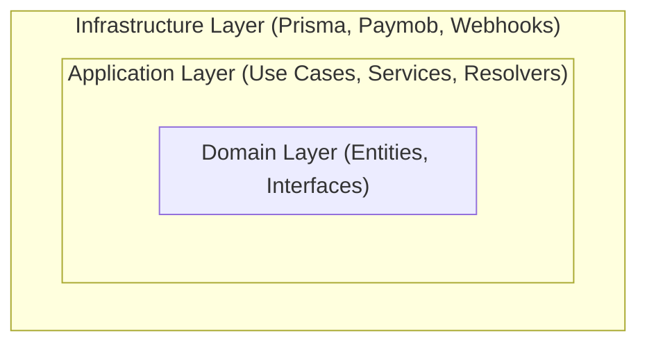
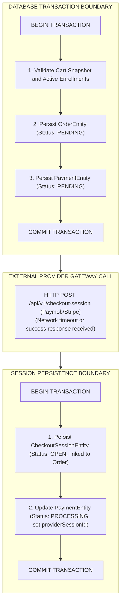
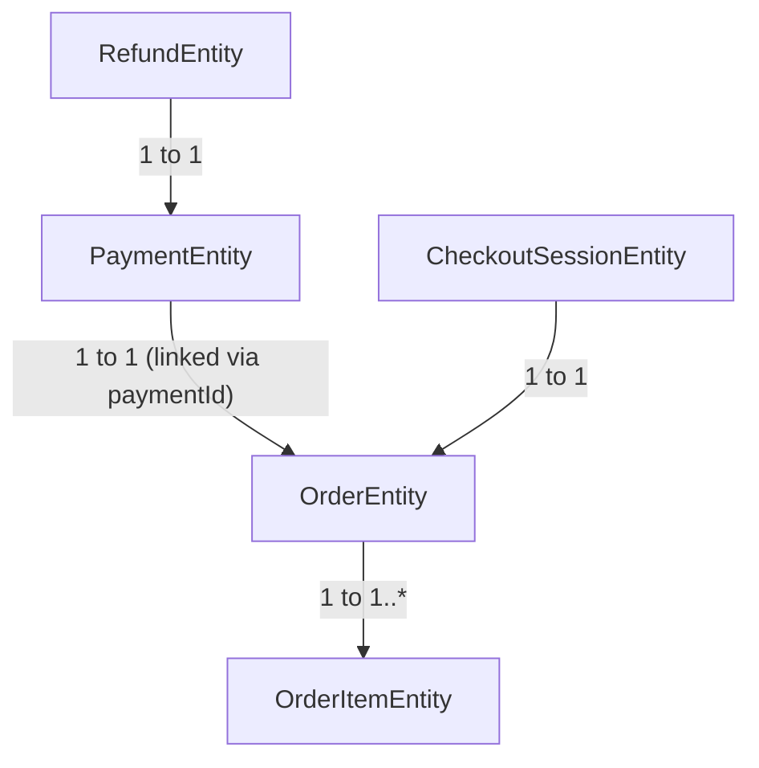
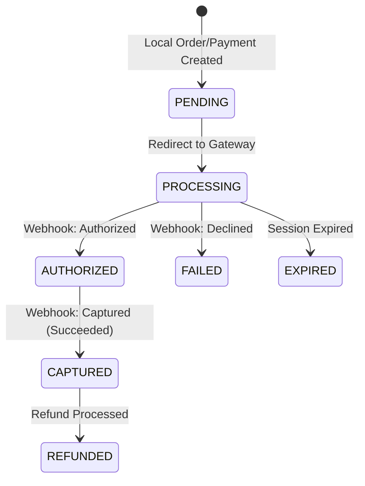
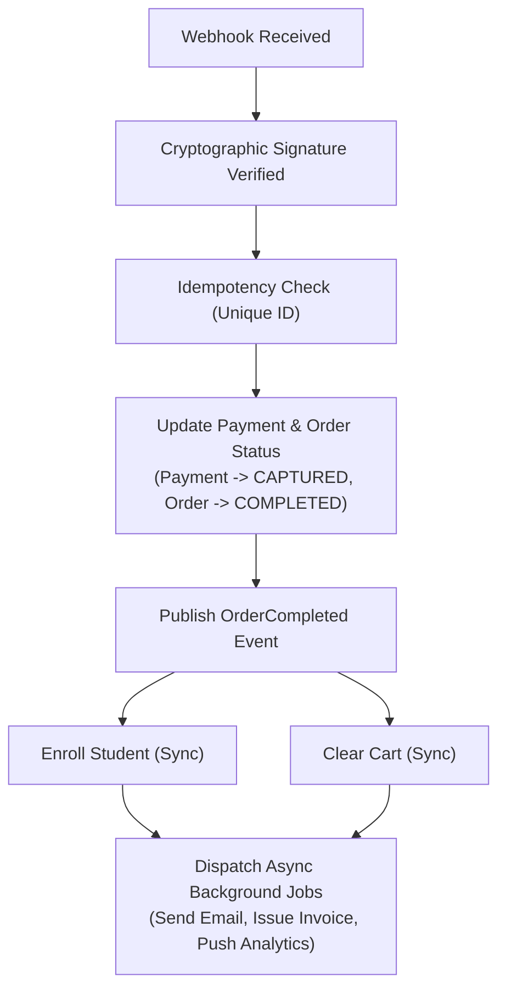

# 01 - Payment Architecture Specification

## Purpose
This document defines the comprehensive architectural blueprint for the IthraCode Payment Platform. It establishes the structural boundaries, layer responsibilities, design principles, and execution flows required to build a secure, highly scalable, and provider-agnostic payment system. It serves as the authoritative design specification and implementation guide for the engineering team.

---

## Overview
The IthraCode Payment Platform is a core system component designed to handle checkout orchestration, payment processing, webhook ingestion, and post-payment fulfillment. 

### Vision
To provide a seamless, secure, and resilient checkout experience for IthraCode students while maintaining a clean separation of concerns. The platform must isolate the core business logic of course purchasing from the volatile APIs of third-party payment gateways, allowing seamless expansion into regional and global markets.

### Goals
*   **Multi-Provider Support**: Enable plug-and-play integration for various payment gateways (Paymob, Stripe, PayPal, MyFatoorah, Moyasar) without altering core business rules.
*   **Resilience & Reliability**: Ensure that network failures, provider downtimes, or client-side disconnects do not result in inconsistent states (e.g., a user paying but not receiving their course).
*   **Security First**: Protect the platform against fraud, double-spending, signature spoofing, and replay attacks.
*   **Auditability**: Maintain an immutable, chronological audit trail of all order states, payment attempts, and webhook events.

---

## Responsibilities
The IthraCode Payment Platform is responsible for:
1.  **Checkout Validation**: Verifying user eligibility, cart integrity, and preventing duplicate purchases of already-active enrollments.
2.  **Order & Payment Creation**: Generating immutable order snapshots with calculated prices and linking them to pending payment records.
3.  **Provider Abstraction**: Resolving and dispatching checkout sessions to the selected payment gateway via unified interfaces.
4.  **Transaction Orchestration**: Managing database transaction boundaries to ensure atomic persistence of local states before external communication.
5.  **Webhook Ingestion**: Authenticating, verifying, and processing asynchronous notifications from payment providers.
6.  **Fulfillment Orchestration**: Coordinating post-payment events (student enrollment, cart cleanup, notifications) upon verified payment success.

---

## Non-Responsibilities
The IthraCode Payment Platform is explicitly NOT responsible for:
1.  **Direct UI Rendering**: The payment module does not render forms or handle client-side redirection logic directly; it provides structured redirect metadata to the API layer.
2.  **User Authentication**: Verification of user identity and session management is handled by the platform's core Identity/Auth module.
3.  **Core Cart Management**: Adding, removing, or persistent storage of items in the cart is the responsibility of the Cart Module. The Payment Platform only reads snapshots of the cart.
4.  **Direct Bank Settlement**: The platform does not perform clearing or settlement operations; it relies entirely on external licensed payment providers.
5.  **Direct PCI-DSS Card Handling**: The platform does not collect, transmit, or store raw credit card numbers (PANs) or CVVs. All card inputs must be handled via provider-hosted fields or redirects.

---

## Design Principles

### 1. Server is the Single Source of Truth
Prices, discounts, taxes, and totals are never calculated on or accepted from the client. The client can only request a checkout session for a given cart. The server recalculates all values using active database records (e.g., Course prices, Coupon validity) at the moment of checkout.

### 2. Orders are Immutable
Once an order is created, it is completely immutable. If a course price changes or a coupon expires after order creation, the existing order remains unaffected. `OrderItem` records store a historical snapshot of the price and currency at the time of purchase.

### 3. Webhook is the Source of Truth
The client-side redirect "Success URL" is never trusted to complete an order or trigger enrollment. It is treated purely as a UI transition. Order completion and fulfillment are strictly triggered by verified, cryptographic webhooks received directly from the payment provider.

### 4. Provider-Agnostic Core
The Domain and Application layers must remain completely unaware of the underlying payment provider's technical details. All provider-specific logic (payload mapping, signature verification, API headers) is isolated within the Infrastructure layer behind clean interfaces.

### 5. Clean Architecture & Domain-Driven Design (DDD)
The system is divided into concentric layers where dependencies flow inward. The core domain contains pure business rules and entities, completely free of database, framework, or network dependencies.



---

## Monetary Rules
To ensure financial accuracy and prevent rounding issues across different environments, the platform enforces the following strict monetary rules:
1.  **Integer Storage**: All monetary amounts (subtotals, discounts, taxes, totals, item prices) must be stored and processed in the smallest currency unit (e.g., cents for USD, piasters for EGP) as 64-bit integers.
2.  **No Floating-Point Math**: Floating-point numbers (`float`, `double`, `number` in JS/TS) must never be used for monetary calculations. All calculations must use integer arithmetic.
3.  **Currency Isolation**: The checkout currency is determined by system configuration and course settings, never by client input. Mixed-currency carts are strictly prohibited.
4.  **Database Price Snapshots**: Course prices are queried from the database at the exact millisecond of checkout creation and snapshot into the immutable `OrderItemEntity`.

---

## Idempotency and Concurrency Control

### 1. Duplicate Checkout Requests
If a user submits a checkout request for an active cart, and a pending order/payment already exists for that exact cart configuration, the system must return the existing `CheckoutSessionEntity` and its redirect URL instead of creating duplicate orders, payments, or provider sessions.

### 2. Double-Click Prevention
At the API layer, a distributed lock (or database-level lock on the user's cart) is acquired when a checkout request begins. Any concurrent checkout requests from the same user while the lock is active are rejected with a `409 Conflict` error.

### 3. Duplicate Webhook Handling
Every webhook notification is assigned a unique identifier by the provider. The system stores this in the `WebhookEventEntity` with a unique constraint on `providerEventId`. If the provider retries sending a webhook (due to network latency or timeout), the database unique constraint will reject the duplicate insert, preventing double-fulfillment.

---

## Transaction Boundaries

To prevent long-lived locks and database connection pool exhaustion, database transactions must be kept extremely short and must never span external network calls.



---

## Failure Recovery Strategy

### 1. External Provider Timeout / API Failure
If the HTTP call to the payment provider fails or times out:
*   The database already has the `OrderEntity` and `PaymentEntity` saved as `PENDING`.
*   The use case catches the network exception and returns a graceful error to the client.
*   The payment status remains `PENDING`.
*   **Recovery**: The user can safely click "Checkout" again. The system detects the existing pending order, cleans up or cancels the previous payment attempt, and initiates a new provider call.

### 2. Webhook Delivery Failure
If the provider fails to deliver the webhook or our server is down during delivery:
*   The payment remains `PROCESSING` and the order remains `PENDING`.
*   **Recovery**: A scheduled cron job (Reconciliation Worker) queries the payment provider's API for all payments in `PROCESSING` status that are older than 30 minutes. It fetches their status and manually triggers the fulfillment flow if the provider marks them as successful.

---

## Domain Overview



### Repository Contracts
These contracts define the boundaries of our persistence layer. Implementations live in the infrastructure layer.

```typescript
export interface CartRepository {
  findByUserId(userId: string): Promise<CartSnapshot | null>;
  findActiveEnrollmentCourseIds(userId: string, courseIds: string[]): Promise<Set<string>>;
  clearCart(userId: string): Promise<void>;
}

export interface OrderRepository {
  findById(id: string): Promise<OrderEntity | null>;
  save(order: OrderEntity): Promise<OrderEntity>;
}

export interface PaymentRepository {
  findById(id: string): Promise<PaymentEntity | null>;
  findByProviderTransactionId(id: string): Promise<PaymentEntity | null>;
  save(payment: PaymentEntity): Promise<PaymentEntity>;
}

export interface CheckoutSessionRepository {
  findById(id: string): Promise<CheckoutSessionEntity | null>;
  findByProviderSessionId(id: string): Promise<CheckoutSessionEntity | null>;
  save(session: CheckoutSessionEntity): Promise<CheckoutSessionEntity>;
}

export interface EnrollmentRepository {
  createEnrollments(userId: string, courseIds: string[]): Promise<void>;
}
```

---

## State Machine Diagram



---

## Provider Abstraction Contract
Every concrete payment provider (Paymob, Stripe, PayPal) must implement the following unified gateway interface:

```typescript
export interface PaymentProviderGateway {
  readonly provider: PaymentProvider;

  /** Initiates a payment session with the gateway and returns redirect details */
  createCheckoutSession(input: CreateProviderCheckoutInput): Promise<ProviderCheckoutResult>;

  /** Cryptographically verifies the incoming webhook payload */
  verifyWebhook(input: WebhookVerificationInput): Promise<boolean>;

  /** Initiates a partial or full refund with the gateway */
  refund(paymentId: string, amountCents: number, reason?: string): Promise<RefundResult>;

  /** Queries the gateway directly to reconcile a payment's status */
  getPaymentStatus(providerTransactionId: string): Promise<ProviderPaymentStatus>;
}
```

---

## Webhook-Driven Event Flow
The webhook is the sole authority for starting the post-payment event flow. Once a verified success webhook is received, the following sequential event flow is executed:



---

## Out of Scope (Phase 1)
To manage complexity and ensure a timely delivery, the following features are explicitly out of scope for the initial release:
1.  **Partial Refunds**: Only full refunds of the entire transaction amount are supported.
2.  **Split Payments**: Payments cannot be split between multiple cards or payment methods.
3.  **Multiple Currencies**: The system will support only a single currency per market (e.g., EGP for Egypt, SAR for Saudi Arabia). Multi-currency conversion at checkout is deferred.
4.  **Subscription Billing**: Only one-time purchases of courses or bundles are supported.
5.  **Saved Cards (Tokenization)**: Users must enter their card details for every transaction; card tokenization is deferred.
6.  **Direct Wallet Payments**: Mobile wallets (e.g., Vodafone Cash) will be handled via Paymob's hosted redirect, not integrated directly via API.

---

## Definition of Done
The architecture of this module is considered complete and ready for implementation when:
1.  **Interface Alignment**: All domain interfaces (`OrderRepository`, `PaymentRepository`, `CheckoutSessionRepository`, `PaymentProviderGateway`) are fully defined and documented.
2.  **Zero Layer Violations**: The domain and application layers have absolutely no dependencies on Prisma, Next.js, or external HTTP clients.
3.  **Security Review Passed**: The webhook verification and secret management strategies are approved by the security lead.
4.  **Database Schema Compatibility**: The Prisma database schema fully supports the fields and relationships defined in the domain entities.
