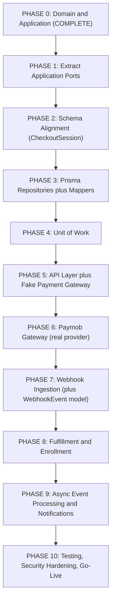
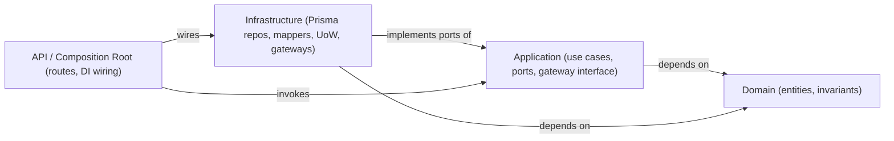

# 02 - Payment Platform Implementation Plan

## Purpose

This document is the official engineering roadmap for the IthraCode Payment Platform, written from a Software Engineering perspective. It has been corrected against the project's guiding principles: business drives the architecture, the Application layer owns the ports, the Domain stays persistence-agnostic, repositories own a single aggregate, mappers are implementation details of repositories, Unit of Work is introduced only after repositories exist, the API layer precedes the real provider integration, and the payment provider is an infrastructure implementation.

Phase 0 (Domain + Application) is complete. Work begins at Infrastructure. Every phase below states **why** it exists, not only **what** to build.

---

## Guiding Principles (applied throughout)

1. **Business drives the architecture.** No technical layer is introduced unless a Use Case requires it.
2. **The Application layer owns the repository contracts (ports).** Interfaces are dependencies of the Use Cases, not Domain rules; they live under `application/ports/`.
3. **The Domain is persistence-agnostic.** Entities never reference Prisma, SQL, PostgreSQL, or any infrastructure concern.
4. **Repositories have a single responsibility.** One repository per aggregate: `CartRepository`, `OrderRepository`, `PaymentRepository`, `CheckoutSessionRepository`, `EnrollmentRepository`, `WebhookEventRepository`.
5. **Mappers are implementation details.** Each mapper is built together with the Prisma repository it serves; there is no separate "mappers phase."
6. **Unit of Work comes after repositories.** Repositories are the persistence abstraction; UoW only coordinates transactions across repositories that already exist.
7. **API before the real provider.** The checkout endpoint is validated end-to-end with a fake gateway before Paymob is integrated.
8. **The provider is infrastructure.** `PaymobGateway implements PaymentProviderGateway`; the Application never depends on Paymob directly.

---

## High-Level Roadmap Overview

### What changed versus the previous plan

- **Repositories now precede Unit of Work.** The previous Phase 1 bundled `PrismaUnitOfWork` with the repositories; UoW cannot be designed correctly before the repositories it orchestrates exist (principle 6).
- **API + fake gateway now precede Paymob.** The previous plan integrated Paymob (Phase 2) before the API (Phase 3), forcing the workflow to be validated through a fragile external dependency (principle 7).
- **Ports are extracted to first-class application contracts.** They were declared inline inside `create-checkout.use-case.ts`; they are application-owned dependencies and belong under `application/ports/` (principle 2).
- **Schema changes are demand-driven.** `CheckoutSession` is added when the checkout use case needs it; `WebhookEvent` is deferred to the webhook phase that first requires it (principle 1).
- **No redundant work.** `PrismaCartRepository` already exists in the cart feature and is reused, not rebuilt.

---

## Layer Dependency Rules (invariant across all phases)

- Domain depends on nothing external.
- Application defines ports and the `PaymentProviderGateway` interface; it never imports Prisma or a provider SDK.
- Infrastructure implements application ports and maps Prisma models to/from domain entities.
- Only the composition root (route wiring) knows concrete classes.

---

## Phase 0: Domain and Application Layer Setup (COMPLETE)

- **Goal**: Define core domain entities, validation rules, application use cases, and abstract interfaces.
- **Deliverables**: `OrderEntity`, `PaymentEntity`, `RefundEntity`, `CheckoutSessionEntity`, `WebhookEventEntity`; `CreateCheckoutUseCase`, `PriceCalculatorService`, `OrderFactory`, `PaymentFactory`, `PaymentProviderResolver`; repository ports and `PaymentProviderGateway`.
- **Exit Criteria**: Domain/application compile with zero infrastructure dependencies; `CreateCheckoutUseCase` unit tests pass with mocked ports and gateways.

---

## Phase 1: Extract Application Ports

- **Why**: The use case's persistence contracts were declared inline inside `create-checkout.use-case.ts`. Ports are application-owned abstractions and must be stable, discoverable contracts before any implementation targets them (principle 2). This is a cheap refactor that de-risks every later phase.
- **Deliverables**:
  - `application/ports/order.repository.ts`, `payment.repository.ts`, `checkout-session.repository.ts` (one file per aggregate).
  - `application/ports/unit-of-work.ts` declaring the `UnitOfWork` port and the transaction-scoped repository bundle (declared now, implemented in Phase 4).
  - `application/ports/index.ts` barrel; `CartRepository` continues to be imported from the cart feature.
- **Depends on**: Phase 0.
- **Single responsibility (principle 4)**: One port per aggregate. No god repository.
- **Avoid**: Adding read methods speculatively; add methods only when a use case needs them (principle 1).
- **Exit Criteria**: Application still compiles with zero infrastructure imports; the use case references ports through `application/ports/`.
- **Trade-off**: The cart feature places ports under `domain/repositories/`. Payments intentionally diverges and keeps ports in `application/` per principle 2; this divergence is documented so it is deliberate, not drift.

---

## Phase 2: Schema Alignment (CheckoutSession only)

- **Why**: `CreateCheckoutUseCase` already requires `CheckoutSessionRepository.save`, but `schema.prisma` has no `CheckoutSession` model. A repository cannot persist an aggregate that has no table. The Application demanding the port is what justifies the table now (principle 1). `Order`, `OrderItem`, and `Payment` already exist.
- **Deliverables**:
  - `CheckoutSession` model plus a `CheckoutSessionStatus` enum (`OPEN | COMPLETE | EXPIRED`) matching `checkout-session.entity.ts`, with FK relations to `User` and `Order` and appropriate indexes.
  - Prisma client regenerated.
- **Depends on**: Phase 1.
- **Defer**: `WebhookEvent` is not consumed by any use case yet and is added in Phase 7.
- **Money boundary decision**: `Order`/`Payment` store integer cents; `Cart`/`Course` store `Decimal(10,2)`. Confirm cents at the money boundary; mappers convert `Decimal` cart prices to cents deterministically.
- **Exit Criteria**: Migration applies cleanly; client regenerated; FK/unique indexes present.

---

## Phase 3: Prisma Repositories plus Mappers (co-located, per aggregate)

- **Why**: Repositories are the persistence abstraction the use case needs; nothing above them can be integration-tested without them. This is the true core-infrastructure step and it must land before UoW (principle 6).
- **Deliverables (mapper ships with its repository, principle 5)**:
  - `PrismaOrderRepository` + `OrderMapper`
  - `PrismaPaymentRepository` + `PaymentMapper`
  - `PrismaCheckoutSessionRepository` + `CheckoutSessionMapper`
  - `Prisma.validator` select objects under `infrastructure/prisma/*.select.ts`; shared `prisma` singleton from `src/lib/prisma.ts`.
- **Depends on**: Phases 1-2.
- **Reuse**: `PrismaCartRepository` already exists; do not rebuild.
- **Ordering constraint**: `orders.payment_id` is a FK to `payments.id`, so the payment row must be inserted before the order row.
- **Avoid**: Multi-aggregate repositories; leaking Prisma types through repository return signatures; a standalone "mappers phase."
- **Exit Criteria**: Each repository reads/writes its aggregate against PostgreSQL; per-repository integration tests pass. At this point the use case still persists sequentially (no atomicity yet); that is fixed next.

---

## Phase 4: Unit of Work

- **Why**: Only now that repositories exist can a UoW coordinate an atomic transaction across them (principle 6). This resolves the `TODO: Wrap order + payment persistence in a database transaction` in the use case.
- **Deliverables**:
  - `PrismaUnitOfWork` implementing the `UnitOfWork` port, wrapping `prisma.$transaction` and constructing transaction-scoped repositories.
  - Refactor `CreateCheckoutUseCase` to persist payment + order atomically (Tx1) and **commit before** any external provider call; persist the checkout session and move the payment to `PROCESSING` in a second transaction (Tx2).
- **Depends on**: Phase 3.
- **Avoid**: Holding a DB transaction open across the provider HTTP call (long-lived locks, connection exhaustion). Commit-then-call is the required boundary.
- **Exit Criteria**: Integration test proves atomic commit and rollback-on-failure of payment + order.
- **Trade-off**: Commit-before-call can leave a `PENDING` order with no session if the provider call fails; this is acceptable and reconciled later by webhook/expiry logic. A transaction spanning the HTTP call is worse.

---

## Phase 5: API Layer plus Fake Payment Gateway

- **Why (principle 7)**: The checkout endpoint should validate the entire application workflow (auth, validation, pricing, persistence, UoW, session save, redirect contract) before any real provider risk. A `FakePaymentGateway` implementing `PaymentProviderGateway` exercises the full path deterministically.
- **Deliverables**:
  - `POST /api/payment/checkout` route; Zod request validation (`provider`, `successUrl`, `cancelUrl`).
  - A composition root that instantiates `CreateCheckoutUseCase` with the concrete Prisma repositories, `PrismaUnitOfWork`, cart repository, and a provider registry containing `FakePaymentGateway`.
  - A global error mapper translating `CheckoutError` (`status` + `code`) into localized HTTP responses.
- **Depends on**: Phase 4.
- **Avoid**: The dual-path anti-pattern seen in cart, where `/api/cart/items/route.ts` reimplements business rules inline via `prisma.$transaction` instead of going through the use case. All checkout logic flows through `CreateCheckoutUseCase`.
- **Exit Criteria**: A valid payload returns a redirect URL and leaves a `PENDING` order + payment in the DB; invalid payloads return localized 4xx. Zero Paymob dependency.

---

## Phase 6: Paymob Gateway (real provider)

- **Why (principle 8)**: The provider is an infrastructure implementation detail. With the workflow already proven against the fake gateway, integrating Paymob is an isolated, swappable concern.
- **Deliverables**:
  - `PaymobGateway implements PaymentProviderGateway` (authentication, order/payment-key creation, redirect URL, error mapping, timeouts/retries).
  - Registration of `PaymobGateway` in the provider registry at the composition root, selected by environment.
- **Depends on**: Phase 5.
- **Avoid**: Any application- or domain-layer import of Paymob. The Application only ever sees `PaymentProviderGateway`; `PaymentProviderResolver` picks the concrete gateway at the composition root.
- **Exit Criteria**: Sandbox checkout produces a valid Paymob redirect; provider errors map to domain errors. Switching provider is a registry change, not a use-case change.
- **Trade-off**: Keep the fake gateway permanently as the CI/test double to prevent flakiness against the Paymob sandbox.

---

## Phase 7: Webhook Ingestion (plus WebhookEvent model)

- **Why**: The webhook is the source of truth for payment completion; the client redirect is never trusted. `WebhookEvent` is first required here, so its Prisma model plus a unique `(provider, providerEventId)` constraint is added now (demand-driven, principle 1).
- **Deliverables**:
  - `WebhookEvent` Prisma model with unique `(provider, providerEventId)`.
  - `WebhookEventRepository` port + Prisma implementation.
  - `POST /api/payment/webhooks/paymob` with raw-body preservation and HMAC verification (provider-specific, in infrastructure).
  - Idempotency via the unique constraint: duplicate insert is caught and the endpoint returns `200 OK`.
- **Depends on**: Phase 6.
- **Design note**: Verification stays provider-specific in infrastructure; `PaymentProviderGateway` is extended only if the abstraction genuinely needs it.
- **Exit Criteria**: Invalid signature returns `401`; valid payload is logged and returns `200`; duplicates are safely ignored.

---

## Phase 8: Fulfillment and Enrollment

- **Why**: A verified, successful payment webhook must atomically complete the order, mark the payment succeeded, enroll the student, and clear the cart.
- **Deliverables**:
  - `ProcessWebhookUseCase` orchestrating status transitions and post-payment workflows.
  - `EnrollmentRepository` port + Prisma implementation.
  - A fulfillment transaction (via UoW) atomically updating payment/order status, creating enrollments, and clearing the cart.
- **Depends on**: Phase 7.
- **Exit Criteria**: A success webhook transitions the order to `COMPLETED`, payment to `SUCCEEDED`, creates `ACTIVE` enrollments, and empties the cart, all-or-nothing; any failure rolls back and returns `5xx` to trigger a provider retry.

---

## Phase 9: Asynchronous Event Processing and Notifications

- **Why**: Keep webhook latency low; secondary tasks (emails, invoices, analytics) must never block or endanger fulfillment.
- **Deliverables**:
  - A Redis-backed queue (BullMQ, already a dependency) and workers consuming an `OrderCompleted` event.
  - Workers for confirmation emails, PDF invoices, and analytics.
- **Depends on**: Phase 8.
- **Exit Criteria**: Fulfillment publishes `OrderCompleted`; workers consume asynchronously; secondary-task failures never affect enrollment and are retried by the queue.

---

## Phase 10: Testing, Security Hardening, and Go-Live

- **Why**: End-to-end confidence, secret hygiene, abuse protection, and observability before production.
- **Deliverables**:
  - E2E suite through the Paymob sandbox covering checkout, redirect, webhook, and fulfillment.
  - Rate limiting on checkout and webhook endpoints.
  - Secret configuration and rotation plan.
  - Monitoring dashboards and alerts for payment failures, webhook errors, and API timeouts.
- **Depends on**: Phase 9.
- **Exit Criteria**: E2E passes in staging; security audit confirms no key exposure, valid HMAC verification, and strict rate limits; monitoring is active and the system is signed off for production.

---

## Consolidated Mistakes to Avoid

- Introducing Unit of Work before repositories exist.
- Treating mappers as their own phase; they ship with their repository.
- Integrating Paymob before the workflow is validated with a fake gateway.
- Any Prisma or Paymob import in the Domain or Application layers.
- Multi-aggregate "god" repositories.
- Adding `WebhookEvent` / `RefundRepository` / read methods before a use case requires them.
- Rebuilding `PrismaCartRepository` (already exists) or reimplementing checkout logic inline in a route.
- Holding a DB transaction open across the external provider HTTP call.
