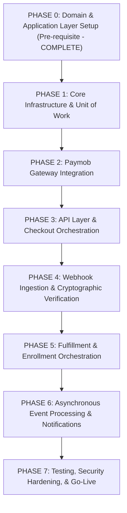

# 02 - Payment Platform Implementation Plan

## Purpose
This document outlines the engineering roadmap for implementing the IthraCode Payment Platform. It decomposes the project into logical, sequential phases from Phase 0 (Pre-requisites) to Phase 7 (Go-Live). For each phase, it defines the goals, deliverables, dependencies, and exit criteria to guide the development team through a structured, risk-mitigated implementation.

---

## High-Level Roadmap Overview

---

## Phase 0: Domain & Application Layer Setup (Pre-requisite)
*   **Goal**: Define the core domain entities, validation rules, application use cases, and abstract interfaces.
*   **Deliverables**:
    *   Domain entities: `OrderEntity`, `PaymentEntity`, `RefundEntity`, `CheckoutSessionEntity`, `WebhookEventEntity`.
    *   Application use cases: `CreateCheckoutUseCase`, `PriceCalculatorService`, `OrderFactory`, `PaymentFactory`, `PaymentProviderResolver`.
    *   Repository interfaces: `OrderRepository`, `PaymentRepository`, `CheckoutSessionRepository`, `CartRepository`.
    *   Gateway interfaces: `PaymentProviderGateway`.
*   **Dependencies**: None.
*   **Exit Criteria**:
    *   Domain and application code compiles successfully with zero external dependencies (Prisma, Next.js, or HTTP clients).
    *   Unit tests for `CreateCheckoutUseCase` pass with mocked repositories and gateways.

---

## Phase 1: Core Infrastructure & Unit of Work
*   **Goal**: Establish the persistence layer, database transaction boundaries, and repository implementations using Prisma.
*   **Deliverables**:
    *   `PrismaUnitOfWork` implementation to manage database transactions.
    *   Prisma-backed repositories: `PrismaOrderRepository`, `PrismaPaymentRepository`, `PrismaCheckoutSessionRepository`, `PrismaCartRepository`.
    *   Data mappers to translate between Prisma database models and Domain Entities.
*   **Dependencies**: Phase 0.
*   **Exit Criteria**:
    *   All repository implementations compile and successfully write/read to the PostgreSQL database.
    *   Integration tests verify that `PrismaUnitOfWork` correctly commits atomic transactions and rolls back on failure.
    *   Database schema fully matches domain requirements (indexes on foreign keys and unique constraints).

---

## Phase 2: Paymob Gateway Integration
*   **Goal**: Implement the concrete `PaymobGateway` to communicate with Paymob's API for session creation, metadata mapping, and redirect generation.
*   **Deliverables**:
    *   `PaymobGateway` class implementing `PaymentProviderGateway`.
    *   HTTP client wrapper for Paymob API calls with secure header management.
    *   Request/response mappers for Paymob's authentication, order creation, and payment key generation endpoints.
*   **Dependencies**: Phase 1.
*   **Exit Criteria**:
    *   `PaymobGateway` successfully authenticates and generates a valid redirection URL when given a mock checkout input.
    *   Unit and integration tests verify correct error mapping for Paymob API failures (e.g., mapping a 400 Bad Request to a domain-specific validation error).

---

## Phase 3: API Layer & Checkout Orchestration
*   **Goal**: Expose the checkout functionality to the frontend via a secure Next.js API route and wire up the application use case.
*   **Deliverables**:
    *   Next.js API route: `POST /api/payment/checkout`.
    *   Request validation middleware (Zod) to validate user input (provider, successUrl, cancelUrl).
    *   Dependency injection wiring to instantiate `CreateCheckoutUseCase` with concrete Prisma repositories and `PaymobGateway`.
    *   Global API error handler to translate domain errors into localized HTTP responses.
*   **Dependencies**: Phase 2.
*   **Exit Criteria**:
    *   Sending a valid payload to `/api/payment/checkout` returns a `201 Created` status with a valid checkout redirect URL.
    *   Sending an invalid payload (e.g., empty cart, invalid provider) returns a `400 Bad Request` with localized error messages.
    *   The database correctly contains a `PENDING` order and `PENDING` payment after a successful request.

---

## Phase 4: Webhook Ingestion & Cryptographic Verification
*   **Goal**: Build a secure, resilient webhook receiver endpoint to ingest and verify asynchronous payment notifications from Paymob.
*   **Deliverables**:
    *   Next.js API route: `POST /api/payment/webhooks/paymob`.
    *   Raw body parser to preserve payload integrity for signature validation.
    *   HMAC verification service to validate Paymob's cryptographic signature.
    *   `WebhookEventRepository` implementation to log incoming webhooks and enforce idempotency.
*   **Dependencies**: Phase 3.
*   **Exit Criteria**:
    *   Webhook endpoint successfully rejects payloads with invalid signatures with a `401 Unauthorized`.
    *   Webhook endpoint successfully accepts valid payloads, logs them in the database, and returns `200 OK`.
    *   Duplicate webhook payloads with the same `providerEventId` are safely ignored (idempotency) and return `200 OK` without reprocessing.

---

## Phase 5: Fulfillment & Enrollment Orchestration
*   **Goal**: Implement the core fulfillment logic to complete orders, enroll students, and clean up carts upon receiving a verified successful payment webhook.
*   **Deliverables**:
    *   `ProcessWebhookUseCase` to orchestrate status transitions and trigger post-payment workflows.
    *   `PrismaEnrollmentRepository` to handle student course enrollment.
    *   Fulfillment transaction boundary to atomically update payment/order status, enroll the student, and clear the cart.
*   **Dependencies**: Phase 4.
*   **Exit Criteria**:
    *   Receiving a successful payment webhook atomically updates the order to `COMPLETED`, payment to `SUCCEEDED`, creates active enrollments, and empties the user's cart in a single transaction.
    *   If any step of the fulfillment transaction fails, the entire transaction rolls back, and the webhook endpoint returns a `500 Internal Server Error` to trigger a provider retry.

---

## Phase 6: Asynchronous Event Processing & Notifications
*   **Goal**: Handle non-critical, secondary post-payment tasks asynchronously to keep webhook response times low and ensure system responsiveness.
*   **Deliverables**:
    *   In-memory or Redis-backed event queue (e.g., BullMQ) to process background jobs.
    *   Background workers for:
        *   Sending payment confirmation and welcome emails.
        *   Generating and issuing PDF invoices.
        *   Pushing purchase data to analytics platforms (e.g., Google Analytics, Mixpanel).
*   **Dependencies**: Phase 5.
*   **Exit Criteria**:
    *   Fulfillment successfully publishes an `OrderCompleted` event.
    *   Background workers consume the event and execute secondary tasks (email, invoice, analytics) asynchronously.
    *   Failures in secondary tasks (e.g., email server timeout) do not affect the student's enrollment status and are retried automatically by the queue.

---

## Phase 7: Testing, Security Hardening, & Go-Live
*   **Goal**: Conduct comprehensive end-to-end testing, security audits, performance profiling, and deploy the payment system to production.
*   **Deliverables**:
    *   End-to-end (E2E) test suite simulating the complete checkout, redirect, webhook, and fulfillment flow using Paymob's sandbox environment.
    *   Rate limiting middleware applied to checkout and webhook endpoints.
    *   Secure environment variable configuration in production (secrets rotation plan).
    *   Monitoring dashboards and alerts for payment failures, webhook errors, and API timeouts.
*   **Dependencies**: Phase 6.
*   **Exit Criteria**:
    *   E2E tests pass successfully in the staging environment.
    *   Security audit confirms zero exposure of API keys, valid HMAC verification, and strict rate limits.
    *   Monitoring and alerting are active, and the system is officially signed off for production deployment.
