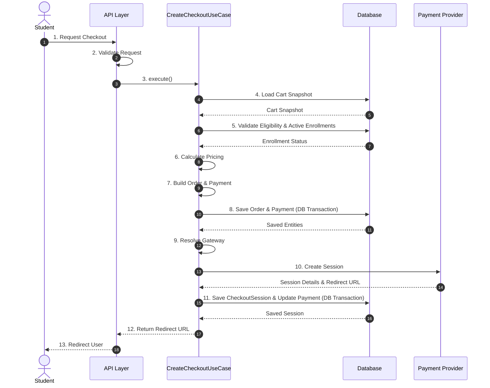

# 03 - Create Checkout Use Case Specification

## Purpose
This document provides a detailed functional and technical specification for the `CreateCheckoutUseCase`. It defines the actors, triggers, preconditions, main flow, postconditions, failure scenarios, database changes, and external calls involved in initiating a checkout session. It serves as the definitive guide for engineers implementing the checkout orchestration workflow.

---

## Overview
The `CreateCheckoutUseCase` is the entry point for the payment flow. It orchestrates the process of validating a user's cart, calculating the final price, creating local immutable order and payment records, communicating with the selected payment gateway to establish an external checkout session, and returning a secure redirection URL to the client.

---

## Use Case Details

### Actor
*   **Student**: An authenticated user of the IthraCode platform who wishes to purchase one or more courses currently in their shopping cart.

### Trigger
*   The Student clicks the "Proceed to Payment" (or equivalent) button on the checkout page, selecting a specific payment provider (e.g., Paymob).

### Preconditions
1.  The Student is authenticated and has a valid, active user account.
2.  The Student's shopping cart is not empty and contains at least one course.
3.  The Student has selected a supported payment provider (e.g., `PAYMOB`).
4.  The Student does not already have active enrollments for any of the courses in their cart.

---

## Main Flow of Execution



### Business Steps Explained

#### Step 1: Load Cart Snapshot
The use case loads the user's active cart from the `CartRepository`. The cart is mapped to a read-only `CheckoutCartSnapshot` to isolate the payment domain from cart mutations.

#### Step 2: Validate Eligibility & Active Enrollments
The `CheckoutValidator` is invoked to perform the following business checks:
*   **Cart Existence**: Ensures the cart exists and is not empty.
*   **Duplicate Purchase Prevention**: Queries the `CartRepository` to check if the user already has an active enrollment for any course in the cart. If an active enrollment is found, a validation error is thrown to prevent double-purchasing.
*   **Provider Validation**: Ensures the selected payment provider is currently supported and active.

#### Step 3: Calculate Pricing
The `PriceCalculatorService` calculates the final financial breakdown:
*   Queries active database records for course prices to prevent client-side price tampering.
*   Applies any valid coupon codes associated with the cart, calculating the subtotal, discount, tax, and final total in cents (integer arithmetic).

#### Step 4: Build Order and Payment Aggregates
*   `OrderFactory` builds an in-memory, immutable `OrderEntity` with a unique order number, status set to `PENDING`, and `OrderItemEntity` records representing price snapshots for each course.
*   `PaymentFactory` builds an in-memory `PaymentEntity` with status set to `PENDING`, linked to the order, with the calculated total amount and currency.

#### Step 5: Persist Order and Payment (Transaction Boundary)
The use case invokes the `UnitOfWork` to open a database transaction. It persists the `OrderEntity` and `PaymentEntity` atomically. If persistence fails, the transaction is rolled back, and no external calls are made.

#### Step 6: Resolve Provider Gateway
The `PaymentProviderResolver` resolves the concrete `PaymentProviderGateway` implementation (e.g., `PaymobGateway`) registered in the system for the selected provider.

#### Step 7: Create External Provider Checkout Session
The use case calls the resolved gateway's `createCheckoutSession` method. The gateway makes a secure HTTP POST request to the provider's API, passing the order ID, amount, currency, and redirect URLs. The provider returns a session identifier, redirection URL, and expiration timestamp.

#### Step 8: Persist Checkout Session
The use case builds and persists a `CheckoutSessionEntity` (status: `OPEN`) containing the provider's session ID and redirection URL, and updates the `PaymentEntity` status to `PROCESSING` to indicate that the user has been redirected.

---

## Postconditions
1.  An immutable `OrderEntity` is saved in the database with status `PENDING`.
2.  A `PaymentEntity` is saved in the database with status `PROCESSING` and linked to the order.
3.  A `CheckoutSessionEntity` is saved in the database with status `OPEN` and linked to the order.
4.  A secure redirect URL is returned to the client.

---

## Failure Cases & Recovery

### 1. Cart is Empty or Missing
*   **Cause**: Client sends a checkout request with no items in the cart.
*   **Handling**: `CheckoutValidator` throws a `CheckoutError` (400 Bad Request, code: `EMPTY_CART`). No database records are created.

### 2. User Already Enrolled
*   **Cause**: User tries to purchase a course they already own.
*   **Handling**: `CheckoutValidator` throws a `CheckoutError` (400 Bad Request, code: `ALREADY_ENROLLED`). No database records are created.

### 3. Database Write Failure
*   **Cause**: Database connection timeout or constraint violation during Order/Payment persistence.
*   **Handling**: The transaction is rolled back automatically. The use case throws a `DatabaseError` (500 Internal Server Error). No external provider call is initiated.

### 4. External Provider API Timeout / Failure
*   **Cause**: Paymob/Stripe API is down or slow.
*   **Handling**: The HTTP client times out. The use case catches the network exception. Since the Order and Payment are already committed as `PENDING`, they remain in the database. The use case returns a graceful error to the client (503 Service Unavailable, code: `PROVIDER_TIMEOUT`). The user can safely retry the checkout.

---

## Database Changes
All database operations within the main flow must be executed within their respective transaction boundaries:

| Entity | Operation | Fields Populated | Transaction |
| :--- | :--- | :--- | :--- |
| `Order` | Insert | `id`, `orderNumber`, `userId`, `subtotalCents`, `discountCents`, `taxCents`, `totalCents`, `currency`, `status` (`PENDING`), `couponId`, `createdAt` | Tx 1 (Core) |
| `OrderItem` | Insert | `id`, `orderId`, `courseId`, `priceCents`, `currency`, `status` (`ACTIVE`) | Tx 1 (Core) |
| `Payment` | Insert | `id`, `provider`, `amountCents`, `currency`, `status` (`PENDING`), `createdAt` | Tx 1 (Core) |
| `CheckoutSession` | Insert | `id`, `orderId`, `userId`, `provider`, `providerSessionId`, `status` (`OPEN`), `amountCents`, `currency`, `url`, `expiresAt`, `createdAt` | Tx 2 (Session) |
| `Payment` | Update | `status` (`PROCESSING`), `updatedAt` | Tx 2 (Session) |

---

## External Calls
The only external call permitted in this use case occurs *outside* of the database transaction boundaries:

*   **Target**: Payment Provider API (e.g., Paymob Checkout API).
*   **Protocol**: HTTPS POST.
*   **Payload**:
    ```json
    {
      "amount_cents": 150000,
      "currency": "EGP",
      "merchant_order_id": "ORD-K3J89D-8F92A",
      "success_url": "https://ithracode.com/success",
      "cancel_url": "https://ithracode.com/cancel"
    }
    ```
*   **Response**:
    ```json
    {
      "id": "paymob_session_982347",
      "redirect_url": "https://accept.paymob.com/api/acceptance/iframes/12345?payment_token=xyz",
      "expires_at": "2026-07-19T12:00:00.000Z"
    }
    ```

---

## Response Structure
Upon successful execution, the use case returns the following structured response DTO to the API layer:

```typescript
export type CreateCheckoutResponse = {
  checkoutSession: {
    id: string;
    orderId: string;
    userId: string;
    provider: PaymentProvider;
    providerSessionId: string;
    status: 'OPEN';
    amountCents: number;
    currency: Currency;
    url: string;
    expiresAt: Date;
    createdAt: Date;
  };
  redirectUrl: string;
  expiresAt: Date;
};
```
