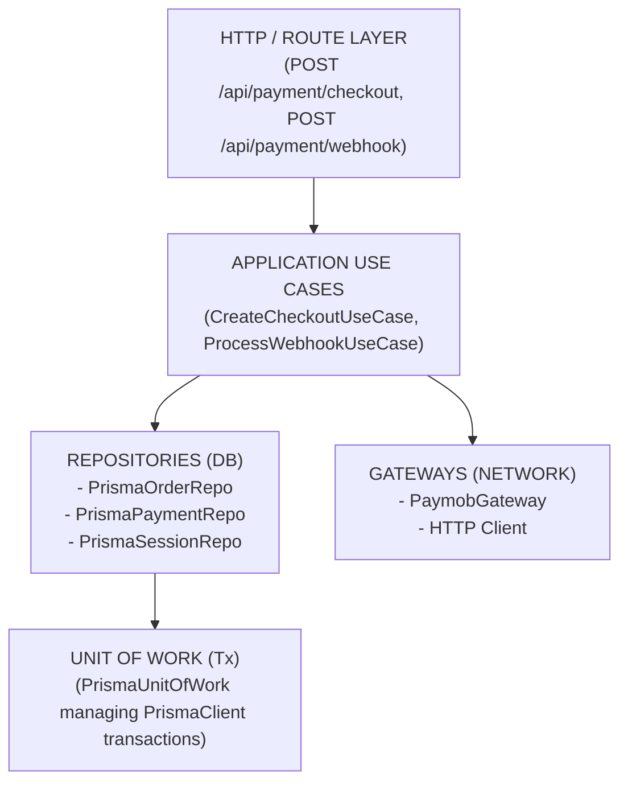

# 04 - Sprint 2 Infrastructure Specification

## Purpose
This document outlines the technical design, scope, deliverables, and execution risks for Sprint 2 (Infrastructure Sprint) of the IthraCode Payment Platform. It provides the concrete engineering details required to implement the persistence layer, Unit of Work pattern, external provider gateways, and HTTP route handlers. It acts as the direct guide for developers during this sprint.

---

## Overview
Sprint 2 transitions the payment platform from abstract domain and application rules into a fully functioning, database-backed, and network-connected system. The primary focus of this sprint is implementing the concrete infrastructure components that satisfy the domain interfaces defined in Sprint 1.

---

## Sprint 2 Scope & Architecture

---

## Core Infrastructure Components

### 1. Repository Layer
*   **Philosophy**: Repositories are strictly responsible for data persistence and retrieval. They must contain zero business logic or state transition rules.
*   **Prisma Implementations**:
    *   `PrismaOrderRepository`: Implements `OrderRepository`. Handles saving `OrderEntity` and its nested `OrderItemEntity` records, mapping them to Prisma's `Order` and `OrderItem` models.
    *   `PrismaPaymentRepository`: Implements `PaymentRepository`. Handles saving and updating `PaymentEntity` records, including updating status and mapping provider transaction IDs.
    *   `PrismaCheckoutSessionRepository`: Implements `CheckoutSessionRepository`. Handles saving and querying temporary checkout sessions.
    *   `PrismaCartRepository`: Implements `CartRepository`. Handles loading cart snapshots, checking active enrollments, and clearing carts.
*   **Mapping Strategy**: Every repository must use a dedicated Mapper class (e.g., `OrderMapper`) to convert rich Domain Entities into database-specific Prisma payloads and vice versa. This keeps the Domain Layer completely decoupled from database schema changes.

### 2. Unit of Work & Database Transactions
*   **Why Unit of Work**: To ensure atomic persistence across multiple repositories (e.g., saving an Order and a Payment together) while maintaining a single transactional boundary.
*   **Prisma Integration**: Implements `PrismaUnitOfWork` using Prisma's `$transaction` client. Repositories must accept an optional transaction client parameter to execute queries within the active transaction context.
*   **Transaction Boundary Rule**: Transactions must be short-lived. No external API calls (e.g., calling Paymob) are permitted inside a database transaction.

### 3. Provider Wiring & Gateway Abstraction
*   **Dependency Injection**: Concrete gateways (e.g., `PaymobGateway`) are registered in the dependency injection container / composition root.
*   **Resolver Integration**: The `PaymentProviderResolver` is injected with the registered gateways, allowing it to dynamically resolve the correct gateway at runtime based on the requested `PaymentProvider` enum.

### 4. HTTP Layer & Route Handlers
*   **Checkout Route**: `POST /api/payment/checkout`
    *   Parses the request body.
    *   Validates input schemas using Zod.
    *   Resolves the authenticated user's ID from the session.
    *   Instantiates and executes `CreateCheckoutUseCase`.
    *   Returns a standard JSON response with the redirect URL.
*   **Webhook Route**: `POST /api/payment/webhooks/paymob`
    *   Receives the raw request body (required for HMAC verification).
    *   Validates the cryptographic signature.
    *   Instantiates and executes `ProcessWebhookUseCase` to handle status updates and fulfillment.

---

## Deliverables
1.  **Database Mappers**:
    *   `OrderMapper`, `PaymentMapper`, `CheckoutSessionMapper`.
2.  **Prisma Repositories**:
    *   `PrismaOrderRepository`, `PrismaPaymentRepository`, `PrismaCheckoutSessionRepository`, `PrismaCartRepository`, `PrismaWebhookEventRepository`.
3.  **Transaction Management**:
    *   `PrismaUnitOfWork` class implementing the `UnitOfWork` interface.
4.  **Paymob Gateway**:
    *   `PaymobGateway` class implementing `PaymentProviderGateway` and handling API authentication, session creation, and signature verification.
5.  **API Routes**:
    *   Next.js API route handlers for checkout (`/api/payment/checkout`) and webhook (`/api/payment/webhooks/paymob`).
6.  **Integration Tests**:
    *   Test suite verifying database transactions, repository queries, and raw webhook signature verification.

---

## Risks & Mitigation Strategies

### Risk 1: Long-Running Database Transactions
*   **Description**: Executing the external Paymob API call inside the database transaction holds database connections open, risking connection pool exhaustion and application crashes under high traffic.
*   **Mitigation**: Enforce the "Commit Before Call" rule. The core database transaction must be committed before calling the external provider gateway. The checkout session is saved in a separate, subsequent transaction.

### Risk 2: Webhook Signature Verification Failure
*   **Description**: Next.js API routes automatically parse request bodies into JSON by default, which alters whitespace and breaks HMAC signature verification.
*   **Mitigation**: Disable body parsing on the webhook route handler (`config = { api: { bodyParser: false } }`) and read the raw request stream as a buffer to perform precise cryptographic validation.

### Risk 3: Inconsistent State on Network Timeout
*   **Description**: The local order and payment are saved, but the call to Paymob times out, leaving the order in a permanent `PENDING` state.
*   **Mitigation**: Implement a background Reconciliation Worker that polls the provider's API for pending payments, and allow users to safely retry checkout by resolving or replacing the existing pending payment.

---

## Success Criteria
1.  **Zero Layer Violations**: The Domain and Application layers remain completely free of Prisma, Next.js, and HTTP client imports.
2.  **Atomic Persistence**: Initiating a checkout successfully saves both the Order and Payment records, or saves neither if an error occurs (verified via transaction rollback tests).
3.  **Secure Webhook Validation**: The webhook endpoint successfully rejects tampered payloads with a `401 Unauthorized` and accepts authentic payloads with a `200 OK`.
4.  **Successful Redirection**: A complete end-to-end local test successfully generates a valid Paymob checkout URL and redirects the user.
