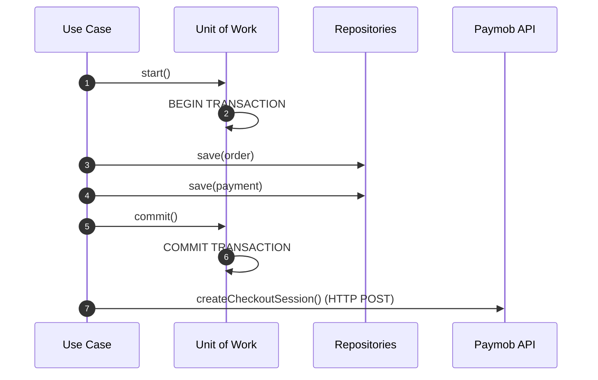

# 05 - Unit of Work Pattern Specification

## Purpose
This document defines the architectural specification for the Unit of Work (UoW) pattern within the IthraCode Payment Platform. It explains the design rationale, transaction boundaries, repository integration, failure recovery, and retry strategies. It establishes the critical engineering rules governing database transaction boundaries and external network communication.

---

## Overview
The Unit of Work pattern maintains a list of business operations affected by a single business transaction. It coordinates the writing of changes and the resolution of concurrency problems. In IthraCode, the Unit of Work acts as the gatekeeper for database transactions, ensuring that multiple repository operations succeed or fail as a single atomic unit.

---

## Why Unit of Work?
In a clean architecture codebase, business use cases coordinate multiple repositories to achieve a business goal. For example, creating a checkout requires:
1.  Saving an `OrderEntity` via `OrderRepository`.
2.  Saving a `PaymentEntity` via `PaymentRepository`.

Without a Unit of Work, each repository would manage its own database connection and commit its changes independently. If saving the Order succeeds but saving the Payment fails, the database is left in an inconsistent, corrupted state.

The Unit of Work solves this by exposing a unified transaction boundary across multiple repositories, ensuring that all writes are committed together or rolled back completely.

---

## Responsibilities
The `UnitOfWork` is responsible for:
1.  **Transaction Orchestration**: Starting, committing, and rolling back database transactions.
2.  **Context Sharing**: Providing repositories with a shared transactional database client (e.g., Prisma transaction client) to ensure all queries execute within the same transaction context.
3.  **Atomicity**: Enforcing that all database operations within its boundary either succeed together or leave the database completely untouched.

---

## Non-Responsibilities
The `UnitOfWork` is explicitly NOT responsible for:
1.  **Executing Business Logic**: It does not validate data, calculate prices, or make business decisions.
2.  **External Network Calls**: It must never manage, wrap, or execute external API requests (e.g., calling Paymob or sending emails).
3.  **Direct SQL Execution**: It delegates all actual database reads and writes to the repositories.

---

## Transaction Boundary Rules

### Critical Engineering Decision: Commit BEFORE External Call
The database transaction MUST be committed before communicating with external payment providers (e.g., Paymob).



### Rationale: Why We Commit Before the External Call
1.  **Connection Pool Protection**: Database transactions hold database connections open. External HTTP calls are slow and highly volatile (taking anywhere from 200ms to several seconds). Executing an HTTP call inside a database transaction keeps the connection locked, leading to rapid connection pool exhaustion and application downtime under load.
2.  **Orphan Prevention**: If we call Paymob first and then attempt to write to the database, a database write failure (e.g., unique constraint violation or database timeout) would leave an orphaned checkout session active on Paymob's servers. The user might pay for a session that has no corresponding order in our database.
3.  **Database as Source of Truth**: By committing first, the local database is established as the absolute source of truth. If the subsequent external call fails, the system has a record of the intent to purchase (`PENDING` order) and can recover gracefully.

---

## Transaction Client & Repository Integration
To support both transactional and non-transactional operations, repositories must be designed to accept an optional transaction client.

### Abstract Interface Contract

```typescript
export interface UnitOfWork {
  /** Executes a set of repository operations within an atomic database transaction */
  runInTransaction<T>(work: (txClient: unknown) => Promise<T>): Promise<T>;
}
```

### Repository Integration Pattern
Repositories must check for the presence of the shared transaction client before executing database queries:

```typescript
export class PrismaOrderRepository implements OrderRepository {
  constructor(private readonly globalPrisma: PrismaClient) {}

  async save(order: OrderEntity, txClient?: unknown): Promise<OrderEntity> {
    // Use the transaction client if provided, otherwise fallback to the global client
    const client = (txClient as PrismaClient) ?? this.globalPrisma;
    
    await client.order.upsert({
      where: { id: order.id },
      create: OrderMapper.toPrisma(order),
      update: OrderMapper.toPrisma(order),
    });

    return order;
  }
}
```

---

## Failure Scenarios & Recovery

### Scenario 1: Database Write Fails During Core Transaction
*   **Behavior**: The `UnitOfWork` catches the database error, triggers an automatic rollback of all pending writes, and releases the database connection.
*   **Result**: No order or payment records are saved. No external call is made. The user receives a graceful error message and can try again.

### Scenario 2: External Gateway Call Fails After Commit
*   **Behavior**: The database transaction is already committed; the `OrderEntity` and `PaymentEntity` are saved as `PENDING`. The HTTP call to Paymob fails or times out.
*   **Result**: The use case catches the network exception and returns a graceful error to the user. The order remains in the database in a `PENDING` state.
*   **Recovery**: The user can safely click "Checkout" again. The system detects the existing pending order, cancels the previous payment attempt, and initiates a new provider call.

---

## Retry Strategy & Reconciliation
External provider failures must be retryable. To handle edge cases where a user pays but a network failure prevents the redirect or webhook from completing, the system implements two layers of reconciliation:

### 1. User-Initiated Retry
If a user returns to checkout after a provider failure:

*   **Current behavior:** `CreateCheckoutUseCase` acquires a Redis checkout lock, computes a cart fingerprint, and **reuses** an existing `PENDING` order with matching fingerprint when an open non-expired `CheckoutSession` exists. If the session expired, the same order receives a new provider session. Concurrent checkouts return `409 CHECKOUT_IN_PROGRESS`.

### 2. Automated Reconciliation Worker
A background worker runs every **15 minutes** (`PAYMENT_RECONCILE_INTERVAL_MS`, default `900000`) to reconcile stuck transactions:

*   Claims due `PENDING`/`PROCESSING` payments via `nextReconcileAt` (with `FOR UPDATE SKIP LOCKED`) — first due time is set at checkout (`createdAt + PAYMENT_RECONCILE_THRESHOLD_MINUTES`, default **30**).
*   Calls the provider's `getPaymentStatus` API and maps the response to gateway-agnostic outcomes: `succeeded | failed | pending | not_found | transient_error | ambiguous`.
*   `ReconciliationPolicy` decides: fulfill success, fulfill failure, **defer** (exponential backoff), **manual_review**, or **abandon** (only after exhausted window + consecutive `not_found` + expired session).
*   **Never** marks FAILED on a single provider 404/`not_found`.
*   Success/failure fulfillment goes through `FulfillOrderService` (same path as webhooks — idempotent).
*   Each attempt is appended to `payment_reconcile_attempts` and updates reconcile control-plane fields on `payments`.

**Scripts:** `pnpm payment:reconcile` (one-shot), `pnpm worker:reconcile` (interval worker), `pnpm payment:reconcile-review` (list / requeue / abandon `MANUAL_REVIEW`).

**Log / metric events:** `[PAYMENT_RECONCILE_PROCESSED]`, `[PAYMENT_RECONCILE_BATCH_COMPLETE]`, `[PAYMENT_RECONCILE_ERROR]`, `payment_reconcile_*` counters via `LoggingMetricsRecorder`.

---

## Commit Failure

If the database `COMMIT` itself fails after all writes succeed (e.g., disk full, replication lag, connection drop at commit time):

*   **Behavior:** Prisma/`UnitOfWork` treats this as a transaction failure. All pending writes in that transaction are rolled back.
*   **Result:** No partial records from that transaction are visible to other connections.
*   **Checkout impact:** If Tx1 commit fails → no order/payment saved, no provider call made. If Tx2 commit fails after a successful provider call → order/payment remain `PENDING` without a saved `CheckoutSession`; user sees `INTERNAL_ERROR` (500) and can retry.
*   **Webhook impact:** Fulfillment transaction rolls back → webhook returns `500` → provider retries.

---

## Benefits of This Design
*   **High Concurrency**: Keeping transactions extremely short ensures database connections are released immediately, allowing the platform to handle high volumes of concurrent checkouts.
*   **Data Consistency**: The database is guaranteed to never contain orphaned orders or payments. Every successful payment is guaranteed to link to a valid, pre-existing order.
*   **Resilience**: The system can recover automatically from external network failures, API timeouts, and temporary database disconnects.
