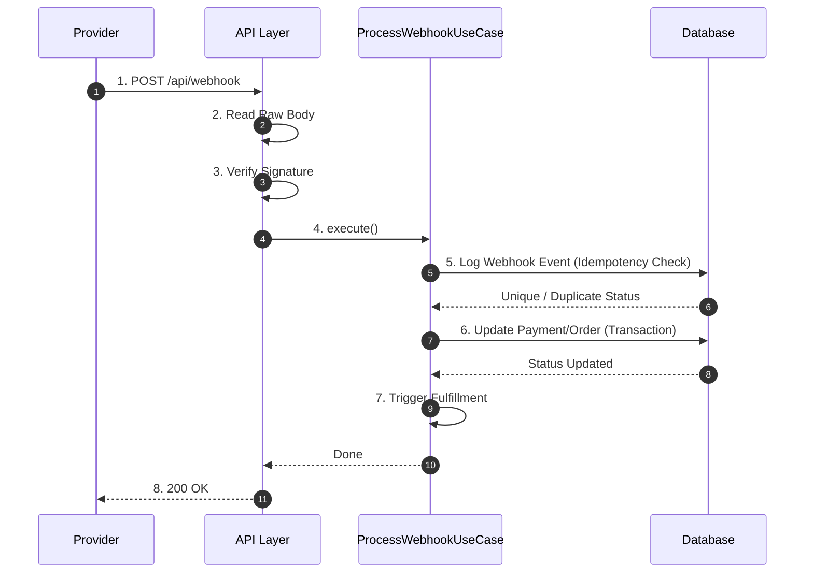

# 08 - Webhook Processing Specification

## Purpose
This document defines the architectural specification for webhook ingestion and processing within the IthraCode Payment Platform. It details the webhook lifecycle, cryptographic signature verification, idempotency controls, replay protection, state transitions, and error handling. It establishes the critical engineering rules that protect the platform against double-spending and unauthorized fulfillment.

---

## Overview
Webhooks are asynchronous, server-to-server HTTP POST notifications sent by payment providers to notify IthraCode of transaction outcomes. 

### Critical Principle: Webhook is the Absolute Source of Truth
The client-side redirect "Success URL" is never trusted to complete an order or trigger enrollment. It is treated purely as a UI transition. Order completion and student enrollment are strictly triggered by verified, cryptographic webhooks received directly from the payment provider.

---

## Webhook Lifecycle

---

## Cryptographic Signature Verification
To prevent malicious actors from spoofing webhook notifications (e.g., sending fake success payloads to trigger free course enrollments), every incoming webhook must undergo strict cryptographic signature verification.

### 1. Raw Body Ingestion
Next.js API routes automatically parse request bodies into JSON by default. This process alters whitespace, formatting, and key order, which breaks HMAC signature verification. 
*   **Enforced Rule**: The webhook route handler must disable default body parsing (`bodyParser: false`) and read the raw request stream directly into a buffer.

### 2. HMAC Calculation
*   The gateway extracts the signature from the request headers or query parameters.
*   It concatenates specific payload fields (e.g., transaction ID, amount, currency, status) in the exact order specified by the provider.
*   It computes an HMAC-SHA256 hash of the concatenated string using the shared Webhook Secret.
*   It performs a constant-time string comparison (`crypto.timingSafeEqual`) between the computed hash and the received signature to prevent timing attacks.
*   If the signature is invalid, the request is rejected immediately with a `401 Unauthorized` status.

---

## Idempotency & Replay Protection

### 1. Duplicate Event Handling
Payment providers guarantee webhook delivery but do not guarantee *exactly-once* delivery. Due to network retries, the same webhook payload may be delivered multiple times.
*   **Idempotency Key**: Every webhook payload contains a unique provider transaction or event ID.
*   **Logging**: Upon successful signature verification, the use case attempts to save a `WebhookEventEntity` containing the unique `providerEventId` and provider name.
*   **Database Constraint**: The `WebhookEvent` table enforces a unique constraint on the composite key `(provider, providerEventId)`.
*   **Handling**: If a duplicate webhook is received, the database unique constraint will reject the insert. The use case catches this constraint violation, halts further processing, and returns a `200 OK` to the provider (indicating we have successfully received and processed the event previously).

### 2. Replay Attack Protection
A replay attack occurs when an attacker intercepts a valid webhook payload and signature and resends it to our server at a later time.
*   **Timestamp Validation**: Webhook payloads include a timestamp indicating when the event was generated.
*   **Handling**: The system verifies that the webhook timestamp is within a **5-minute window** of the current server time. Payloads older than 5 minutes are rejected to prevent replay attacks.

---

## Payment State Updates & Order Completion
Once a webhook is verified and confirmed as unique, the system initiates the state transition workflow inside a database transaction managed by the Unit of Work.

### 1. Payment Status Transition
*   The system loads the linked `PaymentEntity` using the provider transaction ID.
*   If the webhook indicates success:
    *   Payment status is updated to `SUCCEEDED`.
    *   `paidAt` is set to the current timestamp.
    *   Provider metadata and payment method details (e.g., card brand, last 4 digits) are updated.
*   If the webhook indicates failure:
    *   Payment status is updated to `FAILED`.
    *   `failureCode` and `failureMessage` are populated.

### 2. Order Status Transition
*   If the payment is updated to `SUCCEEDED`:
    *   The linked `OrderEntity` status is updated to `COMPLETED`.
    *   `completedAt` is set to the current timestamp.
*   If the payment is updated to `FAILED`:
    *   The linked `OrderEntity` status remains `PENDING` to allow the user to retry payment, or is updated to `CANCELLED` if the session has expired.

---

## Failure Handling & Provider Retries
To ensure system resilience, the webhook endpoint must handle failures gracefully:

### 1. Database Failures during Processing
*   If a database error occurs while updating statuses or logging events, the transaction is rolled back.
*   The webhook endpoint returns a `500 Internal Server Error` to the payment provider.
*   This signals the provider that the delivery failed, triggering their automatic retry schedule (e.g., retrying every hour for 24 hours).

### 2. Non-Critical Failures
*   Failures in secondary, non-critical post-payment tasks (e.g., email notification failure, analytics tracking timeout) must never fail the webhook response.
*   These tasks are executed asynchronously outside the core transaction. If they fail, they are logged and retried via an asynchronous queue, while the webhook endpoint returns a successful `200 OK` to the provider.
