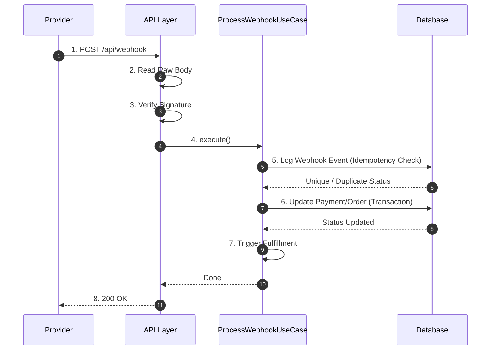

# 08 - Webhook Processing Specification

## Purpose
This document defines the architectural specification for webhook ingestion and processing within the IthraCode Payment Platform. It details the webhook lifecycle, cryptographic signature verification, idempotency controls, replay protection, state transitions, and error handling. It establishes the critical engineering rules that protect the platform against double-spending and unauthorized fulfillment.

---

## Overview
Webhooks are asynchronous, server-to-server HTTP POST notifications sent by payment providers to notify IthraCode of transaction outcomes. 

### Critical Principle: Webhook is the Absolute Source of Truth
The client-side redirect "Success URL" is never trusted to complete an order or trigger enrollment. It is treated purely as a UI transition. Order completion and student enrollment are strictly triggered by verified, cryptographic webhooks received directly from the payment provider.

---

## Webhook Lifecycle

---

## Cryptographic Signature Verification
To prevent malicious actors from spoofing webhook notifications (e.g., sending fake success payloads to trigger free course enrollments), every incoming webhook must undergo strict cryptographic signature verification.

### 1. Raw Body Ingestion
Next.js API routes automatically parse request bodies into JSON by default. This process alters whitespace, formatting, and key order, which breaks HMAC signature verification. 
*   **Enforced Rule**: The webhook route handler must disable default body parsing (`bodyParser: false`) and read the raw request stream directly into a buffer.

### 2. HMAC Calculation (Paymob)
*   The route extracts the signature from the `hmac` query parameter (Paymob convention).
*   It concatenates 20 transaction fields in the exact lexical order specified by Paymob (see `paymob.hmac.ts` → `TRANSACTION_HMAC_FIELDS`).
*   It computes an **HMAC-SHA512** hash of the concatenated string using the shared `PAYMOB_HMAC_SECRET`.
*   It performs a constant-time comparison (`crypto.timingSafeEqual`) between the computed hash and the received signature.
*   If the signature is invalid or missing, the request is rejected with `401 Unauthorized` and code `INVALID_SIGNATURE`. No database mutations occur.

---

## HTTP Response Matrix

`POST /api/payment/webhooks/paymob` returns the following responses. Provider retry behavior depends on the status code.

| Scenario | HTTP | Response Body | DB Mutations | Provider Retries? |
| :--- | :--- | :--- | :--- | :--- |
| Valid webhook, first delivery, fulfillment succeeds | `200` | `{ ok: true, duplicate: false, fulfilled: true, orderId }` | Yes (payment, order, enrollments, cart, webhook event) | No |
| Valid webhook, payment failed outcome | `200` | `{ ok: true, duplicate: false, fulfilled: false, orderId }` | Yes (payment `FAILED`) | No |
| Duplicate webhook (`P2002` on `providerEventId`) | `200` | `{ ok: true, duplicate: true, ... }` | No (idempotent) | No |
| Already completed order (re-delivery after fulfillment) | `200` | `{ ok: true, duplicate: false, fulfilled: false, orderId }` | Webhook event may be logged; no re-enrollment | No |
| Missing `hmac` query parameter | `401` | `{ error, code: 'INVALID_SIGNATURE' }` | No | Unlikely |
| Invalid HMAC | `401` | `{ error, code: 'INVALID_SIGNATURE' }` | No | Unlikely |
| Stale/missing webhook timestamp | `401` | `{ error, code: 'REPLAY_DETECTED' }` | No | Unlikely |
| Missing `orderId` in payload | `400` | `{ error, code: 'VALIDATION_ERROR' }` | No | Depends on provider |
| Missing provider transaction `id` | `400` | `{ error, code: 'VALIDATION_ERROR' }` | No | Depends on provider |
| Invalid payload (no `obj`) | `400` | `{ error, code: 'VALIDATION_ERROR' }` | No | Depends on provider |
| Paymob not configured (`readPaymobConfig()` null) | `503` | `{ error, code: 'PROVIDER_UNAVAILABLE' }` | No | Yes |
| Rate limit exceeded (>120 req/s per IP) | `429` | `{ error, code: 'VALIDATION_ERROR' }` | No | Yes |
| Order not found (`ORDER_NOT_FOUND`) | `404` | `{ error, code: 'ORDER_NOT_FOUND' }` | No (webhook event insert may roll back with tx) | **Risk:** provider may stop retrying |
| Payment not found (`PAYMENT_NOT_FOUND`) | `404` | `{ error, code: 'PAYMENT_NOT_FOUND' }` | No | **Risk:** provider may stop retrying |
| Database error during fulfillment transaction | `500` | `{ error: 'Internal Error', code: 'INTERNAL_ERROR' }` | Rolled back | Yes |
| `OrderCompleted` BullMQ publish failure | `200` | Success body (publish errors are caught post-commit) | Yes (fulfillment committed) | No |

### Orphaned webhook policy

When a signed webhook references an `orderId` that does not exist in our database (e.g., data loss, wrong environment), the endpoint returns **`404 ORDER_NOT_FOUND`**. This is a **fail-close** decision: we do not fulfill unknown orders. Operations must investigate via `[PAYMOB_WEBHOOK_ERROR]` logs. If Paymob stops retrying on 404, manual reconciliation is required.

Unsupported Paymob event types are not explicitly filtered today — all processed-transaction callbacks are mapped to success/failed outcomes via `paymob-webhook.mapper.ts`.

---

## Idempotency & Replay Protection

### 1. Duplicate Event Handling
Payment providers guarantee webhook delivery but do not guarantee *exactly-once* delivery. Due to network retries, the same webhook payload may be delivered multiple times.
*   **Idempotency Key**: Every webhook payload contains a unique provider transaction or event ID.
*   **Logging**: Upon successful signature verification, the use case attempts to save a `WebhookEventEntity` containing the unique `providerEventId` and provider name.
*   **Database Constraint**: The `WebhookEvent` table enforces a unique constraint on the composite key `(provider, providerEventId)`.
*   **Handling**: If a duplicate webhook is received, the database unique constraint will reject the insert. The use case catches this constraint violation, halts further processing, and returns a `200 OK` to the provider (indicating we have successfully received and processed the event previously).

### 2. Replay Attack Protection

**Implemented.** `paymob-webhook.mapper.ts` exposes `eventCreatedAt` from Paymob `created_at`. `WebhookReplayGuard` rejects stale or missing timestamps with `401 REPLAY_DETECTED` (configurable via `PAYMOB_WEBHOOK_REPLAY_WINDOW_SECONDS`, default 300s). Defense in depth alongside HMAC + `providerEventId` idempotency.

*   **Clock skew**: Events more than 60s in the future are rejected. NTP-synced servers recommended.

---

## Payment State Updates & Order Completion
Once a webhook is verified and confirmed as unique, the system initiates the state transition workflow inside a database transaction managed by the Unit of Work.

### 1. Payment Status Transition
*   The system resolves `orderId` from the webhook payload (`special_reference` / `merchant_order_id`), loads the `OrderEntity`, then loads the linked `PaymentEntity` via `order.paymentId`.
*   If the webhook indicates success:
    *   Payment status is updated to `SUCCEEDED`.
    *   `paidAt` is set to the current timestamp.
    *   Provider metadata and payment method details (e.g., card brand, last 4 digits) are updated.
*   If the webhook indicates failure:
    *   Payment status is updated to `FAILED`.
    *   `failureCode` and `failureMessage` are populated.

### 2. Order Status Transition
*   If the payment is updated to `SUCCEEDED`:
    *   The linked `OrderEntity` status is updated to `COMPLETED`.
    *   `completedAt` is set to the current timestamp.
*   If the payment is updated to `FAILED`:
    *   The linked `OrderEntity` status remains `PENDING` to allow the user to retry payment, or is updated to `CANCELLED` if the session has expired.

---

## Failure Handling & Provider Retries
To ensure system resilience, the webhook endpoint must handle failures gracefully:

### 1. Database Failures during Processing
*   If a database error occurs while updating statuses or logging events, the transaction is rolled back.
*   The webhook endpoint returns a `500 Internal Server Error` to the payment provider.
*   This signals the provider that the delivery failed, triggering their automatic retry schedule (e.g., retrying every hour for 24 hours).

### 2. Non-Critical Failures
*   Failures in secondary, non-critical post-payment tasks (e.g., email notification failure, analytics tracking timeout) must never fail the webhook response.
*   These tasks are executed asynchronously outside the core transaction. If they fail, they are logged and retried via an asynchronous queue, while the webhook endpoint returns a successful `200 OK` to the provider.
