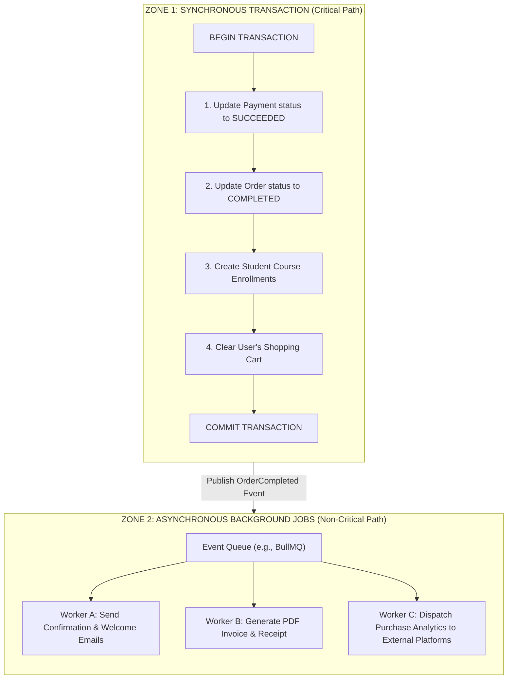

# 09 - Fulfillment Specification

## Purpose
This document defines the post-payment fulfillment architecture for the IthraCode Payment Platform. It specifies the sequence of operations executed upon successful payment, detailing which operations run inside a synchronous database transaction and which run asynchronously. It establishes the retry strategies and error boundaries required to guarantee student enrollment and system consistency.

---

## Overview
Fulfillment is the process of delivering purchased assets (courses, bundles) to the student once their payment has been verified. The fulfillment engine must be highly resilient: if a student pays, they must receive access to their course under all circumstances, even in the event of database deadlocks, network timeouts, or third-party email server failures.

---

## Transactional vs. Asynchronous Operations

To maximize performance, reliability, and responsiveness, the fulfillment process is divided into two distinct execution zones:



### 1. Zone 1: Synchronous Transaction (Critical Path)
These operations are critical to core business consistency and must execute atomically within a single database transaction. If any of these operations fail, the entire transaction is rolled back, and the webhook is rejected (triggering a retry).
*   **Payment Status Update**: Transitioning the payment to `SUCCEEDED`.
*   **Order Status Update**: Transitioning the order to `COMPLETED`.
*   **Enrollment Creation**: Granting the student active access to the purchased courses.
*   **Cart Cleanup**: Removing the purchased courses from the user's active shopping cart.

### 2. Zone 2: Asynchronous Background Jobs (Non-Critical Path)
These operations are secondary and must never block the critical path or fail the webhook response. If they fail, they are retried independently behind the scenes.
*   **Email Dispatch**: Sending purchase receipts, payment confirmations, and course welcome emails.
*   **Invoice Generation**: Generating PDF invoices and tax receipts.
*   **Analytics Tracking**: Pushing purchase events to external analytics platforms (e.g., Google Analytics, Mixpanel).

---

## Synchronous Transaction Flow (Critical Path)

The critical path is managed by the `ProcessWebhookUseCase` inside a transaction orchestrated by the `UnitOfWork`.

```typescript
async function executeCriticalPath(paymentId: string, courseIds: string[], userId: string) {
  await unitOfWork.runInTransaction(async (tx) => {
    // 1. Update Payment status to SUCCEEDED
    await paymentRepository.updateStatus(paymentId, 'SUCCEEDED', tx);

    // 2. Update Order status to COMPLETED
    await orderRepository.updateStatusByPaymentId(paymentId, 'COMPLETED', tx);

    // 3. Create active course enrollments
    await enrollmentRepository.createEnrollments(userId, courseIds, tx);

    // 4. Clear the user's shopping cart
    await cartRepository.clearCart(userId, tx);
  });
}
```

### Rationale for Cart Cleanup in Critical Path
Clearing the cart inside the transaction prevents a critical race condition: if the cart is cleared asynchronously, the user might click "Checkout" again on their still-populated cart before the background worker runs, leading to duplicate orders and double-spending.

---

## Asynchronous Event Flow (Non-Critical Path)

Once the critical path transaction commits successfully, the use case publishes an `OrderCompleted` event to the system's event bus or background queue.

### Event Payload Structure

```typescript
export type OrderCompletedEvent = {
  eventId: string;
  timestamp: Date;
  orderId: string;
  userId: string;
  totalCents: number;
  currency: string;
  purchasedCourseIds: string[];
};
```

### Background Workers

#### Worker A: Email Notification Worker
*   **Responsibility**: Compiles and sends a localized HTML email containing the payment confirmation, receipt details, and links to start the purchased courses.
*   **Failure Handling**: If the email server (e.g., SendGrid, Resend) is down, the worker fails and is scheduled for retry.

#### Worker B: Invoice Worker
*   **Responsibility**: Generates a secure, sequential PDF invoice, stores it in secure object storage (S3), and links it to the user's profile.
*   **Failure Handling**: Retried automatically on failure.

#### Worker C: Analytics Worker
*   **Responsibility**: Formats and dispatches purchase metadata to marketing and product analytics tools.
*   **Failure Handling**: Retried automatically on failure.

---

## Resilience & Retry Strategy

### 1. Critical Path Failure
If the synchronous transaction fails (e.g., database deadlock or connection pool timeout):
*   The entire database state is rolled back. No enrollment is created, and the cart remains populated.
*   The webhook endpoint returns a `500 Internal Server Error` to the payment provider.
*   The provider retries sending the webhook according to its retry schedule.

### 2. Asynchronous Path Failure (Queue Retries)
If an asynchronous worker fails (e.g., email server timeout):
*   The core enrollment and payment states are unaffected. The student already has access to their courses.
*   The background queue (e.g., BullMQ) catches the failure and applies an exponential backoff retry strategy:
    *   **Max Retries**: 5 attempts.
    *   **Initial Delay**: 1 minute.
    *   **Backoff Factor**: 2 (1 min, 2 min, 4 min, 8 min, 16 min).
*   If all retries are exhausted, the job is moved to a Dead Letter Queue (DLQ) for manual engineering triage.
