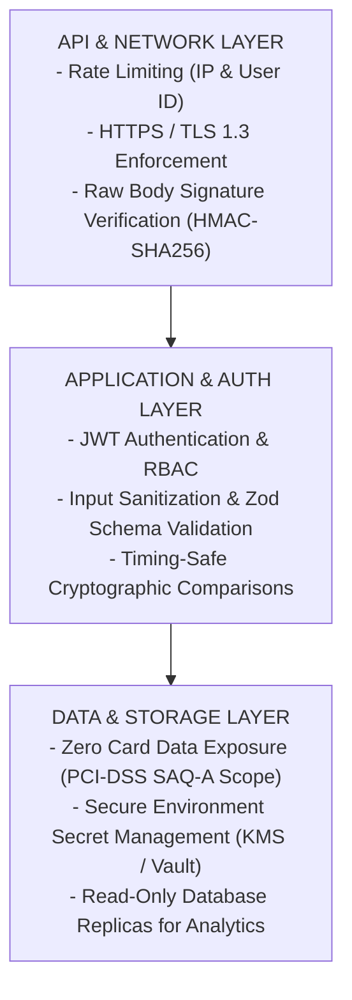

# 10 - Payment Platform Security Specification

## Purpose
This document defines the security architecture and compliance standards for the IthraCode Payment Platform. It specifies the protocols, controls, and practices required to protect user funds, prevent transaction fraud, secure sensitive data, and ensure strict compliance with industry standards (PCI-DSS). It serves as the authoritative security guide for the engineering team.

---

## Overview
Security is the primary non-functional requirement of the IthraCode Payment Platform. Because the platform handles financial transactions and user data, it is a high-value target for malicious actors. The security architecture is designed using the **Defense in Depth** principle, applying multiple layers of security controls across the API, application, database, and network layers.

---

## Core Security Controls

---

## Authentication & Authorization

### 1. Checkout Endpoint Authentication
The checkout endpoint (`POST /api/payment/checkout`) must require strict user authentication:
*   **Token Validation**: Requests must carry a valid, cryptographically signed JWT session token.
*   **Identity Resolution**: The user ID is resolved directly from the verified session token on the server. The client cannot pass a user ID in the request body, preventing account hijacking and unauthorized checkouts.

### 2. Role-Based Access Control (RBAC)
*   Only users with the `STUDENT` role can initiate checkout sessions.
*   Administrative actions (e.g., manually triggering refunds, reconciling stuck payments) are restricted to authorized personnel with the `ADMIN` or `FINANCE` role and require multi-factor authentication (MFA).

---

## Secret Management & Environment Variables
Under no circumstances may API keys, webhook secrets, or database credentials be hardcoded in the codebase.

### 1. Environment Variable Configuration
The system relies on secure environment variables injected at runtime:
*   `PAYMOB_API_KEY`: Secret key used to authenticate with Paymob.
*   `PAYMOB_HMAC_SECRET`: Secret key used to verify webhook signatures.
*   `PAYMOB_INTEGRATION_ID`: Public identifier for the credit card payment integration.
*   `PAYMENT_SYSTEM_CURRENCY`: Enforced system currency (e.g., `EGP`).

### 2. Production Secret Protection
In production, secrets must be managed using a dedicated Key Management Service (KMS) or Secret Manager (e.g., AWS Secrets Manager, HashiCorp Vault, or Vercel Environment Secrets). Secrets must be rotated every 90 days to minimize the impact of potential leaks.

---

## Webhook Validation & Cryptographic Integrity

To protect the system from fraudulent fulfillment, the webhook endpoint enforces strict cryptographic validation:

### 1. HMAC-SHA256 Verification
Every webhook received from Paymob includes an HMAC signature. The platform must recalculate this signature locally using the raw request body and the shared `PAYMOB_HMAC_SECRET`.
*   **Timing Attack Prevention**: Signature comparison must use constant-time string comparison algorithms (`crypto.timingSafeEqual`) to prevent attackers from guessing valid signatures based on response times.

### 2. Replay Protection
*   The webhook payload must include a timestamp.
*   The system rejects any webhook where the timestamp differs from the current server time by more than **5 minutes**, preventing attackers from intercepting and replaying successful payment notifications.

---

## Rate Limiting & Abuse Prevention
To protect the checkout and webhook endpoints from Denial of Service (DoS) attacks, brute-force coupon guessing, and payment fraud, strict rate limits are enforced:

### 1. Checkout Endpoint Limits
*   **Limit**: Max 5 checkout requests per user ID per minute.
*   **Limit**: Max 10 checkout requests per IP address per minute.
*   **Action on Violation**: Returns a `429 Too Many Requests` status.

### 2. Webhook Endpoint Limits
*   **Limit**: Configured to match the maximum expected throughput from the payment provider (e.g., 100 requests per second).
*   **IP Whitelisting**: If possible, the webhook route should restrict incoming traffic to Paymob's official public IP address ranges.

---

## PCI-DSS Compliance (Zero Card Exposure)
The IthraCode platform must maintain a **Zero Card Exposure** policy to minimize security risk and simplify compliance audits.

*   **SAQ-A Scope**: By ensuring that raw credit card numbers (PANs), expiration dates, and CVVs never touch IthraCode servers, the platform remains within the scope of PCI-DSS Self-Assessment Questionnaire A (SAQ-A).
*   **Hosted Fields / Redirects**: All card data entry must occur within secure iframes hosted directly by Paymob or via direct redirection to Paymob's secure payment pages.
*   **No Card Storage**: The database must never store raw card details. It is only permitted to store non-sensitive payment metadata returned by the provider, such as the card brand (e.g., `VISA`) and the last 4 digits (e.g., `4242`) for user reference.

---

## Secure Error Handling
Error messages returned to the client must be carefully sanitized to prevent information disclosure:

*   **No Stack Traces**: Stack traces and raw database error messages (e.g., Prisma query errors) must never be returned to the client.
*   **Sanitized API Responses**: If an external API call fails, the API returns a standardized, localized error message (e.g., "مزود الدفع غير متاح حالياً").
*   **Detailed Internal Logging**: The complete, raw error details (including stack traces and API payloads) are logged securely on the server for engineering triage, completely hidden from the public.

---

## Logging & Auditing
A comprehensive, immutable audit trail is maintained for all financial events to support security audits and fraud investigations.

### 1. Audit Trail Requirements
*   Every state transition of an Order or Payment must be logged in the database with the timestamp, user ID, and action performed.
*   All incoming webhooks (both successful and failed) must be logged in the `WebhookEvent` table.

### 2. Log Sanitization
*   Logs must be strictly sanitized before being written to disk or pushed to logging aggregators (e.g., Datadog, Winston).
*   Mappers must strip any potentially sensitive information (such as user passwords, personal identification details, or API keys) from log payloads.
