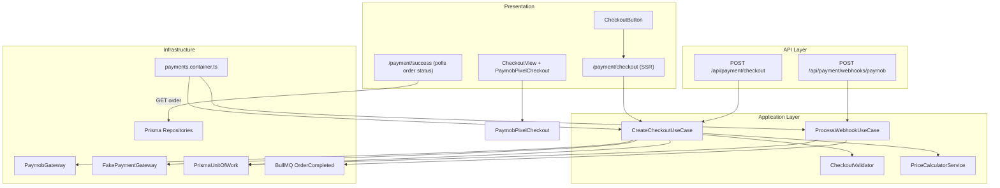

# Payment Platform — Complete Implementation Overview

This document explains everything implemented in the IthraCode payment system — architecture, front-to-back flow, testing strategy, and the reasoning behind each major design decision. It complements the numbered specs in this directory (`01`–`11`) with a single end-to-end narrative.

**Code location:** `src/features/payments`  
**Related docs:** [00-index.md](./00-index.md)

---

## Table of Contents

1. [Core Philosophy](#1-core-philosophy)
2. [Architecture Overview](#2-architecture-overview)
3. [Layer-by-Layer Breakdown](#3-layer-by-layer-breakdown)
4. [End-to-End Payment Flow](#4-end-to-end-payment-flow)
5. [Security Controls](#5-security-controls)
6. [Testing Strategy (Front + Back)](#6-testing-strategy-front--back)
7. [Async Post-Fulfillment](#7-async-post-fulfillment)
8. [Implementation Phases](#8-implementation-phases)
9. [What the UI Shows vs. What the Server Owns](#9-what-the-ui-shows-vs-what-the-server-owns)
10. [Known Gaps / Future Work](#10-known-gaps--future-work)
11. [Summary](#11-summary)

---

## 1. Core Philosophy

Five rules govern every layer of the payment module:

| Principle | What it means in practice |
|-----------|---------------------------|
| **Server is source of truth** | Prices, discounts, and totals are never trusted from the browser. |
| **Orders are immutable** | Once created, order line items are frozen price snapshots. |
| **Webhook is source of truth** | Success redirect ≠ enrollment. Only a verified webhook completes the order. |
| **Provider-agnostic core** | Domain/Application never import Paymob, Prisma, or Axios. |
| **Short DB transactions** | DB commits happen **before** external API calls, never during them. |

These are not abstract ideals — they directly shaped transaction boundaries, the Pixel embed approach, and the success-page polling UX.

---

## 2. Architecture Overview



**Dependency direction:** Domain ← Application ← Infrastructure ← API/Pages. Only `payments.container.ts` wires concrete classes.

---

## 3. Layer-by-Layer Breakdown

### Domain (`domain/`)

Pure business entities with no framework imports:

- `OrderEntity`, `PaymentEntity`, `CheckoutSessionEntity`, `WebhookEventEntity`, `RefundEntity`
- `PaymentProvider` enum (`PAYMOB`, `STRIPE`, `PAYPAL`, `CASH`)
- Helpers like `isSuccessfulPayment()`, `isTerminalPaymentStatus()`

**Why:** Keeps business rules testable and stable even if Paymob or Prisma changes.

---

### Application (`application/`)

Orchestration and contracts:

| Piece | Role |
|-------|------|
| `CreateCheckoutUseCase` | Validates cart → prices → persists order/payment → calls gateway → saves session |
| `ProcessWebhookUseCase` | Idempotent webhook → payment status → enrollment → cart clear |
| `CheckoutValidator` | Business rules (empty cart, already enrolled, own course, coupon, currency) |
| `PriceCalculatorService` | Server-side pricing in **integer cents** |
| `OrderFactory` / `PaymentFactory` | Build immutable aggregates before persistence |
| `application/ports/` | Repository and `UnitOfWork` interfaces |
| `PaymentProviderGateway` | Provider abstraction (only `createCheckoutSession` today) |

**Why ports live in Application (not Domain):** Persistence is a use-case dependency, not a domain rule. This matches the phased implementation plan in [02-payment-implementation-plan.md](./02-payment-implementation-plan.md).

---

### Infrastructure (`infrastructure/`)

Concrete implementations:

- **Prisma repositories** — one per aggregate (`Order`, `Payment`, `CheckoutSession`, `WebhookEvent`, `Enrollment`, `Cart`)
- **`PrismaUnitOfWork`** — binds all repos to a single `$transaction`
- **`PaymobGateway`** — Intention API + unified checkout URL
- **`FakePaymentGateway`** — deterministic fake sessions for dev/CI
- **`paymob.hmac.ts`** — HMAC-SHA512 verification with `timingSafeEqual`
- **`rate-limit.ts`** — Redis-backed limits on checkout and webhooks
- **`order-completed.publisher.ts`** — BullMQ jobs for email/invoice/analytics (stubs)

**Why FakePaymentGateway is permanent:** The implementation plan explicitly says *"API before real provider"* — the full checkout pipeline is validated without Paymob before Phase 6.

---

## 4. End-to-End Payment Flow

### Phase A — Cart → Checkout Page

1. **`CheckoutButton`** (`src/features/cart/components/checkout-button.tsx`)
   - Guest → stage cart, redirect to login
   - Authenticated → link to `/payment/checkout`

2. **`/payment/checkout/page.tsx`** (Server Component)
   - `requireAuth()` — unauthenticated users are redirected
   - Loads cart via `getCart()`; empty cart → redirect to cart
   - If Paymob is configured → runs `CreateCheckoutUseCase` **on the server**
   - Passes `clientSecret`, `publicKey`, `orderId` into `CheckoutView`

**Why SSR checkout initiation (not client-side API call):**

- Checkout session is created before the page renders
- No exposed checkout API call from the browser on first paint
- `userId` always comes from the session, never from the request body

`createCheckoutAction` exists as a server action wrapper around `POST /api/payment/checkout`, but the checkout page calls the use case directly today.

---

### Phase B — Create Checkout (backend)

`CreateCheckoutUseCase` runs in two database transactions separated by the provider call:

**Tx1** — persist payment then order atomically, and **commit before** the external provider call. `payments.id` is the FK target of `orders.payment_id`, so the payment must be inserted first.

**External call** — `PaymobGateway.createCheckoutSession()` → Paymob Intention API

**Tx2** — record the checkout session and move the payment to `PROCESSING`

**Step-by-step:**

1. Load cart snapshot from `CartRepository`
2. Load active enrollments (duplicate-purchase prevention)
3. **`CheckoutValidator`** — 10+ business rules
4. **`PriceCalculatorService`** — DB prices → cents, apply coupon
5. **`OrderFactory`** + **`PaymentFactory`** — in-memory aggregates
6. **Tx1:** Save `Payment` (`PENDING`) then `Order` (`PENDING`) — commit before network
7. **External call:** `PaymobGateway.createCheckoutSession()` → Intention API
8. **Tx2:** Mark payment `PROCESSING`, save `CheckoutSession` (`OPEN`)

**Why two transactions separated by the provider call:**

- Avoids holding DB locks during Paymob's **15-second** HTTP timeout (`REQUEST_TIMEOUT_MS` in `paymob.gateway.ts`)
- If Paymob fails, order/payment remain `PENDING` and the user can retry
- Documented in [05-unit-of-work.md](./05-unit-of-work.md)

**Why payment is saved before order:** FK constraint — `orders.payment_id` references `payments.id`.

---

### Phase C — Frontend Payment UI

**`CheckoutView`** — RTL Arabic layout:

- Order details (`CheckoutCourseList`)
- Sticky order summary (subtotal, discount, total from **cart API**, display only)
- Embedded Paymob form

**`PaymobPixelCheckout`** — Paymob Pixel SDK:

- Dynamically imports `paymob-pixel`
- Card fields run inside **Paymob-hosted iframes** (PCI SAQ-A — no card data touches your server)
- RTL labels, dark/light theme via `buildPaymobStyle()`
- Waits for container width before init (SDK layout bug workaround)
- On `afterPaymentComplete` → redirects to `/payment/success?orderId=...`

**Why embedded Pixel instead of full redirect:**

- User stays on your checkout page
- Better UX and branding control
- Still PCI-safe because card data never hits your backend

**Why opaque hex colors in dark mode:** Paymob iframes ignore `transparent` and fall back to white — documented in the component.

**`PricingBreakdown`** — shared cart summary component; explicitly does **not** recalculate totals on the client. Used in cart summary; checkout page has its own inline summary.

---

### Phase D — Paymob Gateway

`PaymobGateway.createCheckoutSession()`:

- POSTs to `${apiUrl}/v1/intention/`
- Sends `amount` in cents, `currency`, `payment_methods` (integration IDs)
- Sets `special_reference: orderId` — links webhook back to our order
- Sets `redirection_url` and `extras: { orderId, userId }`
- Returns `clientSecret`, `publicKey`, and a unified checkout redirect URL

**Why `special_reference = orderId`:** Paymob webhooks map back to your internal order via `special_reference` / `extras.orderId` in `paymob-webhook.mapper.ts`.

**Why placeholder billing data:** Paymob requires billing fields; real user profile loading is marked as a production TODO.

**Gateway selection** (`payments.container.ts`):

- All providers default to `FakePaymentGateway`
- If `PAYMOB_SECRET_KEY`, `PAYMOB_PUBLIC_KEY`, `PAYMOB_HMAC_SECRET` are set → swap in `PaymobGateway`

---

### Phase E — Webhook (fulfillment trigger)

`POST /api/payment/webhooks/paymob`:

1. Read **raw body** (required for HMAC)
2. Read `hmac` from query parameter (Paymob convention)
3. Verify HMAC via `verifyPaymobTransactionHmac()`
4. Map payload → `ProcessWebhookRequest`
5. Execute `ProcessWebhookUseCase`

**`ProcessWebhookUseCase`** (single DB transaction):

1. Insert `WebhookEvent` (unique on `provider + providerEventId`)
2. Load order + payment
3. If already completed → idempotent return
4. On failure → `markFailed`, no enrollment
5. On success → `markSucceeded` → `markCompleted` → **create enrollments** → **clear cart**
6. After commit → publish `OrderCompleted` to BullMQ (email, invoice, analytics — stubs)

**Why webhook, not redirect, triggers enrollment:** Client redirects can be forged, skipped, or lost. Paymob's signed server-to-server callback is the only trusted completion signal.

**Why duplicate webhooks return 200:** Paymob retries on non-2xx. A `P2002` unique constraint violation is caught and returned as `{ duplicate: true }` without double enrollment.

**HMAC verification** (`paymob.hmac.ts`):

- Concatenates 20 fields in Paymob's exact order
- SHA-512 HMAC
- `timingSafeEqual` to prevent timing attacks

---

### Phase F — Success Page (UI only)

`payment-success-content.tsx`:

- Polls `GET /api/orders/:id` every 2s for up to ~90s
- Shows spinner until `order.status === 'COMPLETED'`
- Copy explains: *"enrollment happens after webhook confirmation"*

**Why polling instead of trusting redirect:** The redirect only means Paymob accepted payment. Your DB may not be updated yet. Polling reflects real backend state.

---

## 5. Security Controls

| Control | Implementation | Why |
|---------|----------------|-----|
| Auth on checkout | Session `userId`, never from body | Prevents paying as another user |
| Rate limiting | 5 req/user/min, 10 req/IP/min | Abuse / double-click protection |
| Webhook rate limit | 120 req/s per IP | Flood protection |
| HMAC verification | `paymob.hmac.ts` | Prevents fake success webhooks |
| No card storage | Pixel iframes | PCI SAQ-A compliance |
| Redis fail-open | Rate limit errors swallowed | Checkout not blocked by Redis outage |
| Structured logging | `[PAYMENT_CHECKOUT_ERROR]`, `[PAYMOB_WEBHOOK_INVALID_HMAC]`, etc. | Ops monitoring per [11-go-live-checklist.md](./11-go-live-checklist.md) |

---

## 6. Testing Strategy (Front + Back)

There are **no `*.test.ts` unit test files** in the repo today. Testing is layered as follows:

### A. Backend engine E2E — `pnpm payment:e2e`

**Script:** `scripts/payment/e2e.ts`

Exercises the **real composition root** (not mocks):

```
CreateCheckoutUseCase → FakePaymentGateway → ProcessWebhookUseCase → DB
```

Three scenarios:

| # | Scenario | Asserts |
|---|----------|---------|
| 1 | Failed webhook | Payment `FAILED`, order stays `PENDING`, cart intact, no enrollment |
| 2 | Success webhook | Order `COMPLETED`, payment `SUCCEEDED`, enrollments created, cart cleared |
| 3 | Duplicate webhook | `duplicate: true`, no second enrollment, single `WebhookEvent` |

**Usage:**

```bash
PAYMENT_PROVIDER=fake pnpm payment:e2e    # uses FakePaymentGateway (CASH)
PAYMENT_PROVIDER=paymob pnpm payment:e2e  # uses real Paymob if configured
```

**Prerequisites:**

- Migrations applied (`checkout_sessions`, `webhook_events`)
- Redis reachable
- Seed data: at least one `STUDENT` and one `PUBLISHED`+`PUBLIC` course

**Why this approach:** Validates the full pipeline including UoW, repositories, and fulfillment without a browser or Paymob sandbox.

---

### B. Paymob webhook smoke — `pnpm payment:webhook-smoke`

**Script:** `scripts/payment/paymob-webhook-smoke.ts`

Posts a **real signed payload** to `POST /api/payment/webhooks/paymob`:

```bash
pnpm payment:webhook-smoke -- --order-id <uuid>
pnpm payment:webhook-smoke -- --create-checkout   # creates order first
pnpm payment:webhook-smoke -- --order-id <id> --fail
pnpm payment:webhook-smoke -- --base-url https://xxxx.ngrok-free.app
```

**Why:** Tests the HTTP route, raw body parsing, HMAC verification, and fulfillment without exposing localhost to Paymob.

---

### C. Staging manual suite — [11-go-live-checklist.md](./11-go-live-checklist.md)

| Test | What it validates |
|------|-------------------|
| Checkout (fake gateway) | API + DB state without Paymob |
| Checkout (Paymob sandbox) | Real Intention API + Tx1 before provider call |
| Webhook success | Full fulfillment chain |
| Invalid HMAC | 401, no DB changes |
| Duplicate webhook | 200 + `duplicate: true` |
| Failed outcome | Payment `FAILED`, no enrollment |
| Rate limits | 429 after threshold |

---

### D. Frontend testing (implicit / manual)

| Area | How it's validated |
|------|-------------------|
| Checkout page SSR | Auth guard, empty cart redirect, Paymob session creation |
| Pixel embed | Theme sync, RTL labels, loading state, redirect on complete |
| Success page | Polling until `COMPLETED`, timeout messaging |
| Cart → checkout | `CheckoutButton` auth flow |

**Why no automated frontend tests yet:** Phase 10 (go-live) focuses on backend E2E and staging sign-off; Pixel SDK is hard to unit test without a browser.

---

## 7. Async Post-Fulfillment

After the webhook transaction commits, `ProcessWebhookUseCase` publishes an `OrderCompleted` event to BullMQ. Publisher failures are caught — they must never roll back enrollment.

**Queue:** `order-completed`

| Job | Status |
|-----|--------|
| `send-confirmation-email` | Stub |
| `generate-invoice` | Stub |
| `track-analytics` | Stub |

**Worker:** `npm run worker:order-completed`

**Why async:** Email/invoice failures must never roll back enrollment. Critical path (enrollment + cart clear) stays synchronous inside the webhook transaction.

---

## 8. Implementation Phases

From [02-payment-implementation-plan.md](./02-payment-implementation-plan.md):

```
Phase 0: Domain + Application (done)
Phase 1: Extract ports
Phase 2: Schema (CheckoutSession)
Phase 3: Prisma repositories
Phase 4: Unit of Work
Phase 5: API + Fake gateway        ← test without Paymob
Phase 6: Paymob gateway
Phase 7: Webhook ingestion
Phase 8: Fulfillment (enrollment)
Phase 9: Async notifications
Phase 10: Staging + go-live
```

**Key correction from the original plan:**

- Repositories **before** UoW (you can't coordinate transactions without repos)
- API + fake gateway **before** Paymob (no fragile external dependency during core validation)

---

## 9. What the UI Shows vs. What the Server Owns

| Data | Source | Client role |
|------|--------|---------------|
| Cart items / display prices | Cart API | Display only |
| Checkout totals at payment time | `PriceCalculatorService` (server) | Not recalculated |
| Payment session | Paymob Intention API via server | Pixel uses `clientSecret` + `publicKey` |
| Order completion | Webhook → `ProcessWebhookUseCase` | Success page polls order status |
| Enrollment | Webhook transaction | User sees courses in "My Courses" after poll confirms |

---

## 10. Known Gaps / Future Work

Documented gaps tracked in [13-production-readiness-review.md](./13-production-readiness-review.md). Operational playbooks: [14-production-operations-runbook.md](./14-production-operations-runbook.md).

| Gap | Status |
| :--- | :--- |
| Reconciliation worker | **Implemented** — `ReconcilePaymentsUseCase`, `pnpm payment:reconcile`, `pnpm worker:reconcile` |
| Pending-order reuse on checkout retry | **Implemented** — cart fingerprint + `findReusablePendingOrder` |
| Distributed checkout lock (`409`) | **Implemented** — `RedisCheckoutLock` (fail-close on Redis outage → `503`) |
| Paymob gateway retries | **Implemented** — `executeWithHttpRetry` in `paymob.gateway.ts` |
| Timestamp replay protection | **Implemented** — `WebhookReplayGuard` + `REPLAY_DETECTED` |
| Email / invoice / analytics | **Implemented** — Resend email, PDF invoice, logging analytics adapter |
| Observability | **Implemented** — trace context, correlation IDs, health check, metrics port — see [16](./16-observability.md) |
| Real billing data in Paymob Intention API | Placeholders |
| `createCheckoutAction` | Built but checkout page calls use case directly |
| Automated unit tests | Not present as `*.test.ts` files |

---

## 11. Summary

The payment module is a **cleanly layered, webhook-driven checkout system**:

1. **Cart** → authenticated checkout page
2. **Server** validates, prices, and persists order/payment **before** calling Paymob
3. **Paymob Pixel** collects card data in hosted iframes (PCI-safe)
4. **Webhook** (HMAC-verified) is the only trigger for enrollment and cart clearing
5. **Success page** polls until the backend confirms `COMPLETED`
6. **Testing** relies on `payment:e2e` (backend), `payment:webhook-smoke` (HTTP + HMAC), and the staging checklist — not traditional unit tests

Every major decision — two-phase transactions, fake gateway, embedded Pixel, webhook authority, integer cents, idempotent webhooks — follows the five architectural principles in [01-payment-architecture.md](./01-payment-architecture.md).

---

## Key File Reference

| Area | Path |
|------|------|
| Checkout use case | `src/features/payments/application/use-cases/create-checkout.use-case.ts` |
| Webhook use case | `src/features/payments/application/use-cases/process-webhook.use-case.ts` |
| Composition root | `src/features/payments/infrastructure/di/payments.container.ts` |
| Paymob gateway | `src/features/payments/infrastructure/gateways/paymob/paymob.gateway.ts` |
| Fake gateway | `src/features/payments/infrastructure/gateways/fake-payment.gateway.ts` |
| HMAC verification | `src/features/payments/infrastructure/gateways/paymob/paymob.hmac.ts` |
| Checkout API | `src/app/api/payment/checkout/route.ts` |
| Webhook API | `src/app/api/payment/webhooks/paymob/route.ts` |
| Checkout page | `src/app/payment/checkout/page.tsx` |
| Checkout UI | `src/features/payments/components/checkout-view.tsx` |
| Pixel embed | `src/features/payments/components/paymob-pixel-checkout.tsx` |
| Success page | `src/app/payment/success/payment-success-content.tsx` |
| Backend E2E script | `scripts/payment/e2e.ts` |
| Webhook smoke script | `scripts/payment/paymob-webhook-smoke.ts` |
