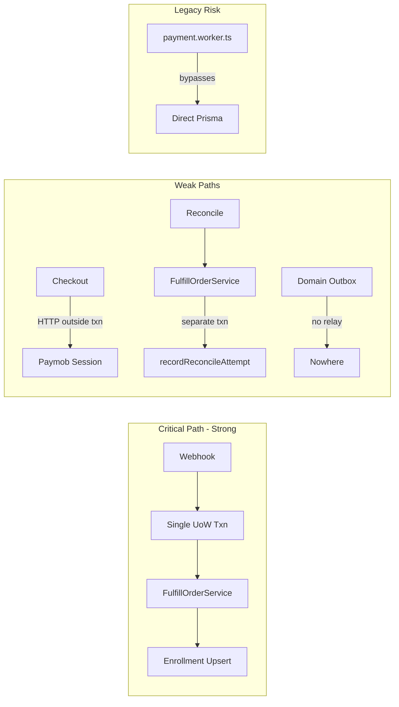

# Payment Platform Architecture Review

**Reviewer stance:** Assume millions of payments, millions of students, international expansion. Do not optimize for enterprise complexity today — but do not ship money bugs.

**Codebase reviewed:** `src/features/payments/`, `prisma/schema.prisma`, `src/app/api/payment/`, workers, `docs/payment/`.

**Review date:** July 2026

---

## Executive Summary

This is a **competent startup payment module** with unusually mature reconciliation thinking for its stage. The **webhook critical path** (`process-webhook.use-case.ts` + `fulfill-order.service.ts`) is the best-designed part: one transaction for idempotency + fulfillment, shared kernel for webhook and reconcile.

The system is **not production-safe as-is** for money integrity under concurrency. `markSucceeded`/`markFailed` are blind updates; success fulfillment lacks terminal guards; reconcile audit is split from fulfillment. There are **zero automated payment tests**. A **legacy Stripe worker** (`payment.worker.ts`) bypasses the new domain layer.

The domain layer is **documentation theater DDD**: anemic Prisma-shaped types, not rich aggregates. That is acceptable at startup scale but becomes a liability when refunds, disputes, multi-currency tax, and instructor payouts arrive.

**Verdict preview:** Ship to production **only after P0 fixes** (below). Core architecture is keepable for 2–3 years; do not rewrite.



---

## 1. DDD Review

### Aggregate boundaries

| Implicit aggregate | Root | Assessment |
|---|---|---|
| Order | `OrderEntity` + items | Items embedded; `CheckoutSession` is separate table/type — boundary is fuzzy |
| Payment | `PaymentEntity` | Reconcile control plane co-located with money state — schema comment says "not money state" but domain does not separate them |
| Webhook | `WebhookEventEntity` | Correctly independent idempotency ledger |

**Problem:** No aggregate enforces invariants. `Order.paymentId` links aggregates but nothing prevents illegal transitions.

**Keep:** Order/Payment split (1:1) — correct for Udemy-style course purchases.

**Delay:** Rich aggregate classes with `order.complete()` / `payment.succeed()` — P2 until refund/dispute workflows force it.

### Invariants enforced vs missing

**Enforced (application layer):**

- Success requires `providerTransactionId` (`fulfill-order.service.ts`)
- Reconcile amount/currency mismatch → `ambiguous` (`reconciliation-provider-outcome.validator.ts`)
- Idempotent fulfillment when order completed + payment succeeded
- Failure path skips if payment terminal

**Missing (money integrity):**

- **Webhook does not validate amount/currency** against `Payment.amountCents` — reconcile does, webhook does not
- `TERMINAL_PAYMENT_STATUSES` omits `VOIDED`, `PARTIALLY_REFUNDED` (`payment.entity.ts`) — failure guard incomplete
- No pricing invariant (item sum vs subtotal vs total)
- `isOrderPayable`, `providerSupports`, refund predicates — **exported but unused**

### Repository design

Ports are well-scoped. `PrismaPaymentRepository` is the star: `claimDueForReconciliation` with `FOR UPDATE SKIP LOCKED` is genuinely production-grade.

**Leak:** `claimDueForReconciliation` and `recordReconcileAttempt` use global `prisma`, not `this.db` — breaks UoW composability.

### Value objects

Only `ReconciliationDecision` is a real VO. Money is `number` + Prisma `Currency` — primitive obsession.

### Ubiquitous language

Consistent: Order, Payment, Fulfill, Reconcile, Checkout Session. **Drift:** docs describe "rich entities"; code is anemic DTOs.

**DDD Score rationale:** Structure exists; behavior does not live in domain.

---

## 2. Hexagonal Architecture

### Ports and adapters

**Strong ports:** `UnitOfWork`, `PaymentInquiryPort` (separate from checkout gateway), `CheckoutLock`, `PaymentRepository.claimDue*`, `EnrollmentRepository` upsert contract.

**Weaknesses:**

- Webhook HMAC verification is route-level Paymob-specific — no `WebhookVerifierPort`
- Cart infra types leak into `checkout.validator.ts`
- Prisma `P2002` in `process-webhook.use-case.ts`

**Dependency direction:** Correct overall (application → ports ← infrastructure). Domain imports Prisma enums — **inverted for "pure" hexagonal**.

### Provider abstraction

`PaymentProviderGateway` + `PaymentInquiryPort` + normalized `ProviderPaymentOutcome` is the right shape for multi-PSP. **Reality:** only Paymob wired; `FakePaymentGateway` registered for all providers when Paymob missing — **production footgun**.

---

## 3. Clean Architecture

| Layer | Quality | Issue |
|---|---|---|
| Presentation (API routes) | Good — thin, trace/metrics | Multi-provider Zod enum ahead of implementation |
| Application (use cases) | Strong orchestration | `env` read inside use case |
| Domain | Weak — types only | Prisma coupling |
| Infrastructure | Solid adapters | Split txn in payment repo |

**Best pattern:** Webhook use case delegates fulfillment inside UoW — textbook.

**Worst pattern:** Reconciliation coordinator calls `fulfill()` then `recordReconcileAttempt()` in separate transactions (`reconciliation-coordinator.service.ts`).

---

## 4. Payment Architecture

### Webhook correctness — Strong with one hole

- Raw body HMAC (`timingSafeEqual`), replay guard (300s), DB idempotency `@@unique([provider, providerEventId])`
- Single txn: webhook insert + fulfillment
- Post-commit `OrderCompletedPublisher` — correct (enrollment must not roll back on email failure)

#### P0 gap — Webhook amount validation missing

| Field | Value |
|---|---|
| **Problem** | Webhook success path does not compare Paymob `amount_cents` / `currency` to stored payment |
| **Why it matters** | Authenticated wrong-amount fulfillment = free courses or overcharge disputes |
| **Production scenario** | Paymob misconfiguration, partial capture, or API bug sends success for wrong amount |
| **Risk if ignored** | Money loss at scale; unreconcilable ledger |
| **Complexity** | Low — reuse `normalizeProviderOutcomeForReconcile` logic in webhook mapper or use case |
| **Startup priority** | P0 |
| **Enterprise priority** | P0 |
| **Implement now?** | **Yes** |
| **Effort** | 2–4 hours |
| **Layer** | Application (validator) + Infrastructure (mapper passes amount) |
| **Tradeoffs** | May defer edge cases where provider omits amount — treat omission as ambiguous, not success |
| **Simpler alternative** | Log-only warning at startup — **insufficient** for production |

### Money integrity — At risk under concurrency

#### P0 — Conditional status updates

| Field | Value |
|---|---|
| **Problem** | `markSucceeded`/`markFailed` update by `id` only, no `WHERE status IN ('PENDING','PROCESSING')` |
| **Why it matters** | Webhook + reconcile race can overwrite terminal state |
| **Production scenario** | Slow webhook + fast reconcile both call `markSucceeded`; or success webhook races failed reconcile |
| **Risk if ignored** | SUCCEEDED payment with FAILED order or double enrollment edge cases |
| **Complexity** | Low |
| **Startup priority** | P0 |
| **Enterprise priority** | P0 |
| **Implement now?** | **Yes** |
| **Effort** | 2–3 hours + tests |
| **Layer** | Infrastructure (repository) + Application (handle 0 rows updated) |
| **Tradeoffs** | Must define behavior when update affects 0 rows (idempotent no-op vs error) |
| **Simpler alternative** | Rely on enrollment upsert only — **not enough** |

#### P0 — Success path terminal guard

Mirror failure path in `fulfill-order.service.ts`: skip `markSucceeded` if `isTerminalPaymentStatus(payment.status)`.

### Idempotency — Good with gaps

| Mechanism | Status |
|---|---|
| Webhook dedup | Strong (DB unique) |
| Enrollment | Strong (upsert) |
| Checkout fingerprint | Strong |
| Duplicate webhook response | Weak — returns `fulfilled: false` even if first delivery succeeded |
| Domain outbox | Not idempotent with fulfillment (non-transactional) |

### Reconciliation — Surprisingly mature

`ReconciliationPolicy`: backoff + jitter, abandon on consecutive not_found + expired session, manual_review on ambiguous — **this is better than most Series A startups**.

`claimDueForReconciliation`: `SKIP LOCKED` + 5min lease — **keep exactly this pattern**.

#### P0 — Unify reconcile fulfillment + audit transaction

| Field | Value |
|---|---|
| **Problem** | `ReconciliationCoordinator.apply` commits fulfillment before `recordReconcileAttempt` |
| **Why it matters** | Fulfilled order with stale lease / missing audit → ops blind, duplicate reconcile attempts |
| **Production scenario** | DB blip after `fulfill()` succeeds, before `recordAttempt` |
| **Risk if ignored** | Ghost fulfilled payments in reconcile queue; incorrect metrics |
| **Complexity** | Medium — extend `TransactionalRepositories` with `recordReconcileAttempt` or pass repos like webhook |
| **Startup priority** | P0 |
| **Enterprise priority** | P0 |
| **Implement now?** | **Yes** |
| **Effort** | 4–8 hours |
| **Layer** | Application + Infrastructure |
| **Tradeoffs** | Raw SQL claim still needs global prisma txn — acceptable |
| **Simpler alternative** | Retry `recordAttempt` on failure — partial mitigation only |

### Double payment / duplicate fulfillment

- Checkout lock (Redis `SET NX EX 30`) + fingerprint reuse — good for duplicate checkout clicks
- **Gap:** 30s TTL without extension; slow Paymob API → lock expires → concurrent checkout possible
- Enrollment upsert prevents duplicate access; **does not prevent double charge** if two payments succeed

### Refund / dispute strategy — Not implemented

Schema has `Refund`, `PaymentDispute`, `RefundRequest` on order items — **zero use cases**. `provider-capabilities.ts` lists refunds/disputes — unused.

**Classification:** P2 for refunds (needed before generous refund policy); P3 for disputes until chargeback volume exists.

### Order lifecycle

```
PENDING → (checkout) → PROCESSING → (webhook/reconcile) → COMPLETED
                       ↘ FAILED / CANCELLED / ABANDONED
```

Checkout sessions stay `OPEN` after payment — no `COMPLETE` transition. Low risk today; messy for analytics at scale.

---

## 5. PostgreSQL

**Strengths:**

- Money in integer cents
- `@@unique([provider, providerTransactionId])`
- Partial index on reconcile claim (migration `20260724160000`) — advanced
- BRIN on reconcile attempts — forward-thinking
- Safe backfills in migrations

**Gaps:**

| Item | Priority | Notes |
|---|---|---|
| Partial index not in Prisma schema | P1 | Future `prisma migrate` may drop it |
| Composite index for claim query | P2 | Separate indexes on status/reconcile_status — OK until ~10k stale payments |
| No optimistic locking (`version` column) | P1 | Conditional updates are simpler fix for now |
| `claimDue` uses raw SQL outside injected client | P0 | Breaks txn unification |

**Transaction isolation:** Default READ COMMITTED is fine. Webhook single-txn is the correct isolation boundary.

**Scaling:** At 100k+ payments/day, `payment_reconcile_attempts` append-only table needs partitioning (BRIN is a hint you already know this).

---

## 6. Redis

| Use | Implementation | Assessment |
|---|---|---|
| Checkout lock | `SET NX EX 30` | Fail-close on Redis down — correct for money |
| Rate limiting | Per-user/IP | Fail-open on Redis down — documented tradeoff |
| Provider rate limit | Token bucket + sleep | Blocks worker thread under sustained load |

#### P1 — Checkout lock TTL extension

| Field | Value |
|---|---|
| **Problem** | 30s lock, no heartbeat during provider HTTP (up to 15s timeout + retries) |
| **Production scenario** | Two tabs, slow Paymob, lock expires → two orders same cart |
| **Risk** | Double payment (user charged twice) |
| **Complexity** | Low — extend TTL on heartbeat or use 60–90s |
| **Implement now?** | Yes (P1) |
| **Effort** | 2 hours |
| **Layer** | Infrastructure |
| **Simpler alternative** | Increase TTL to 120s — good enough for startup |

**P3:** Redlock, lock tokens — not needed today.

---

## 7. Workers

| Worker | Role | Verdict |
|---|---|---|
| `reconcile-payments.worker` | Poll + claim | Keep |
| `reconcile-payments.consumer` | BullMQ fan-out | Keep if queue mode needed; **Delay** until multi-instance |
| `order-completed.worker` | Email/invoice/analytics | Keep — correct async boundary |
| `payment.worker.ts` | Legacy Stripe | **Remove or isolate P0** |

#### P0 — Legacy worker coexistence

`payment.worker.ts` directly updates Prisma, enrolls students, bypasses `FulfillOrderService`. If any Stripe job is still enqueued, you have **two fulfillment paths**.

**Lease concern:** Queue mode holds DB lease until consumer finishes; no lease extension on BullMQ retry — P1 when `PAYMENT_RECONCILE_USE_QUEUE=true` in prod.

---

## 8. Observability

**Exists:** Correlation IDs, `AsyncLocalStorage` trace context, structured payment logger, health endpoint, reconcile Prometheus text, ops CLI scripts.

**Gaps:**

| Item | Priority |
|---|---|
| Zero automated tests | P0 |
| In-memory Prometheus per process | P1 |
| Split metrics (logging vs Prometheus) | P1 |
| No OTEL/distributed tracing | P2 |
| Outbox lag metric (table unused) | P2 |
| Alerting wired | P1 |

**P1 — Shared metrics backend:** Without it, multi-instance deploys have **blind spots** on reconcile failure rate — first thing that breaks at 10k/day.

---

## 9. Security

**Strong:** HMAC-SHA512, replay guard, checkout auth from session only, PCI SAQ-A posture, sanitized Arabic errors, checkout lock fail-close.

**Gaps:**

| Gap | Priority | Risk |
|---|---|---|
| No webhook IP allowlist | P1 | DoS noise (HMAC still blocks spoofing) |
| Admin reconcile = single bearer secret | P1 | Secret leak = full ops control |
| Health endpoint unauthenticated | P2 | Info disclosure (reconcile metrics) |
| `x-forwarded-for` trust | P1 | Rate limit bypass without trusted proxy |
| Fake gateway in prod if Paymob misconfigured | P0 | Fake checkout redirects |
| STRIPE env required globally | P2 | Ops friction, not security |

---

## 10. Performance

**Hot path:** Checkout → Paymob intention API → redirect. DB writes are minimal.

**What breaks first by scale:**

| Volume | First bottleneck |
|---|---|
| 100/day | Nothing |
| 10k/day | Paymob rate limits; in-memory metrics useless |
| 100k/day | Reconcile claim query without composite index; reconcile attempt table size |
| 1M/day | Single Postgres write primary; provider inquiry fan-out; need read replicas + partitioned audit |

**N+1:** `findReusablePendingOrder` is one composed query — fine.

**Provider latency:** Circuit breaker on inquiry only — good. Checkout has retry but no breaker (correct — don't block checkout on breaker state).

---

## 11. Scalability Evolution

**100 payments/day:** Current architecture is overbuilt but fine.

**10,000/day:** Fix metrics, composite reconcile index, verify Paymob rate limiter settings, add integration tests.

**100,000/day:** Postgres primary contention on `payments` updates; need connection pooling tuning, reconcile queue mode mandatory, shared Redis rate limiter state.

**1,000,000/day:** Modular monolith payment module still OK; **Postgres vertical scale + read replicas** first. Split workers to dedicated processes. Consider event bus for order-completed fan-out. **Do not** microservice payments yet.

---

## 12. Maintainability

**Strengths:** Feature folder layout, clear use case names, extensive docs (`docs/payment/`), DI container, shared `FulfillOrderService`.

**Weaknesses:**

- Anemic domain vs documented "rich" model — onboarding confusion
- Dead exports (`isOrderPayable`, `providerSupports`)
- Dual gateway instantiation in container
- No tests = refactoring is Russian roulette

**Testability:** Ports enable unit tests — **none written**. This is the biggest maintainability debt.

---

## 13. Startup Simplicity Audit

| Component | Verdict | Reasoning |
|---|---|---|
| Webhook-first + shared FulfillOrderService | **Keep** | Core correctness pattern |
| Reconciliation control plane (leases, policy, attempts) | **Keep** | Safety net worth the code; already built |
| `PaymentDomainOutbox` table + enqueue | **Simplify or Delay** | Write-only, no relay — delete enqueue calls or add minimal relay; half-built outbox is worse than none |
| `PaymentDispute` model | **Delay** | Schema-only; no workflow |
| `provider-capabilities.ts` matrix | **Delay** | Unused; YAGNI until second provider |
| Dual reconcile mode (inline + BullMQ queue) | **Delay** queue mode | Run inline until multi-instance |
| Multi-provider API enum (STRIPE/PAYPAL/CASH) | **Simplify** | Restrict to configured providers in prod |
| Legacy `payment.worker.ts` | **Remove** | Active hazard |
| BRIN index + partial index | **Keep** | Low cost, high future value |
| Prometheus in-memory recorder | **Simplify** | Pick one metrics path (logs OK for month 1) |
| Invoice PDF + local filesystem | **Keep** short-term | **Simplify** to email-only receipt until S3 |
| Extensive payment docs (16 files) | **Keep** | Rare startup discipline |

---

## 14. Udemy Evolution Path

### Stage 1 — Startup (now)

- **Unchanged:** Modular monolith, Paymob, webhook-first, PostgreSQL, BullMQ for async side effects
- **Evolve:** P0 money fixes, basic integration tests, prod provider guard
- **Replace:** Legacy Stripe worker
- **New:** Minimal alerting on reconcile manual_review count

### Stage 2 — Growing startup (1k–50k students)

- **Evolve:** Refund use case, invoice object storage, shared metrics, tax fields populated
- **New:** Admin finance dashboard (manual_review queue already exists)
- **Delay:** Second payment provider

### Stage 3 — Regional platform (MENA + adjacent)

- **Evolve:** Second PSP (Stripe or local), `WebhookVerifierPort` per provider, currency expansion
- **New:** Payout/instructor earnings reconciliation (schema hints at `InstructorEarning`)
- **Replace:** In-memory metrics → Datadog/Prometheus/Grafana

### Stage 4 — International platform

- **Evolve:** Tax engine integration, dispute workflow, partial refunds, subscription billing (not in current model)
- **New:** Payment read replica, reconcile worker fleet, fraud signals
- **Replace:** Local invoice storage; optional payment module extraction to package (not service)

### Stage 5 — Udemy scale

- **Unchanged:** Core invariants (idempotent webhook, integer cents, fulfillment kernel)
- **Replaced:** Single Postgres primary → sharded or domain-separated ledgers; event streaming for order-completed
- **New:** Dedicated payments team, chargeback ops, multi-region deployment, PCI scope review if any card data touches servers
- **Do NOT prematurely build:** Kafka, microservices, event sourcing, CQRS

---

## 15. Prioritized Recommendations

### P0-1: Conditional payment status updates

See Payment Architecture section above.

### P0-2: Webhook amount/currency validation

See above.

### P0-3: Unify reconcile fulfillment + audit in one transaction

See above.

### P0-4: Remove or gate legacy Stripe worker

| Field | Value |
|---|---|
| **Problem** | Parallel fulfillment path bypasses domain layer |
| **Risk** | Double enrollment, inconsistent payment state, unmaintainable ops |
| **Complexity** | Low — delete or feature-flag off |
| **Implement now?** | **Yes** |
| **Effort** | 1–2 hours |
| **Layer** | Infrastructure / ops |

### P0-5: Integration tests for money path

| Field | Value |
|---|---|
| **Problem** | Zero `*.test.ts` in payments module |
| **Why it matters** | Every refactor is a production experiment |
| **Production scenario** | Deploy breaks idempotency; discovered by angry customers |
| **Risk** | Highest operational risk in the entire module |
| **Complexity** | Medium |
| **Implement now?** | **Yes** — minimum: webhook duplicate, fulfill idempotent, reconcile amount mismatch |
| **Effort** | 2–3 days |
| **Layer** | Application (use case tests with fake repos) |
| **Simpler alternative** | Only e2e script — insufficient for CI |

### P0-6: Production provider guard

| Field | Value |
|---|---|
| **Problem** | `FakePaymentGateway` used when provider not configured |
| **Risk** | Production checkout that does not charge |
| **Implement now?** | **Yes** |
| **Effort** | 1 hour |
| **Layer** | Application (`PaymentProviderResolver`) |

### P1-1: Success terminal guard in FulfillOrderService

Effort: 30 min. Layer: Application.

### P1-2: Replace Prisma P2002 with port-level duplicate error

Effort: 2 hours. Layer: Application + Infrastructure.

### P1-3: Extend checkout lock TTL / heartbeat

Effort: 2 hours. Layer: Infrastructure.

### P1-4: Shared metrics + basic alerts (manual_review > 0, reconcile error rate)

Effort: 1–2 days. Layer: Infrastructure.

### P1-5: Invoice storage → S3/GCS

Effort: 1 day. Layer: Infrastructure. **Delay** if email-only receipt suffices for launch.

### P1-6: Restrict checkout `provider` enum to configured gateways

Effort: 1 hour. Layer: Application.

### P2-1: Composite index for reconcile claim query

Implement when `EXPLAIN ANALYZE` shows seq scans or p95 reconcile poll > 500ms.

### P2-2: True transactional outbox (enqueue inside UoW + relay worker)

Only if you add consumers that must not lose events. Today `OrderCompletedPublisher` (BullMQ) already works.

### P2-3: Refund use case + provider adapter

Needed before marketing refunds.

### P2-4: Webhook IP allowlist

Effort: 4 hours. Reduces noise, not correctness.

### P3: Rich domain entities, event sourcing, payment microservice, multi-region active-active

**Do not build.**

---

## Final Verdict

### Scores (1–10)

| Dimension | Score | Notes |
|---|---|---|
| **Architecture** | 7.5 | Sound modular monolith; webhook kernel is right |
| **DDD** | 4.5 | Folder structure yes; behavior in application, Prisma in domain |
| **Clean Architecture** | 7.0 | Good use cases/ports; leaks (P2002, cart types, env) |
| **Hexagonal** | 7.5 | Inquiry/checkout split is excellent; webhook verification not ported |
| **Payment Correctness** | 6.0 | Good design intent; race/validation holes are unacceptable for prod |
| **Operational Readiness** | 5.5 | Scripts/runbooks exist; no tests, weak metrics |
| **Scalability** | 7.0 | Reconcile pattern scales; DB indexes need tuning later |
| **Maintainability** | 6.5 | Clear code; anemic domain + no tests hurt |
| **Startup Fitness** | 6.0 | Over-scaffolded (outbox/disputes/capabilities) vs under-tested |
| **Enterprise Readiness** | 5.0 | No refunds, disputes, audit-grade txn boundaries on reconcile |

### Top 10 Strengths

1. **Single-transaction webhook + fulfillment** — the correct money pattern
2. **`FulfillOrderService` shared kernel** — one money path for webhook and reconcile
3. **`FOR UPDATE SKIP LOCKED` reconcile claiming** — real multi-worker coordination
4. **`ReconciliationPolicy`** — backoff, abandon, manual_review — mature safety net
5. **Amount/currency validation on reconcile** — financial paranoia where it matters
6. **Checkout fingerprint reuse** — prevents duplicate orders for identical carts
7. **HMAC + replay guard + DB idempotency** — defense in depth on webhooks
8. **Integer cents everywhere on orders/payments** — correct money modeling
9. **Separation of critical path vs async** (enrollment sync, email async)
10. **Documentation + ops scripts** — unusual discipline for a startup

### Top 10 Weaknesses

1. **No automated tests** — disqualifying for payments
2. **Blind `markSucceeded`/`markFailed`** — concurrency hole
3. **Reconcile fulfillment/audit split across transactions**
4. **Webhook missing amount/currency validation**
5. **Legacy Stripe worker** — parallel fulfillment path
6. **Anemic domain with Prisma enum coupling** — "DDD" in name only
7. **Half-built outbox** — schema + enqueue, no relay
8. **Fake gateway fallback** — production misconfiguration risk
9. **Checkout lock 30s without extension** — double checkout window
10. **Refund/dispute/multi-provider** — schema promises, code does not deliver

### Top 10 Improvements (ordered)

1. Add integration tests for webhook idempotency + fulfillment
2. Conditional status updates on payment transitions
3. Webhook amount/currency validation
4. Unify reconcile txn boundary
5. Remove legacy `payment.worker.ts`
6. Production provider guard (fail if gateway not configured)
7. Success-path terminal guard in `FulfillOrderService`
8. Shared metrics + alert on `manual_review` queue depth
9. Extend checkout lock TTL
10. Sync Prisma schema with partial reconcile index (or document as manual-only)

### Do NOT Build Yet

- Payment microservice
- Event sourcing / CQRS
- Kafka / dedicated event bus (BullMQ is enough)
- `PaymentDispute` workflow
- `PaymentDomainOutbox` relay (unless you have a consumer that needs it — use BullMQ `OrderCompleted` instead)
- Multi-provider checkout surface (STRIPE/PAYPAL in API) until implemented
- Rich domain entity classes
- Redlock / distributed transaction coordinator
- Multi-region active-active payments

### Missing (actually needed)

- Automated tests
- Refund flow (even manual admin-triggered)
- Webhook amount validation
- Production metrics aggregation
- Provider configuration validation at startup

### Over-Engineered (for today's traffic)

- `PaymentDomainOutbox` without consumer
- `PaymentDispute` schema
- `provider-capabilities.ts` (unused)
- Dual reconcile modes (inline + queue) — pick one for now
- BRIN index (harmless but premature — **keep anyway**)
- 16 doc files vs 0 test files — imbalance

### Surprisingly Well-Designed

- Reconcile claim SQL with leases
- `ReconciliationDecision` discriminated union
- `normalizeProviderOutcomeForReconcile` — refuses unsafe success
- Webhook route preserving raw body + trace context
- Checkout fingerprint + reusable pending order
- Migration backfills for reconcile scheduling

---

## Would I Ship This to Production Today?

**No — not without P0 fixes.**

**Why no:** Payments are not "mostly working" — they are "working until the first race condition." Blind status updates, missing webhook amount checks, split reconcile transactions, zero tests, and a legacy worker waiting to bite you are not startup pragmatism; they are **unpaid technical debt denominated in customer money**.

**Why yes after P0 (1–2 weeks):** The architectural skeleton is correct. Webhook-first with reconcile as safety net is exactly right for Paymob. You did not waste six months on Kafka. Fix the txn boundaries, add 10–15 integration tests, kill the legacy worker, and **ship**. The reconcile control plane is an asset — most startups learn this lesson after losing money.

**If I were CTO:** Keep the module. Fire the half-built outbox and unused dispute schema from the mental model until needed. Invest the next sprint in **tests + conditional updates**, not more abstractions.
